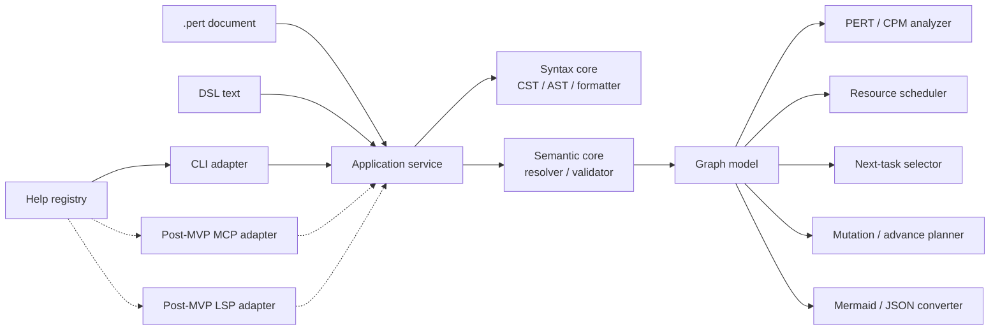

# perttool 基本設計

- 文書状態: Draft 0.8
- 作成日: 2026-07-21
- 更新日: 2026-07-22
- 対応要件: [requirements.md](requirements.md)
- Graph semantics: [specs/graph-semantics.md](specs/graph-semantics.md)
- Analysis: [specs/analysis.md](specs/analysis.md)
- Recommendation semantics: [specs/recommendation.md](specs/recommendation.md)
- Recommendation ranking: [specs/recommendation-ranking.md](specs/recommendation-ranking.md)
- Recommendation reasons: [specs/recommendation-reasons.md](specs/recommendation-reasons.md)
- Recommendation explanation: [specs/recommendation-explanation.md](specs/recommendation-explanation.md)
- CLI interface: [specs/interfaces.md](specs/interfaces.md)
- AoA decision: [adr/0001-activity-on-arrow.md](adr/0001-activity-on-arrow.md)
- Runtime/package decision: [adr/0002-node-typescript-package.md](adr/0002-node-typescript-package.md)
- 自己利用計画: [process/self-use.md](process/self-use.md)

## 1. 目的

本書は、要件で定めた `perttool` を実装へ移せる粒度まで分解し、共通コア、データ表現、処理フロー、外部インターフェース、安全な文書更新、テスト境界を定義する。

完全なDSL grammarとCLI/JSON contractは個別仕様で固定した。Mermaid profileは今後の個別仕様で固定する。本書では、それらを実装するモジュール境界と契約を扱う。

## 2. 基本方針

### 2.1 採用する方針

- 実装言語は TypeScript とする
- Node.js 上で動作する CLI とライブラリを同一 package から提供する
- task を edge、milestone を node とする Activity-on-Arrow を中核モデルとする
- `.pert` 文書を正本とし、通常の解析はローカルで完結させる
- parser、意味検査、PERT/CPM 計算は共通コアへ集約する
- MVPはCLIをprimary adapterとし、MCP、LSP/エディタはMVP後に共通コアへ追加する
- 文書編集は source span に対する差分として計画し、再 parse・再検査後にだけ適用する
- 人間向け text と機械向け JSON は、同じ結果 object から描画する
- すべての計算と並び順を決定的にする

TypeScript を選ぶ理由は次のとおりである。

- CLIと将来のMCP、VS Code系adapterを同じ型と実装から提供しやすい
- Mermaid/HTML/SVG などの可視化 adapter と統合しやすい
- `llmthink` で採用済みの、共通コアと薄い複数 UI という構成を踏襲できる
- JSON Schema と TypeScript type の対応を管理しやすい

RuntimeはNode.js 24以上、package managerはnpm、module形式はESMとする。詳細は[ADR 0002](adr/0002-node-typescript-package.md)、具体versionは`package.json`と`package-lock.json`、CI baselineはworkflowを正本とする。

### 2.2 採用しない方針

- CLI から MCP server を呼び出す構成にはしない
- UI ごとに parser や PERT 計算を実装しない
- AST を毎回全量 serialize して局所編集する方式を既定にしない
- 浮動小数点値を計算上の正本にしない
- Mermaid AST を内部の正規 graph model にしない
- LLM の応答を解析結果として扱わない
- 初期実装で厳密最適resource leveling、calendar、skill、外部issue同期を混在させない

## 3. システム構成



### 3.1 dependency rule

依存方向は外側から内側への一方向にする。

```text
CLI / future MCP / LSP / filesystem
             |
             v
      application services
             |
             v
syntax / semantic / graph / analyzer / transform
```

Core layer は次へ依存してはならない。

- filesystem
- network
- process environment
- terminal width や color
- MCP transport
- editor API
- wall clock

基準日時、file path、表示桁、critical epsilon などは明示的な引数として渡す。

## 4. リポジトリ構成

現在の実装では次の配置を採用する。未実装moduleを先行して配置しない。

```text
perttool/
  .github/
    workflows/
  docs/
    adr/
    examples/
    process/
    specs/
    basic-design.md
    requirements.md
  plans/
    control-plane.pert
    grammar.pert
    mvp.pert
  scripts/
    check-docs.sh
    check-npm-link.sh
    check-self-use.sh
  README.md
  package.json
  tsconfig.json
  src/
    application/
      analyze.ts
      check.ts
      next.ts
    analysis/
      graph.ts
      precedence.ts
      resource.ts
    help/
      registry.ts
    model/
      syntax.ts
      diagnostics.ts
      rational.ts
    parser/
      document-parser.ts
    semantic/
      validator.ts
    cli.ts
    index.ts
    version.ts
  test/
    analysis.test.mjs
    cli.test.mjs
    e2e.test.mjs
    next.test.mjs
    parser.test.mjs
    self-use.test.mjs
    fixtures/
    golden/
```

配置は責務を表す。小規模な初期段階で空 directory を先に量産せず、実装 slice に応じて追加する。

## 5. 文書表現の3層

文書を `CST -> AST -> Graph` の3層で扱う。

### 5.1 CST

CST は元テキストの編集可能性を保持する。

保持する情報:

- token kind と raw text
- UTF-16 code unit offset
- line と column
- indentation
- 空行
- 独立行 comment
- block の開始・終了 span
- field value の span
- 改行形式

内部 offset、line、column は 0 始まりとし、offset と column は JavaScript/LSP と整合する UTF-16 code unit 基準とする。CLI の source location は 1 始まりへ変換して表示する。filesystem digest と file size だけは UTF-8 byte 列を対象にする。

CST の目的:

- task の 1 field だけを変更する
- comment と宣言順を保持する
- source diagnostic を正確に示す
- editor rename や code action の基盤にする

### 5.2 AST

AST は DSL の構文上の意味を表す。

初期 node:

- `ProjectDecl`
- `ResourceDecl`
- `MilestoneDecl`
- `TaskDecl`
- `GateDecl`
- `DurationLiteral`
- `EstimateDecl`
- `RequirementsDecl`
- `TextField`
- `ListField`

各 node は最低限、次を持つ。

```text
kind
id or field name
normalized value
source span
CST node reference
```

AST の時点では、参照先の存在、cycle、finish 到達性を確定しない。

### 5.3 Graph model

Graph model は参照解決済みの解析用表現である。

```ts
interface PertGraph {
  project: ProjectModel;
  resources: ReadonlyMap<ResourceId, ResourceModel>;
  milestones: ReadonlyMap<MilestoneId, MilestoneModel>;
  edges: ReadonlyMap<EdgeId, TaskEdge | GateEdge>;
  incoming: ReadonlyMap<MilestoneId, readonly EdgeId[]>;
  outgoing: ReadonlyMap<MilestoneId, readonly EdgeId[]>;
  topologicalOrder: readonly MilestoneId[];
}
```

Graph model の条件:

- ID が一意である
- endpoint が解決済みである
- taskのresource requirementが解決済みでcapacity内である
- self-loop がない
- DAG である
- adjacency の edge ID は決定的な順で並ぶ
- 入力 AST への source reference を保持する

解析器は無効な Graph を受け取らない。構造エラーがある場合は `SemanticResult` が diagnostics を返し、Graph の生成を完了扱いにしない。

## 6. 数値表現

### 6.1 Rational

duration、expected、variance、float は内部で正規化した有理数として扱う。

```ts
interface Rational {
  numerator: bigint;
  denominator: bigint;
}
```

Rules:

- denominator は常に正数
- numerator と denominator は最大公約数で約分する
- DSL の有限小数は正確な分数へ変換する
- PERT の `/ 6` を正確に保持する
- 表示時だけ指定桁へ丸める
- JSON では decimal string と、必要に応じて numerator/denominator string を返す

これにより、critical 判定と tie-break が runtime の浮動小数点差に左右されることを避ける。

### 6.2 duration unitとvelocity

MVP では 1 文書内の duration unit を統一する。

- `duration_unit day` なら `d`
- `duration_unit hour` なら `h`
- `duration_unit point`なら`p`。`velocity <points>p/<period>d|h`を必須とする
- 異なる unit の混在は semantic error
- Pointとday/hourはproject-wide velocityでexact Rational換算する
- 換算値はvelocity forecastとして基準PERT値と別に保持する
- day/hour間のcalendar変換は行わない
- variance の unit は duration unit の二乗として metadata に示す

### 6.3 resource quantity

resource capacity、task requirement量、priorityは安全な範囲の非負Integerとして扱う。

- capacityは1以上
- requirement量は1以上かつcapacity以下
- priorityは0以上、既定値0
- 最大値は2147483647
- quantityはdurationのRationalと混在させない
- active taskの同時requirement合計がcapacityを超える場合はanalysis error

## 7. 診断モデル

すべての layer は共通の `Diagnostic` を返す。

```ts
interface Diagnostic {
  code: string;
  severity: "error" | "warning" | "info";
  message: string;
  span?: SourceSpan;
  related?: readonly RelatedLocation[];
  helpTopic?: string;
  expectedSyntax?: string;
  fixes?: readonly SuggestedFix[];
}
```

code namespace:

- `PTDSL-*`: lexical/parser/field syntax
- `PTSEM-*`: reference、state、duration、graph constraint
- `PTDAG-*`: cycle、reachability、schedule
- `PTRES-*`: resource capacity、allocation、resource schedule
- `PTMUT-*`: mutation、optimistic lock、unsafe removal
- `PTCNV-*`: import/export/loss report
- `PTCLI-*`: CLI usage
- `PTHLP-*`: help registry lookup

Rules:

- 同じ原因からCore APIとCLIで異なるcodeを作らない。将来adapterも同じdiagnosticを再利用する
- parse recovery 後の二次 error を抑制できること
- cycle は少なくとも 1 本の witness path を related location 付きで返す
- ID 重複は先行宣言と重複宣言の両方を示す
- error の並び順は source position、code、ID の順で安定化する

## 8. Core API

公開 library API は I/O を含まない pure function を基本とする。

```ts
parseDocument(text, options): ParseResult
buildGraph(document, options): SemanticResult
checkDocument(text, options): CheckResult
analyzeDocument(text, options): AnalysisResult
selectNextTasks(text, options): NextResult
planMutation(text, mutation, options): MutationResult
planAdvance(text, options): MutationResult
exportMermaid(text, options): ExportResult
importMermaid(text, options): ImportResult
getHelp(request): HelpResult
```

Result の共通要素:

```ts
interface OperationResult {
  schemaVersion: string;
  diagnostics: readonly Diagnostic[];
  diagnosticsTruncated: boolean;
  ok: boolean;
}
```

Rules:

- error diagnostic が 1 件以上あれば `ok=false`
- warning の fail 条件は caller option で決める
- library API は `process.exit` しない
- syntax error や user document error を exception にしない
- programmer error と不変条件違反だけを exception にする
- `maxDiagnostics`はdefault 100、1..1000とし、超過時はsource順の先頭を返して`diagnosticsTruncated=true`にする
- parse errorがある場合はfield/graph phaseへ進まず、派生diagnosticを抑制する

## 9. 処理フロー

### 9.1 check

```text
text
 -> lex / parse
 -> AST field validation
 -> reference resolution
 -> graph construction
 -> cycle detection
 -> reached/frontier validation
 -> finish reachability validation
 -> diagnostics sort
```

Graph 構築ができない error がある場合、後続の schedule analysis は行わない。

### 9.2 analyze

```text
check
 -> effective reached closure
 -> remaining edge weight
 -> topological forward pass
 -> reverse backward pass
 -> float calculation
 -> critical subgraph
 -> representative critical path
 -> resource-capacity validation
 -> deterministic resource schedule
 -> resource waits / schedule critical path
 -> blocked schedule qualification
 -> AnalysisResult
```

#### effective reached closure

1. 明示 `reached` milestone を queue に入れる
2. 始点が reached の `done` task を satisfied edge とする
3. 始点が reached の gate を satisfied edge とする
4. incoming edge を1本以上持ち、そのすべてが satisfied になった milestone を reached にする
5. 新たに reached になった milestone から、外向きの done task と gate の satisfaction を伝播する

DAG なのでトポロジカル順または入次数 counter で決定的に処理できる。

#### edge weight

- `done` task: 0
- deterministic task: duration
- PERT task: `(o + 4m + p) / 6`
- gate: 0

blocked task の作業時間は通常どおり重みに含めるが、外部待ち時間は含めない。結果全体に `conditionalOnBlocksResolved=true` を立て、該当 task ID を返す。

analysis resultは、resourceを無視した`precedence`と、capacityを守る`resource`を分離する。precedence makespanは理論下限、resource makespanは選択したheuristicによる実行可能値であり、最適値とは表示しない。

### 9.3 next

`next` は `analyze` の結果を再利用する。

```text
active:
  status == active

ready:
  status == planned
  and effectiveReached(from)

runnable_now:
  ready
  and selected by current resource capacity after active allocation

blocked_now:
  status == blocked
  and effectiveReached(from)

upcoming:
  unfinished
  and not active / ready / blocked_now
```

ready sort key:

```text
priority desc
precedenceCritical desc
totalFloat asc
earliestStart asc
taskId asc
```

resourceを要求しないready taskはrunnable candidateになる。resourceを要求するtaskはactive taskの時刻0占有量を差し引き、resource scheduleと同じpriority ruleで可能な限り選択する。選ばれなかったready taskには不足resource、capacity、使用量、占有taskを付ける。

upcoming の explanation は、直接の `from` milestone と、その milestone を未達にしている unsatisfied incoming edge を返す。最初から全祖先を展開せず、API option で explanation depth を制御する。

Recommendationは既存classificationと`runnable_now`を置き換えず、新規start actionへのdecision authorityとして[Recommendation Semantics仕様](specs/recommendation.md)で分離する。Conceptual recommended setはready taskのsubsetであり、active allocationを含めてjointly resource-feasibleでなければならない。`recommended`、`allowed`、`deferred`、`discouraged`はready taskだけへ適用し、`blocked`をrecommendation tierとして使用しない。

[Recommendation Ranking Policy仕様](specs/recommendation-ranking.md)はactual ready taskからselection horizonとrecommended setを決定的に選び、[Recommendation Reason Taxonomy仕様](specs/recommendation-reasons.md)はset/tierの理由をstable code、typed fact、entity referenceへ分解する。[Recommendation Structured Explanation仕様](specs/recommendation-explanation.md)はtyped fact、制限付きexpression、comparison、decision trace、description projectionを接続する。現行`NextResult.v2`へrecommendation fieldは存在しない。Interface Contractでschema migrationが受け入れられるまで、`runnable_now`の意味や既定sortを変更しない。

### 9.4 mutation

```text
text + mutation request
 -> check existing document
 -> resolve exactly one target
 -> build TextEdit[]
 -> verify edits do not overlap
 -> apply edits in descending offset order
 -> parse and check candidate text
 -> build unified diff
 -> MutationResult
```

`MutationResult`:

```ts
interface MutationResult extends OperationResult {
  originalDigest: string;
  updatedDigest?: string;
  updatedText?: string;
  diff?: string;
  edits: readonly TextEdit[];
}
```

Coreはファイルを書かない。MVPではCLI adapterが`MutationResult`を受け、安全条件を満たした場合だけwriteする。将来adapterにも同じ境界を適用する。

### 9.5 advance

advance は通常 mutation より強い graph rewrite なので、専用 planner とする。

初期アルゴリズム:

1. effective reached closure を求める
2. 新たに reached となった milestone を frontier candidate とする
3. finish へ至る未完了 edge を逆向きに辿り、未来に必要な subgraph を求める
4. 合流判定にまだ必要な `done` task を保持する
5. reached frontier より完全に過去で、未来 subgraph の条件に不要な edge/node を削除対象にする
6. candidate 文書を再 parse・再分析する
7. next result が advance 前後で意味的に矛盾しないことを確認する

advanceの完全な削除条件は[Graph Semantics仕様](specs/graph-semantics.md)を正とする。要約すると、targetがeffective reachedのedgeを過去として除去し、targetが未到達のedgeをunfinished workまたは部分合流条件として保持する。write actionはsafe-writeとadvanceの自己利用gateを満たすまで公開しない。

### 9.6 Mermaid export/import

export:

```text
Graph + optional AnalysisResult
 -> stable node/edge ordering
 -> perttool metadata records
 -> Mermaid flowchart declarations
 -> optional style declarations
```

import:

```text
Mermaid text
 -> supported-profile parser
 -> perttool metadata decode
 -> graph reconstruction
 -> semantic validation
 -> DSL formatter
 -> loss report
```

Mermaid adapter は analysis や validation を再実装しない。一般 Mermaid の best-effort import と、`perttool` profile の lossless import を別 mode として扱う。

resource requirementはDAGのdependency edgeではないため、通常flowchartへresource nodeを直結してprecedenceと混同させない。resource共有はtask style/annotation、別のresource bipartite view、またはschedule timelineで表現する。

## 10. Graph algorithm

### 10.1 topological sort と cycle witness

- Kahn algorithm で安定 topological order を作る
- 同時に処理可能な milestone は ID 辞書順の priority queue から取る
- 全 node を処理できなければ cycle error
- 未処理 subgraph に DFS を行い、1 本以上の cycle witness を返す

### 10.2 finish reachability

- finish から reverse traversal する
- reverse traversal で到達しない未完了 edge/node を `finish_unreachable` とする
- 過去を表すためだけの孤立 done subgraph は許容せず、advance 候補として診断する

### 10.3 forward pass

- effective reached milestone の earliest は 0
- milestone は topological order で処理する
- non-reached milestone の earliest は incoming edge EF の最大値
- 比較と加算は Rational で行う

### 10.4 backward pass

- finish の latest は finish earliest
- reverse topological order で処理する
- milestone latest は outgoing edge LS の最小値
- finish へ到達しない要素は事前検査で除外されていることを前提にする

### 10.5 critical subgraph

- `abs(totalFloat) <= criticalEpsilon` を critical とする
- critical edge の集合を primary result とする
- path 全列挙を primary result にしない
- representative path は各分岐で edge ID の辞書順を tie-break とする
- exact driving path数はBigIntで数え、列挙数と分離する
- 全列挙 option には `maxPaths` を必須または既定上限付きにする

### 10.6 resource schedule

MVPはrenewable resourceに対するdeterministic parallel schedule generation schemeを使用する。

```text
t = 0
active taskをrunningへ登録してresourceを確保

while unfinished taskがある:
  precedence上eligibleなtaskを集める
  priority desc, totalFloat asc, expectedDuration desc, id ascでsort
  sort順に、全resourceを確保できるtaskを可能な限り開始
  開始できるtaskがなくなったら次のtask完了時刻へtを進める
  完了taskのresourceを返却し、milestone到達を伝播
```

Rules:

- DAG edgeはhard precedence、priorityはsoft preference、resource arcは選択scheduleの説明用派生情報とする
- taskはnon-preemptive
- taskは全required resourceを同時取得する
- allocation区間は`[start, finish)`
- 同時刻の完了処理と開始処理は、先に完了・解放、次に開始とする
- requirementが確保できない上位taskがあっても、後続taskがcapacity内なら開始できる
- expected durationを使用する
- blocked taskは時刻0にresourceを占有せず、即時解消を仮定したconditional scheduleとして別途flagする
- done taskとgateはresourceを消費しない
- resultにheuristic名とversionを含める

resource待ちを説明するため、task開始時にcapacityを解放して開始を可能にしたtaskとの間に`resource arc`を記録する。capacity 2以上と複数resourceを含むwitness選択、schedule graph replay、schedule critical pathの厳密な規則は[Analysis仕様](specs/analysis.md)を正とする。

このheuristicは実行可能scheduleを返すが、最小makespanを保証しない。exact solverは別adapterとして将来追加し、lower bound、best found、gap、timeoutを明示する。

## 11. CLI 設計

CLIはresource-firstとする。Command、option、stream、exit code、JSON fieldの規範は[CLI Interface仕様](specs/interfaces.md)を正とする。

```text
perttool dsl check <file>
perttool dsl format <file>
perttool dsl help [topic] [subtopic] [--level index|quick|detail]

perttool dag analyze <file> [--schedule precedence|resource|both]
perttool dag analyze <file> --capacity <resource-id>=<integer>
perttool dag next <file>
perttool dag render <file> --to mermaid|svg|json
perttool dag import <file> --from mermaid
perttool dag advance <file>

perttool task add|set|remove|finish ...
perttool milestone add|set|remove ...
perttool resource add|set|remove ...
```

CLI adapter の責務:

- argv parse
- file read
- Core API call
- text/JSON render
- exit code mapping
- explicit write option の処理
- terminal color の制御

CLI adapter が持たない責務:

- DSL parse rule
- graph validation rule
- PERT/CPM formula
- next task ranking
- mutation target resolution

### 11.1 output

- stdout: request された result data
- stderr: diagnostic、write summary、non-data message
- `--format text`: 人間向け既定出力
- `--format json`: schema に従う機械可読出力
- color は TTY の text 出力だけで既定有効
- JSON に ANSI escape を含めない

### 11.2 write safety

変更 command は既定で preview とする。

```text
default: updated text or diff only
--out: new fileへ出力
--write: input fileを更新
--expect-digest: optimistic lock
```

`--write` の処理:

1. 読み取り時 digest を保持
2. mutation result を生成
3. 書き込み直前に現在 file digest を再確認
4. 同 directory に temporary file を作成
5. temporary file を flush/fsync してから atomic rename
6. 対応可能な環境では親 directory も fsync
7. rename 後の file を再 parse して digest を確認

## 12. Post-MVP adapter境界

MCP、LSP、editor adapterはMVP対象外である。MVP repository構成、package dependency、acceptance testへMCP serverやSDKを含めない。

将来adapterを追加する場合はCLI subprocessを呼ばず、同じapplication serviceを直接利用する。Adapter固有transport、request/response schema、write authorityはCLI Interface仕様と分離したversioned仕様で固定する。

## 13. Help 設計

help を code 内の散在文字列にせず、共通 registry として持つ。

```ts
interface HelpNode {
  id: string;
  title: string;
  summary: string;
  quick: readonly HelpSection[];
  detail: readonly HelpSection[];
  syntax?: readonly string[];
  examples?: readonly HelpExample[];
  related: readonly string[];
}
```

初期 topic:

- `syntax`
- `syntax.project`
- `syntax.resource`
- `syntax.milestone`
- `syntax.task`
- `syntax.gate`
- `syntax.duration`
- `analysis`
- `analysis.resources`
- `next`
- `editing`
- `mermaid`
- `workflows`
- `errors`
- `samples`

同じ registry から次を生成する。

- CLI text help
- CLI JSON help
- 将来のMCP help result
- 将来のLSP hover/completion documentation
- parse diagnostic の help link

grammar の規範全文は `docs/specs/dsl-grammar.md` とする。help は自己完結した operational guidance を提供するが、完全 EBNF の複製を正本にはしない。grammar、parser、formatter、help sample の整合性は fixture から検査する。

## 14. Schema と versioning

初期 schema:

- `Perttool.CheckResult.v1`
- `Perttool.AnalysisResult.v2`
- `Perttool.ResourceScheduleResult.v1`
- `Perttool.NextResult.v2`
- `Perttool.MutationResult.v1`
- `Perttool.ConversionLossReport.v1`
- `Perttool.HelpResult.v1`
- `Perttool.ExportResult.v1`
- `Perttool.ImportResult.v1`
- `Perttool.CliError.v1`

Rules:

- TypeScript type と JSON Schema を同一変更で更新する
- root に `schema_version` と `tool_version` を持つ
- optional field の追加は同一 major schema 内で許容する
- field 削除、意味変更、enum narrowing は major schema を上げる
- golden JSON は stable key order で出力する

DSL version は project block の optional field として将来導入できるよう予約する。MVP で省略された場合は version 1 grammar として扱う。

## 15. テスト設計

### 15.1 unit test

- indentation/tokenization
- quoted text/block text
- duration parse と Rational
- PERT expected/variance
- topological sort
- cycle witness
- reachability
- forward/backward pass
- total/free float
- next classification/ranking
- TextEdit overlap detection

### 15.2 fixture/golden test

最低限の fixture:

- minimal linear graph
- parallel diamond
- task と gate の合流
- multiple frontier
- duplicate ID
- undefined endpoint
- self-loop
- multi-node cycle
- unreachable finish
- invalid estimate order
- mixed duration unit
- active from unreached
- blocked ready task
- retained done task at merge
- advance-safe graph
- advance-unsafe graph
- multiple critical path
- exclusive resource capacity 1
- parallel resource capacity 2
- multi-resource task
- active resource oversubscription
- priority tie-break
- capacity変更でmakespan/critical pathが変わるgraph
- Mermaid lossless round-trip
- general Mermaid lossy import

Golden artifacts:

- formatted DSL
- diagnostics text/JSON
- analysis text/JSON
- next text/JSON
- mutation diff
- Mermaid output
- loss report

### 15.3 property test

Should:

- `parse(format(parse(text)))` の AST 同値性
- formatter idempotence
- DAG generator に対する topological order validity
- nonnegative task duration での earliest monotonicity
- mutation 後の target field 一致と他 field 不変性
- lossless Mermaid profile の semantic round-trip

### 15.4 adapter parity

MVPでは同一fixtureに対し、library resultとCLI JSONのsemantic payloadが一致することを検査する。Presentation固有fieldは比較対象から明示的に除外する。MCP parityはMCP adapter追加時のtestとする。

## 16. 自己利用設計

自己利用の詳細な gate と運用は [process/self-use.md](process/self-use.md) を正とする。

### 16.1 最初の対象

最初の自己利用対象は DSL 文法の設計・実装タスクとする。

- 規範的な grammar 内容: `docs/specs/dsl-grammar.md`
- 現在・未来の grammar 作業計画: `plans/grammar.pert`
- Issue #1のAI工程制御設計計画: `plans/control-plane.pert`
- 過去の作業計画: Git history

MVP全体のstage gateは`plans/mvp.pert`、現在sliceの設計・実装taskは対応する詳細planで分離する。Macro work packageは詳細planのresource makespanをroll-upし、個別task状態を重複管理しない。2026-07-22時点ではgrammar実装を`plans/grammar.pert`、AI工程制御設計を`plans/control-plane.pert`で管理する。

`.pert` は仕様内容そのものではなく、仕様を設計・実装する作業の DAG を表現する。規範仕様と作業状態を混同しない。

### 16.2 bootstrap gate

`plans/grammar.pert` を作成して CI 対象にする前に、次を満たす。

- project/resource/milestone/task/gate の parser がある
- ID と endpoint の意味検査がある
- cycle と finish reachability の検査がある
- `perttool dsl check` がある
- `perttool dag analyze` の基本 forward/backward pass がある
- renewable resource capacityを守るdeterministic scheduleがある
- `perttool dag next` が決定的な結果を返す
- 正常/失敗 fixture が自動テストされる

この段階では read-only の自己利用を開始する。formatter、mutation、advance の write path は使用しない。

### 16.3 write gate

自己利用文書へ `format --write` や task mutation を適用するには、さらに次を満たす。

- formatter idempotence
- comment と宣言順の保持
- preview diff
- candidate text の再 parse・再検査
- atomic write
- optimistic lock
- grammar plan fixture に対する round-trip regression

### 16.4 failure policy

- tool の bug に合わせて grammar plan を不正に書き換えない
- Markdown grammar と golden fixture を bootstrap 時の判断根拠として残す
- 自己利用文書が parse 不能になった場合、直前の Git revision と read-only check から復旧する
- tool upgrade と `plans/grammar.pert` の破壊的変更を同一 commit に混在させる場合は、旧版と新版の検査証跡を残す

## 17. 実装 slice

### Slice 0: design baseline

- 基本設計
- DSL grammar spec
- graph semantics spec
- analysis spec
- interface spec
- ADR

Exit:

- parser が実装できる完全 EBNF と error policy がある
- reached/ready/done/gate/advance の意味が例で確認できる

### Slice 1: syntax and check

- TypeScript scaffold
- lexer/parser/CST/AST
- diagnostics
- resolver/validator
- `dsl check`
- `dsl help syntax`

Exit:

- minimal/invalid fixture が固定される
- source span 付き error が text/JSON で出る

### Slice 2: analysis and next

- Rational
- topological/cycle/reachability
- forward/backward pass
- critical subgraph
- renewable resource scheduler
- runnable_now/resource wait explanation
- reached closure
- next classification/ranking
- `dag analyze` / `dag next`

Exit:

- bootstrap gate を満たす
- `plans/grammar.pert` の read-only 自己利用を開始する

### Slice 3: safe formatting and mutation

- source-preserving formatter
- task/milestone mutation
- preview diff
- atomic write/optimistic lock

Exit:

- write gate を満たす
- grammar plan の安全な更新に使用する

### Slice 4: advance and Mermaid

- advance planner
- Mermaid lossless profile
- general Mermaid loss report
- SVG/HTML preview の基礎

### Post-MVP Slice 5: MCP and editor

- MCP adapter
- adapter parity tests
- LSP diagnostics/completion/definition/rename の基礎

## 18. 詳細設計へ送る事項

DSL完全EBNFとerror recoveryは[DSL文法仕様](specs/dsl-grammar.md)、reached/ready/gate/resource/advanceは[Graph Semantics仕様](specs/graph-semantics.md)、PERT/CPMとresource scheduleは[Analysis仕様](specs/analysis.md)、実行可否と推奨度のmodelは[Recommendation Semantics仕様](specs/recommendation.md)、推奨順と理由は[Ranking Policy](specs/recommendation-ranking.md)と[Reason Taxonomy](specs/recommendation-reasons.md)、説明graphは[Structured Explanation仕様](specs/recommendation-explanation.md)、CLI/JSON/help/write safetyは[CLI Interface仕様](specs/interfaces.md)で決定する。残る事項は個別仕様またはADRで確定する。

1. CST の trivia/comment 所有規則の実装詳細
2. formatter の canonical whitespace 実装詳細
3. Mermaid metadata record schema
4. package/runtime/test dependency の選定

## 19. 要件トレーサビリティ

| 基本設計 | 主な対応要件 |
| --- | --- |
| CST/AST/Graph 3層 | 8、12、16、17章 |
| Rational | 10章 |
| Graph algorithm | 9、10、11章 |
| Resource scheduler | 7.2、7.4、10.6、11章 |
| Recommendation model | 2.4、5.4、17、21章 |
| Recommendation ranking/reasons/explanation | 2.4、5.4、17、21章 |
| Pure Core API | 2.2、15、17章 |
| CLI adapter | 15、17章 |
| Help registry | 16章 |
| Mutation/atomic write | 9.3、12、20.1節 |
| Mermaid adapter | 13、14章 |
| Test design | 20.3、21章 |
| Grammar-first self-use | 19章、本書16章 |
