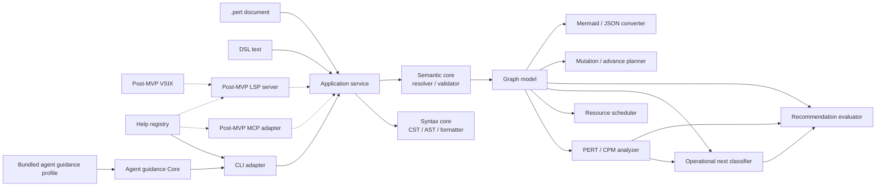

# perttool Basic Design

- Document status: Draft 1.9
- Created: 2026-07-21
- Updated: 2026-07-24
- Applicable requirements: [requirements.md](requirements.md)
- Graph semantics: [specs/graph-semantics.md](specs/graph-semantics.md)
- Analysis: [specs/analysis.md](specs/analysis.md)
- Recommendation semantics: [specs/recommendation.md](specs/recommendation.md)
- Recommendation ranking: [specs/recommendation-ranking.md](specs/recommendation-ranking.md)
- Recommendation reasons: [specs/recommendation-reasons.md](specs/recommendation-reasons.md)
- Recommendation explanation: [specs/recommendation-explanation.md](specs/recommendation-explanation.md)
- Recommendation interface: [specs/recommendation-interface.md](specs/recommendation-interface.md)
- Recommendation override: [specs/recommendation-override.md](specs/recommendation-override.md)
- Recommendation examples: [examples/recommendation.md](examples/recommendation.md)
- AI Agent Guidance Registry: [specs/agent-guidance.md](specs/agent-guidance.md)
- AI Agent Guidance examples: [examples/agent-guidance.md](examples/agent-guidance.md)
- Recommendation migration: [process/recommendation-migration.md](process/recommendation-migration.md)
- Recommendation design review: [process/recommendation-design-review.md](process/recommendation-design-review.md)
- CLI interface: [specs/interfaces.md](specs/interfaces.md)
- CLI Contract 3: [specs/cli-contract-3.md](specs/cli-contract-3.md)
- CLI Contract 3 migration: [process/cli-contract-3-migration.md](process/cli-contract-3-migration.md)
- Mermaid profile: [specs/mermaid-profile.md](specs/mermaid-profile.md)
- AoA decision: [adr/0001-activity-on-arrow.md](adr/0001-activity-on-arrow.md)
- Runtime/package decision: [adr/0005-node-22-runtime-baseline.md](adr/0005-node-22-runtime-baseline.md)
- Beta versioning/release decision: [adr/0003-beta-versioning.md](adr/0003-beta-versioning.md)
- Repository language decision: [adr/0004-english-repository-baseline.md](adr/0004-english-repository-baseline.md)
- Self-use plan: [process/self-use.md](process/self-use.md)

## 1. Purpose

This document decomposes the `perttool` defined by the requirements to an implementation-ready level, and defines the shared Core, data representations, processing flows, external interfaces, safe document updates, and test boundaries.

The complete DSL grammar, CLI/JSON contracts, and Mermaid profile are fixed by their respective specifications. This document covers the module boundaries and contracts that implement them.

## 2. Design Principles

### 2.1 Adopted Principles

- The implementation language is TypeScript.
- A CLI and library that run on Node.js are provided from the same package.
- Activity-on-Arrow, in which tasks are edges and milestones are nodes, is the central model.
- `.pert` documents are authoritative, and normal analysis completes locally.
- Parsing, semantic validation, and PERT/CPM calculation are consolidated in the shared Core.
- The MVP uses the CLI as its primary adapter; an LSP server, VSIX, and MCP server are added to the shared Core after the MVP.
- Document edits are planned as diffs against source spans and applied only after reparsing and revalidation.
- Human-readable text and machine-readable JSON are rendered from the same result object.
- All calculations and orderings are deterministic.
- English is the canonical language for repository-maintained artifacts; runtime i18n is not part of the current architecture

TypeScript is selected for the following reasons.

- It enables the CLI and future MCP and VS Code-family adapters to share types and implementations.
- It integrates well with visualization adapters such as Mermaid, HTML, and SVG.
- It can follow the architecture already adopted by `llmthink`: a shared Core with multiple thin UIs.
- It makes the correspondence between JSON Schema and TypeScript types easier to manage.

The runtime is Node.js 22 or later, the package manager is npm, and the module format is ESM. [ADR 0005](adr/0005-node-22-runtime-baseline.md) defines the supported baseline; `package.json` and `package-lock.json` define concrete package versions, and the CI workflow defines the tested runtime matrix.

### 2.2 Rejected Principles

- The CLI does not invoke an MCP server.
- Parsers and PERT calculations are not implemented separately for each UI.
- Re-serializing the entire AST for every local edit is not the default approach.
- Floating-point values are not authoritative for calculations.
- A Mermaid AST is not the internal canonical graph model.
- An LLM response is not treated as an analysis result.
- The initial implementation does not combine exact-optimal resource leveling, calendars, skills, or external issue synchronization.

## 3. System Architecture



### 3.1 Dependency Rule

Dependencies point in one direction, from outer layers to inner layers.

```text
CLI / future MCP / LSP / VSIX / filesystem
             |
             v
      application services
             |
             v
syntax / semantic / graph / analyzer / recommendation / transform
```

The Core layer MUST NOT depend on the following:

- filesystem
- network
- process environment
- terminal width or color
- MCP transport
- editor API
- wall clock time

The reference timestamp, file path, display precision, critical epsilon, and similar values are passed as explicit arguments.

## 4. Repository Structure

The current implementation uses the following layout. Do not create directories for unimplemented modules in advance.

```text
perttool/
  .github/
    workflows/
  docs/
    adr/
    examples/
    process/
    specs/
    basic-design.md
    requirements.md
  plans/
    agent-guidance.pert
    control-plane.pert
    grammar.pert
    mvp.pert
    operations.pert
    recommendation.pert
  scripts/
    check-docs.sh
    check-npm-link.sh
    check-self-use.sh
  README.md
  package.json
  tsconfig.json
  src/
    application/
      agent-help.ts
      analyze.ts
      check.ts
      format.ts
      mutate.ts
      next.ts
    analysis/
      graph.ts
      precedence.ts
      resource.ts
    editing/
      unified-diff.ts
    formatter/
      source-formatter.ts
    guidance/
      profile.ts
      projection.ts
      query.ts
      text.ts
      types.ts
      validator.ts
    help/
      registry.ts
    io/
      document-file.ts
      safe-write.ts
    model/
      syntax.ts
      diagnostics.ts
      rational.ts
    parser/
      document-parser.ts
    mutation/
      diagnostics.ts
      entity-editor.ts
      milestone.ts
      resource.ts
      source.ts
      task.ts
      text-edits.ts
      types.ts
    semantic/
      validator.ts
    cli.ts
    index.ts
    version.ts
  test/
    agent-guidance-core.test.mjs
    agent-guidance-publication.test.mjs
    analysis.test.mjs
    cli.test.mjs
    e2e.test.mjs
    next.test.mjs
    parser.test.mjs
    mutation.test.mjs
    self-use.test.mjs
    fixtures/
    golden/
```

The layout represents responsibilities. Do not proliferate empty directories during the small initial stage; add them as implementation slices require.

## 5. Three Layers of Document Representation

Documents are handled in three layers: `CST -> AST -> Graph`.

### 5.1 CST

CST preserves the editability of the original text.

Preserved information:

- token kind and raw text
- UTF-16 code-unit offset
- line and column
- indentation
- blank lines
- standalone-line comments
- start and end spans for blocks
- spans for field values
- separate spans for block text markers and content
- line-ending form

Internal offsets, lines, and columns are zero-based; offsets and columns use UTF-16 code units to align with JavaScript and LSP. The CLI converts source locations to one-based values for display. Only filesystem digests and file sizes use UTF-8 byte sequences.

Purposes of the CST:

- Change only one field of a task.
- Preserve comments and declaration order.
- Report source diagnostics precisely.
- Provide the foundation for editor rename and code actions.

### 5.2 AST

AST represents the syntactic meaning of the DSL.

Initial nodes:

- `ProjectDecl`
- `ResourceDecl`
- `MilestoneDecl`
- `TaskDecl`
- `GateDecl`
- `DurationLiteral`
- `EstimateDecl`
- `RequirementsDecl`
- `TextField`
- `ListField`

Each node has at least the following:

```text
kind
id or field name
normalized value
source span
CST node reference
```

At the AST stage, target existence, cycles, and reachability of `finish` are not determined.

### 5.3 Graph model

The Graph model is the analysis representation after reference resolution.

```ts
interface PertGraph {
  project: ProjectModel;
  resources: ReadonlyMap<ResourceId, ResourceModel>;
  milestones: ReadonlyMap<MilestoneId, MilestoneModel>;
  edges: ReadonlyMap<EdgeId, TaskEdge | GateEdge>;
  incoming: ReadonlyMap<MilestoneId, readonly EdgeId[]>;
  outgoing: ReadonlyMap<MilestoneId, readonly EdgeId[]>;
  topologicalOrder: readonly MilestoneId[];
}
```

Graph model conditions:

- IDs are unique.
- Endpoints are resolved.
- Each task resource requirement is resolved and within capacity.
- There are no self-loops.
- The graph is a DAG.
- Edge IDs in adjacency lists use a deterministic order.
- Source references to the input AST are retained.

Analyzers do not receive an invalid Graph. When structural errors exist, `SemanticResult` returns diagnostics and Graph construction is not considered complete.

## 6. Numeric Representation

### 6.1 Rational

Durations, expected values, variances, and float values are represented internally as normalized rational numbers.

```ts
interface Rational {
  numerator: bigint;
  denominator: bigint;
}
```

Rules:

- The denominator is always positive.
- The numerator and denominator are reduced by their greatest common divisor.
- Finite decimals in the DSL are converted to exact fractions.
- PERT division by `/ 6` is retained exactly.
- Rounding to the requested precision occurs only for display.
- JSON returns a decimal string and, when necessary, numerator and denominator strings.

This prevents criticality decisions and tie breaks from depending on runtime floating-point differences.

### 6.2 Duration Units and Velocity

The MVP uses a single duration unit within each document.

- `duration_unit day` uses `d`.
- `duration_unit hour` uses `h`.
- `duration_unit point` uses `p` and requires `velocity <points>p/<period>d|h`.
- Mixing units is a semantic error.
- Points and days/hours are converted as exact rationals using project-wide velocity.
- Converted values are kept separately from baseline PERT values as a velocity forecast.
- No calendar conversion is performed between days and hours.
- Metadata reports the variance unit as the square of the duration unit.

### 6.3 Resource Quantities

Resource capacities, task requirement quantities, and priorities are non-negative integers within a safe range.

- Capacity is at least 1.
- A requirement quantity is at least 1 and no greater than capacity.
- Priority is at least 0; its default is 0.
- The maximum value is 2147483647.
- Quantities are not mixed with duration rationals.
- An analysis error occurs when simultaneous requirements of active tasks exceed capacity.

## 7. Diagnostic Model

Every layer returns the shared `Diagnostic` type.

```ts
interface Diagnostic {
  code: string;
  severity: "error" | "warning" | "info";
  message: string;
  span?: SourceSpan;
  related?: readonly RelatedLocation[];
  helpTopic?: string;
  expectedSyntax?: string;
  fixes?: readonly SuggestedFix[];
}
```

Code namespaces:

- `PTDSL-*`: lexical, parser, and field syntax
- `PTSEM-*`: references, state, duration, and graph constraints
- `PTDAG-*`: cycles, reachability, and schedules
- `PTRES-*`: resource capacity, allocation, and resource schedules
- `PTMUT-*`: mutation requests, target resolution, and unsafe removal
- `PTIO-*`: safe-write conflicts and post-write verification
- `PTCNV-*`: import, export, and loss reports
- `PTCLI-*`: CLI usage
- `PTHLP-*`: help registry lookup

Rules:

- Do not create different codes in the Core API and CLI for the same cause. Future adapters reuse the same diagnostics.
- Secondary errors after parse recovery can be suppressed.
- A cycle returns at least one witness path with related locations.
- A duplicate ID reports both the prior declaration and the duplicate declaration.
- Errors are stably ordered by source position, code, and ID.

## 8. Core API

The public library API is based on pure functions that do not perform I/O.

```ts
parseDocument(text, options): ParseResult
buildGraph(document, options): SemanticResult
checkDocument(text, options): CheckResult
formatDocument(text, options): FormatResult
analyzeDocument(text, options): AnalysisResult
selectNextTasks(text, options): NextResult
planMutation(text, mutation, options): MutationResult
planAdvance(text, options): MutationResult
exportMermaid(text, options): ExportResult
importMermaid(text, options): ImportResult
getHelp(request): HelpResult
```

Shared result fields:

```ts
interface OperationResult {
  schemaVersion: string;
  diagnostics: readonly Diagnostic[];
  diagnosticsTruncated: boolean;
  ok: boolean;
}
```

The source-preserving formatter Core returns the following. It provides `formattedText` and `edits` only when it can produce a valid candidate; subsequent application and CLI layers add I/O, diff, and write modes.

```ts
interface FormatResult {
  ok: boolean;
  documentId: string | null;
  changed: boolean;
  formattedText: string | null;
  edits: readonly TextEdit[];
  diagnostics: readonly Diagnostic[];
  diagnosticsTruncated: boolean;
}
```

Rules:

- `ok=false` when one or more error diagnostics exist.
- Caller options determine whether warnings cause failure.
- Library APIs do not call `process.exit`.
- Syntax errors and user document errors are not exceptions.
- Only programmer errors and invariant violations are exceptions.
- `maxDiagnostics` defaults to 100 and ranges from 1 through 1000; when exceeded, return the first diagnostics in source order and set `diagnosticsTruncated=true`.
- When parse errors exist, do not proceed to field or graph phases, and suppress derived diagnostics.

### 8.1 Safe-write adapter

I/O remains outside the pure Core. The public boundary is limited to committing a candidate generated and revalidated by the Core to a document file.

```ts
readDocumentFile(path): Promise<DocumentContent>
replaceDocumentFile(path, candidateText, { initialDigest, expectedDigest? }): Promise<DocumentWriteResult>
createDocumentFile(path, candidateText, { mode? }): Promise<DocumentWriteResult>
createArtifactFile(path, artifact, { mode? }): Promise<DocumentWriteResult>
```

`DocumentContent` contains owned raw bytes, BOM-preserving UTF-8 text, and a raw-byte SHA-256 digest. In-place replacement rejects symlinks and anything other than regular files, and compares the path identity obtained by `lstat` with the file identity opened using `O_NOFOLLOW`. It rechecks the initial digest before writing and immediately before renaming, writes an inherited mode to an exclusive temporary file in the same directory, fsyncs the file, atomically renames it, fsyncs the parent directory, and revalidates the digest and document validity.

New output avoids overwriting an existing target through rename and publishes the target through an exclusive hard link on the same filesystem from an fsynced temporary file. Concurrent writers, existing files, and symlinks are all rejected as conflicts; the temporary entry is removed and the parent directory is fsynced again. `createDocumentFile` revalidates DSL candidates, while `createArtifactFile` revalidates only digest equality for UTF-8 byte sequences in other formats such as Mermaid. Public results return only the mode, target, candidate digest, and byte count; they never return temporary paths or random tokens.

## 9. Processing flows

### 9.1 check

```text
text
 -> lex / parse
 -> AST field validation
 -> reference resolution
 -> graph construction
 -> cycle detection
 -> reached/frontier validation
 -> finish reachability validation
 -> diagnostics sort
```

When an error prevents graph construction, do not perform subsequent schedule analysis.

### 9.2 analyze

```text
check
 -> effective reached closure
 -> remaining edge weight
 -> topological forward pass
 -> reverse backward pass
 -> float calculation
 -> critical subgraph
 -> representative critical path
 -> resource-capacity validation
 -> deterministic resource schedule
 -> resource waits / schedule critical path
 -> blocked schedule qualification
 -> AnalysisResult
```

#### effective reached closure

1. Put explicitly `reached` milestones into the queue.
2. Treat a `done` task whose source is reached as a satisfied edge.
3. Treat a gate whose source is reached as a satisfied edge.
4. Mark a milestone that has one or more incoming edges and whose incoming edges are all satisfied as reached.
5. From each newly reached milestone, propagate satisfaction to outgoing done tasks and gates.

Because the graph is a DAG, processing can be deterministic using topological order or an indegree counter.

#### edge weight

- `done` task: 0
- deterministic task: duration
- PERT task: `(o + 4m + p) / 6`
- gate: 0

Include the work duration of a blocked task in its weight as usual, but exclude external waiting time. Set `conditionalOnBlocksResolved=true` on the overall result and return the applicable task IDs.

The analysis result separates `precedence`, which ignores resources, from `resource`, which respects capacity. The precedence makespan is a theoretical lower bound; the resource makespan is a feasible result produced by the selected heuristic and MUST NOT be presented as an optimum.

### 9.3 next

`next` reuses the result of `analyze`.

```text
active:
  status == active

ready:
  status == planned
  and effectiveReached(from)

runnable_now:
  ready
  and selected by current resource capacity after active allocation

blocked_now:
  status == blocked
  and effectiveReached(from)

upcoming:
  unfinished
  and not active / ready / blocked_now
```

ready sort key:

```text
priority desc
precedenceCritical desc
totalFloat asc
earliestStart asc
taskId asc
```

Ready tasks that do not require a resource are runnable candidates. For tasks that require resources, subtract the time-zero allocation of active tasks and select as many as possible under the same priority rule as the resource schedule. For each ready task not selected, include the insufficient resource, capacity, usage, and occupying task.

The explanation for `upcoming` returns the direct `from` milestone and the unsatisfied incoming edges that leave that milestone unreached. Do not expand all ancestors initially; control explanation depth through an API option.

Recommendation does not replace the existing classification or `runnable_now`; it is separated in the [Recommendation Semantics specification](specs/recommendation.md) as the decision authority for new start actions. The conceptual recommended set is a subset of ready tasks and MUST be jointly resource-feasible, including active allocation. Apply `recommended`, `allowed`, `deferred`, and `discouraged` only to ready tasks, and do not use `blocked` as a recommendation tier.

The [Recommendation Ranking Policy specification](specs/recommendation-ranking.md) deterministically selects the selection horizon and recommended set from actual ready tasks, and the [Recommendation Reason Taxonomy specification](specs/recommendation-reasons.md) decomposes the reason for a set or tier into stable codes, typed facts, and entity references. The [Recommendation Structured Explanation specification](specs/recommendation-explanation.md) connects typed facts, restricted expressions, comparisons, decision traces, and description projections, while the [Recommendation Interface Contract specification](specs/recommendation-interface.md) fixes the Core types, complete JSON, text summary, and `NextResult.v3` migration. The [Recommendation Human Override Contract specification](specs/recommendation-override.md) leaves the normal result unchanged and separates feasible replacements, human reasons, audit artifacts, and reanalysis. In addition to candidate facts, complete order, selection horizon, recommended set, tier, resource witnesses, a complete explanation graph, canonical English descriptions, and PTREC invariant validation, the pure Core in `src/recommendation/` implements read-only `validateOverride`, the `Perttool.OverrideDecision.v1` projection, and canonical SHA-256 identity. Publish normal and override results as distinct types, retaining the V2 meanings of `runnable_now` and upcoming explanations.

Use the [Recommendation normative examples](examples/recommendation.md) as inputs for conflict boundaries and implementation tests. Cover critical-versus-priority, parallel recommendations, selected and active-only resource blockers, empty sets, exact descriptions, and the need for an override across Core, JSON, text, and override validation using the same case IDs; do not treat an excerpt from an example as a complete result.

The [Recommendation implementation and self-use migration](process/recommendation-migration.md) is authoritative for the implementation and self-use adoption sequence. MIG-04 switched the Core, CLI, help, goldens, and package documentation to `NextResult.v3` together. The CLI, help, and provider guide display the same Core result and do not have independent ranking. Shadow evaluation and authority adoption are independent gates after publication.

### 9.4 mutation

```text
text + mutation request
 -> check existing document
 -> resolve exactly one target
 -> build TextEdit[]
 -> verify edits do not overlap
 -> apply edits in descending offset order
 -> parse and check candidate text
 -> build unified diff
 -> MutationResult
```

`MutationResult`:

```ts
interface MutationResult extends OperationResult {
  documentId: string | null;
  originalDigest: string;
  updatedDigest?: string;
  updatedText?: string;
  diff?: string;
  edits: readonly TextEdit[];
}
```

The Core does not write files. In the MVP, the CLI adapter receives `MutationResult` and writes only when safety conditions are satisfied. Apply the same boundary to future adapters.

### 9.5 advance

Because advance is a stronger graph rewrite than ordinary mutation, it uses a dedicated planner.

Initial algorithm:

1. Determine the effective reached closure.
2. Treat newly reached milestones as frontier candidates.
3. Traverse unfinished edges backward from finish to determine the subgraph needed in the future.
4. Retain `done` tasks still needed for join evaluation.
5. Select for removal edges and nodes that are wholly before the reached frontier and unnecessary conditions of the future subgraph.
6. Reparse and reanalyze the candidate document.
7. Confirm that the next result is not semantically inconsistent before and after advance.

The [Graph Semantics specification](specs/graph-semantics.md) is authoritative for the complete deletion conditions of advance. In summary, remove as past edges whose target is effectively reached, and retain edges whose target is unreached as unfinished work or partial-join conditions. Do not expose the write action until the self-use gates for safe-write and advance are met.

### 9.6 Mermaid export/import

export:

```text
Graph + optional AnalysisResult
 -> stable node/edge ordering
 -> perttool metadata records
 -> Mermaid flowchart declarations
 -> optional style declarations
```

import:

```text
Mermaid text
 -> supported-profile parser
 -> perttool metadata decode
 -> graph reconstruction
 -> semantic validation
 -> DSL formatter
 -> loss report
```

The Mermaid adapter does not reimplement analysis or validation. Treat best-effort import of general Mermaid and lossless import of the `perttool` profile as separate modes.

Implement the MVP exporter as `exportMermaid` in `src/conversion/mermaid.ts`; it deterministically generates profile or plain artifacts from the result of `checkDocument` or `analyzeDocument`. Implement the importer as `importMermaid` in `src/conversion/mermaid-import.ts`; it restores the perttool profile fail-closed and returns stable generated IDs and a loss report for plain input. The CLI projects text or JSON, strict loss, and exclusive `--out` through `dag render --to mermaid` and `dag import --from mermaid`. Leave `--to svg|json` for a later slice.

The [Mermaid Profile specification](specs/mermaid-profile.md) is authoritative for the lossless profile. Preserve the complete semantic value after applying defaults in `%% perttool:` canonical JSON records, and do not make the visual flowchart the source of truth for restoration. After detecting a profile header, fail closed for invalid records, digests, or projections; do not downgrade to general Mermaid import. After decoding metadata, the importer also performs ordinary semantic validation and reparses the canonical DSL.

Because a resource requirement is not a DAG dependency edge, do not connect resource nodes directly to an ordinary flowchart and confuse them with precedence. Represent shared resources using task styles or annotations, a separate resource bipartite view, or a schedule timeline.

## 10. Graph algorithms

### 10.1 Topological sort and cycle witness

- Create a stable topological order with Kahn's algorithm.
- Take simultaneously processable milestones from a priority queue in lexicographic ID order.
- If all nodes cannot be processed, report a cycle error.
- Run DFS on the unprocessed subgraph and return one or more cycle witnesses.

### 10.2 finish reachability

- Perform reverse traversal from finish.
- Mark unfinished edges and nodes not reached by reverse traversal as `finish_unreachable`.
- Do not allow isolated done subgraphs solely to represent the past; diagnose them as advance candidates.

### 10.3 forward pass

- The earliest value of an effectively reached milestone is 0.
- Process milestones in topological order.
- The earliest value of a non-reached milestone is the maximum EF of its incoming edges.
- Perform comparisons and additions with Rational values.

### 10.4 backward pass

- The latest value of finish is the earliest value of finish.
- Process in reverse topological order.
- The latest value of a milestone is the minimum LS of its outgoing edges.
- Assume that elements which cannot reach finish have been excluded by prior validation.

### 10.5 critical subgraph

- Treat `abs(totalFloat) <= criticalEpsilon` as critical.
- Use the set of critical edges as the primary result.
- Do not make full path enumeration the primary result.
- For a representative path, tie-break at each branch by lexicographic edge ID order.
- Count exact driving paths with BigInt, separately from the number enumerated.
- Require `maxPaths` or provide a default limit for a full-enumeration option.

### 10.6 resource schedule

The MVP uses a deterministic parallel schedule-generation scheme for renewable resources.

```text
t = 0
register active tasks as running and allocate resources

while unfinished tasks exist:
  collect precedence-eligible tasks
  sort by priority desc, totalFloat asc, expectedDuration desc, id asc
  in sort order, start as many tasks as possible whose full resource requirements can be allocated
  when no further task can start, advance t to the next task completion time
  release resources of completed tasks and propagate milestone reachability
```

Rules:

- A DAG edge is hard precedence, priority is a soft preference, and a resource arc is derived information for explaining the selected schedule.
- Tasks are non-preemptive.
- A task acquires all required resources simultaneously.
- The allocation interval is `[start, finish)`.
- For completions and starts at the same time, complete and release first, then start.
- A lower-priority task can start when it is within capacity even if a higher-priority task cannot secure its requirement.
- Use expected duration.
- A blocked task does not occupy resources at time zero; flag it separately as a conditional schedule that assumes immediate resolution.
- Done tasks and gates consume no resources.
- Include the heuristic name and version in the result.

To explain resource waiting, record a `resource arc` between a task and the task whose completion released capacity that enabled its start. The [Analysis specification](specs/analysis.md) is authoritative for witness selection involving capacity of 2 or more and multiple resources, schedule-graph replay, and the exact rules for the schedule critical path.

This heuristic returns a feasible schedule but does not guarantee minimum makespan. Add an exact solver in the future as a separate adapter, explicitly reporting lower bound, best found, gap, and timeout.

## 11. CLI design

The CLI is resource-first. The [CLI Interface specification](specs/interfaces.md) is authoritative for the implemented Contract 2 commands, options, streams, exit codes, and JSON fields. [CLI Contract 3](specs/cli-contract-3.md) is the accepted post-beta target and remains inactive until its atomic cutover.

```text
perttool dsl check <file>
perttool dsl format <file>
perttool dsl help [topic] [subtopic] [--level index|quick|detail]

perttool project show <file>
perttool project set <file> ...

perttool dag analyze <file> [--schedule precedence|resource|both]
perttool dag analyze <file> --capacity <resource-id>=<integer>
perttool dag next <file>
perttool dag render <file> --to mermaid|svg|json
perttool dag import <file> --from mermaid
perttool dag advance <file>

perttool task add|set|remove|finish ...
perttool milestone add|set|remove ...
perttool resource add|set|remove ...
```

CLI adapter responsibilities:

- parse argv
- read files
- call Core APIs
- render text and JSON
- map exit codes
- handle explicit write options
- control terminal colors

Responsibilities excluded from the CLI adapter:

- DSL parsing rules
- graph validation rules
- PERT/CPM formulas
- next-task ranking
- mutation target resolution

### 11.1 output

- stdout: requested result data
- stderr: diagnostics, write summaries, and non-data messages
- `--format text`: human-facing default output
- `--format json`: machine-readable output conforming to the schema
- enable color by default only for text output to a TTY
- do not include ANSI escapes in JSON

### 11.2 write safety

Mutation commands preview by default.

```text
default: updated text or diff only
--out: write to a new file
--write: update the input file
--expect-digest: optimistic lock
```

`--write` procedure:

1. Retain the digest recorded when reading.
2. Generate the mutation result.
3. Recheck the current file digest immediately before writing.
4. Create a temporary file in the same directory.
5. Flush and fsync the temporary file before atomic rename.
6. Fsync the parent directory where supported.
7. Reparse the file after rename and verify its digest.

### 11.3 Contract 3 command registry and dispatch

Contract 3 replaces handwritten dispatch/help duplication with one immutable
typed registry. `CLI_001_COMMAND_REGISTRY` selected
`src/command/registry.ts`, made its expanded Contract 2 descriptors
authoritative for the active dispatch and option parser, and added
deterministic text and JSON descriptor projections. Public hierarchical JSON
help remains inactive until the atomic cutover, and the active descriptors
retain `contractVersion = 2` until then.

`HELP_001_COMMAND_DISCOVERY` added the pure
`src/command/discovery.ts` Contract 3 preview. It derives the accepted command
and operation renames, examples, top-level/resource/action queries,
`Perttool.CommandHelpResult.v1`, and deterministic text/JSON from the active
expanded descriptors. The target `help` descriptor is the only additional
descriptor in this slice. The preview includes only implemented capabilities,
so `project init` and gate maintenance remain absent. Its resource summaries
fix display order but do not duplicate operand, option, effect, schema, exit,
or example data. `PTHLP-002` reports an unknown resource or top-level command;
`PTHLP-003` reports an unknown action. The package root and CLI do not expose
the preview before the atomic cutover. The module naming does not change the
following dependency rule.

```text
command descriptors
       |
       +--> argv dispatch validation
       +--> text command help
       +--> JSON command help
       +--> usage-error help targets
       +--> registry completeness tests
```

The descriptor layer may depend on shared public types and schema IDs. It does
not depend on filesystem adapters, parse documents, run application services,
or contain domain algorithms. The CLI adapter resolves a descriptor, validates
argv against it, then calls the existing Application/Core path.

Shared options are reusable descriptor fragments expanded into a complete
per-command view. Expansion rejects duplicate or conflicting option names.
Dispatch parity tests compare the expanded registry with every implemented
handler; a handler or option without a descriptor is a build failure.

Build the registry and Contract 3 projections before public cutover while
keeping Contract 2 as the advertised surface. The cutover changes all breaking
resource/action and JSON operation mappings in one logical change.

## 12. Post-MVP adapter boundaries

The LSP server, VSIX/editor adapter, and MCP server are outside the MVP scope. Do not include LSP transport, a VS Code extension, an MCP server, or SDKs in the MVP repository structure, package dependencies, or acceptance tests.

When adding future adapters, use the same application service directly rather than calling a CLI subprocess. Fix adapter-specific transports, request/response schemas, and write authority in versioned specifications separate from the CLI Interface specification.

## 13. Help design

Maintain help as a shared registry rather than scattered strings in code.

```ts
interface HelpNode {
  id: string;
  title: string;
  summary: string;
  quick: readonly HelpSection[];
  detail: readonly HelpSection[];
  syntax?: readonly string[];
  examples?: readonly HelpExample[];
  related: readonly string[];
}
```

Initial topics:

- `syntax`
- `syntax.project`
- `syntax.resource`
- `syntax.milestone`
- `syntax.task`
- `syntax.gate`
- `syntax.estimate`
- `syntax.duration`
- `syntax.velocity`
- `syntax.indentation`
- `syntax.string`
- `syntax.text`
- `syntax.tags`
- `syntax.comments`
- `syntax.top-level`
- `analysis`
- `analysis.resources`
- `next`
- `editing`
- `mermaid`
- `workflows`
- `errors`
- `samples`

Generate the following from the same registry.

- CLI text help
- CLI JSON help
- future MCP help results
- future LSP hover and completion documentation
- help links in parse diagnostics

The complete normative grammar is `docs/specs/dsl-grammar.md`. Help provides self-contained operational guidance, but a duplicate of the complete EBNF is not the source of truth. Verify consistency among grammar, parser, formatter, and help samples through fixtures. Automatically verify that every related ID in the registry and every diagnostic `helpTopic` in parser fixtures resolves, and that stable `.pert` references for syntax and sample topics exist and can be parsed.

Contract 3 separates two registry domains:

- the command descriptor registry drives dispatch and `help` at top-level,
  resource-level, and action-level;
- the existing `HelpNode` graph drives conceptual `guide` topics.

Neither registry substitutes for the other. Diagnostics reference a
`guide_topic` for conceptual recovery and a structured `help_target` for argv
recovery. `agent help` remains a third read-only registry backed by Guidance
Core because it answers provider-capability questions.

## 14. Schemas and versioning

Initial schemas:

- `Perttool.CheckResult.v1`
- `Perttool.AnalysisResult.v2`
- `Perttool.ResourceScheduleResult.v1`
- `Perttool.NextResult.v3`
- `Perttool.MutationResult.v1`
- `Perttool.ConversionLossReport.v1`
- `Perttool.HelpResult.v1`
- `Perttool.ExportResult.v1`
- `Perttool.ImportResult.v1`
- `Perttool.AgentGuidanceResult.v1` (planned for beta Issue #2)
- `Perttool.CliError.v1`
- `Perttool.CommandHelpResult.v1` (Contract 3 target)
- `Perttool.GuideResult.v1` (Contract 3 target)
- `Perttool.InitResult.v1` (Contract 3 target)

Rules:

- Update TypeScript types and JSON Schema in the same change.
- Include `schema_version` and `tool_version` at the root.
- Adding optional fields is permitted within the same major schema.
- Removing fields, changing semantics, or narrowing enums requires a major schema increase.
- Emit golden JSON in stable key order.

Every Contract 3 CLI JSON envelope also includes
`cli_contract_version=3`. Contract 2 result shapes remain active until the
atomic cutover.

Reserve DSL version for future introduction as an optional field in the project block. When omitted in the MVP, treat it as version 1 grammar.

## 15. Test design

### 15.1 Unit tests

- indentation/tokenization
- quoted text/block text
- duration parsing and Rational
- PERT expected/variance
- topological sort
- cycle witness
- reachability
- forward/backward pass
- total/free float
- next classification/operational sort
- TextEdit overlap detection

### 15.2 Fixture/golden tests

Minimum fixtures:

- minimal linear graph
- parallel diamond
- task and gate convergence
- multiple frontier
- duplicate ID
- undefined endpoint
- self-loop
- multi-node cycle
- unreachable finish
- invalid estimate order
- mixed duration unit
- active from unreached
- blocked ready task
- retained done task at merge
- advance-safe graph
- advance-unsafe graph
- multiple critical path
- exclusive resource capacity 1
- parallel resource capacity 2
- multi-resource task
- active resource oversubscription
- priority tie-break
- a graph where a capacity change changes the makespan or critical path
- Mermaid lossless round-trip
- general Mermaid lossy import

Golden artifacts:

- formatted DSL
- diagnostics text/JSON
- analysis text/JSON
- next text/JSON
- mutation diff
- Mermaid output
- loss report

### 15.3 Property tests

Should:

- AST equivalence of `parse(format(parse(text)))`
- formatter idempotence
- topological-order validity for DAG generators
- earliest-time monotonicity with nonnegative task durations
- target-field equality and other-field invariance after mutation
- semantic round-trip of the lossless Mermaid profile

### 15.4 Adapter parity

For the MVP, verify that the library result and CLI JSON semantic payload agree for the same fixture. Explicitly exclude presentation-specific fields from comparison. Test MCP parity when the MCP adapter is added.

## 16. Self-use design

The detailed gates and operations for self-use are defined by [process/self-use.md](process/self-use.md).

### 16.1 Initial target

The initial self-use target is the DSL grammar design and implementation work.

- Normative grammar content: `docs/specs/dsl-grammar.md`
- Current and future grammar work plan: `plans/grammar.pert`
- AI process-control design plan for Issue #1: `plans/control-plane.pert`
- M1 through M4 operational implementation plan: `plans/operations.pert`
- MVP recommendation implementation plan: `plans/recommendation.pert`
- Beta AI Agent Guidance Registry implementation plan: `plans/agent-guidance.pert`
- Post-beta English repository baseline migration: `plans/english-baseline.pert`
- Historical work plans: Git history

`plans/mvp.pert` defines the stage gates from MVP through beta; the design and implementation tasks for the current slice are separated into the corresponding detail plan. Macro work packages roll up the resource makespan of their detail plans and do not duplicate individual task state. Manage grammar implementation in `plans/grammar.pert`, AI process-control design in `plans/control-plane.pert`, operational M1-M4 work in `plans/operations.pert`, MVP recommendation implementation in `plans/recommendation.pert`, and beta Issue #2 in `plans/agent-guidance.pert`. The post-beta English migration remains independent in `plans/english-baseline.pert` until a later macro composition decision.

`.pert` represents the DAG of work that designs and implements specifications; it is not the specification content itself. Do not conflate normative specifications with work state.

### 16.2 Bootstrap gate

Before creating `plans/grammar.pert` and making it a CI target, satisfy the following.

- There is a parser for project, resource, milestone, task, and gate declarations.
- There is semantic validation for IDs and endpoints.
- There is validation for cycles and finish reachability.
- `perttool dsl check` exists.
- The basic forward/backward pass of `perttool dag analyze` exists.
- There is a deterministic schedule that respects renewable-resource capacity.
- `perttool dag next` returns a deterministic result.
- Valid and failing fixtures are automatically tested.

At this stage, begin read-only self-use. Do not use the write paths for formatter, mutation, or advance.

### 16.3 Write gate

To apply `format --write` or task mutation to self-use documents, also satisfy the following.

- formatter idempotence
- preservation of comments and declaration order
- preview diff
- re-parsing and re-validation of candidate text
- atomic write
- optimistic lock
- round-trip regression against the grammar-plan fixture

### 16.4 Failure policy

- Do not corrupt the grammar plan to accommodate a tool bug.
- Retain the Markdown grammar and golden fixture as the evidence for bootstrap decisions.
- If a self-use document becomes unparsable, recover using the immediately preceding Git revision and a read-only check.
- When mixing a tool upgrade and a breaking change to `plans/grammar.pert` in one commit, retain verification evidence for both the old and new versions.

## 17. Implementation slices

### Slice 0: Design baseline

- basic design
- DSL grammar specification
- graph-semantics specification
- analysis specification
- interface specification
- ADRs

Exit:

- complete EBNF and an error policy with which a parser can be implemented
- examples confirm the meaning of reached, ready, done, gate, and advance

### Slice 1: Syntax and check

- TypeScript scaffold
- lexer/parser/CST/AST
- diagnostics
- resolver/validator
- `dsl check`
- `dsl help syntax`

Exit:

- minimal and invalid fixtures are fixed
- errors with source spans are emitted in text and JSON

### Slice 2: Analysis and next

- Rational
- topology, cycles, and reachability
- forward/backward passes
- critical subgraph
- renewable resource scheduler
- runnable_now and resource-wait explanations
- reached closure
- next classification/operational sort
- `dag analyze` / `dag next`

Exit:

- satisfy the bootstrap gate
- begin read-only self-use of `plans/grammar.pert`

### Slice 2R: Recommendation control plane

- normative fixtures and a v2 compatibility baseline
- pure Core for candidate facts, ranking, recommended sets, and tiers
- structured explanation graph, invariants, and canonical descriptions
- atomic publication of `Perttool.NextResult.v3` through Core, CLI, and help
- read-only override validation
- self-use shadow evaluation and normal-authority adoption

Exit:

- satisfy MIG-01 through MIG-07 in [Recommendation Implementation and Self-use Migration](process/recommendation-migration.md)
- generate complete JSON and summary text from the same Core result
- preserve the meaning of v2-derived fields and make breaking changes explicit to consumers
- allow AI to use known, complete recommendations as the selection authority through two-stage macro/detail planning

Detail the Slice 2R implementation tasks and estimates after Slice 3 reaches `M3_SAFE_WRITE_READY`. The file-ownership review for `M1_ROADMAP_UPDATE` found that Slice 2R and Issue #2 share `src/cli.ts`, `src/index.ts`, and reviewers with Slice 3; therefore, early parallelization could delay the operational milestones. Connect human override apply as MIG-08 only after the safe-write gate.

### Slice 3: Safe formatting and mutation

- source-preserving formatter
- project, task, milestone, and resource mutation with atomic batch
- preview diff
- atomic write and optimistic lock

Exit:

- satisfy the write gate
- use it for safe updates to the grammar plan

`M1_ROADMAP_UPDATE` finalized the [operations detail plan](../plans/operations.pert), completed all 24p, and recalibrated its observed operational velocity to `24p/1d`. `dag advance` published preview, diff, advance-specific JSON, and safe `--write`, `--out`, and `--expect-digest` controls, moving the project to Stage 3. Macro `MERMAID_PROFILE`, `MERMAID_EXPORT`, `MERMAID_ROUNDTRIP`, and `ADVANCE` also completed. The release-readiness audit found that MVP acceptance criterion 16 was missing; all 22p of MIG-01 through MIG-07 in the [recommendation implementation plan](../plans/recommendation.pert) resolved it. The project accepted five-plan shadow evaluation, read-only override validation, normal-authority adoption, and an unknown-version safe-stop dry run, then recalibrated the provisional recommendation-specific observed velocity to `22p/1d`. It published `v0.1.0-alpha.2` to a GitHub prerelease and npm `alpha` from the same artifact and accepted the MVP public alpha after verification through registry installation.

### Slice 4: Advance and Mermaid

- advance planner
- Mermaid lossless profile
- `%% perttool:` semantic records and projection integrity
- general Mermaid loss report
- SVG/HTML preview foundations

### Post-MVP Slice 4A: AI Agent Guidance Registry and beta

- provider-specific official baselines and versioned offline snapshots
- the common contract for instructions, workflows, delegated agents, enforcement, prompts, and connectors fixed in the [AI Agent Guidance Registry specification](specs/agent-guidance.md)
- deterministic `Perttool.AgentGuidanceResult.v1` pure Core
- text/JSON publication of read-only `agent help`
- acceptance tests for provider drift, aliases, unsupported/unknown values, legacy help, and the package-installed CLI
- publication of suffix-free `0.1.0` to a GitHub prerelease and npm `beta` from the same artifact

Exit:

- satisfy the [first beta acceptance criteria](requirements.md#211-first-beta-acceptance-criteria)
- trace the 12 acceptance criteria from the [Issue #2 acceptance record](process/agent-guidance-acceptance.md) to Core, CLI, help, and tests
- perform no hook execution, file creation, configuration change, network access, or provider write
- do not make alpha compatibility or additional soak a gate; update specifications and migration information in the same change when there is a breaking change

The [AI Agent Guidance detail plan](../plans/agent-guidance.pert) totals 22p. Use the [provider baseline](process/agent-guidance-provider-baseline.md) as design input, and the [AI Agent Guidance Registry specification](specs/agent-guidance.md) and [normative example](examples/agent-guidance.md) as the sources of truth for the public contract. The detail plan and [self-use procedure](process/self-use.md) define progress, observed velocity, remaining forecast, and the current recommended task; do not duplicate changing values in this design.

`src/guidance/` is a pure Core independent of the document application service. `profile.ts` provides versioned offline snapshots; `validator.ts` fail-closed validates version, ordering, reference closure, descriptions, and digests; `query.ts` provides exact lookup and alias normalization; `projection.ts` derives index, quick, and detail projections plus public JSON bytes; and `text.ts` derives text bytes and exit boundaries from the same result. The Core does not access files, the environment, the network, clocks, locale catalogs, or provider APIs. `GUIDANCE_CORE` implemented the public library export and dedicated goldens, while `AGENT_HELP_PUBLICATION` implemented structured command help, the CLI adapter, text/JSON, and package-installed parity.

`src/application/project.ts` is a read-only Core that extracts project metadata from a valid document and passes the same typed result to the text/JSON adapters for `project show`. `src/mutation/project.ts` provides source-preserving `project.set` for exactly one project declaration. Include unit changes that are invalid in the project alone with related entity mutations in an atomic batch, and revalidate only the final candidate. This makes ordinary viewing and editing of project metadata, including velocity, possible without directly viewing or manually editing the source file.

### Post-MVP Slice 4B: English repository baseline

[ADR 0004](adr/0004-english-repository-baseline.md) makes English canonical for repository-maintained prose while keeping stable machine identifiers and user-authored Unicode content unchanged. Existing Japanese surfaces migrate after the first beta through the independent [`english-baseline.pert`](../plans/english-baseline.pert) plan.

The migration is split into inventory, runtime messages, bundled help, normative documents, process and agent guidance, current PERT metadata, golden/Unicode audit, and final acceptance. Runtime locale negotiation, translation catalogs, a `--locale` option, and automatic translation of `.pert` content are outside this slice.

The first task remained explicitly blocked until `plans/mvp.pert` reached `M8_BETA_RELEASED`. Because cross-plan dependencies are not yet implemented, that external gate was represented by a stable `blocked_reason`. After beta acceptance, the Stage 3 preview-first unblock procedure removed the reason and changed `SURFACE_INVENTORY` to `planned`. The inventory, normative-document, process-and-guidance, runtime-message, and help-and-usage migrations completed and advanced on 2026-07-24; fresh analysis now recommends `PERT_PLANS`.

### Post-MVP Slice 4C: CLI Contract 3

The [CLI Contract 3 specification](specs/cli-contract-3.md) fixes the complete
review-derived target before runtime work starts. The independent
[`cli-surface-reset.pert`](../plans/cli-surface-reset.pert) plan orders:

1. the authoritative command descriptor registry;
2. hierarchical command discovery, domain-guide separation, and usage-error
   recovery;
3. explicit project initialization and typed gate maintenance;
4. one atomic breaking cutover; and
5. installed-package file-first acceptance.

`project init` remains backlog item `MUT-001` until its dedicated task
implements and tests it. Contract 3 design acceptance neither exposes the
command nor authorizes a package release. The
[migration guide](process/cli-contract-3-migration.md) keeps Contract 2 active
until all breaking names and JSON operations move together.

Exit:

- satisfy Requirements 21.2 and every `CLI3-*` normative case;
- maintain one dispatch/help registry and separate command/domain/agent help
  meanings;
- initialize and maintain every entity type without manual source rewriting;
- pass local-link and isolated-package acceptance;
- preserve MCP, LSP, VSIX, i18n, Git, and multi-plan composition as independent
  non-goals.

### Post-MVP Slice 5: Language tooling and MCP

As an independent future backlog after the first beta, split the work into the following three deliverables.

- LSP server: directly use `src/application/`, parser/validator, formatter, and source-preserving TextEdit to provide diagnostics, completion, definition, rename, and formatting.
- VSIX: provide syntax highlighting through a TextMate grammar for `.pert` and an LSP client. Do not duplicate semantic analysis in the extension; make the LSP server the sole source of language intelligence.
- MCP server: start with read-only analysis/help and extend incrementally to preview mutation. Directly use shared Application/Core APIs rather than CLI subprocesses.

Fix LSP protocol capabilities, UTF-16 position mapping, VSIX packaging, workspace trust, server distribution, and MCP tool schema, transport, and write safety in versioned specifications before each implementation begins. Give each adapter a Core semantic-parity test. Treat the LSP server as the predecessor of VSIX, while planning the MCP server as an independent workstream.

## 18. Matters for detailed design

The [DSL Grammar specification](specs/dsl-grammar.md) determines the complete DSL EBNF and error recovery; the [Graph Semantics specification](specs/graph-semantics.md) determines reached, ready, gate, resource, and advance; the [Analysis specification](specs/analysis.md) determines PERT/CPM and resource schedules; the [Mutation Semantics specification](specs/mutation.md) determines Core requests for task mutation, local TextEdit, and comment ownership; the [Recommendation Semantics specification](specs/recommendation.md) determines the model for executability and recommendation strength; [Ranking Policy](specs/recommendation-ranking.md) and [Reason Taxonomy](specs/recommendation-reasons.md) determine recommendation order and reasons; the [Structured Explanation specification](specs/recommendation-explanation.md) determines the explanation graph; the [Recommendation Interface Contract specification](specs/recommendation-interface.md) determines Core/text/JSON for recommendations; the [Override Contract specification](specs/recommendation-override.md) determines human overrides; the [CLI Interface specification](specs/interfaces.md) determines the implemented Contract 2 CLI, help, and write safety; and the [CLI Contract 3 specification](specs/cli-contract-3.md) determines the accepted post-beta command/help reset. The [AI Agent Guidance Registry specification](specs/agent-guidance.md) is the source of truth for agent-guidance provider, surface, guidance, and risk taxonomies; support evidence; profiles; Core/text/JSON; diagnostics; and migration boundaries. [ADR 0003](adr/0003-beta-versioning.md) and the [beta release procedure](process/beta-release.md) define beta versioning and the release gate. [ADR 0004](adr/0004-english-repository-baseline.md) defines the repository language baseline and migration boundary.

1. Implementation details for CST trivia/comment ownership rules
2. Implementation details for the formatter's canonical whitespace
3. Selection of package, runtime, and test dependencies

## 19. Requirements traceability

| Basic design | Primary related requirements |
| --- | --- |
| CST/AST/Graph three layers | Chapters 8, 12, 16, and 17 |
| Rational | Chapter 10 |
| Graph algorithms | Chapters 9, 10, and 11 |
| Resource scheduler | Sections 7.2, 7.4, and 10.6; Chapter 11 |
| Recommendation model | Sections 2.4 and 5.4; Chapters 17 and 21 |
| Recommendation ranking/reasons/explanation/interface/override | Sections 2.4 and 5.4; Chapters 17 and 21 |
| AI Agent Guidance Registry | Chapter 17 and Section 21.1 |
| Pure Core API | Sections 2.2 and 15; Chapter 17 |
| CLI adapter | Chapters 15 and 17 |
| Help registry | Chapter 16 |
| CLI Contract 3 registry, help/guide split, and file-first maintenance | Sections 12.2, 15, 16, and 21.2 |
| Mutation/atomic write | Section 9.3; Chapter 12; Section 20.1 |
| Mermaid adapter | Chapters 13 and 14 |
| Test design | Section 20.3 and Chapter 21 |
| Grammar-first self-use | Chapter 19 and Section 16 of this document |
