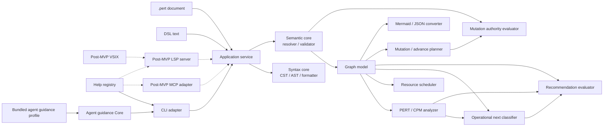

# perttool Basic Design

- Document status: Draft 1.20
- Created: 2026-07-21
- Updated: 2026-07-28
- Applicable requirements: [requirements.md](requirements.md)
- Graph semantics: [specs/graph-semantics.md](specs/graph-semantics.md)
- Analysis: [specs/analysis.md](specs/analysis.md)
- Temporal calendar semantics: [specs/temporal-calendar.md](specs/temporal-calendar.md)
- Temporal deadline semantics: [specs/temporal-deadline.md](specs/temporal-deadline.md)
- Unit migration semantics: [specs/unit-migration.md](specs/unit-migration.md)
- Temporal and unit interface: [specs/temporal-unit-interface.md](specs/temporal-unit-interface.md)
- Project actuals and Git history: [specs/project-actuals.md](specs/project-actuals.md)
- Recommendation semantics: [specs/recommendation.md](specs/recommendation.md)
- Recommendation ranking: [specs/recommendation-ranking.md](specs/recommendation-ranking.md)
- Recommendation reasons: [specs/recommendation-reasons.md](specs/recommendation-reasons.md)
- Recommendation explanation: [specs/recommendation-explanation.md](specs/recommendation-explanation.md)
- Recommendation interface: [specs/recommendation-interface.md](specs/recommendation-interface.md)
- Recommendation override: [specs/recommendation-override.md](specs/recommendation-override.md)
- Owner-aware mutation governance: [specs/governance-authority.md](specs/governance-authority.md)
- Governance source and effective metadata: [specs/governance-source.md](specs/governance-source.md)
- Governance interface: [specs/governance-interface.md](specs/governance-interface.md)
- Governance examples: [examples/governance.md](examples/governance.md)
- Governance design acceptance: [process/governance-design-acceptance.md](process/governance-design-acceptance.md)
- Contract 5 beta release: [process/0.4.0-release.md](process/0.4.0-release.md)
- Recommendation examples: [examples/recommendation.md](examples/recommendation.md)
- AI Agent Guidance Registry: [specs/agent-guidance.md](specs/agent-guidance.md)
- AI Agent Guidance examples: [examples/agent-guidance.md](examples/agent-guidance.md)
- Recommendation migration: [process/recommendation-migration.md](process/recommendation-migration.md)
- Recommendation design review: [process/recommendation-design-review.md](process/recommendation-design-review.md)
- CLI interface: [specs/interfaces.md](specs/interfaces.md)
- CLI Contract 3: [specs/cli-contract-3.md](specs/cli-contract-3.md)
- CLI Contract 3 migration: [process/cli-contract-3-migration.md](process/cli-contract-3-migration.md)
- CLI Contract 5 migration: [process/cli-contract-5-migration.md](process/cli-contract-5-migration.md)
- Mermaid profile: [specs/mermaid-profile.md](specs/mermaid-profile.md)
- AoA decision: [adr/0001-activity-on-arrow.md](adr/0001-activity-on-arrow.md)
- Runtime/package decision: [adr/0005-node-22-runtime-baseline.md](adr/0005-node-22-runtime-baseline.md)
- Beta versioning/release decision: [adr/0003-beta-versioning.md](adr/0003-beta-versioning.md)
- Repository language decision: [adr/0004-english-repository-baseline.md](adr/0004-english-repository-baseline.md)
- Self-use plan: [process/self-use.md](process/self-use.md)

## 1. Purpose

This document decomposes the `perttool` defined by the requirements to an implementation-ready level, and defines the shared Core, data representations, processing flows, external interfaces, safe document updates, and test boundaries.

The complete DSL grammar, CLI/JSON contracts, and Mermaid profile are fixed by their respective specifications. This document covers the module boundaries and contracts that implement them.

## 2. Design Principles

### 2.1 Adopted Principles

- The implementation language is TypeScript.
- A CLI and library that run on Node.js are provided from the same package.
- Activity-on-Arrow, in which tasks are edges and milestones are nodes, is the central model.
- `.pert` documents are authoritative, and normal analysis completes locally.
- Parsing, semantic validation, and PERT/CPM calculation are consolidated in the shared Core.
- The MVP uses the CLI as its primary adapter; an LSP server, VSIX, and MCP server are added to the shared Core after the MVP.
- Document edits are planned as diffs against source spans and applied only after reparsing and revalidation.
- Human-readable text and machine-readable JSON are rendered from the same result object.
- All calculations and orderings are deterministic.
- English is the canonical language for repository-maintained artifacts; runtime i18n is not part of the current architecture

TypeScript is selected for the following reasons.

- It enables the CLI and future MCP and VS Code-family adapters to share types and implementations.
- It integrates well with visualization adapters such as Mermaid, HTML, and SVG.
- It can follow the architecture already adopted by `llmthink`: a shared Core with multiple thin UIs.
- It makes the correspondence between JSON Schema and TypeScript types easier to manage.

The runtime is Node.js 22 or later, the package manager is npm, and the module format is ESM. [ADR 0005](adr/0005-node-22-runtime-baseline.md) defines the supported baseline; `package.json` and `package-lock.json` define concrete package versions, and the CI workflow defines the tested runtime matrix.

### 2.2 Rejected Principles

- The CLI does not invoke an MCP server.
- Parsers and PERT calculations are not implemented separately for each UI.
- Re-serializing the entire AST for every local edit is not the default approach.
- Floating-point values are not authoritative for calculations.
- A Mermaid AST is not the internal canonical graph model.
- An LLM response is not treated as an analysis result.
- The initial implementation does not combine exact-optimal resource leveling, calendars, skills, or external issue synchronization.

## 3. System Architecture



### 3.1 Dependency Rule

Dependencies point in one direction, from outer layers to inner layers.

```text
CLI / future MCP / LSP / VSIX / filesystem
             |
             v
      application services
             |
             v
syntax / semantic / graph / analyzer / recommendation / transform / governance
```

The Core layer MUST NOT depend on the following:

- filesystem
- network
- process environment
- terminal width or color
- MCP transport
- editor API
- wall clock time

The reference timestamp, file path, display precision, critical epsilon, and similar values are passed as explicit arguments.

## 4. Repository Structure

The current implementation uses the following layout. Do not create directories for unimplemented modules in advance.

```text
perttool/
  .github/
    workflows/
  docs/
    adr/
    examples/
    process/
    specs/
    basic-design.md
    requirements.md
  plans/
    agent-guidance.pert
    control-plane.pert
    grammar.pert
    mvp.pert
    operations.pert
    recommendation.pert
  scripts/
    check-docs.sh
    check-npm-link.sh
    check-self-use.sh
  schemas/
    Perttool.Common.v1.schema.json
    Perttool.<ResultType>.vN.schema.json
  README.md
  package.json
  tsconfig.json
  src/
    application/
      agent-help.ts
      analyze.ts
      check.ts
      format.ts
      mutate.ts
      target-check.ts
      target-governance-write.ts
      target-mutate.ts
      target-project.ts
      next.ts
    analysis/
      graph.ts
      precedence.ts
      resource.ts
    editing/
      unified-diff.ts
    formatter/
      source-formatter.ts
      target-source-formatter.ts
    guidance/
      profile.ts
      projection.ts
      query.ts
      text.ts
      types.ts
      validator.ts
    help/
      registry.ts
    io/
      document-file.ts
      safe-write.ts
      target-safe-write.ts
    model/
      calendar.ts
      declaration-fields.ts
      syntax.ts
      diagnostics.ts
      rational.ts
      target-calendar.ts
    parser/
      document-parser.ts
    mutation/
      diagnostics.ts
      entity-editor.ts
      milestone.ts
      resource.ts
      source.ts
      task.ts
      text-edits.ts
      target-types.ts
      types.ts
    semantic/
      target-validator.ts
      validator.ts
    schema/
      registry.ts
    cli.ts
    index.ts
    version.ts
  test/
    agent-guidance-core.test.mjs
    agent-guidance-publication.test.mjs
    analysis.test.mjs
    cli.test.mjs
    e2e.test.mjs
    next.test.mjs
    parser.test.mjs
    temporal-source-parser.test.mjs
    temporal-declared-input.test.mjs
    temporal-semantic-validator.test.mjs
    temporal-mutation.test.mjs
    mutation.test.mjs
    self-use.test.mjs
    fixtures/
    golden/
```

The layout represents responsibilities. Do not proliferate empty directories during the small initial stage; add them as implementation slices require.

## 5. Three Layers of Document Representation

Documents are handled in three layers: `CST -> AST -> Graph`.

### 5.1 CST

CST preserves the editability of the original text.

Preserved information:

- token kind and raw text
- UTF-16 code-unit offset
- line and column
- indentation
- blank lines
- standalone-line comments
- start and end spans for blocks
- spans for field values
- separate spans for block text markers and content
- line-ending form

Internal offsets, lines, and columns are zero-based; offsets and columns use UTF-16 code units to align with JavaScript and LSP. The CLI converts source locations to one-based values for display. Only filesystem digests and file sizes use UTF-8 byte sequences.

Purposes of the CST:

- Change only one field of a task.
- Preserve comments and declaration order.
- Report source diagnostics precisely.
- Provide the foundation for editor rename and code actions.

### 5.2 AST

AST represents the syntactic meaning of the DSL.

Initial nodes:

- `ProjectDecl`
- `ResourceDecl`
- `MilestoneDecl`
- `TaskDecl`
- `GateDecl`
- `DurationLiteral`
- `EstimateDecl`
- `RequirementsDecl`
- `TextField`
- `ListField`

Each node has at least the following:

```text
kind
id or field name
normalized value
source span
CST node reference
```

At the AST stage, target existence, cycles, and reachability of `finish` are not determined.

### 5.3 Graph model

The Graph model is the analysis representation after reference resolution.

```ts
interface PertGraph {
  project: ProjectModel;
  resources: ReadonlyMap<ResourceId, ResourceModel>;
  milestones: ReadonlyMap<MilestoneId, MilestoneModel>;
  edges: ReadonlyMap<EdgeId, TaskEdge | GateEdge>;
  incoming: ReadonlyMap<MilestoneId, readonly EdgeId[]>;
  outgoing: ReadonlyMap<MilestoneId, readonly EdgeId[]>;
  topologicalOrder: readonly MilestoneId[];
}
```

Graph model conditions:

- IDs are unique.
- Endpoints are resolved.
- Each task resource requirement is resolved and within capacity.
- There are no self-loops.
- The graph is a DAG.
- Edge IDs in adjacency lists use a deterministic order.
- Source references to the input AST are retained.

Analyzers do not receive an invalid Graph. When structural errors exist, `SemanticResult` returns diagnostics and Graph construction is not considered complete.

## 6. Numeric Representation

### 6.1 Rational

Durations, expected values, variances, and float values are represented internally as normalized rational numbers.

```ts
interface Rational {
  numerator: bigint;
  denominator: bigint;
}
```

Rules:

- The denominator is always positive.
- The numerator and denominator are reduced by their greatest common divisor.
- Finite decimals in the DSL are converted to exact fractions.
- PERT division by `/ 6` is retained exactly.
- Rounding to the requested precision occurs only for display.
- JSON returns a decimal string and, when necessary, numerator and denominator strings.

This prevents criticality decisions and tie breaks from depending on runtime floating-point differences.

### 6.2 Duration Units and Velocity

The MVP uses a single duration unit within each document.

- `duration_unit day` uses `d`.
- `duration_unit hour` uses `h`.
- `duration_unit point` uses `p` and requires `velocity <points>p/<period>d|h`.
- Mixing units is a semantic error.
- Points and days/hours are converted as exact rationals using project-wide velocity.
- Converted values are kept separately from baseline PERT values as a velocity forecast.
- No calendar conversion is performed between days and hours.
- Metadata reports the variance unit as the square of the duration unit.

### 6.3 Resource Quantities

Resource capacities, task requirement quantities, and priorities are non-negative integers within a safe range.

- Capacity is at least 1.
- A requirement quantity is at least 1 and no greater than capacity.
- Priority is at least 0; its default is 0.
- The maximum value is 2147483647.
- Quantities are not mixed with duration rationals.
- An analysis error occurs when simultaneous requirements of active tasks exceed capacity.

### 6.4 Temporal Calendar Projection

The first temporal extension adds a pure projection layer over exact relative
analysis. It does not change `AnalysisResult.v2`, scheduler version 1, or the
source document.

```text
validated calendar literals + project.as_of
                    +
exact precedence or resource relative result
                    +
point velocity when the base unit is point
                    |
                    v
tagged exact calendar values or an unavailable cause
```

Calendar values remain tagged as `date` or `date-time`. Dates use Gregorian
ordinal-day arithmetic and do not imply midnight or a time zone. Date-times
use exact Rational SI seconds normalized for comparison by their declared
fixed offset; derived values retain the `as_of` offset. Mixed-kind operations
do not guess a conversion.

Projection uses the independently versioned arithmetic and continuous profile
in the [Temporal Calendar Semantics specification](specs/temporal-calendar.md).
It has no clock, locale, host-zone, named-zone, daylight-saving,
business-calendar, or resource-availability input.

For a point project, the existing exact velocity conversion selects day or
hour as the projection unit while retaining the `velocity_forecast`
qualification. The projection constants for day/date-time and hour/date-time
arithmetic are not a general day/hour conversion and cannot be reused for
source migration.

`task.not_before` produces an exact release bound for a new start.
Structural `ready` remains a graph/state fact. A missing or incomparable
temporal relationship fails closed for `runnable_now` without reclassifying
the task as blocked. The separately versioned temporal precedence and resource
projections apply future release bounds; the unqualified Analysis version 1
results remain available.

### 6.5 Temporal Deadline Evaluation

Deadline evaluation is a pure layer over the calendar model and separately
versioned temporal schedules.

```text
project.as_of + deadline + completion state
                    +
temporal precedence earliest projection
                    +
temporal parallel-SGS projection
                    |
                    v
current due state + separate forecast views
                    |
                    v
exact margin/lateness + qualified combined assessment
```

The temporal precedence projection propagates the maximum of predecessor reach
and `not_before` release for every unstarted task. The temporal resource
projection extends `parallel-sgs` version 1 with deterministic release events
while preserving capacity, active allocation, candidate order, and
`optimal=false`.

For an incomplete deadline subject, compare `as_of` independently from each
projected completion. Positive signed margin is early, zero is on the
deadline, and negative margin is late. A precedence lower-bound miss is
`forecast_infeasible`; a resource-heuristic miss when the lower bound can meet
is `at_risk`; a constructed on-time heuristic schedule is
`forecast_on_time`. None is an actual-time or probability claim.

Done tasks and reached milestones have no inferred historical completion time.
Blocked predecessor cones retain stable conditional IDs, and heuristic
results retain their scheduler identity and non-optimal qualification.

The [Temporal Deadline Semantics specification](specs/temporal-deadline.md)
fixes these meanings. Recommendation algorithm version 1 and Reason Taxonomy
version 1.0 do not consume deadline facts. Public result types, CLI/help
projection, grammar fields, and source-preserving mutations remain
responsibilities of the ordered SU-M1 follow-on contracts.

### 6.6 Point and Time-Unit Source Migration

Unit migration is a pure candidate-planning layer over one valid source
document. It is not an Analysis forecast and does not apply a sequence of
independently valid project/task mutations.

```text
valid source + target unit + optional replacement velocity
                         |
                         v
direction and effective-velocity validation
                         |
                         v
complete base-unit field inventory
                         |
                         v
exact Rational conversion + canonical Duration and grammar selection
                         |
                         v
localized UTF-16 edits + one revalidated candidate
```

The only changing-unit directions are Point to the effective velocity's
`day` or `hour` period, and the matching time unit back to Point. The design
does not infer a day/hour ratio. It converts declared project epsilon and
target duration plus every deterministic or three-point task estimate,
regardless of task status. Absolute `as_of`, `deadline`, and `not_before`
values are retained.

Serialization reduces every converted Rational. A denominator containing only
prime factors 2 and 5 produces the shortest exact finite Decimal; every other
denominator produces a reduced fraction Duration. Display rounding is never a
fallback. A grammar version 1 or 2 source remains at that version when every
generated token is Decimal. If any generated token requires a fraction, the
same candidate upgrades the project to grammar version 3 before final
validation.

The planner retains an equal declared velocity byte-for-byte, atomically
replaces a different explicit velocity, or inserts an explicit velocity for a
time source that lacks one. It edits only the project unit, applicable
velocity, and inventoried Duration value spans, then reuses ordinary candidate
validation, diff, digest, and later safe-write controls.

A same-target request without replacement is a no-op. Repeating a successful
target does not rescale values. Inverting with the same effective velocity
restores exact source Rationals, although canonical Duration spelling need not
restore lexical bytes. A replacement velocity or source-grammar upgrade is
retained and therefore qualifies whole-document reversibility as
metadata-changed. Migration never automatically downgrades grammar version 3.

The [Point and Time-Unit Migration Semantics
specification](specs/unit-migration.md) fixes the algorithm identity, formulas,
field inventory, velocity disposition, representability, failures, and
round-trip meaning.

### 6.7 Temporal and Unit Public Interface

The [Temporal and Unit Interface
Contract](specs/temporal-unit-interface.md) version 2 keeps grammar version 1,
accepted target grammar version 2, and CLI Contract 3 closed, then selects
grammar version 3 and CLI Contract 4 for one later atomic cutover.

Grammar version 2 adds only milestone `deadline`, task `not_before`, and task
`deadline`. Grammar version 3 inherits those fields and changes only Duration
to accept a finite Decimal or an exact unsigned fraction with a positive
denominator. Exact date/date-time and Rational values flow from validated
CST/AST data into pure application layers; they never enter ordinary PERT or
recommendation ranking as substituted display values.

The target public results are CheckResult v2, ProjectResult v2,
AnalysisResult v3, NextResult v4, and UnitMigrationResult v2. Analysis v3
retains the entire base Analysis v2 result and adds separate temporal
precedence/resource and deadline views. Next v4 retains Recommendation
algorithm version 1 and its complete v3 graph, then adds a release gate:
automation starts only the intersection published as
`startable_recommended_task_ids`. Deadline facts remain informational for
ranking.

`project migrate-unit --to-unit ...` calls a separate pure planner, not
`project.set` or `batch.apply`. Temporal field mutations can participate in a
final-candidate-only batch, including grammar upgrade/downgrade. Automatic
unit migration cannot be a batch member in interface version 2 because its
complete-field inventory and exactness guarantee bind to one source
snapshot.

Contract 4 is not active until parser, Core, schemas, registry dispatch/help,
Guide, diagnostics, README, installed-package E2E, authority guidance, and
override validation move together. Emitting NextResult v4 alone does not
authorize self-use.

Delivery preserves that atomic boundary. SU-M2 implemented accepted target
Grammar 2 source handling and declared-input Core projections. SU-M2R first
fixes and then implements Grammar 3 exact Duration source, formatting,
mutation, version-boundary, and acceptance behavior. SU-M3 adds target
calendar, deadline, temporal-schedule, and Next v4 Core; SU-M4 adds
unit-migration version 2 Core. Those slices can expose internal target types
and tests but do not enter active dispatch, help, public result schemas,
package examples, or normal task-selection authority. SU-M5 alone performs
the Contract 4 public cutover after shadow and unknown-result safe-stop
acceptance. Package publication remains a separate decision after that local
acceptance.

The current source implements the internal Grammar 2 target capability and a
separately identity-checked Grammar 3 source capability rather than changing
`TARGET_GRAMMAR_2_CAPABILITY` in place. Grammar 3 parsing, validation, exact
source serialization, explicit formatting, and source-preserving mutation are
internal SU-M2R inputs. The exact-Duration version boundary and cross-cutting
acceptance are complete. SU-M4 now adds an internal migration-version-2
request preparation layer over the validated Grammar 1/2/3 boundary. It
selects an exact declared, equal, replaced, or inserted velocity; rejects
unsupported directions and period mismatches with stable causes; inventories
every known base-unit field in declaration and field order; and captures
absolute temporal source tokens for later preservation checks. Exact
conversion, coordinated candidate planning, result projection, and inverse
behavior remain. The active Grammar 1 parser and accepted internal Grammar 2
behavior remain unchanged.

`src/migration/request.ts` owns the pure semantic request, velocity, stable
cause, complete Duration inventory, and preserved-temporal snapshot.
`src/migration/conversion.ts` applies the one positive exact velocity factor
to that ordered inventory, records normalized original and converted
Rationals with their units, reuses the accepted exact Duration serializer,
and selects the existing grammar retention or upgrade boundary without using
display or calendar-projection values.
`src/application/target-unit-migration-request.ts` admits only a document
validated through the identity-checked Grammar 3 target capability and
returns that nominally validated boundary for later SU-M4 layers. Neither
application boundary nor the migration modules are root exports or Contract 3
commands.

`src/application/target-unit-migration-candidate.ts` coordinates the prepared
request and exact conversion without routing through the ordinary public
batch surface. It plans the grammar version, base unit, retained/replaced/
inserted velocity, and complete Duration inventory as one non-overlapping
UTF-16 edit set against the original target AST; applies the edits once;
validates only the final Grammar 1, 2, or 3 candidate; verifies exact token and
absolute-temporal preservation postconditions; and exposes candidate text,
SHA-256 digest, unified diff, and edits only after success. Its candidate is
accepted by the existing internal Grammar 3 digest-locked safe-write adapter.
The service remains absent from root exports and CLI Contract 3.

Round-trip acceptance invokes that same service for each operation. A
same-unit request and a repeated completed target return the current source,
digest, and empty edit/diff set without conversion records. An inverse request
is prepared again from the forward candidate and restores every inventoried
Rational under the retained effective velocity; canonical Duration spelling
may differ while temporal tokens, trivia, and unrelated fields remain exact.
Grammar 3 retention is observable on the inverse. Velocity insertion or
replacement is qualified by the operation that changed the metadata; the
history-free inverse retains the resulting velocity and does not guess its
prior absence or value.

`src/application/target-unit-migration-result.ts` projects the candidate into
the internal `Perttool.UnitMigrationResult.v2` Core shape. It removes the
request-only velocity token and serializer classification, emits normalized
exact values with explicit Point or calendar units, preserves ordered
converted fields and complete semantic causes, and includes candidate,
diagnostic, and preview/write state. A write state can be attached only to a
successful result whose safe-write digest equals the candidate digest. This
module has no JSON or text adapter, CLI envelope, command registration, root
export, or active installed workflow; those remain SU-M5 work.

The SU-M2 source implementation keeps `parseDocument` fixed to the active
Grammar 1 profile. Target parsing requires the identity-checked internal
`TARGET_GRAMMAR_2_CAPABILITY`; only an explicit project `version 2` selects
the added fields. Declared date and date-time tokens become exact internal
`DeclaredCalendarValue` records while retaining their original spelling and
source spans. The capability, target parser, and calendar records are not
re-exported from `src/index.ts`.

The SU-M2R source implementation adds
`TARGET_GRAMMAR_3_CAPABILITY`, `parseTargetGrammar3Document`, and
`validateTargetGrammar3Document` as a separate internal boundary. Explicit
Grammar 3 Duration accepts the existing Decimal record or an additive
`DurationFractionValue`. A Fraction retains its original token and source
span while storing a reduced nonnegative numerator and positive denominator.
Exact cross-form comparisons enforce zero, positivity, and PERT ordering
without binary floating point. Grammar 1 and Grammar 2 continue to reject
Fraction Duration, and velocity remains Decimal-only.

The internal `serializeExactDurationSource` helper consumes a Rational and
Duration unit. It emits the shortest exact ordinary Decimal when the reduced
denominator has no prime factors other than 2 and 5, otherwise a reduced
Fraction. It uses BigInt arithmetic only and is independent from display
precision and rounding.

The active and target parsers derive their accepted fields from shared
canonical declaration-field orders. The internal Grammar 2 and Grammar 3
target formatters reuse the same target order as the temporal mutation
insertion path, but walk the validated source fields in their existing order.
Both retain declaration order, comments, blank lines, BOM, predominant line
endings, and the exact `as_of`, `deadline`, and `not_before` token spellings
while applying the ordinary lexical normalization rules to the rest of the
document. The Grammar 3 path additionally canonicalizes every exact Duration
as the shortest ordinary Decimal or reduced Fraction without changing its
Rational value. Each candidate crosses its matching target
validated-document boundary again, and repeated formatting is idempotent and
target-AST equivalent. `formatDocument`, root exports, CLI Contract 3, and
installed-package behavior remain Grammar 1.

Target semantic validation has separate identity-checked boundaries. The
Grammar 2 capability accepts Grammar 1 or explicit Grammar 2, while the
Grammar 3 capability also accepts explicit Grammar 3 and exact Fraction
Duration. Both return an internal `TargetValidatedDocument` boundary on
success. A Grammar 2 or Grammar 3 temporal field without `project.as_of`
produces `PTSEM-112` at the field value. Mixed calendar kinds and temporal
fields retained on active, done, or reached history remain valid source;
projection availability and start authority belong to later target Core
slices. The target validators read no clock, host zone, locale, repository,
or path and are not re-exported from `src/index.ts`.

The internal target check service reuses that one parsed and semantically
checked document to derive CheckResult v2 declared-input Core records. It
projects the optional anchor, milestone deadlines, and task constraints from
the validated source order into exact tagged CalendarValue records. Syntax
failures or an unprojectable legacy anchor set `temporalInputs` to null;
trusted declared fields remain observable with semantic diagnostics such as a
missing anchor. Diagnostic limits do not change the complete summary counts.
The target project service consumes the same target check result once,
projects typed `asOf`, and obtains `finishDeadline` only from the milestone
named by `project.finish`. Any invalid document returns null project metadata
and null grammar version. Neither service performs calendar arithmetic,
deadline evaluation, JSON projection, CLI dispatch, or public export.

The internal Grammar 2 and Grammar 3 target mutation planners use their
matching identity-checked capability and validated-document boundary with the
shared canonical declaration-field orders, entity editors, UTF-16 edit
normalization, diff, and digest machinery. Their private request types add
task `notBefore`/`deadline` and milestone `deadline` only to target
add/set/clear operations. The Grammar 3 profile also accepts exact Duration in
project and task add/set/estimate requests, canonicalizes only changed values,
and preserves unrelated source tokens. A batch plans every edit against the
original AST and validates only the final target candidate, so one request
can atomically select the required target grammar and can return to Grammar 1
or Grammar 2 only when the final candidate permits it. Invalid calendar or
Duration values, missing anchors, overlap, duplicate targets, and invented
unit-migration batch members expose no candidate or edits; automatic
whole-document unit migration remains outside this planner. The active
`planMutation`, public request types, root exports, registry, and CLI remain
Grammar 1 and Contract 3.

Safe-write mechanics accept an internal candidate-validator strategy while
the public adapters remain fixed to active Grammar 1 validation. The private
target adapters bind the Grammar 2 or Grammar 3 capability to that same
in-place/out, digest-lock, symlink/race rejection, fsync, and post-write
verification path; they do not add a Contract 4 CLI write route.

The internal exact-Duration grammar boundary receives the complete set of
canonical tokens generated for one changing-unit candidate and an explicit
velocity disposition. A pure selector retains source Grammar 1 or 2 for an
all-Decimal set, upgrades either to Grammar 3 when any token is a Fraction,
and never downgrades Grammar 3. An identity-checked target application
validates the source through the Grammar 3 capability and returns either no
version edit or the localized canonical `project.version 3` edit. The
version-only candidate is revalidated and is intended for composition with
the later unit, velocity, and Duration edits before their one final
validation. It preserves all temporal source bytes.

The boundary reports source and target grammar versions,
`grammar_disposition`, stable grammar/velocity qualifications, and
reversibility independently from display precision. An upgrade, a retained
Grammar 3 inverse-shaped all-Decimal candidate, or replaced/inserted velocity
qualifies reversibility as `values_exact_metadata_changed`; another changing
candidate is `exact`, and a no-op is `not_applicable`. The boundary and its
types remain internal and do not activate migration, public schemas,
dispatch, help, or installed behavior.

### 6.8 Project actuals and Git history

The selected post-beta actuals architecture follows
[ADR 0006](adr/0006-explicit-work-events-in-git-history.md) and the
[Project Actuals and Git History Contract](specs/project-actuals.md). Its
source Core is implemented behind an internal target capability; it is not
part of active Grammar 4 or CLI Contract 5.

The target keeps three concerns separate.

```text
current source mutation
  task state + task-owned work event
            |
            v
  one validated source candidate
            |
            v
  pre-advance Git snapshot
            |
            v
read-only semantic history reconstruction
            |
            +--> task actual summaries
            +--> project throughput observations
            +--> qualified legacy recorded transitions
```

#### 6.8.1 Source and lifecycle Core

The internal `src/actuals/` source and lifecycle Core currently owns:

- deterministic event identity and exact fixed-offset time;
- exact active-time and explicit person-effort source values;
- planned-value baselines; and
- deterministic task-owned event projection;
- semantic event ordering and exact active-interval reduction; and
- complete, open, finish-only, and unrecorded coverage classification.

The internal lifecycle application service implements `task.start`,
`task.suspend`, `task.resume`, and `task.finish.actual`. It normalizes an
explicit caller time and kind-specific exact inputs, derives or validates one
event ID, validates the pre-change event stream and stored state, plans the
task state and event as one candidate, revalidates the lifecycle and exact
active time, and composes the existing pre-change governance decision. Start
generates its exact planned-value baseline from the validated task. Start and
resume fail before candidate generation when active requirements leave
insufficient snapshot capacity. Identical retries are no-ops and payload reuse
under one ID fails closed. Grammar 5 safe-write adapters retain the active
digest, optimistic-lock, symlink, race, and atomic replacement controls.

The internal AnalysisResult v4 and NextResult v5 targets project suspended
tasks without changing the active public result types. Analysis retains the
complete remaining task duration and makes precedence, resource, temporal,
and deadline views explicitly conditional on resumption at relative time
zero. Next keeps suspended tasks out of active, ready, blocked, upcoming,
runnable, raw recommendation, release-eligibility, and temporal start-authority
sets. The internal history reducer derives task-actual summaries from
committed snapshots without activating any of these targets through the public
package surface.

Grammar 5 adds task-owned top-level `work_event` declarations and the
`suspended` task state. Exact event EBNF, `h`/`ph` quantities, canonical
field order, source ownership, and migration are fixed by the accepted
contract. Events are source records but not graph edges. A lifecycle
application service plans the state edit and event insertion against one
validated source, applies the edit set once, revalidates the final candidate,
and exposes neither half on failure.

`suspended` tasks occupy no renewable resources and are not ordinary ready or
blocked tasks. Their versioned internal graph, analysis, recommendation, and
result handling is complete, but remains unavailable through the public
surface before atomic activation. Lifecycle mutation does not implement
recommendation override or durable authorization audit.

#### 6.8.2 Advance ownership

The internal Grammar 5 advance profile treats each work event as owned by its
task declaration. Removing a task removes its events in the same candidate,
retains events for residual tasks, and reports the removed event IDs in stable
order. Active Grammar 1 through 4 advance results and projections remain
unchanged. The existing pre-advance commit procedure remains mandatory.
`ADV-001` uses the shared Git inspection boundary to guard destructive edits,
while history reconstruction uses it to read evidence; the two application
decisions do not call each other.

#### 6.8.3 Read-only Git history

The internal `src/history/` boundary separates the pure semantic history
reducer from the narrow read-only Git probe.

```ts
interface PlanRevisionSnapshot {
  readonly repositorySnapshotId: string;
  readonly relativePath: string;
  readonly commitId: string;
  readonly parentCommitIds: readonly string[];
  readonly recordedAt: string | null;
  readonly sourceDigest: string | null;
  readonly source: Uint8Array | null;
}
```

The probe binds the Git object format, resolved commit, repository-relative
path, current source digest, and optional caller-expected digest. It traverses
only first-parent path changes and returns raw bytes, including a null source
for a deletion snapshot, plus commit parents and committer-time provenance.
It accepts SHA-1 and SHA-256 object repositories, supports linked worktrees,
and rechecks both `HEAD` and the regular-file identity after inspection. It
never stages, commits, checks out, resets, rebases, or pushes.

The probe and reducer are internal to the source tree and absent from the
active package root, CLI Contract 5, and installed workflow. The pure reducer
parses supported Grammar 1 through 5 snapshots, treats a deletion as an empty
snapshot, deduplicates stable event IDs, retains the last committed payload
and removal commit, and fails closed when one ID has conflicting payloads.
It distinguishes explicit actual events from legacy Git-recorded transitions:
commit provenance can identify a recorded state change but never supplies an
actual event time.

The probe reports shallow and rename boundaries as typed incomplete results;
missing repository/HEAD/revision, untracked or ambiguous paths, source/HEAD
races, and process or read failures fail closed. Unsupported grammar,
task-ID replacement, and event conflicts are typed by the reducer. A boundary
cuts semantic continuity so an incomplete prefix cannot invent a transition
or complete actual. Current-source operations remain Git-independent.

The reducer projects exact complete, open, finish-only, unrecorded, or
unavailable task summaries. It preserves actual start and finish times,
suspension intervals, cycle and active time, explicit active-time and effort
measurements, and the qualified planned-value baseline from the start or
finish snapshot. The internal application target composes the probe and
reducer and provides deterministic `Perttool.ProjectHistoryResult.v1` JSON
and text projections without adding a public command or root export.

#### 6.8.4 Observation service

The observation service consumes only the versioned history result. It returns
exact elapsed-hour Point throughput, qualified active-date Point throughput,
and Point/person-hour productivity separately. It does not sum parallel cycle
times, infer effort from resources, equate one day with 24 hours, read the
current clock, or mutate declared velocity.

The history reducer retains an eventless task's exact value at its
Git-recorded `done` transition as a qualified `finish_snapshot` baseline.
This is the only baseline available to the separately reported
`git_recorded_transition` candidate; it has no event ID and remains
`recorded_not_actual`.

The active project velocity remains the forecast input. A separately
previewed `project set` may later adopt one compatible observed value; the
observation service never performs that write.

#### 6.8.5 Public cutover

The implementation may land internal source, actuals, Git, lifecycle,
history, and observation slices without exposing them. Public activation is
one coordinated Grammar 5/CLI Contract 6 cutover after:

- source syntax and version migration are accepted;
- suspended-state graph and result semantics are versioned;
- lifecycle mutation composes governance and safe-write controls;
- history and observation schemas have stable qualification causes;
- active Contract 5 command discovery proves future commands remain absent
  before cutover; and
- repository, link, package, and installed-package acceptance pass.

## 7. Diagnostic Model

Every layer returns the shared `Diagnostic` type.

```ts
interface Diagnostic {
  code: string;
  severity: "error" | "warning" | "info";
  message: string;
  span?: SourceSpan;
  related?: readonly RelatedLocation[];
  helpTopic?: string;
  expectedSyntax?: string;
  fixes?: readonly SuggestedFix[];
}
```

Code namespaces:

- `PTDSL-*`: lexical, parser, and field syntax
- `PTSEM-*`: references, state, duration, and graph constraints
- `PTDAG-*`: cycles, reachability, and schedules
- `PTRES-*`: resource capacity, allocation, and resource schedules
- `PTMUT-*`: mutation requests, target resolution, and unsafe removal
- `PTGOV-*`: owner-aware persistent-write authority
- `PTIO-*`: safe-write conflicts and post-write verification
- `PTCNV-*`: import, export, and loss reports
- `PTCLI-*`: CLI usage
- `PTHLP-*`: help registry lookup

Rules:

- Do not create different codes in the Core API and CLI for the same cause. Future adapters reuse the same diagnostics.
- Secondary errors after parse recovery can be suppressed.
- A cycle returns at least one witness path with related locations.
- A duplicate ID reports both the prior declaration and the duplicate declaration.
- Errors are stably ordered by source position, code, and ID.

## 8. Core API

The public library API is based on pure functions that do not perform I/O.

```ts
parseDocument(text, options): ParseResult
buildGraph(document, options): SemanticResult
checkDocument(text, options): CheckResult
formatDocument(text, options): FormatResult
analyzeDocument(text, options): AnalysisResult
selectNextTasks(text, options): NextResult
planMutation(text, mutation, options): MutationResult
planAdvance(text, options): MutationResult
exportMermaid(text, options): ExportResult
importMermaid(text, options): ImportResult
getHelp(request): HelpResult
```

Shared result fields:

```ts
interface OperationResult {
  schemaVersion: string;
  diagnostics: readonly Diagnostic[];
  diagnosticsTruncated: boolean;
  ok: boolean;
}
```

The source-preserving formatter Core returns the following. It provides `formattedText` and `edits` only when it can produce a valid candidate; subsequent application and CLI layers add I/O, diff, and write modes.

```ts
interface FormatResult {
  ok: boolean;
  documentId: string | null;
  changed: boolean;
  formattedText: string | null;
  edits: readonly TextEdit[];
  diagnostics: readonly Diagnostic[];
  diagnosticsTruncated: boolean;
}
```

Rules:

- `ok=false` when one or more error diagnostics exist.
- Caller options determine whether warnings cause failure.
- Library APIs do not call `process.exit`.
- Syntax errors and user document errors are not exceptions.
- Only programmer errors and invariant violations are exceptions.
- `maxDiagnostics` defaults to 100 and ranges from 1 through 1000; when exceeded, return the first diagnostics in source order and set `diagnosticsTruncated=true`.
- When parse errors exist, do not proceed to field or graph phases, and suppress derived diagnostics.

### 8.1 Safe-write adapter

I/O remains outside the pure Core. The public boundary is limited to committing a candidate generated and revalidated by the Core to a document file.

```ts
readDocumentFile(path): Promise<DocumentContent>
replaceDocumentFile(path, candidateText, { initialDigest, expectedDigest? }): Promise<DocumentWriteResult>
createDocumentFile(path, candidateText, { mode? }): Promise<DocumentWriteResult>
createArtifactFile(path, artifact, { mode? }): Promise<DocumentWriteResult>
```

`DocumentContent` contains owned raw bytes, BOM-preserving UTF-8 text, and a raw-byte SHA-256 digest. In-place replacement rejects symlinks and anything other than regular files, and compares the path identity obtained by `lstat` with the file identity opened using `O_NOFOLLOW`. It rechecks the initial digest before writing and immediately before renaming, writes an inherited mode to an exclusive temporary file in the same directory, fsyncs the file, atomically renames it, fsyncs the parent directory, and revalidates the digest and document validity.

New output avoids overwriting an existing target through rename and publishes the target through an exclusive hard link on the same filesystem from an fsynced temporary file. Concurrent writers, existing files, and symlinks are all rejected as conflicts; the temporary entry is removed and the parent directory is fsynced again. `createDocumentFile` revalidates DSL candidates, while `createArtifactFile` revalidates only digest equality for UTF-8 byte sequences in other formats such as Mermaid. Public results return only the mode, target, candidate digest, and byte count; they never return temporary paths or random tokens.

## 9. Processing flows

### 9.1 check

```text
text
 -> lex / parse
 -> AST field validation
 -> reference resolution
 -> graph construction
 -> cycle detection
 -> reached/frontier validation
 -> finish reachability validation
 -> diagnostics sort
```

When an error prevents graph construction, do not perform subsequent schedule analysis.

### 9.2 analyze

```text
check
 -> effective reached closure
 -> remaining edge weight
 -> topological forward pass
 -> reverse backward pass
 -> float calculation
 -> critical subgraph
 -> representative critical path
 -> resource-capacity validation
 -> deterministic resource schedule
 -> resource waits / schedule critical path
 -> blocked schedule qualification
 -> AnalysisResult
```

#### effective reached closure

1. Put explicitly `reached` milestones into the queue.
2. Treat a `done` task whose source is reached as a satisfied edge.
3. Treat a gate whose source is reached as a satisfied edge.
4. Mark a milestone that has one or more incoming edges and whose incoming edges are all satisfied as reached.
5. From each newly reached milestone, propagate satisfaction to outgoing done tasks and gates.

Because the graph is a DAG, processing can be deterministic using topological order or an indegree counter.

#### edge weight

- `done` task: 0
- deterministic task: duration
- PERT task: `(o + 4m + p) / 6`
- gate: 0

Include the work duration of a blocked task in its weight as usual, but exclude external waiting time. Set `conditionalOnBlocksResolved=true` on the overall result and return the applicable task IDs.

The analysis result separates `precedence`, which ignores resources, from `resource`, which respects capacity. The precedence makespan is a theoretical lower bound; the resource makespan is a feasible result produced by the selected heuristic and MUST NOT be presented as an optimum.

### 9.3 next

`next` reuses the result of `analyze`.

```text
active:
  status == active

ready:
  status == planned
  and effectiveReached(from)

runnable_now:
  ready
  and selected by current resource capacity after active allocation

blocked_now:
  status == blocked
  and effectiveReached(from)

upcoming:
  unfinished
  and not active / ready / blocked_now
```

ready sort key:

```text
priority desc
precedenceCritical desc
totalFloat asc
earliestStart asc
taskId asc
```

Ready tasks that do not require a resource are runnable candidates. For tasks that require resources, subtract the time-zero allocation of active tasks and select as many as possible under the same priority rule as the resource schedule. For each ready task not selected, include the insufficient resource, capacity, usage, and occupying task.

The explanation for `upcoming` returns the direct `from` milestone and the unsatisfied incoming edges that leave that milestone unreached. Do not expand all ancestors initially; control explanation depth through an API option.

Recommendation does not replace the existing classification or `runnable_now`; it is separated in the [Recommendation Semantics specification](specs/recommendation.md) as the decision authority for new start actions. The conceptual recommended set is a subset of ready tasks and MUST be jointly resource-feasible, including active allocation. Apply `recommended`, `allowed`, `deferred`, and `discouraged` only to ready tasks, and do not use `blocked` as a recommendation tier.

The [Recommendation Ranking Policy specification](specs/recommendation-ranking.md) deterministically selects the selection horizon and recommended set from actual ready tasks, and the [Recommendation Reason Taxonomy specification](specs/recommendation-reasons.md) decomposes the reason for a set or tier into stable codes, typed facts, and entity references. The [Recommendation Structured Explanation specification](specs/recommendation-explanation.md) connects typed facts, restricted expressions, comparisons, decision traces, and description projections, while the [Recommendation Interface Contract specification](specs/recommendation-interface.md) fixes the Core types, complete JSON, text summary, and `NextResult.v3` migration. The [Recommendation Human Override Contract specification](specs/recommendation-override.md) leaves the normal result unchanged and separates feasible replacements, human reasons, audit artifacts, and reanalysis. In addition to candidate facts, complete order, selection horizon, recommended set, tier, resource witnesses, a complete explanation graph, canonical English descriptions, and PTREC invariant validation, the pure Core in `src/recommendation/` implements read-only `validateOverride`, the `Perttool.OverrideDecision.v1` projection, and canonical SHA-256 identity. Publish normal and override results as distinct types, retaining the V2 meanings of `runnable_now` and upcoming explanations.

Use the [Recommendation normative examples](examples/recommendation.md) as inputs for conflict boundaries and implementation tests. Cover critical-versus-priority, parallel recommendations, selected and active-only resource blockers, empty sets, exact descriptions, and the need for an override across Core, JSON, text, and override validation using the same case IDs; do not treat an excerpt from an example as a complete result.

The [Recommendation implementation and self-use migration](process/recommendation-migration.md) is authoritative for the implementation and self-use adoption sequence. MIG-04 switched the Core, CLI, help, goldens, and package documentation to `NextResult.v3` together. The CLI, help, and provider guide display the same Core result and do not have independent ranking. Shadow evaluation and authority adoption are independent gates after publication.

### 9.4 mutation

```text
text + mutation request
 -> check existing document
 -> resolve exactly one target
 -> build TextEdit[]
 -> verify edits do not overlap
 -> apply edits in descending offset order
 -> parse and check candidate text
 -> build unified diff
 -> MutationResult
```

`MutationResult`:

```ts
interface MutationResult extends OperationResult {
  documentId: string | null;
  originalDigest: string;
  updatedDigest?: string;
  updatedText?: string;
  diff?: string;
  edits: readonly TextEdit[];
}
```

The Core does not write files. In the MVP, the CLI adapter receives `MutationResult` and writes only when safety conditions are satisfied. Apply the same boundary to future adapters.

The owner-aware extension composes a separate pure authority evaluator after
the final candidate is valid. It receives the original digest and effective
governance snapshot, the accepted original-to-candidate change set, write or
preview mode, and caller assertions. It returns per-scope facts and an
authority decision without filesystem, network, clock, Git, or authentication
effects. The
[Governance Source and Effective-Metadata
specification](specs/governance-source.md) fixes the Grammar 4 source fields,
declared/effective defaults, localized edits, and digest-bound pre-change
snapshot. The
[Governance Semantics specification](specs/governance-authority.md) fixes
classification and pre-change decisions; the
[Governance Interface contract](specs/governance-interface.md) fixes public
request and result types, CLI Contract 5, help, diagnostics, and exits.

The capability-checked governance path implements this preview and persistence
composition. `src/application/target-governance-mutation.ts`
applies the same actual-change classifier and pre-change evaluator after
direct, batch, and advance candidates validate.
`src/application/target-governance-projection.ts` owns target ProjectResult
v3, MutationResult v2, GovernanceDecision v1, and text projections.
`src/application/target-governance-write.ts` rejects preview, denied, and
invalid results before I/O, then sends only a digest-bound authorized
persistent candidate through the target Grammar 4 safe-write adapter.
In-place persistence retains expected-digest, source-identity, symlink,
atomic-replacement, and post-write checks. Existing-document `--out`
persistence rechecks the original source before temporary-file creation and
again before exclusive output creation, so a stale authority decision cannot
produce a new output artifact.
`src/command/target-governance-discovery.ts` and
`src/command/target-governance-usage.ts` derive the complete Contract 5
registry, help, usage recovery, and operation-level caller assertions used by
the active root and CLI.
`src/governance/guidance.ts` owns the exact generated direct-edit warning.
`src/help/target-governance-guide.ts` reuses the HelpNode projection and adds
the active Contract 5 editing guidance for preview, pre-change authority,
atomic multi-scope confirmation, caller-assertion limits, and direct-edit
bypass. `src/application/contract5-governance.ts` exposes the governed
direct, batch, and advance planners under the standard package-root names.

Preview renders the candidate and authority facts even when an actor or owner
acceptance is absent. A persistent governed write proceeds to the safe-write
adapter only when every affected scope is authorized. Direct commands, atomic
batch, advance, and any existing-document graph replacement share this
evaluator rather than command-specific authorization logic.

### 9.5 advance

Because advance is a stronger graph rewrite than ordinary mutation, it uses a dedicated planner.

Initial algorithm:

1. Determine the effective reached closure.
2. Treat newly reached milestones as frontier candidates.
3. Traverse unfinished edges backward from finish to determine the subgraph needed in the future.
4. Retain `done` tasks still needed for join evaluation.
5. Select for removal edges and nodes that are wholly before the reached frontier and unnecessary conditions of the future subgraph.
6. Reparse and reanalyze the candidate document.
7. Confirm that the next result is not semantically inconsistent before and after advance.

The [Graph Semantics specification](specs/graph-semantics.md) is authoritative for the complete deletion conditions of advance. In summary, remove as past edges whose target is effectively reached, and retain edges whose target is unreached as unfinished work or partial-join conditions. Do not expose the write action until the self-use gates for safe-write and advance are met.

### 9.6 Mermaid export/import

export:

```text
Graph + optional AnalysisResult
 -> stable node/edge ordering
 -> perttool metadata records
 -> Mermaid flowchart declarations
 -> optional style declarations
```

import:

```text
Mermaid text
 -> supported-profile parser
 -> perttool metadata decode
 -> graph reconstruction
 -> semantic validation
 -> DSL formatter
 -> loss report
```

The Mermaid adapter does not reimplement analysis or validation. Treat best-effort import of general Mermaid and lossless import of the `perttool` profile as separate modes.

Implement the MVP exporter as `exportMermaid` in `src/conversion/mermaid.ts`; it deterministically generates profile or plain artifacts from the result of `checkDocument` or `analyzeDocument`. Implement the importer as `importMermaid` in `src/conversion/mermaid-import.ts`; it restores the perttool profile fail-closed and returns stable generated IDs and a loss report for plain input. The CLI projects text or JSON, strict loss, and exclusive `--out` through `dag render --to mermaid` and `dag import --from mermaid`. Leave `--to svg|json` for a later slice.

The [Mermaid Profile specification](specs/mermaid-profile.md) is authoritative for the lossless profile. Preserve the complete semantic value after applying defaults in `%% perttool:` canonical JSON records, and do not make the visual flowchart the source of truth for restoration. After detecting a profile header, fail closed for invalid records, digests, or projections; do not downgrade to general Mermaid import. After decoding metadata, the importer also performs ordinary semantic validation and reparses the canonical DSL.

Because a resource requirement is not a DAG dependency edge, do not connect resource nodes directly to an ordinary flowchart and confuse them with precedence. Represent shared resources using task styles or annotations, a separate resource bipartite view, or a schedule timeline.

## 10. Graph algorithms

### 10.1 Topological sort and cycle witness

- Create a stable topological order with Kahn's algorithm.
- Take simultaneously processable milestones from a priority queue in lexicographic ID order.
- If all nodes cannot be processed, report a cycle error.
- Run DFS on the unprocessed subgraph and return one or more cycle witnesses.

### 10.2 finish reachability

- Perform reverse traversal from finish.
- Mark unfinished edges and nodes not reached by reverse traversal as `finish_unreachable`.
- Do not allow isolated done subgraphs solely to represent the past; diagnose them as advance candidates.

### 10.3 forward pass

- The earliest value of an effectively reached milestone is 0.
- Process milestones in topological order.
- The earliest value of a non-reached milestone is the maximum EF of its incoming edges.
- Perform comparisons and additions with Rational values.

### 10.4 backward pass

- The latest value of finish is the earliest value of finish.
- Process in reverse topological order.
- The latest value of a milestone is the minimum LS of its outgoing edges.
- Assume that elements which cannot reach finish have been excluded by prior validation.

### 10.5 critical subgraph

- Treat `abs(totalFloat) <= criticalEpsilon` as critical.
- Use the set of critical edges as the primary result.
- Do not make full path enumeration the primary result.
- For a representative path, tie-break at each branch by lexicographic edge ID order.
- Count exact driving paths with BigInt, separately from the number enumerated.
- Require `maxPaths` or provide a default limit for a full-enumeration option.

### 10.6 resource schedule

The MVP uses a deterministic parallel schedule-generation scheme for renewable resources.

```text
t = 0
register active tasks as running and allocate resources

while unfinished tasks exist:
  collect precedence-eligible tasks
  sort by priority desc, totalFloat asc, expectedDuration desc, id asc
  in sort order, start as many tasks as possible whose full resource requirements can be allocated
  when no further task can start, advance t to the next task completion time
  release resources of completed tasks and propagate milestone reachability
```

Rules:

- A DAG edge is hard precedence, priority is a soft preference, and a resource arc is derived information for explaining the selected schedule.
- Tasks are non-preemptive.
- A task acquires all required resources simultaneously.
- The allocation interval is `[start, finish)`.
- For completions and starts at the same time, complete and release first, then start.
- A lower-priority task can start when it is within capacity even if a higher-priority task cannot secure its requirement.
- Use expected duration.
- A blocked task does not occupy resources at time zero; flag it separately as a conditional schedule that assumes immediate resolution.
- Done tasks and gates consume no resources.
- Include the heuristic name and version in the result.

To explain resource waiting, record a `resource arc` between a task and the task whose completion released capacity that enabled its start. The [Analysis specification](specs/analysis.md) is authoritative for witness selection involving capacity of 2 or more and multiple resources, schedule-graph replay, and the exact rules for the schedule critical path.

This heuristic returns a feasible schedule but does not guarantee minimum makespan. Add an exact solver in the future as a separate adapter, explicitly reporting lower bound, best found, gap, and timeout.

## 11. CLI design

The CLI is resource-first. [CLI Contract 3](specs/cli-contract-3.md) is
authoritative for the active commands, options, operation namespace, command
help, guide split, and JSON envelope. The [CLI Interface
specification](specs/interfaces.md) is retained for Contract 2 payload, stream,
and exit meanings that Contract 3 explicitly preserves.

The [Temporal and Unit Interface
Contract](specs/temporal-unit-interface.md) is the target-only Contract 4
delta. It is not added to active dispatch until its atomic cutover gate.

```text
perttool help [resource [action]] [--format text|json]
perttool schema [schema-id] [--format text|json]
perttool guide [topic] [subtopic] [--level index|quick|detail]
perttool document check <file>
perttool document format <file>

perttool project init ...
perttool project show <file>
perttool project set <file> ...

perttool dag analyze <file> [--schedule precedence|resource|both]
perttool dag analyze <file> --capacity <resource-id>=<integer>
perttool dag next <file>
perttool dag render <file> --to mermaid|svg|json
perttool dag import <file> --from mermaid
perttool dag advance <file>

perttool task add|set|remove|finish ...
perttool gate add|set|remove ...
perttool milestone add|set|remove ...
perttool resource add|set|remove ...
perttool batch apply <file> --request <json-file|->
perttool agent help [provider [surface]]
```

CLI adapter responsibilities:

- parse argv
- read files
- call Core APIs
- render text and JSON
- map exit codes
- handle explicit write options
- control terminal colors

Responsibilities excluded from the CLI adapter:

- DSL parsing rules
- graph validation rules
- PERT/CPM formulas
- next-task ranking
- mutation target resolution

### 11.1 output

- stdout: requested result data
- stderr: diagnostics, write summaries, and non-data messages
- `--format text`: human-facing default output
- `--format json`: machine-readable output conforming to the schema
- enable color by default only for text output to a TTY
- do not include ANSI escapes in JSON

### 11.2 write safety

Mutation commands preview by default.

```text
default: updated text or diff only
--out: write to a new file
--write: update the input file
--expect-digest: optimistic lock
```

`--write` procedure:

1. Retain the digest recorded when reading.
2. Generate the mutation result.
3. Recheck the current file digest immediately before writing.
4. Create a temporary file in the same directory.
5. Flush and fsync the temporary file before atomic rename.
6. Fsync the parent directory where supported.
7. Reparse the file after rename and verify its digest.

The owner-aware extension inserts its authority decision after candidate
validation and before step 3. The decision is bound to the retained original
digest. A digest or identity conflict still fails through the existing
safe-write path, and a retry must recompute authority from newly read bytes.

### 11.3 Contract 3 command registry and dispatch

Contract 3 replaces handwritten dispatch/help duplication with one immutable
typed registry. `CLI_001_COMMAND_REGISTRY` selected
`src/command/registry.ts` as the descriptor source and added deterministic
descriptor projections. `CLI_002_CONTRACT_V3_CUTOVER` made the projected
`CONTRACT3_COMMAND_REGISTRY` in `src/command/discovery.ts` authoritative for
active dispatch, argv validation, text help, and JSON help. Every active
descriptor has `contractVersion = 3`.

`HELP_001_COMMAND_DISCOVERY` added the pure
`src/command/discovery.ts` Contract 3 projection. It derives the accepted command
and operation renames, examples, top-level/resource/action queries,
`Perttool.CommandHelpResult.v1`, and deterministic text/JSON from the active
expanded descriptors. The target `help` descriptor is the only additional
descriptor in that slice. `MUT_002_GATE_MAINTENANCE` added three target-only
gate descriptors after implementing their Core and atomic-batch path; these
descriptors reuse the editing contract. `MUT_001_PROJECT_INIT` added the
target-only `project init` descriptor after
implementing `src/application/init.ts`, deterministic
`Perttool.InitResult.v1` text/JSON projection, and composition with the
existing exclusive safe-write adapter. Resource summaries fix the accepted
action order but do not duplicate operand, option, effect, schema, exit, or
example data. `PTHLP-002` reports an unknown resource or top-level command;
`PTHLP-003` reports an unknown action. The atomic cutover activated all
projected and target-only descriptors together. The module naming does not
change the following dependency rule.

`HELP_003_USAGE_RECOVERY` added the pure
`src/command/usage.ts` projection. It resolves target command paths and
validates descriptor-expressible argv structure before any document read,
returns a typed `PTCLI-001` error with the most specific `helpTarget`, and
renders deterministic `Perttool.CliError.v1` text/JSON. Suggestions use only
the applicable registry resource, action, or option set and a fixed bounded
edit-distance rule. Handler-specific value relationships can add a usage error
after descriptor validation but retain the resolved descriptor target. The
cutover now runs this validation before document I/O and rejects Contract 2
renamed spellings with exit 2.

`HELP_002_DOMAIN_GUIDE_SPLIT` added the pure
`src/help/guide.ts` projection over the existing `HelpNode` graph. It preserves
topic IDs and index/quick/detail content while adding
`Perttool.GuideResult.v1`, `cli_contract_version=3`, operation `guide`,
deterministic text/JSON, and conceptual `guide_topic` diagnostic links. The
command descriptor registry does not import the domain graph, and GuideResult
does not project command descriptors or option contracts. The cutover
published this projection as `guide` and removed the `dsl help` route.

```text
command descriptors
       |
       +--> argv dispatch validation
       +--> text command help
       +--> JSON command help
       +--> usage-error help targets
       +--> registry completeness tests
```

The descriptor layer may depend on shared public types and schema IDs. It does
not depend on filesystem adapters, parse documents, run application services,
or contain domain algorithms. The CLI adapter resolves a descriptor, validates
argv against it, then calls the existing Application/Core path.

Shared options are reusable descriptor fragments expanded into a complete
per-command view. Expansion rejects duplicate or conflicting option names.
Dispatch parity tests compare the expanded registry with every implemented
handler; a handler or option without a descriptor is a build failure.

The registry and Contract 3 projections were built before public cutover while
Contract 2 remained advertised. The cutover then changed all breaking
resource/action and JSON operation mappings in one logical change.

### 11.4 Contract 6 schema discovery

The active Contract 6 registry adds one read-only `schema` descriptor. The
catalog in `src/schema/registry.ts` maps every advertised result identity
and the supported public library-only override result to one bundled Draft
2020-12 artifact under `schemas/`. It renders
`Perttool.SchemaResult.v1`, resolves artifacts locally and lazily, and does
not read a project or use the network. The
[JSON Schema Artifact Contract](specs/json-schema.md) is authoritative for
the inventory, `$id` convention, package layout, nested records, and
compatibility rules.

## 12. Post-MVP adapter boundaries

The LSP server, VSIX/editor adapter, and MCP server are outside the MVP scope. Do not include LSP transport, a VS Code extension, an MCP server, or SDKs in the MVP repository structure, package dependencies, or acceptance tests.

When adding future adapters, use the same application service directly rather than calling a CLI subprocess. Fix adapter-specific transports, request/response schemas, and write authority in versioned specifications separate from the CLI Interface specification.

## 13. Help design

Maintain help as a shared registry rather than scattered strings in code.

```ts
interface HelpNode {
  id: string;
  title: string;
  summary: string;
  quick: readonly HelpSection[];
  detail: readonly HelpSection[];
  syntax?: readonly string[];
  examples?: readonly HelpExample[];
  related: readonly string[];
}
```

Initial topics:

- `syntax`
- `syntax.project`
- `syntax.resource`
- `syntax.milestone`
- `syntax.task`
- `syntax.gate`
- `syntax.estimate`
- `syntax.duration`
- `syntax.velocity`
- `syntax.indentation`
- `syntax.string`
- `syntax.text`
- `syntax.tags`
- `syntax.comments`
- `syntax.top-level`
- `analysis`
- `analysis.resources`
- `next`
- `editing`
- `mermaid`
- `workflows`
- `errors`
- `samples`

Generate the following from the same registry.

- CLI text help
- CLI JSON help
- future MCP help results
- future LSP hover and completion documentation
- help links in parse diagnostics

The complete normative grammar is `docs/specs/dsl-grammar.md`. Help provides self-contained operational guidance, but a duplicate of the complete EBNF is not the source of truth. Verify consistency among grammar, parser, formatter, and help samples through fixtures. Automatically verify that every related ID in the registry and every diagnostic `helpTopic` in parser fixtures resolves, and that stable `.pert` references for syntax and sample topics exist and can be parsed.

Contract 3 separates two registry domains:

- the command descriptor registry drives dispatch and `help` at top-level,
  resource-level, and action-level;
- the existing `HelpNode` graph drives conceptual `guide` topics.

Neither registry substitutes for the other. Diagnostics reference a
`guide_topic` for conceptual recovery and a structured `help_target` for argv
recovery. `agent help` remains a third read-only registry backed by Guidance
Core because it answers provider-capability questions.

## 14. Schemas and versioning

Initial schemas:

- `Perttool.CheckResult.v1`
- `Perttool.AnalysisResult.v2`
- `Perttool.ResourceScheduleResult.v1`
- `Perttool.NextResult.v3`
- `Perttool.MutationResult.v1`
- `Perttool.ConversionLossReport.v1`
- `Perttool.HelpResult.v1`
- `Perttool.ExportResult.v1`
- `Perttool.ImportResult.v1`
- `Perttool.AgentGuidanceResult.v1` (planned for beta Issue #2)
- `Perttool.CliError.v1`
- `Perttool.CommandHelpResult.v1`
- `Perttool.GuideResult.v1`
- `Perttool.InitResult.v1`

Target Contract 4 schemas:

- `Perttool.CheckResult.v2`
- `Perttool.ProjectResult.v2`
- `Perttool.AnalysisResult.v3`
- `Perttool.NextResult.v4`
- `Perttool.UnitMigrationResult.v2`

Active Contract 5 schema changes:

- `Perttool.ProjectResult.v3`
- `Perttool.MutationResult.v2`
- `Perttool.GovernanceDecision.v1`

Active Contract 6 schema changes:

- `Perttool.CheckResult.v3`
- `Perttool.AnalysisResult.v4`
- `Perttool.NextResult.v5`
- `Perttool.MutationResult.v3`
- `Perttool.UnitMigrationResult.v3`
- `Perttool.ProjectHistoryResult.v1`
- `Perttool.VelocityObservationResult.v1`
- `Perttool.SchemaResult.v1`

Machine-readable Contract 6 artifacts:

- use JSON Schema Draft 2020-12;
- live at `schemas/<schema-id>.schema.json`;
- use `Perttool.Common.v1.schema.json` for bundled relative references;
- are discoverable through `perttool schema` and the public schema catalog;
- include all 17 command-result identities and public library-only
  `Perttool.OverrideDecision.v1`; and
- reject unknown root fields without changing existing result semantics.

Rules:

- Update TypeScript types and JSON Schema in the same change.
- Include `schema_version` and `tool_version` at the root.
- Adding optional fields is permitted within the same major schema.
- Removing fields, changing semantics, or narrowing enums requires a major schema increase.
- Emit golden JSON in stable key order.

The published `0.4.0` CLI JSON envelope includes
`cli_contract_version=5`. The current source-level cutover makes every
envelope include `cli_contract_version=6`; the actuals-affected operations
always return their Contract 6 schema identities, including for older input
grammars.

Reserve DSL version for future introduction as an optional field in the project block. When omitted in the MVP, treat it as version 1 grammar.

## 15. Test design

### 15.1 Unit tests

- indentation/tokenization
- quoted text/block text
- duration parsing and Rational
- PERT expected/variance
- topological sort
- cycle witness
- reachability
- forward/backward pass
- total/free float
- next classification/operational sort
- TextEdit overlap detection

### 15.2 Fixture/golden tests

Minimum fixtures:

- minimal linear graph
- parallel diamond
- task and gate convergence
- multiple frontier
- duplicate ID
- undefined endpoint
- self-loop
- multi-node cycle
- unreachable finish
- invalid estimate order
- mixed duration unit
- active from unreached
- blocked ready task
- retained done task at merge
- advance-safe graph
- advance-unsafe graph
- multiple critical path
- exclusive resource capacity 1
- parallel resource capacity 2
- multi-resource task
- active resource oversubscription
- priority tie-break
- a graph where a capacity change changes the makespan or critical path
- Mermaid lossless round-trip
- general Mermaid lossy import

Golden artifacts:

- formatted DSL
- diagnostics text/JSON
- analysis text/JSON
- next text/JSON
- mutation diff
- Mermaid output
- loss report

### 15.3 Property tests

Should:

- AST equivalence of `parse(format(parse(text)))`
- formatter idempotence
- topological-order validity for DAG generators
- earliest-time monotonicity with nonnegative task durations
- target-field equality and other-field invariance after mutation
- semantic round-trip of the lossless Mermaid profile

### 15.4 Adapter parity

For the MVP, verify that the library result and CLI JSON semantic payload agree for the same fixture. Explicitly exclude presentation-specific fields from comparison. Test MCP parity when the MCP adapter is added.

## 16. Self-use design

The detailed gates and operations for self-use are defined by [process/self-use.md](process/self-use.md).

### 16.1 Initial target

The initial self-use target is the DSL grammar design and implementation work.

- Normative grammar content: `docs/specs/dsl-grammar.md`
- Current and future grammar work plan: `plans/grammar.pert`
- AI process-control design plan for Issue #1: `plans/control-plane.pert`
- M1 through M4 operational implementation plan: `plans/operations.pert`
- MVP recommendation implementation plan: `plans/recommendation.pert`
- Beta AI Agent Guidance Registry implementation plan: `plans/agent-guidance.pert`
- Post-beta English repository baseline migration: `plans/english-baseline.pert`
- Post-beta CLI Contract 3 reset: `plans/cli-surface-reset.pert`
- Contract 3 `v0.2.0` beta release: `plans/release-0.2.0.pert`
- Contract 4 `v0.3.0` beta release: `plans/release-0.3.0.pert`
- Contract 5 `v0.4.0` beta release: `plans/release-0.4.0.pert`
- Contract 6 `v0.5.0` beta release: `plans/release-0.5.0.pert`
- Historical work plans: Git history

`plans/mvp.pert` defines the completed stage gates from MVP through the first beta; the design and implementation tasks for each slice are separated into the corresponding detail plan. Macro work packages roll up the resource makespan of their detail plans and do not duplicate individual task state. Manage grammar implementation in `plans/grammar.pert`, AI process-control design in `plans/control-plane.pert`, operational M1-M4 work in `plans/operations.pert`, MVP recommendation implementation in `plans/recommendation.pert`, and beta Issue #2 in `plans/agent-guidance.pert`. The post-beta English migration, CLI reset, `v0.2.0` release, scheduling/unit roadmap and details, `v0.3.0` release, owner-aware governance, `v0.4.0` release, project actuals, and the active `v0.5.0` release remain independent in their corresponding plans until a later macro composition decision.

`.pert` represents the DAG of work that designs and implements specifications; it is not the specification content itself. Do not conflate normative specifications with work state.

### 16.2 Bootstrap gate

Before creating `plans/grammar.pert` and making it a CI target, satisfy the following.

- There is a parser for project, resource, milestone, task, and gate declarations.
- There is semantic validation for IDs and endpoints.
- There is validation for cycles and finish reachability.
- `perttool dsl check` exists.
- The basic forward/backward pass of `perttool dag analyze` exists.
- There is a deterministic schedule that respects renewable-resource capacity.
- `perttool dag next` returns a deterministic result.
- Valid and failing fixtures are automatically tested.

At this stage, begin read-only self-use. Do not use the write paths for formatter, mutation, or advance.

### 16.3 Write gate

To apply `format --write` or task mutation to self-use documents, also satisfy the following.

- formatter idempotence
- preservation of comments and declaration order
- preview diff
- re-parsing and re-validation of candidate text
- atomic write
- optimistic lock
- round-trip regression against the grammar-plan fixture

### 16.4 Failure policy

- Do not corrupt the grammar plan to accommodate a tool bug.
- Retain the Markdown grammar and golden fixture as the evidence for bootstrap decisions.
- If a self-use document becomes unparsable, recover using the immediately preceding Git revision and a read-only check.
- When mixing a tool upgrade and a breaking change to `plans/grammar.pert` in one commit, retain verification evidence for both the old and new versions.

## 17. Implementation slices

### Slice 0: Design baseline

- basic design
- DSL grammar specification
- graph-semantics specification
- analysis specification
- interface specification
- ADRs

Exit:

- complete EBNF and an error policy with which a parser can be implemented
- examples confirm the meaning of reached, ready, done, gate, and advance

### Slice 1: Syntax and check

- TypeScript scaffold
- lexer/parser/CST/AST
- diagnostics
- resolver/validator
- `dsl check`
- `dsl help syntax`

Exit:

- minimal and invalid fixtures are fixed
- errors with source spans are emitted in text and JSON

### Slice 2: Analysis and next

- Rational
- topology, cycles, and reachability
- forward/backward passes
- critical subgraph
- renewable resource scheduler
- runnable_now and resource-wait explanations
- reached closure
- next classification/operational sort
- `dag analyze` / `dag next`

Exit:

- satisfy the bootstrap gate
- begin read-only self-use of `plans/grammar.pert`

### Slice 2R: Recommendation control plane

- normative fixtures and a v2 compatibility baseline
- pure Core for candidate facts, ranking, recommended sets, and tiers
- structured explanation graph, invariants, and canonical descriptions
- atomic publication of `Perttool.NextResult.v3` through Core, CLI, and help
- read-only override validation
- self-use shadow evaluation and normal-authority adoption

Exit:

- satisfy MIG-01 through MIG-07 in [Recommendation Implementation and Self-use Migration](process/recommendation-migration.md)
- generate complete JSON and summary text from the same Core result
- preserve the meaning of v2-derived fields and make breaking changes explicit to consumers
- allow AI to use known, complete recommendations as the selection authority through two-stage macro/detail planning

Detail the Slice 2R implementation tasks and estimates after Slice 3 reaches `M3_SAFE_WRITE_READY`. The file-ownership review for `M1_ROADMAP_UPDATE` found that Slice 2R and Issue #2 share `src/cli.ts`, `src/index.ts`, and reviewers with Slice 3; therefore, early parallelization could delay the operational milestones. Connect human override apply as MIG-08 only after the safe-write gate.

### Slice 3: Safe formatting and mutation

- source-preserving formatter
- project, task, milestone, and resource mutation with atomic batch
- preview diff
- atomic write and optimistic lock

Exit:

- satisfy the write gate
- use it for safe updates to the grammar plan

`M1_ROADMAP_UPDATE` finalized the [operations detail plan](../plans/operations.pert), completed all 24p, and recalibrated its observed operational velocity to `24p/1d`. `dag advance` published preview, diff, advance-specific JSON, and safe `--write`, `--out`, and `--expect-digest` controls, moving the project to Stage 3. Macro `MERMAID_PROFILE`, `MERMAID_EXPORT`, `MERMAID_ROUNDTRIP`, and `ADVANCE` also completed. The release-readiness audit found that MVP acceptance criterion 16 was missing; all 22p of MIG-01 through MIG-07 in the [recommendation implementation plan](../plans/recommendation.pert) resolved it. The project accepted five-plan shadow evaluation, read-only override validation, normal-authority adoption, and an unknown-version safe-stop dry run, then recalibrated the provisional recommendation-specific observed velocity to `22p/1d`. It published `v0.1.0-alpha.2` to a GitHub prerelease and npm `alpha` from the same artifact and accepted the MVP public alpha after verification through registry installation.

### Slice 4: Advance and Mermaid

- advance planner
- Mermaid lossless profile
- `%% perttool:` semantic records and projection integrity
- general Mermaid loss report
- SVG/HTML preview foundations

### Post-MVP Slice 4A: AI Agent Guidance Registry and beta

- provider-specific official baselines and versioned offline snapshots
- the common contract for instructions, workflows, delegated agents, enforcement, prompts, and connectors fixed in the [AI Agent Guidance Registry specification](specs/agent-guidance.md)
- deterministic `Perttool.AgentGuidanceResult.v1` pure Core
- text/JSON publication of read-only `agent help`
- acceptance tests for provider drift, aliases, unsupported/unknown values, legacy help, and the package-installed CLI
- publication of suffix-free `0.1.0` to a GitHub prerelease and npm `beta` from the same artifact

Exit:

- satisfy the [first beta acceptance criteria](requirements.md#211-first-beta-acceptance-criteria)
- trace the 12 acceptance criteria from the [Issue #2 acceptance record](process/agent-guidance-acceptance.md) to Core, CLI, help, and tests
- perform no hook execution, file creation, configuration change, network access, or provider write
- do not make alpha compatibility or additional soak a gate; update specifications and migration information in the same change when there is a breaking change

The [AI Agent Guidance detail plan](../plans/agent-guidance.pert) totals 22p. Use the [provider baseline](process/agent-guidance-provider-baseline.md) as design input, and the [AI Agent Guidance Registry specification](specs/agent-guidance.md) and [normative example](examples/agent-guidance.md) as the sources of truth for the public contract. The detail plan and [self-use procedure](process/self-use.md) define progress, observed velocity, remaining forecast, and the current recommended task; do not duplicate changing values in this design.

`src/guidance/` is a pure Core independent of the document application service. `profile.ts` provides versioned offline snapshots; `validator.ts` fail-closed validates version, ordering, reference closure, descriptions, and digests; `query.ts` provides exact lookup and alias normalization; `projection.ts` derives index, quick, and detail projections plus public JSON bytes; and `text.ts` derives text bytes and exit boundaries from the same result. The Core does not access files, the environment, the network, clocks, locale catalogs, or provider APIs. `GUIDANCE_CORE` implemented the public library export and dedicated goldens, while `AGENT_HELP_PUBLICATION` implemented structured command help, the CLI adapter, text/JSON, and package-installed parity.

`src/application/project.ts` is a read-only Core that extracts project metadata from a valid document and passes the same typed result to the text/JSON adapters for `project show`. The governance target extends that one result with declared and effective owners/delegates for every supported grammar version; adapters do not derive omission defaults independently. `src/mutation/project.ts` provides source-preserving `project.set` for exactly one project declaration. Include unit changes that are invalid in the project alone with related entity mutations in an atomic batch, and revalidate only the final candidate. Governance field insertion into Grammar 1, 2, or 3 similarly combines the localized field edit and explicit Grammar 4 version edit in one candidate. This makes ordinary viewing and editing of project metadata, including velocity and future governance metadata, possible without directly viewing or manually editing the source file.

### Post-MVP Slice 4B: English repository baseline

[ADR 0004](adr/0004-english-repository-baseline.md) makes English canonical for repository-maintained prose while keeping stable machine identifiers and user-authored Unicode content unchanged. Existing Japanese surfaces migrate after the first beta through the independent [`english-baseline.pert`](../plans/english-baseline.pert) plan.

The migration is split into inventory, runtime messages, bundled help, normative documents, process and agent guidance, current PERT metadata, golden/Unicode audit, and final acceptance. Runtime locale negotiation, translation catalogs, a `--locale` option, and automatic translation of `.pert` content are outside this slice.

The first task remained explicitly blocked until `plans/mvp.pert` reached `M8_BETA_RELEASED`. Because cross-plan dependencies are not yet implemented, that external gate was represented by a stable `blocked_reason`. After beta acceptance, the Stage 3 preview-first unblock procedure removed the reason and changed `SURFACE_INVENTORY` to `planned`. All nine migration and acceptance tasks are complete; the [final acceptance record](process/english-baseline-acceptance.md) traces this design through runtime, help, documentation, plans, tests, package contents, and agent entrypoints.

### Post-MVP Slice 4C: CLI Contract 3

The [CLI Contract 3 specification](specs/cli-contract-3.md) fixes the complete
review-derived target before runtime work starts. The independent
[`cli-surface-reset.pert`](../plans/cli-surface-reset.pert) plan orders:

1. the authoritative command descriptor registry;
2. hierarchical command discovery, domain-guide separation, and usage-error
   recovery;
3. explicit project initialization and typed gate maintenance;
4. one atomic breaking cutover, completed by
   `CLI_002_CONTRACT_V3_CUTOVER`; and
5. installed-package file-first acceptance, completed by
   `CLI_003_FILE_FIRST_ACCEPTANCE`.

`MUT-001` implemented and tested project initialization Core, output
projection, exclusive creation, and its internal descriptor without
authorizing a package release. The [migration
guide](process/cli-contract-3-migration.md) kept Contract 2 active until all
breaking names and JSON operations moved together. The isolated package
workflow now verifies every entity field and the complete
initialize/read/change/analyze/select/advance/validate sequence without
importing the repository Core or manually rewriting the document.

Exit:

- satisfy Requirements 21.2 and every `CLI3-*` normative case;
- maintain one dispatch/help registry and separate command/domain/agent help
  meanings;
- initialize and maintain every entity type without manual source rewriting;
- pass local-link and isolated-package acceptance;
- preserve MCP, LSP, VSIX, i18n, Git, and multi-plan composition as independent
  non-goals.

### Post-MVP Slice 4D: Contract 3 `v0.2.0` beta release

The [`v0.2.0` release procedure](process/0.2.0-release.md) selects the first
package version for accepted CLI Contract 3. The independent
[`release-0.2.0.pert`](../plans/release-0.2.0.pert) plan separates:

1. the normative release gate and version decision;
2. local version, lockfile, CLI, CHANGELOG, and package preparation;
3. clean-candidate and version-availability preflight;
4. explicitly authorized Git, GitHub, and npm distribution from one tarball;
5. durable public-channel acceptance.

The distribution task remains blocked until the user explicitly authorizes
the named `0.2.0` external-write batch. npm publication uses `beta` and must
leave `latest` unchanged. A later `latest` promotion is not a release-plan
task and requires a separate post-acceptance decision.

Exit:

- satisfy Requirements 21.3 from one clean release commit and annotated tag;
- publish one tarball as a GitHub prerelease asset and npm `beta`;
- verify artifact identity and isolated installation from both public
  channels;
- retain the pre-publication `latest` value;
- record durable acceptance without rewriting the immutable release artifact.

### Post-MVP Slice 4E: Temporal and unit SU-M1 contract

The scheduling-units M1 workstream specifies the temporal property scope,
calendar arithmetic, release-aware deadline evaluation, exact Point/time
source migration, and the public interface before runtime implementation.
The accepted public interface selects grammar version 3, unit-migration
version 2, and CLI Contract 4. SU-M5 atomically activated the Grammar 1/2/3
boundary, target result schemas, and NextResult v4 authority in source; package
publication remains separately gated.

The accepted implementation sequence treated SU-M2 through SU-M4 as
target-only source and Core slices. SU-M5 atomically activated the public
schemas, registry and dispatch, text/JSON help, Guide, README and
installed-package workflows, and Next v4 normal start authority. No earlier
milestone is a partial public Contract 4 cutover.

Exit:

- accept the calendar, deadline, migration, and interface contracts;
- accept the [machine-readable boundary examples](examples/temporal-units.md)
  for available, unavailable, not-applicable, migration-failure, and authority
  cases;
- complete the cross-cutting contract review;
- keep runtime activation, authority adoption, and publication separately
  gated.

### Post-MVP Slice 4F: Contract 4 `v0.3.0` beta release

The [`v0.3.0` release procedure](process/0.3.0-release.md) selects the first
package version for the accepted temporal, deadline, exact unit-migration, and
CLI Contract 4 surface. The independent
[`release-0.3.0.pert`](../plans/release-0.3.0.pert) plan does not duplicate
SU-M3 or SU-M5 task state. It verifies the reached scheduling-and-units finish
before preparing and accepting one release candidate.

The release sequence separates:

1. the normative version and release gate;
2. verification of accepted Contract 4 implementation input;
3. local package identity and documentation preparation;
4. one clean candidate and external availability preflight;
5. the explicitly authorized Git, GitHub, and npm `beta` publication from one
   tarball;
6. post-publication durable acceptance.

The release was published under the initial authorization through
`RELEASE_030_PUBLISH`, then accepted under a later explicit request. npm
`latest` promotion remained a separate post-acceptance mutation and was
performed only after the user selected `0.3.0`.

Exit:

- satisfy Requirements 21.4 from one clean release commit and annotated tag;
- publish the accepted Contract 4 package from one tarball to the GitHub
  prerelease and npm `beta`;
- verify artifact identity and isolated installation from both public
  channels;
- retain `latest=0.2.0` during PUBLISH;
- record durable acceptance separately;
- allow only a separately authorized post-acceptance `latest` promotion.

All exit conditions were satisfied on 2026-07-26. The completed release plan
has no remaining or recommended task, and the independent promotion made npm
`beta=latest=0.3.0` without changing beta product maturity.

### Post-MVP Slice 4G: Owner-aware mutation governance

The independent [`governance.pert`](../plans/governance.pert) workstream
adopts Issue #4 without merging it into recommendation override MIG-08.
Requirements Draft 0.16 fixes the accidental-overreach threat boundary,
effective default owners, goal/DAG scope, and explicit non-goals. Governance
semantics version 1 fixes actual-change classification, pre-change
owner/delegate authorization, atomic mixed-scope decisions, preview behavior,
direct-edit limits, and `PTGOV-101`. Governance source contract version 1
fixes PrincipalId/PrincipalList syntax, Grammar 4 project fields, declared and
effective defaults, source-preserving edits, project init/show behavior,
generated warnings, unit-migration compatibility, and the digest-bound
pre-change snapshot. Governance interface version 1 selects one optional
actor, repeatable `--accepted-by-owner`, operation-level batch assertions,
ProjectResult v3, MutationResult v2 with GovernanceDecision v1, PTGOV-101
under exit 1, and the atomic Grammar 4/CLI Contract 5 cutover.
The [normative governance examples](examples/governance.md) fix defaults,
preview, direct owner/delegate authority, missing/matching/wrong confirmation,
same- and distinct-owner batches, pre-change self-authorization rejection,
stale-digest composition, ordinary operations, atomic activation, and
direct-edit guidance as one machine-readable acceptance baseline.
The [cross-cutting governance design acceptance
review](process/governance-design-acceptance.md) traces all Issue #4 criteria,
all 15 interface invariants, the source and authority/write example sets, and
the explicit non-goals into the implementation gates. It accepts design input
without activating Grammar 4, CLI Contract 5, or owner-aware runtime
enforcement.

The source model, pure evaluator, governed preview/result/help path, guarded
safe-write composition, generated warning, and editing guidance are
implemented. The Issue #4 acceptance gate activated Grammar 4, ProjectResult
v3, MutationResult v2 with GovernanceDecision v1, the Contract 5 registry and
Guide, owner-aware persistence, and installed-package behavior atomically.
The accepted evidence is recorded in
[Issue #4 Governance Implementation Acceptance](process/governance-acceptance.md).
The published `0.3.0` artifact remains Contract 4; release version selection
and publication were not part of this activation.

Exit:

- preserve existing documents through explicit effective defaults;
- authorize every governed write against the pre-change snapshot;
- use one classifier/evaluator for direct, batch, advance, and replacement
  paths;
- keep ordinary maintenance and preview-first behavior unchanged;
- state that direct editing bypasses the check; and
- retain authentication, durable audit, recommendation ranking, MIG-08, Git
  integration, and release publication as separate concerns.

### Post-MVP Slice 4H: Contract 5 `v0.4.0` beta release

The [`v0.4.0` release procedure](process/0.4.0-release.md) selects the first
package version for accepted Grammar 4, owner-aware goal/DAG mutation
governance, and CLI Contract 5. The independent
[`release-0.4.0.pert`](../plans/release-0.4.0.pert) plan does not restore or
duplicate completed governance implementation task state. It verifies reached
`GOVERNANCE_ACCEPTED` and the accepted source/package boundary before
preparing one release candidate.

The release sequence separates:

1. the normative version, release gate, and authority boundary;
2. verification of accepted Contract 5 implementation input;
3. local package identity, migration guidance, and documentation preparation;
4. one clean candidate and one immutable tarball;
5. the separately authorized Git, GitHub, and npm `beta` PUBLISH operation;
6. post-publication durable acceptance;
7. independent later decisions for npm `latest` and Issue #4 closure.

The 2026-07-27 requests authorized `RELEASE_040_GATE_DESIGN` and
`RELEASE_040_CONTRACT_5_READINESS`; the first 2026-07-28 instruction to
perform the next release task authorized `RELEASE_040_PREPARATION`, and the
later instruction to continue after the candidate-only scope was stated
authorized `RELEASE_040_CANDIDATE`. After the PUBLISH boundary was stated
again, the user's instruction to proceed authorized only the named `0.4.0`
external publication batch. That batch is complete: the release commit and
peeled tag agree, both public channels contain the candidate bytes, and npm
reports `beta=0.4.0` with unchanged `latest=0.3.0`. Durable acceptance then
completed all six release tasks at `19p/2d` and advanced the plan to reached
`RELEASE_040_ACCEPTED`; it has zero makespans and no recommendation. The user separately authorized the
post-acceptance `perttool@0.4.0` `latest` promotion. Plan state records these
boundaries but is not itself external-write authority.

That separate promotion is complete. Fresh registry reads and an unqualified
isolated installation confirmed `beta=latest=0.4.0`, CLI Contract 5, and
Grammar 4. It changed only npm's default tag and did not alter the immutable
release artifact or completed release plan.

Exit:

- satisfy Requirements 21.5 from one clean release commit and one immutable
  tarball;
- publish the accepted Contract 5 package to a GitHub prerelease and npm
  `beta` only under separate named authorization;
- verify artifact identity and isolated installation from both public
  channels;
- retain `latest=0.3.0` through acceptance;
- permit only the separately authorized post-acceptance `perttool@0.4.0`
  `latest` promotion; and
- leave Issue #4 closure as a separate decision.

### Post-MVP Slice 4I: Project actuals and Git-recorded history

The independent
[`project-actuals.pert`](../plans/project-actuals.pert) workstream adopts the
accepted actuals contract without changing the completed MVP, governance, or
release plans. Contract review, the Grammar 5 source Core, the read-only Git
probe, eventful finish, start/suspend/resume lifecycle, semantic
project-history reconstruction, and exact observations are complete. The
current source activates their public root, CLI Contract 6
registry/help/Guide, suspended AnalysisResult v4/NextResult v5, and
installed-package checks atomically. Repository and installed-package
acceptance remains a later plan task.

The source cutover does not authorize automatic Git mutation, post-advance
correction, arbitrary branch-union history, automatic declared-velocity
changes, MIG-08, package publication, or dist-tag movement.

### Post-MVP Slice 4J: Contract 6 `v0.5.0` beta release

The [`v0.5.0` release procedure](process/0.5.0-release.md) selects the first
package version for accepted Grammar 5, lifecycle events, read-only project
history and velocity observation, and CLI Contract 6. The independent
[`release-0.5.0.pert`](../plans/release-0.5.0.pert) plan consumes reached
`ACTUALS_ACCEPTED` and `ENGLISH_BASELINE_ACCEPTED` without restoring or
duplicating either workstream's completed task state.

The release sequence separates:

1. the normative version, acceptance criteria, and authority boundaries;
2. verification of the accepted Contract 6 and English-baseline inputs;
3. local package identity, migration guidance, and documentation preparation;
4. one clean candidate commit and one immutable tarball;
5. the authorized named Git, GitHub prerelease, and npm `beta` publication;
6. post-publication durable acceptance; and
7. exact local installation of `perttool@0.5.0` without moving npm `latest`.

The user's 2026-07-29 instruction authorizes this complete named sequence only
after each predecessor gate passes. It does not authorize npm `latest`
promotion, Issue #4 closure, Git mutation by perttool, automatic velocity
adoption, REOPEN, or any other deferred capability. Plan state is planning
evidence and does not broaden that authority.

Exit:

- satisfy Requirements 21.6 from one clean release commit and one immutable
  tarball;
- prove the accepted actuals and English-baseline inputs before changing
  release-source identity;
- publish identical bytes to a GitHub prerelease and npm `beta`;
- verify public Contract 6 installation and preserve `latest=0.4.0`;
- record durable release identity and restart evidence; and
- install and verify exact `perttool@0.5.0` locally only after release
  acceptance.

### Post-MVP Slice 4K: Compatible Contract 6 `v0.5.1` beta patch

The [`v0.5.1` release procedure](process/0.5.1-release.md) publishes the
accepted JSON Schema source and Git 2.54 CI correction without changing the
Grammar 5 or CLI Contract 6 compatibility boundary. The independent
[`release-0.5.1.pert`](../plans/release-0.5.1.pert) plan sequences:

1. a compatibility and complete-diff self-review;
2. version-bearing source and release-record preparation;
3. one clean candidate commit and one immutable tarball;
4. the authorized Git, GitHub prerelease, and npm `beta` publication; and
5. durable public-channel and installed-package acceptance.

The additive `schema` dispatcher calls the same pure registry and artifact
resolver exported by the package root. Bundled artifacts are package data;
they do not add a grammar version, replace typed TypeScript APIs, or define
MCP transport schemas. The Git correction widens only the accepted strict
ISO representation for `%cI`; it does not relax object-format, parent,
first-parent, source-binding, or read-only history checks.

Exit:

- satisfy Requirements 21.7 from one clean release commit and immutable
  tarball;
- show no removal or semantic change to the pre-existing Contract 6 command,
  result, and export surfaces;
- pass strict schema validation and Git 2.54 regression coverage;
- publish identical bytes to a GitHub prerelease and npm `beta`;
- preserve `latest=0.4.0`; and
- record durable acceptance without closing Issue #5.

### Post-MVP Slice 5: Language tooling and MCP

As an independent future backlog after the first beta, split the work into the following three deliverables.

- LSP server: directly use `src/application/`, parser/validator, formatter, and source-preserving TextEdit to provide diagnostics, completion, definition, rename, and formatting.
- VSIX: provide syntax highlighting through a TextMate grammar for `.pert` and an LSP client. Do not duplicate semantic analysis in the extension; make the LSP server the sole source of language intelligence.
- MCP server: start with read-only analysis/help and extend incrementally to preview mutation. Directly use shared Application/Core APIs rather than CLI subprocesses.

Fix LSP protocol capabilities, UTF-16 position mapping, VSIX packaging, workspace trust, server distribution, and MCP tool schema, transport, and write safety in versioned specifications before each implementation begins. Give each adapter a Core semantic-parity test. Treat the LSP server as the predecessor of VSIX, while planning the MCP server as an independent workstream.

## 18. Matters for detailed design

The [DSL Grammar specification](specs/dsl-grammar.md) determines the complete DSL EBNF and error recovery; the [Graph Semantics specification](specs/graph-semantics.md) determines reached, ready, done, suspended, gate, resource, and advance; the [Analysis specification](specs/analysis.md) determines PERT/CPM and resource schedules; the [Mutation Semantics specification](specs/mutation.md) determines Core requests for project/task/gate/milestone/resource mutation, local TextEdit, atomic batch, and comment ownership; the [Project Actuals and Git History Contract](specs/project-actuals.md) determines the selected future work-event, lifecycle, history, and observation semantics; the [Governance Source and Effective-Metadata specification](specs/governance-source.md) determines Grammar 4 source, omission defaults, project metadata, and pre-change snapshots; the [Owner-Aware Mutation Governance Semantics specification](specs/governance-authority.md) determines goal/DAG change classification and pre-change persistent-write authority; the [Owner-Aware Governance Interface Contract](specs/governance-interface.md) determines Core assertions, CLI Contract 5, text/JSON/help projections, diagnostics, exits, and atomic activation; the [Issue #4 Owner-Aware Governance Design Acceptance Review](process/governance-design-acceptance.md) fixes the complete criterion, interface, example, non-goal, and implementation-gate trace; the [Recommendation Semantics specification](specs/recommendation.md) determines the model for executability and recommendation strength; [Ranking Policy](specs/recommendation-ranking.md) and [Reason Taxonomy](specs/recommendation-reasons.md) determine recommendation order and reasons; the [Structured Explanation specification](specs/recommendation-explanation.md) determines the explanation graph; the [Recommendation Interface Contract specification](specs/recommendation-interface.md) determines Core/text/JSON for recommendations; the [Override Contract specification](specs/recommendation-override.md) determines human overrides; the [CLI Interface specification](specs/interfaces.md) retains Contract 2 payload and write-safety meanings that Contract 3 preserves; the [CLI Contract 3 specification](specs/cli-contract-3.md) determines the active command/help reset and JSON envelope; and the [Temporal and Unit Interface Contract](specs/temporal-unit-interface.md) determines the active Grammar 1/2/3 and CLI Contract 4 temporal/unit result, mutation, help, diagnostic, and authority boundary. The [AI Agent Guidance Registry specification](specs/agent-guidance.md) is the source of truth for agent-guidance provider, surface, guidance, and risk taxonomy; support evidence; profiles; Core/text/JSON; diagnostics; and migration boundaries. [ADR 0003](adr/0003-beta-versioning.md) and the [beta release procedure](process/beta-release.md) define beta versioning and the release gate. [ADR 0004](adr/0004-english-repository-baseline.md) defines the repository language baseline and migration boundary. [ADR 0006](adr/0006-explicit-work-events-in-git-history.md) defines transient same-document work events and read-only Git durability.

1. Implementation details for CST trivia/comment ownership rules
2. Implementation details for the formatter's canonical whitespace
3. Selection of package, runtime, and test dependencies

## 19. Requirements traceability

| Basic design | Primary related requirements |
| --- | --- |
| CST/AST/Graph three layers | Chapters 8, 12, 16, and 17 |
| Rational | Chapter 10 |
| Graph algorithms | Chapters 9, 10, and 11 |
| Resource scheduler | Sections 7.2, 7.4, and 10.6; Chapter 11 |
| Recommendation model | Sections 2.4 and 5.4; Chapters 17 and 21 |
| Recommendation ranking/reasons/explanation/interface/override | Sections 2.4 and 5.4; Chapters 17 and 21 |
| AI Agent Guidance Registry | Chapter 17 and Section 21.1 |
| Pure Core API | Sections 2.2 and 15; Chapter 17 |
| CLI adapter | Chapters 15 and 17 |
| Help registry | Chapter 16 |
| CLI Contract 3 registry, help/guide split, and file-first maintenance | Sections 12.2, 15, 16, and 21.2 |
| Temporal/unit grammar, projections, migration, and Contract 4 boundary | Sections 7.6, 7.7, 10.7, 11, 12, 15, 16, and 18 |
| Project actuals, lifecycle, Git history, and observed velocity | Sections 2.3, 7.8, 9, 12, and 19 |
| Mutation/atomic write | Section 9.3; Chapter 12; Section 20.1 |
| Owner-aware goal/DAG source, authority, and Contract 5 interface/release | Sections 2.6, 7.1, 12.3, 15, 16, and 17 |
| Mermaid adapter | Chapters 13 and 14 |
| Test design | Section 20.3 and Chapter 21 |
| Grammar-first self-use | Chapter 19 and Section 16 of this document |
