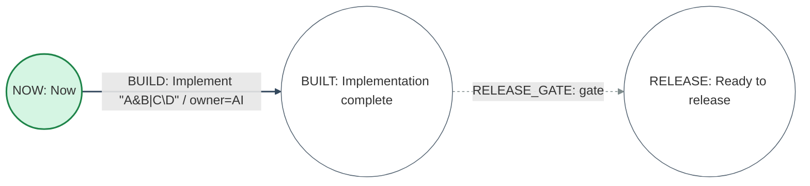

# Mermaid Profile Normative Example

- Document status: Normative example 1.0
- Profile schema: `Perttool.MermaidProfile.v1`
- Specification: [Mermaid Profile Specification](../specs/mermaid-profile.md)

## 1. Source DSL

The following DSL semantic model is the input.

```pert
project PROFILE_SAMPLE:
  version 1
  title "Mermaid profile sample"
  as_of 2026-07-22
  duration_unit day
  finish RELEASE

resource DEVELOPERS:
  title "Developers"
  capacity 2
  tags [implementation]

milestone NOW:
  title "Now"
  state reached

milestone BUILT:
  title "Implementation complete"

milestone RELEASE:
  title "Ready to release"

task BUILD NOW -> BUILT:
  title "Implement \"A&B|C\\D\""
  duration 2d
  priority 10
  requires:
    DEVELOPERS 1
  owner "AI"
  tags [critical]
  source "Issue #10"

gate RELEASE_GATE BUILT -> RELEASE:
  reason "review accepted"
```

Apply the DSL grammar v1 defaults to omitted fields. The profile record retains complete semantic values after defaults are applied, rather than source omissions or field order.

## 2. Canonical Mermaid artifact

The following is the normative artifact byte for byte. Metadata records are ordered as project, resource, milestones in ascending ID order, tasks in ascending ID order, and gates in ascending ID order.



`metadata_digest` is the SHA-256 of the UTF-8 byte sequence produced by concatenating the canonical record body from `project {..}\n` through `gate {..}\n`. `projection_digest` is the SHA-256 of the byte sequence produced by concatenating the 11 physical lines between the markers, including two-space indentation and LF.

## 3. Expected import result

Importing this artifact as a profile yields:

- `loss_report.lossless = true`
- `loss_report.records = []`
- `generated_ids = []`
- the normalized semantic model obtained by reparsing canonical DSL is equivalent to section 1
- default-applied values such as `description=null`, `critical_epsilon=0d`, `state=planned`, and `status=planned` are retained
- resource requirements are not converted to precedence edges

Comments, blank lines, field/declaration order, and string escape spelling are outside semantic-equivalence comparison.

## 4. Required negative cases

During implementation, create fixtures that change exactly one location in this artifact and fix the following results:

| Change | Expected code | Plain fallback |
| --- | --- | --- |
| Delete one line of a `task` record | `PTCNV-103` or `PTCNV-104` | Prohibited |
| Change `duration` to `3d` without updating the digest | `PTCNV-104` | Prohibited |
| Change a projection edge endpoint | `PTCNV-105` | Prohibited |
| Add an unknown record key | `PTCNV-102` | Prohibited |
| Change the header schema to v2 | `PTCNV-101` | Prohibited |
| Add a `click` directive | `PTCNV-105` | Prohibited |

When multiple validations fail at once, return the code for the validation phase that executes first. Tests use the stable code and absence of a candidate as their primary assertions, not the full message.
