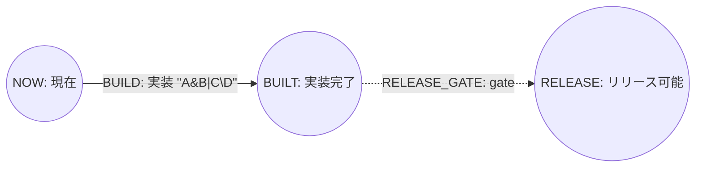

# Mermaid profile 規範例

- 文書状態: Normative example 1.0
- Profile schema: `Perttool.MermaidProfile.v1`
- 対応仕様: [Mermaid Profile仕様](../specs/mermaid-profile.md)

## 1. Source DSL

次のDSL意味モデルを入力とする。

```pert
project PROFILE_SAMPLE:
  version 1
  title "Mermaid profile sample"
  as_of 2026-07-22
  duration_unit day
  finish RELEASE

resource DEVELOPERS:
  title "開発担当"
  capacity 2
  tags [implementation]

milestone NOW:
  title "現在"
  state reached

milestone BUILT:
  title "実装完了"

milestone RELEASE:
  title "リリース可能"

task BUILD NOW -> BUILT:
  title "実装 \"A&B|C\\D\""
  duration 2d
  priority 10
  requires:
    DEVELOPERS 1
  owner "AI"
  tags [critical]
  source "Issue #10"

gate RELEASE_GATE BUILT -> RELEASE:
  reason "review accepted"
```

省略fieldにはDSL grammar v1のdefaultを適用する。Profile recordはsource上の省略やfield順ではなく、default適用後の完全な意味値を保持する。

## 2. Canonical Mermaid artifact

次をbyte単位の規範artifactとする。Metadata recordはproject、resource、ID昇順milestone、ID昇順task、ID昇順gateの順である。



`metadata_digest`は、`project {..}\n`から`gate {..}\n`までのcanonical record bodyを連結したUTF-8 byte列に対するSHA-256である。`projection_digest`はmarker間の5 physical lineをtwo-space indentationとLF込みで連結したbyte列に対するSHA-256である。

## 3. Expected import result

このartifactをprofile importした結果:

- `loss_report.lossless = true`
- `loss_report.records = []`
- `generated_ids = []`
- canonical DSLを再parseした正規化意味モデルがSection 1と同値
- `description=null`、`critical_epsilon=0d`、`state=planned`、`status=planned`などのdefault適用値を維持
- Resource requirementをprecedence edgeへ変換しない

Comment、blank line、field/declaration順、Stringのescape spellingは意味同値性の比較対象外である。

## 4. Required negative cases

実装時はこのartifactから1箇所だけ変更したfixtureを作り、次を固定する。

| Change | Expected code | Plain fallback |
| --- | --- | --- |
| `task` recordを1行削除 | `PTCNV-103` or `PTCNV-104` | 禁止 |
| `duration`を`3d`へ変更しdigestを更新しない | `PTCNV-104` | 禁止 |
| projection edge endpointを変更 | `PTCNV-105` | 禁止 |
| unknown record keyを追加 | `PTCNV-102` | 禁止 |
| header schemaをv2へ変更 | `PTCNV-101` | 禁止 |
| `click` directiveを追加 | `PTCNV-105` | 禁止 |

複数validationが同時に失敗する場合、最初に実行する検査phaseのcodeを返す。Testはmessage全文ではなくstable codeとcandidate不生成を主要assertionにする。
