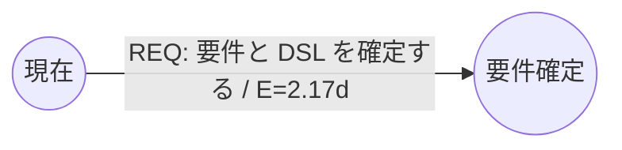
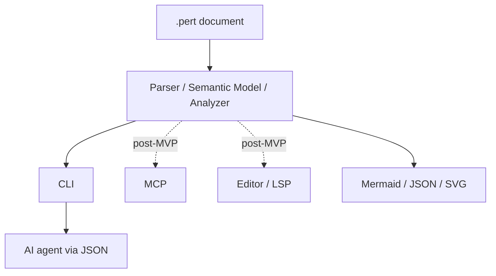

# perttool 要件定義

- 文書状態: Draft 0.7
- 作成日: 2026-07-21
- 更新日: 2026-07-22
- 対象: MVP と、その後の拡張境界
- 想定ファイル拡張子: `.pert`（暫定）

## 1. 文書の目的

本書は、PERT 線図を使ってプロジェクトの現在状態と将来計画を管理する `perttool` の要求を定義する。

`perttool`の中心的な使命は、PERT解析そのものではなく、明示されたproject planからAI開発の優先判断を再現し、局所的には妥当でも全体工程を遅らせるtask選択を抑止する **AI Project Control Plane** を提供することである。PERT/CPM、resource schedule、gate、milestoneは、この工程制御判断をproject factsから導出するための基盤である。

`perttool` は、独自 DSL で記述された文書を正本とし、その文書から次を再現可能にする。

- DAG としての構造検査
- PERT/CPM に基づく日程分析
- 共有resource容量を考慮した実行可能日程の生成
- クリティカルなタスクと余裕時間の抽出
- 現時点で着手可能な「次のタスク」の抽出
- 現在の工程で優先すべきtaskと、他の実行可能taskより優先する理由の導出
- Mermaid などの可視化形式への変換
- CLI、CI、CLI JSONを使うAIエージェントからの同一操作。MCP/エディタadapterはMVP後に追加する

本書では要求を `Must`、`Should`、`Could` に分類する。

- Must: MVP に必須
- Should: MVP 直後までに必要
- Could: 将来拡張

## 2. プロダクトの中心的な判断

### 2.1 Activity-on-Arrow を採用する

`perttool` は Activity-on-Arrow（AoA）を基本モデルとする。

- タスクはエッジである
- マイルストーンまたはイベントはノードである
- タスクの依存関係は、エッジの接続とゼロ時間の依存エッジで表現する
- DAG の構造を崩す循環は許可しない

これは「タスク（エッジ）を容易に修正、変更、追加したい」という要求を、データモデル上の第一級要素として保証するための判断である。

### 2.2 文書を正本とする

Must:

- `.pert` 文書だけで、構造検査、分析、次タスク判定を再実行できること
- 通常の分析にデータベース、サーバ、ネットワーク接続を要求しないこと
- 同じ文書、同じ設定、同じツールバージョンからは同じ分析結果を得られること
- 解析結果、キャッシュ、描画座標を正本の文書に混入させないこと

Should:

- 生成物を `.perttool/` などの無視可能な領域へ保存できること
- 文書中の相対パスは、実行ディレクトリではなく文書自身の位置を基準に解決すること

### 2.3 現行文書は現在と未来を表す

Must:

- 正本の `.pert` 文書は、現在の作業境界と、その先の未完了計画を表すこと
- 完了して役割を終えたタスクの履歴は Git に委ねること
- 並行タスクの合流判定にまだ必要な完了タスクだけは、`done` 状態で一時的に現行文書へ残せること
- 合流条件を満たした後は、現在境界を前進させ、不要になった過去部分を機械的に除去できること

この前進操作を本書では `advance` と呼ぶ。`advance` 前後の差分と履歴は Git で確認する。

### 2.4 AI Project Control Planeを中心目的とする

`perttool`は、単に実行可能taskを列挙するのではなく、project全体の現在状態から、AIまたは人間が今どのworkを優先すべきかを判断するcontrol planeである。目的は完了task数を最大化することではなく、依存関係、resource容量、明示priority、gate、milestoneを尊重しながら、宣言されたproject finishまでの期間短縮に寄与するworkを優先することである。

実行可否、resource selection、推奨度の形式的な分離は[Recommendation Semantics仕様](specs/recommendation.md)、決定的な推奨順は[Recommendation Ranking Policy仕様](specs/recommendation-ranking.md)、機械可読な理由語彙は[Recommendation Reason Taxonomy仕様](specs/recommendation-reasons.md)、typed factから派生descriptionまでの説明graphは[Recommendation Structured Explanation仕様](specs/recommendation-explanation.md)、Core/text/JSONは[Recommendation Interface Contract仕様](specs/recommendation-interface.md)、人間の意図的逸脱は[Recommendation Human Override Contract仕様](specs/recommendation-override.md)を正とする。

Must:

- task、dependency、milestone、gate、resource、state、明示priorityを持つproject planを優先判断のsource of truthとすること
- 「現在実行できるtask」と「現在の工程で優先すべきtask」を別の判断として扱うこと
- AIはprojectが決めた許可・推奨範囲でworkを実行し、会話上の興味、実装容易性、局所的な改善だけを理由にproject priorityを再定義しないこと
- recommendationを、critical path、float、resource制約、後続依存、gateまたはmilestoneなど、project modelに明示されたfactから導出すること
- 推奨taskだけでなく、他の実行可能taskがより優先されない理由も機械可読なproject factで説明できること
- reason codeだけで結論を返さず、適用rule、typed fact、比較対象、決定に使った条件を構造化された説明として返し、AIがrankingを再推論せず「なぜこのtaskで別taskではないか」を回答できること
- 人間向けreason descriptionはstable code、構造化fact、比較、decision traceから決定的に導出し、自然言語textだけを判断根拠の正本にしないこと
- 同じdocument、option、algorithm versionから同じrecommendationと順序を返すこと
- recommendation algorithmとresource scheduleがheuristicである場合、証明していないglobal optimumとして表示しないこと
- rework risk、情報不足、release固有の意味など、現在のproject modelに存在しないfactをchat contextから推測してrankingへ混入させないこと
- 人間がrecommendationから意図的に逸脱できること。逸脱を禁止するのではなく、overrideであることと理由を明示できる契約を持つこと
- MVPではread-onlyのCore/CLI analysisとしてrecommendationを取得できること。overrideの永続化はwrite safety gateを越えるまで要求しないこと

Should:

- task完了、block、capacity、overrideなどproject stateが変わった後に全体を再解析し、古いrecommendationを継続利用しないこと
- CLI以外の将来adapterも同じCore recommendationを利用し、provider固有のpriority判断を再実装しないこと

## 3. 解決したい問題

- タスク一覧だけでは依存関係と着手順が見えにくい
- 手計算したクリティカルパスや余裕時間が計画変更後に古くなる
- 図を直接編集すると、図と計画データが分離または不整合になる
- タスク追加時に、既存の依存関係を壊したことへ気づきにくい
- 「今できるタスク」と「将来のタスク」が混ざる
- 「今できるtask」と「今やるべきtask」が区別されず、AIが着手しやすい枝taskへ局所最適化する
- project intentとtask選択理由がprompt、chat history、issue discussionへ分散し、同じplanから同じ判断を再現できない
- optional featureや置換予定の改善を先行し、critical dependencyやgate直前のworkが後回しになる
- GUI や外部サービスがなければ再計算できない計画は、Git と自動化に載せにくい
- 人間向けヘルプと AI 向け操作契約が別々に実装されると挙動がずれる

## 4. 非目標

MVP では次を目的としない。

- 汎用プロジェクト管理 SaaS の置き換え
- MVPで資源制約付き日程の厳密な全探索最適解を保証すること
- shift、休日、skill、setup timeを含む汎用resource calendar
- 勤怠、工数請求、原価、予算の管理
- チャット、通知、承認ワークフロー
- Git 履歴を使わず、全過去状態を単一 `.pert` 文書へ保存すること
- Mermaid を正本として、Mermaid の全構文を解釈すること
- 複数クリティカルパスが競合するネットワークについて、厳密な完了確率を保証すること
- LLM に PERT/CPM の計算そのものを委ねること
- AIがtask、dependency、milestone、priorityを自律的に発明するplanning system
- codeの面白さ、品質、一般的価値をproject plan外から評価してpriorityを決めること
- opaqueなAI/ML scoreだけでrecommendationを決めること
- heuristic scheduleまたはrecommendationについて、厳密なglobal optimumを保証すること
- project modelにないrisk、情報、release semanticsをchatから推測して正本factとして扱うこと
- 人間がrecommendationから逸脱することを禁止すること

## 5. 想定利用者と主要ユースケース

### 5.1 計画作成者

- マイルストーンとタスクをテキストで追加する
- 三点見積りを記述する
- 排他設備や担当枠をresourceとして宣言する
- 構文、参照、循環、到達不能部分を検査する
- Mermaid 図を生成し、レビューする

### 5.2 実行担当者

- 現在着手中のタスクを確認する
- 現時点で着手可能なタスクを確認する
- 現在のresource空き状況で同時に開始できるtask集合を確認する
- ブロック理由とクリティカル度を確認する
- タスクの状態、見積り、担当、接続先を変更する
- 完了後に現在境界を前進させる

### 5.3 レビュー担当者

- Git diff から計画変更を確認する
- 変更後のクリティカルパス、完了見込み、余裕時間を再計算する
- resource capacityを変えたときの並列実行数と完了見込みを比較する
- Mermaid 図と機械可読 JSON の両方を利用する

### 5.4 AI エージェント

- 構造化ヘルプから DSL と操作契約を発見する
- 文書を検査、分析し、実行可能taskと推奨taskを区別して取得する
- recommendationのreasonと上位taskを確認し、projectが許可・推奨する範囲からworkを選ぶ
- recommendation外のtaskを人間の指示で選ぶ場合は、overrideであることと理由を明示する
- タスク編集をプレビューし、差分を提示する
- 明示された許可と競合検査なしにファイルを書き換えない

## 6. 用語と意味モデル

| 用語 | 意味 |
| --- | --- |
| Project | 1 個の PERT 計画文書 |
| Milestone | タスクの開始または終了を表す DAG ノード |
| Task | 作業を表す、正の所要時間を持つ DAG エッジ |
| Gate | 依存だけを表す、所要時間 0 の非タスクエッジ |
| Resource | task実行中に容量を占有し、完了時に返却される共有資源 |
| Frontier | 現在到達済みで、未来計画の入口となる milestone 集合 |
| Reached | milestone の条件が満たされ、そこから先へ進める状態 |
| Ready | 依存が満たされ、ブロックされておらず、未着手の task から導出される状態 |
| Critical | total float が許容誤差以下の task または gate |
| Schedule Critical | resource待ちを含む実行可能schedule上で完了時刻を拘束するtask列 |
| Recommendation | project modelに明示されたfactから導出する、現在優先すべきworkとその説明。形式的意味は[Recommendation Semantics仕様](specs/recommendation.md)を正とする |
| Override | 人間がrecommendationと異なるworkを意図的に選び、その事実と理由を明示する判断 |
| Point | AIや人が相対的な作業規模を見積もるための独自単位 `p`。時間そのものではない |
| Velocity | 一定期間に完了できるPoint量を表すproject-wide比率。例: `20p/10d` |
| Velocity Forecast | Pointとday/hourをVelocityで換算した予測値。宣言したPERT値とは区別する |
| Snapshot | 特定時点の現在・未来を表す `.pert` 文書 |
| Advance | 完了条件を反映して frontier を進め、不要な過去部分を除去する操作 |

## 7. 正規データモデル

### 7.1 Project

Must fields:

- `id`: 文書内で一意な安定識別子
- `title`: 人間向け名称
- `finish`: 最終 milestone の ID
- `duration_unit`: 分析と表示に使うプロジェクト共通の基準単位。`day`、`hour`、`point`のいずれか

Optional fields:

- `as_of`: スナップショットの基準日または日時
- `description`: 複数行説明
- `critical_epsilon`: exact Rational計算でnear-criticalをcritical表示へ含める許容誤差
- `target_duration`: 現在境界から finish までの目標所要時間
- `velocity`: Pointとday/hourを相互換算するproject-wide比率。`duration_unit point`では必須

Constraints:

- taskのduration/estimate、`critical_epsilon`、`target_duration`はprojectの基準単位へ統一する
- `velocity`は正のPoint量と正の期間を`<points>p/<period>d`または`<points>p/<period>h`で表す
- `duration_unit day|hour`でvelocityを指定する場合、期間suffixはprojectの基準単位と一致させる
- `duration_unit point`ではvelocityの期間suffixが換算先の`day`または`hour`を決める
- velocity換算値は`velocity_forecast`と明示し、宣言したPERT値を置き換えない
- `1d`と`1h`の関係、営業日、勤務時間はvelocityから推測しない

### 7.2 Resource

Resource は task 実行中に占有され、完了時に返却される renewable resource とする。

Must fields:

- `id`: 文書内で一意な安定識別子
- `title`: 人間向け名称
- `capacity`: 同時使用可能な正の整数。`1` は排他実行を表す

Optional fields:

- `description`: 複数行説明
- `tags`: 検索、表示用の文字列集合

Constraints:

- capacity は1以上2147483647以下とする
- consumable resource、shift、calendar、途中でのcapacity変化はMVP対象外とする
- resourceを使用するtaskは実行区間全体で宣言量を保持する

### 7.3 Milestone

Must fields:

- `id`: 文書内で一意な安定識別子
- `title`: 人間向け名称

Optional fields:

- `state`: `planned` または `reached`。省略時は `planned`
- `description`: 複数行説明
- `tags`: 検索、表示用の文字列集合

Constraints:

- `project.finish` が指す milestone は存在しなければならない
- finish milestone から外向きの task または gate を出してはならない
- `reached` milestone に未完了の入 edge がある場合は状態矛盾として検出する
- 明示的な `reached` milestone より前にある、現在判定に不要な部分は残さないことを推奨する

### 7.4 Task

Must fields:

- `id`: 文書内で一意な安定識別子
- `from`: 始点 milestone ID
- `to`: 終点 milestone ID
- `title`: 人間向け名称
- `status`: `planned`、`active`、`blocked`、`done` のいずれか。省略時は `planned`
- `duration` または `estimate`: いずれか一方

Optional fields:

- `description`: 完了条件を含む複数行説明
- `owner`: 担当者または担当グループ
- `priority`: resource競合時の明示優先度。省略時は0
- `requires`: resource IDと必要量の組。省略時はresource占有なし
- `tags`: 文字列集合
- `blocked_reason`: `blocked` の理由
- `source`: チケットや設計文書などの参照先

Constraints:

- `from` と `to` は同じ milestone であってはならない
- `duration` は 0 より大きくなければならない
- `estimate` は `optimistic <= most_likely <= pessimistic` を満たさなければならない
- `duration` と `estimate` を同時に指定してはならない
- `blocked` task には `blocked_reason` が必要である
- priorityは0以上2147483647以下とする
- requiresの必要量は1以上かつ参照resourceのcapacity以下でなければならない
- taskは要求した全resourceを同時に確保できた場合だけ開始できる
- 同一task内で同じresourceを重複指定してはならない
- `active` または `done` task の始点 milestone は実効 reached でなければならない
- `done` task は現在の合流判定に必要な間だけ残すことを推奨する
- task ID は名称や接続先を変更しても維持できること

進行中 task の `duration` または `estimate` は、現行スナップショット時点の残所要時間を表す。過去の見積りは Git 履歴で確認する。

### 7.5 Gate

Gate は AoA で依存だけを表すためのダミーエッジであり、task ではない。

Must fields:

- `id`: 文書内で一意な安定識別子
- `from`: 始点 milestone ID
- `to`: 終点 milestone ID
- `reason`: なぜこの依存が必要か

Constraints:

- 所要時間は常に 0 とする
- task と同様に循環を作ってはならない
- 可視化時は task と識別できる線種にする

## 8. DSL 要求

### 8.1 設計原則

Must:

- 行ベースのブロック構文であること
- インデントで所有関係を表すこと
- ブロック種別をキーワードで明示すること
- 参照は表示名ではなく安定 ID で行うこと
- UTF-8 の title と description を扱えること
- ID は ASCII 英字で始まり、ASCII 英数字、`-`、`_` を使用できること
- parser はすべての意味要素についてファイル、行、列の source span を保持すること
- 独立行コメントを記述でき、通常の編集操作で保持されること
- 宣言順は意味に影響しないこと
- 1 task の定義が 1 か所にまとまり、接続先、見積り、状態を局所編集できること
- resource capacityとtask requirementを安定IDで局所編集できること

Should:

- formatter は意味を変えず、宣言順とコメントを可能な限り保持すること
- 複数行 text は block text として記述できること
- Markdown の fenced code block で言語名 `pert` を使用できること
- 不明な将来フィールドを黙って無視せず、明示的な診断にすること

MVP の duration literal は `2d`、`4h`、`3p` のように単位 suffix を必須とする。`day`/`d`、`hour`/`h`、`point`/`p`を認識し、1文書のtask見積りはprojectの基準単位へ統一する。Pointとday/hourの換算は明示されたvelocityだけで行い、calendar変換規則がない文書での単位混在はエラーとする。

### 8.2 文法仕様と代表構文

完全EBNF、字句規則、field、既定値、error recovery、formatter契約は[DSL文法仕様](specs/dsl-grammar.md)を正とする。次は代表構文である。

```pert
project PERTTOOL_MVP:
  version 1
  title "perttool MVP"
  description |
    文書ベースの PERT タスク管理ツールを作る。
  as_of 2026-07-21
  duration_unit day
  finish RELEASED

resource DEVELOPERS:
  title "開発担当"
  capacity 2

resource RELEASE_ENV:
  title "リリース環境"
  capacity 1

milestone NOW:
  title "現在"
  state reached

milestone REQUIREMENTS_DONE:
  title "要件確定"

milestone CORE_DONE:
  title "解析コア完成"

milestone CONVERTERS_DONE:
  title "相互変換完成"

milestone RELEASED:
  title "MVP リリース"

task REQ NOW -> REQUIREMENTS_DONE:
  title "要件と DSL を確定する"
  estimate:
    optimistic 1d
    most_likely 2d
    pessimistic 4d
  status active
  tags [requirements, mvp]

task CORE REQUIREMENTS_DONE -> CORE_DONE:
  title "PERT/CPM 解析コアを実装する"
  duration 5d
  status planned
  requires:
    DEVELOPERS 1

task CONVERT REQUIREMENTS_DONE -> CONVERTERS_DONE:
  title "Mermaid 相互変換を実装する"
  estimate:
    optimistic 2d
    most_likely 3d
    pessimistic 6d
  status planned
  requires:
    DEVELOPERS 1

task INTEGRATE CORE_DONE -> RELEASED:
  title "CLI と解析コアを統合する"
  duration 2d
  status planned
  requires:
    DEVELOPERS 1
    RELEASE_ENV 1

gate CONVERTER_RELEASE_GATE CONVERTERS_DONE -> RELEASED:
  reason "リリースには相互変換も必要"
```

### 8.3 文法契約

Must:

- `project`、`resource`、`milestone`、`task`、`gate`、`estimate`、`requires`を文法仕様どおり扱うこと
- grammar、parser、formatter、syntax help の差分が自動テストで検出されること
- 文法の破壊的変更はバージョンと移行手順を伴うこと

## 9. 状態と現在境界の意味論

本章の形式定義、diagnostic、canonical advance規則は[Graph Semantics仕様](specs/graph-semantics.md)を正とする。

### 9.1 milestone 到達判定

解析器は、次の規則を DAG のトポロジカル順に適用して milestone の実効状態を導出する。

1. `state reached` の milestone は到達済みである
2. `done` task は、その edge に関する作業条件を満たす
3. gate は、始点 milestone が到達済みなら条件を満たす
4. 入ってくる全 edge の条件が満たされた milestone は到達済みになる
5. 入 edge を持たず、`state reached` でもない milestone は構造エラーとする

明示状態と導出状態が異なる場合、分析は導出状態を利用できるが、`advance` を促す warning を返す。

### 9.2 task 状態

| 保存状態 | 意味 | 残日程への重み |
| --- | --- | --- |
| `planned` | 未着手 | duration または期待値 |
| `active` | 着手中 | 現在記載された残 duration または期待値 |
| `blocked` | 外部要因により着手または進行不可 | duration または期待値。next からは除外 |
| `done` | 作業条件を満たした | 0 |

`ready` は保存状態ではなく、依存関係と保存状態から導出する。

Task statusは排他的であり、snapshot時刻0にresourceを占有するのは`active`だけとする。`blocked`は実行しておらずresourceを占有しない。停止中もresourceを保持する作業や`active`と`blocked`の同時表現はgrammar version 1の対象外とする。

### 9.3 advance

Must:

- 新たに到達した milestone を `state reached` にできること
- 現在境界より完全に過去となった `done` task、不要な gate、孤立した過去 milestone を除去できること
- まだ合流判定に必要な `done` task を誤って除去しないこと
- 変更前に構造検査を行うこと
- 変更後にも DAG、参照、frontier、finish 到達性を再検査すること
- デフォルトでは変更後文書と diff を表示するだけにし、明示指定なしにファイルへ書き込まないこと
- ファイル書き込み時は一時ファイルからの atomic replace を使用し、失敗時に元ファイルを保持すること

## 10. 機械的分析要件

LLM は文書編集や説明を補助してよいが、以下の計算結果を生成してはならない。計算は共通解析コアが行う。

数値表現、PERT/CPM、resource schedule、resource arc、schedule critical pathの規範は[Analysis仕様](specs/analysis.md)を正とする。

### 10.1 構造検査

Must:

- ID の重複を検出すること
- 未定義 milestone 参照を検出すること
- self-loop を検出すること
- 有向 cycle を検出し、cycle を構成する ID 列を報告すること
- finish へ到達できない task、gate、milestone を検出すること
- 複数 root は、すべて明示的に `reached` なら有効な frontier とし、それ以外は検出すること
- root が実効 reached でない状態を検出すること
- `duration`、三点見積り、状態固有フィールドを検証すること
- task と gate を区別した診断を返すこと

### 10.2 PERT 三点見積り

三点見積りを持つ task について、期待所要時間と分散を次で計算する。

```text
expected = (optimistic + 4 * most_likely + pessimistic) / 6
variance = ((pessimistic - optimistic) / 6) ^ 2
```

Must:

- 計算途中では丸めないこと
- 表示時の丸め桁を出力オプションで制御できること
- 決定的 duration の variance は 0 とすること
- `done` task の残日程上の expected と variance は 0 とすること
- 単位を正規化してから計算すること
- 変換不能な単位混在を暗黙変換せずエラーにすること
- `blocked` task の外部待ち時間は所要時間へ暗黙加算せず、完了見込みが「block 解消待ち時間を含まない条件付き値」であると明示すること

### 10.3 forward pass と backward pass

Must:

- すべての実効 reached frontier milestone の earliest time を 0 とすること
- トポロジカル順の forward pass で各 milestone の earliest time を求めること
- finish milestone の earliest time を残プロジェクト期待所要時間とすること
- finish から逆順の backward pass で各 milestone の latest time を求めること
- 各 task と gate について ES、EF、LS、LF を求めること
- 各 task と gate について total float と free float を求めること

計算式は次を基準とする。

```text
EF(edge) = E(from) + duration(edge)
E(node) = max(EF(incoming edge))
LS(edge) = L(to) - duration(edge)
L(node) = min(LS(outgoing edge))
total_float(edge) = L(to) - E(from) - duration(edge)
free_float(edge) = E(to) - E(from) - duration(edge)
```

### 10.4 クリティカルパス

Must:

- `abs(total_float) <= critical_epsilon` の edge を critical と判定すること
- critical edge 全体を「critical subgraph」として返すこと
- 表示用に決定的な規則で代表 critical path を 1 本返すこと
- 複数 critical path が存在する可能性を隠さないこと
- path 列挙には上限を設け、打ち切りを明示すること
- critical path 上の task variance 合計を path ごとに計算できること

Could:

- `target_duration` までの完了確率を正規近似で表示できること
- 複数経路が競合する場合は近似の制約を明示し、厳密値として表示しないこと

### 10.5 決定性と計算量

Must:

- 同順位の出力は安定 ID の辞書順など、仕様化された tie-break で並べること
- path 全列挙と描画レイアウトを除く構造検査と基本分析は `O(V + E)` を目標とすること
- wall clock、乱数、ネットワーク応答に依存して分析結果を変えないこと

### 10.6 Resource-constrained schedule

通常のCPMは依存関係だけを扱い、resource競合を無視した理論上の下限を返す。resourceを宣言した文書では、これと区別して実行可能scheduleも生成する。

Must:

- `precedence schedule` と `resource schedule` を別resultとして返すこと
- DAG edgeはhard precedence、task priorityはsoft preferenceとして区別すること
- dependencyで接続されていないtaskの順序は固定せず、resource capacityとpriority ruleから実行時に選ぶこと
- precedence scheduleのmakespanをresource制約なしの下限として返すこと
- taskはnon-preemptiveとし、開始から完了まで全required resourceを保持すること
- resource scheduleでは任意時刻の使用量合計がcapacityを超えないこと
- PERT taskのresource scheduleにはexpected durationを使用すること
- `active` taskは時刻0から残durationの間resourceを占有すること
- 同時に存在するactive taskのresource使用量がcapacityを超える場合はerrorにすること
- `done` taskとgateはresourceを占有しないこと
- blocked taskの外部待ち時間を推測せず、scheduleがblock即時解消を仮定した条件付き結果であると示すこと
- 同じ入力、capacity、scheduler versionから同じscheduleを生成すること
- MVPでは決定的なheuristic scheduleを生成し、最適解と表示しないこと
- resource待ち時間、resource別使用率、resource makespan、precedence lower boundとの差を返すこと
- 選択したschedule上のresource待ちを仮想的なresource依存として表現し、`schedule critical path`を返すこと
- 仮想resource依存を正本DSLのhard dependencyへ自動保存しないこと
- precedence critical pathとschedule critical pathを混同しないこと
- capacity変更によりschedule critical pathが変化し得ることを出力契約で表現すること

初期heuristicの優先規則:

1. task `priority` の大きい順
2. precedence total float の小さい順
3. expected duration の大きい順
4. task ID の辞書順

同一時刻にeligibleなtaskをこの順で走査し、必要resourceを確保できるtaskを可能な限り開始する。確保できないtaskがあっても、後続candidateが空きcapacity内で実行可能なら開始を許可する。

Should:

- CLI optionによりresource capacityを一時上書きし、文書を書き換えずwhat-if分析できること
- capacityごとのmakespanとschedule critical pathの差を比較できること
- heuristic名とversionをresultへ含めること

Could:

- bounded problemに対しCP-SAT/MILP等のexact/near-optimal solverを選択できること
- lower bound、best found、optimality gap、timeoutを報告できること

## 11. 「次のタスク」判定

`perttool dag next` は、少なくとも次の分類を返す。

1. `active`: 現在着手中
2. `ready`: 始点 milestone が実効 reached、状態が `planned`、かつ block されていない
3. `blocked_now`: 始点 milestone は実効 reached だが、状態が `blocked`
4. `upcoming`: まだ ready ではない未完了 task

resourceを使用する文書では、`ready`から現在のactive taskによる占有を差し引き、同時に開始可能な部分集合を`runnable_now`として返す。

Must:

- ready 判定を保存済みラベルではなく DAG と状態から導出すること
- `done` task を次タスク候補へ含めないこと
- ready task ごとに、precedence/schedule critical判定、priority、total float、期待所要時間、owner、block、resource要求を返すこと
- runnable_nowに含まれないready taskについて、不足resourceと現在の占有taskを説明すること
- ready task の既定順序を次の優先順位にすること
  1. priority の大きい順
  2. precedence critical
  3. total float の小さい順
  4. earliest start の小さい順
  5. task ID の辞書順
- upcoming task について、未達の直接 milestone と未完了の上流 task を説明できること
- 人間向け text と機械可読 JSON で同じ意味を返すこと

Should:

- owner、tag による絞り込みを提供すること
- 「なぜ ready でないか」を task ごとに説明すること
- `advance` 可能な milestone がある場合、次タスクより先にその事実を案内すること

MVP の next 判定は依存関係、明示block、宣言されたrenewable resource capacityを扱う。`owner`だけからcapacityや同時作業数を推測しない。

## 12. タスクと DAG の編集要件

### 12.1 テキストによる編集

Must:

- task ブロックの追加だけで新しい edge を追加できること
- task の `from` または `to` の変更だけで接続を変更できること
- task ID を変えずに title、見積り、状態、担当を変更できること
- task ブロックの削除により edge を削除できること
- resource blockとtask requiresを局所的に追加・変更・削除できること
- 編集後の不正参照、循環、到達不能を診断できること

### 12.2 CLI による構造編集

MVP で、次の操作を提供する。

```text
perttool task add <file> <id> <from> <to> --title <text> ...
perttool task set <file> <task-id> --status active
perttool task set <file> <task-id> --from <id> --to <id>
perttool task remove <file> <task-id>
perttool task finish <file> <task-id>
perttool milestone add|set|remove ...
perttool resource add|set|remove ...
perttool dag advance <file>
```

Must:

- 既定動作は stdout への変更後文書と stderr への要約、または明示的な diff とすること
- `--write` 指定時だけ入力ファイルを更新すること
- `--dry-run` または同等のプレビュー契約をすべての変更操作で提供すること
- 編集対象を安定 ID で指定すること
- 編集後に parse と意味検査を通らない場合は書き込まないこと
- 1 件を期待した編集が 0 件または複数件に解決された場合は失敗すること

Should:

- `--out <file>` で別ファイルへ安全に出力できること
- source span を用いた局所編集により、無関係なコメントや並び順を保持すること
- 変更前文書の digest を受け取り、競合時に書き込みを拒否できること

## 13. 可視化要件

Must:

- DSL の `milestone` をノード、`task` と `gate` をエッジとして直接可視化できること
- task edge のラベルに task ID と title を表示できること
- オプションで status、期待所要時間、total float、owner を表示できること
- critical task、active task、blocked task、done task、gate を視覚的に区別できること
- 同じ意味モデルから Mermaid と他の出力形式を生成すること
- 描画都合の座標を DSL の意味モデルへ要求しないこと
- resource共有関係をdependency edgeと誤認しない別表現で可視化できること
- resource viewでcapacity、task requirement、選択scheduleの占有区間を確認できること

Should:

- 大規模 DAG では critical、ready、owner、tag による部分グラフ表示ができること
- resource IDによるtask強調と、capacity別what-if結果の比較ができること
- SVG または HTML preview から source span へ移動できること
- レイアウトエンジンを意味解析コアから分離すること

## 14. Mermaid 相互変換

### 14.1 export

Must:

- `flowchart LR` を基本とした Mermaid を生成できること
- milestone ID を Mermaid node ID として安定利用すること
- task と gate の ID、title、状態、計算結果を表現できること
- resource capacity、task requirement、priorityを予約metadataへ保持できること
- Mermaid のラベルに使用できない文字を正しく escape すること
- 同じ入力とオプションから安定した出力を生成すること

生成例:



### 14.2 import

Mermaid 全構文を対象にはせず、`perttool` Mermaid profile を定義する。

Must:

- `perttool` が export した profile は DSL へ lossless に戻せること
- lossless round-trip に必要な情報を予約コメント `%% perttool:` 配下の機械可読メタデータとして保持できること
- 一般的な `flowchart` の node と directed edge を best-effort で import できること
- 復元できない見積り、状態、task/gate区別、resource requirementなどをloss reportに列挙すること
- 不明な情報を推測して無言で補完しないこと
- 自動採番した ID と元要素の対応を報告すること

Should:

- `DSL -> Mermaid -> DSL` の意味モデル同値性を golden test で固定すること
- `Mermaid -> DSL -> Mermaid` では、受理 profile 内の意味同値性を保証すること

## 15. CLI 要件

既存 DSL ツールの resource-first パターンを踏襲し、top-level resource と action を分ける。

Command、option、stream、exit code、JSON fieldの規範は[CLI Interface仕様](specs/interfaces.md)を正とする。

初期 command surface:

```text
perttool dsl check <file>
perttool dsl format <file>
perttool dsl help [topic] [subtopic] [--level index|quick|detail]

perttool dag analyze <file>
perttool dag next <file>
perttool dag render <file> --to mermaid|svg|json
perttool dag import <file> --from mermaid
perttool dag advance <file>

perttool task add|set|remove|finish ...
perttool milestone add|set|remove ...
perttool resource add|set|remove ...
```

Must:

- 人間向けの既定 text 出力を提供すること
- `--format json` で安定した機械可読出力を提供すること
- parse、validate、analyze、next、convert の意味を UI 層で再実装しないこと
- stdout をデータ、stderr を診断と進行情報に使うこと
- CI で識別できる exit code を定義すること
- 未知 option、必須引数不足、未知 action を黙って受理しないこと
- エラー時は関係する help topic を表示すること

推奨 exit code:

| Code | 意味 |
| --- | --- |
| 0 | 成功。検査対象は有効 |
| 1 | DSL または意味検査エラー |
| 2 | CLI usage error |
| 3 | 入出力エラー |
| 4 | 変換損失を許容しないモードでの loss |
| 5 | optimistic lock 競合 |

## 16. ヘルプと診断

`llmthink` の共有 help graph と、`semdl` の operational help / 機械可読 help の分離を参考にする。

### 16.1 help graph

Must:

- `perttool dsl help` を DSL 学習の入口にすること
- help topic を少なくとも `syntax`、`analysis`、`next`、`editing`、`mermaid`、`workflows`、`errors`、`samples` に分けること
- topic ごとに index、quick、detail の情報量を選べること
- CLI textとCLI JSONが同じ help registryを共有し、将来adapterからも再利用できること
- `--format json` で topic、要約、構文、例、related topic を取得できること
- sample を固定絶対パスではなく安定 sample ID で参照すること

### 16.2 context-sensitive diagnostics

Must:

- 診断に stable code、severity、message、source span を含めること
- 可能な場合は原因、期待構文、修正候補、help topic を含めること
- 構文エラーで全文 help を再掲せず、局所 help へ誘導すること
- text と JSON の診断が同じ意味を持つこと
- warning を成功扱いにするか失敗扱いにするか、CLI option で制御できること
- 複数の独立した構文エラーを回収し、同じerror regionと後続validation phaseの派生diagnosticを抑制すること
- diagnostic件数上限を指定でき、打ち切りをtext/JSONで明示すること

例:

```text
PTDSL-012 error: task REQ の estimate は optimistic <= most_likely <= pessimistic を満たしていません
  --> plan.pert:24:5
  help: perttool dsl help syntax estimate --level quick
```

## 17. AI / CLI / 将来adapter操作導線

### 17.1 共通コア

次の構造を採用する。



Must:

- CLIは共通コアを直接利用する薄いadapterとすること
- CLI 利用に MCP server の起動を要求しないこと
- AIがCLI JSONの解析結果を利用でき、PERT計算値を自由文で生成する必要がないこと
- AIがPointを時間と誤認しないよう、基準単位のexact Rationalとvelocity forecastを別fieldで取得できること
- AIが実行可能task、推奨task、推奨理由、より優先されるtaskをCLI JSONから取得でき、自由文だけでpriorityを再判断する必要がないこと
- 将来adapterも同じ共通コアを利用し、計算・検査規則を再実装しないこと

### 17.2 MCP / LSP（MVP対象外）

MCP server、MCP tool schema、MCP file write、LSP/editor integrationはMVP受け入れ条件に含めない。MVP実装へMCP SDKやtransport dependencyを追加しない。

MVP後にadapterを追加する場合は、CLI processをsubprocessとして包まず、共通Application/Core APIを直接利用する。MCP固有のaction名、tool schema、write safety、CLI parityは、その時点の別versioned仕様で固定する。

Future候補はMCP read-only analysis/help、MCP preview mutation、LSP diagnostics/completion/definition/renameである。実装順とsurfaceはMVP完了後に判断する。

## 18. JSON とスキーマ

CLI JSON envelope、diagnostic、Rational、analysis、next、mutation、help、conversion fieldは[CLI Interface仕様](specs/interfaces.md)を正とする。

Must:

- parse/validation report、analysis result、next result、conversion loss report に JSON Schema を用意すること
- JSON の field 名と enum をバージョン管理すること
- documentを処理するJSON出力に少なくとも`schema_version`、`tool_version`、`document_id`を含めること。Help/CLI usage resultはdocument fieldを持たなくてよい
- 表示用に丸めた値と計算用の値を混同しないこと
- JSON field の破壊的変更には schema version の変更を伴うこと

Should:

- 正規化した graph model を JSON で export できること
- golden file により schema と実出力の整合性を検証すること

## 19. Git 運用

推奨運用:

1. `.pert` を編集する
2. `perttool dsl check` を実行する
3. `perttool dag analyze` と `perttool dag next` を確認する
4. 必要なら Mermaid を生成する
5. `.pert` と意図した文書だけを commit する
6. task 完了時は `finish`、合流成立時は `advance` をプレビューする
7. diff を確認して commit する

Must:

- formatter と構造編集が不要な大規模差分を作らないこと
- 生成物を正本と区別できること
- 過去 task を削除しても Git から復元、比較できることを文書化すること
- Git がない環境でも分析自体は利用できること

Could:

- 2 つの Git revision 間で critical path と expected duration の変化を比較すること
- `perttool dag diff <old> <new>` で構造差分を表示すること

### 19.1 自己利用

Must:

- parser、構造検査、基本分析、next 判定が安定した時点で、DSL 文法の設計・実装タスクから自己利用を開始すること
- 規範文法は `docs/specs/dsl-grammar.md`、現在・未来の文法作業計画は `plans/grammar.pert`、過去は Git history として分離すること
- 最初の自己利用は check/analyze/next の read-only operation に限定すること
- formatter と mutation の write 利用は、comment 保持、round-trip、preview、再検査、atomic write の回帰試験後に解禁すること
- advance の自己利用は、done 合流と frontier 圧縮の回帰試験後に解禁すること
- tool の不具合に合わせて規範文法や有効な計画を歪めないこと

自己利用の段階と gate は [process/self-use.md](process/self-use.md) を正とする。

## 20. 品質要件

### 20.1 安全性

Must:

- parse または検査に失敗した文書を自動上書きしないこと
- 変更操作は対象の一意性を検証すること
- atomic write と optimistic lock を利用できること
- 外部 command やネットワークを暗黙実行しないこと

### 20.2 可搬性

Must:

- Linux 上のローカル CLI と CI で動作すること
- UTF-8 文書を扱うこと
- パス区切りや改行コードの差を意味モデルへ持ち込まないこと

Should:

- macOS と Windows/WSL をサポートすること
- 単一プロジェクト文書の解析は外部サービスなしで完結すること

### 20.3 テスト容易性

Must:

- parser、validator、analyzer、formatter、converter を UI なしでテストできること
- 正常例と失敗例を manifest と golden output で固定すること
- cycle、diamond、複数 critical path、ゼロ時間 gate、blocked、done 合流、advance を個別にテストすること
- 排他resource、capacity 2以上、複数resource同時要求、active oversubscription、capacity変更によるschedule差を個別にテストすること
- CLI JSONと直接Core APIが同じ入力へ意味的に同じpayloadを返すことを検証すること
- Mermaid round-trip の lossless profile を回帰テストすること

## 21. MVP 受け入れ条件

MVP 完了には、少なくとも以下をすべて満たすことを要求する。

1. サンプル `.pert` を parse し、AST と source span を生成できる
2. task が edge、milestone が node、gate がゼロ時間 edge、resourceが容量制約としてgraph化される
3. 重複 ID、未定義参照、cycle、finish 到達不能、見積り不正を検出できる
4. forward/backward pass、expected、variance、total/free float、critical subgraph を計算できる
5. renewable resource capacityを守る決定的なheuristic scheduleとschedule critical pathを生成できる
6. active、ready、runnable_now、blocked_now、upcoming を決定的に分類できる
7. text と JSON で分析結果と next 結果を出せる
8. task、milestone、resourceの構造編集をプレビューし、安全に書き込める
9. advance が合流判定に必要な done task を保持し、不要になった過去部分だけを除去できる
10. Mermaid profile へ export し、生成 Mermaid を意味損失なく import できる
11. DSL help が topic/index/quick/detail と JSON で取得できる
12. parse error から該当 help topic へ辿れる
13. CLI text/JSONが共通parser/analyzerを利用し、同じdiagnosticと解析値を返す
14. 主要な正常例、失敗例、round-trip が自動テストで固定される
15. Point見積りをexact PERT値として計算し、宣言velocityによるday/hour予測をtext/JSONで区別して返せる
16. project factsから現在優先すべきtaskと理由を決定的なtext/JSONで返し、実行可能だが推奨されないtaskについて、より優先されるtaskを説明できる

## 22. 初期要求との対応

| 初期要求 | 本書での対応 |
| --- | --- |
| 1. DAG 生成記法の定義 | 2、6、7、8 |
| 2. PERT 分析を機械的に行う | 10 |
| 3. task edge を容易に変更する | 7.4、8、12 |
| 4. DAG 記法を可視化しやすくする | 2.1、8、13 |
| 5. Mermaid などと相互変換する | 14 |
| 6. 文書ベースで再計算する | 2.2、18、19 |
| 7. 次のタスクを分かりやすくする | 2.4、11 |
| 8. 現在・未来を表し、過去は Git で補足する | 2.3、9、19 |
| 9. 既存 DSL ツールのヘルプ・AI 導線を踏襲する | 15、16、17、19.1 |
| 10. resource共有、排他実行、並列数で変化する日程を扱う | 7.2、7.4、10.6、11 |
| 11. 独自PointとVelocityでAIの見積りを時間予測へ変換する | 6、7.1、8、10、17 |
| 12. AIの局所最適化と工程逸脱を検出・抑止する | 1、2.4、3、4、5.4、11、17、21 |

## 23. MVP 後へ保留する事項

- 営業日、休日、勤務時間を持つ calendar
- task ごとの calendar と timezone
- shift、skill、担当者calendarを含む高度なresource modeling
- resource-constrained scheduleの厳密最適化
- 複数プロジェクト文書の include/import
- 実績時間と予測精度の統計分析
- team/resource別、期間別、履歴ベースのvelocity
- Git revision 間の計画差分分析
- Web UI と共同編集
- 任意 Mermaid 構文の広範な import
- Monte Carlo simulation によるプロジェクト完了確率
- 外部 issue tracker との双方向同期
- MCP server、MCP tool schema、MCP file write、LSP/editor adapter

## 24. 未確定の設計判断

実装開始前に、次を ADR または個別仕様で固定する。

1. Mermaid profile の `%% perttool:` メタデータ schema

解決済みの設計判断:

- task=edgeのAoA採用: [ADR 0001](adr/0001-activity-on-arrow.md)
- Node.js 24以上、npm、TypeScript ESM package: [ADR 0002](adr/0002-node-typescript-package.md)
- 実行可否、resource selection、推奨度の分離とtier semantics: [Recommendation Semantics仕様](specs/recommendation.md)
- ranking input、selection horizon、優先規則、完全tie-break、algorithm version: [Recommendation Ranking Policy仕様](specs/recommendation-ranking.md)
- stable reason code、effect/role、typed fact category、entity reference、taxonomy version: [Recommendation Reason Taxonomy仕様](specs/recommendation-reasons.md)
- typed fact、制限付きexpression、comparison、decision trace、description projection: [Recommendation Structured Explanation仕様](specs/recommendation-explanation.md)
- Core type、complete JSON、text summary、`NextResult.v3` migration: [Recommendation Interface Contract仕様](specs/recommendation-interface.md)
- override requirement、feasible replacement、human reason、audit、再解析: [Recommendation Human Override Contract仕様](specs/recommendation-override.md)

## 25. 推奨する次の仕様作業

実装へ入る前に、次の順で仕様を分離する。

1. [x] `docs/specs/dsl-grammar.md`: 完全 EBNF、resource構文、正規サンプル
2. [x] [Graph Semantics仕様](specs/graph-semantics.md): reached、ready、done、gate、advance、resourceの形式定義
3. [x] [Analysis仕様](specs/analysis.md): PERT/CPM、resource schedule、resource arc、tie-break
4. [x] [CLI Interface仕様](specs/interfaces.md): CLI、JSON Schema、help、write safety。MCPはMVP対象外
5. [x] [ADR 0001](adr/0001-activity-on-arrow.md): task=edge の設計判断
6. [x] [Issue #1](https://github.com/mako10k/perttool/issues/1): AI Project Control Planeのrecommendation契約
   - [x] product vision、source of truth、global objective、determinism、non-goal
   - [x] [実行可否と推奨度のmodel](specs/recommendation.md)
   - [x] [deterministic ranking policy](specs/recommendation-ranking.md)
   - [x] [stable reason code taxonomy](specs/recommendation-reasons.md)
   - [x] [structured reason descriptionとdecision trace](specs/recommendation-explanation.md)
   - [x] [Core、text、JSON契約](specs/recommendation-interface.md)
   - [x] [human override契約](specs/recommendation-override.md)
   - [x] [normative exampleとtest観点](examples/recommendation.md)
   - [x] [self-useと実装migration方針](process/recommendation-migration.md)
   - [x] [横断設計レビューと受け入れ記録](process/recommendation-design-review.md)
7. [x] parser/validator の最小実装と golden tests

項目7は完了した。`dsl check`、source-backed CST/AST、resolver/validator、`dsl help syntax`、複数error recovery、validation phase suppression、diagnostic上限、block textのcommon indentとUTF-16 span、source-preserving formatter Core、formatterのidempotenceとAST同値goldenに加え、syntax help sample、related link、diagnostic `helpTopic`とparser fixtureのdrift検査を固定し、grammar acceptance全項目を満たした。

Analysis実装は`dag next`まで進んでいる。Exact Rational、PERT expected/variance、precedence CPM、critical path count、決定的resource schedule、capacity override、resource arc、schedule critical pathに加え、next分類、`runnable_now`、resource rejection、upcoming explanationをtext/JSONで返せる。Slice 2のbootstrap gateとgrammar acceptanceを満たし、macro `plans/mvp.pert`と詳細`plans/grammar.pert`、`plans/control-plane.pert`でStage 1のread-only自己利用を行っている。Issue #1のproduct vision、要件境界、実行可否と推奨度model、ranking policy、reason code taxonomy、structured explanation、Core/text/JSON interface、human override contract、normative example、test観点、self-useと実装migration方針は[横断設計レビュー](process/recommendation-design-review.md)で受け入れた。これは設計完了であり、recommendation機能の実装完了ではない。次のcriticalかつ`runnable_now`のtaskはmacroの`M1_ROADMAP_UPDATE`であり、formatter、mutation preview、safe write、advanceの操作系を優先したdetail planを確定する。Issue #2のAI Agent Guidance Registryとrecommendation実装は、操作系を遅らせない場合だけ並行する。
