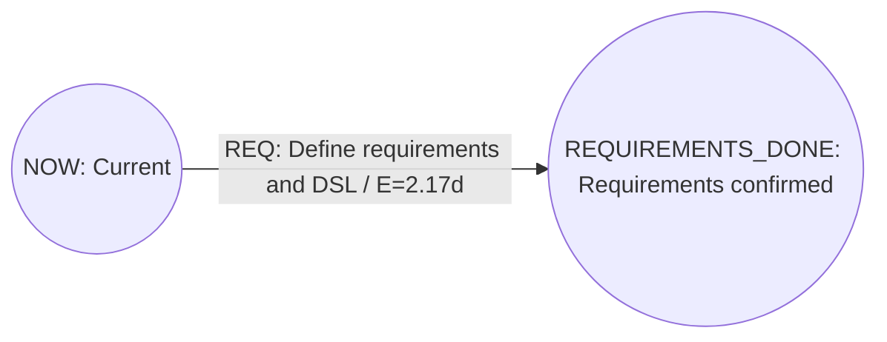
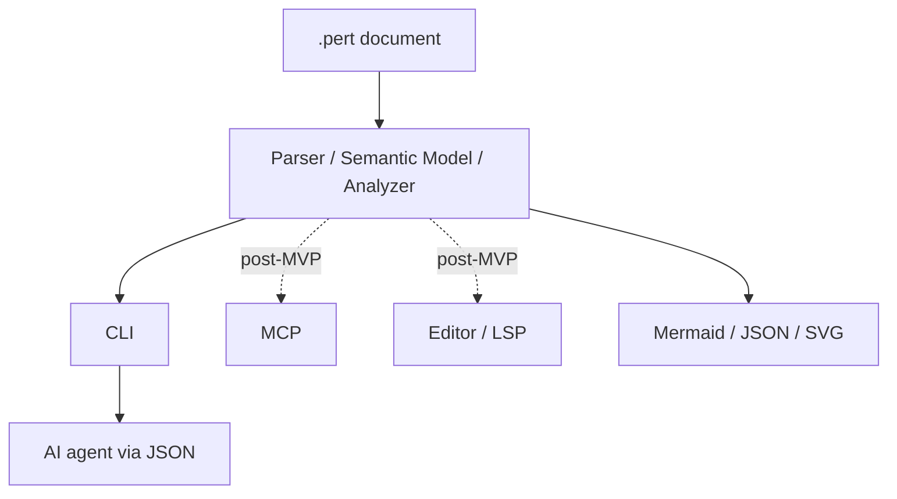

# perttool Requirements

- Document status: Draft 0.10
- Created: 2026-07-21
- Updated: 2026-07-24
- Scope: MVP and subsequent extension boundaries
- Intended file extension: `.pert` (provisional)

## 1. Purpose of this document

This document defines the requirements for `perttool`, which manages a project's current state and future plan using PERT diagrams.

The central mission of `perttool` is not PERT analysis itself. It is to provide an **AI Project Control Plane** that reproduces priority decisions for AI development from an explicit project plan and prevents task choices that may be locally sound but delay the overall project. PERT/CPM, resource schedules, gates, and milestones provide the basis for deriving these project-control decisions from project facts.

`perttool` treats a document written in its DSL as the source of truth and makes the following reproducible from that document.

- Structural validation as a DAG
- Schedule analysis based on PERT/CPM
- Generation of a feasible schedule that considers shared resource capacity
- Extraction of critical tasks and slack
- Extraction of the “next task” that can be started now
- Derivation of the task to prioritize in the current project and the reason it takes precedence over other feasible tasks
- Conversion to visualization formats such as Mermaid
- Equivalent operations from the CLI, CI, and AI agents using CLI JSON; MCP and editor adapters will be added after the MVP

This document classifies requirements as `Must`, `Should`, and `Could`.

- Must: required for the MVP
- Should: needed by immediately after the MVP
- Could: a future extension

## 2. Core product decisions

### 2.1 Adopt Activity-on-Arrow

`perttool` uses Activity-on-Arrow (AoA) as its core model.

- A task is an edge.
- A milestone or event is a node.
- Task dependencies are expressed through edge connections and zero-duration dependency edges.
- Cycles that violate the DAG structure are not permitted.

This decision makes the need to easily revise, change, and add tasks (edges) a first-class property of the data model.

### 2.2 Treat the document as the source of truth

Must:

- Structural validation, analysis, and next-task selection can be rerun from the `.pert` document alone.
- Routine analysis does not require a database, server, or network connection.
- The same document, configuration, and tool version produce the same analysis result.
- Analysis results, caches, and layout coordinates are not mixed into the source-of-truth document.

Should:

- Generated artifacts can be saved in an ignorable location such as `.perttool/`.
- Relative paths in a document are resolved relative to the document itself, not the execution directory.

### 2.3 The current document represents the present and the future

Must:

- The source-of-truth `.pert` document represents the current work boundary and the unfinished plan beyond it.
- Git retains the history of tasks that are complete and no longer serve a role.
- Only completed tasks still needed to determine a join of parallel tasks may remain temporarily in the current document with state `done`.
- After the join condition is satisfied, the current boundary can advance and unnecessary past portions can be removed mechanically.

This document calls this forward operation `advance`. Git is used to inspect history and the difference before and after `advance`.

### 2.4 Make the AI Project Control Plane the central purpose

`perttool` is a control plane that determines which work an AI or human should prioritize now from the current state of the whole project, rather than merely listing feasible tasks. Its purpose is not to maximize the number of completed tasks; it is to prioritize work that helps shorten the time to the declared project finish while respecting dependencies, resource capacity, explicit priorities, gates, and milestones.

The source of truth for the formal separation of feasibility, resource selection, and recommendation tier is the [Recommendation Semantics specification](specs/recommendation.md); for deterministic recommendation order, the [Recommendation Ranking Policy specification](specs/recommendation-ranking.md); for machine-readable reason vocabulary, the [Recommendation Reason Taxonomy specification](specs/recommendation-reasons.md); for the explanation graph from typed facts to derived descriptions, the [Recommendation Structured Explanation specification](specs/recommendation-explanation.md); for Core/text/JSON, the [Recommendation Interface Contract specification](specs/recommendation-interface.md); and for intentional human deviations, the [Recommendation Human Override Contract specification](specs/recommendation-override.md).

Must:

- A project plan with tasks, dependencies, milestones, gates, resources, state, and explicit priorities is the source of truth for priority decisions.
- “Tasks that can be executed now” and “tasks that should be prioritized in the current project” are separate decisions.
- An AI performs work within the authorization and recommendation range decided by the project; it does not redefine project priority based only on conversational interest, ease of implementation, or local improvements.
- Recommendations are derived from facts made explicit in the project model, such as critical path, float, resource constraints, downstream dependencies, gates, and milestones.
- It is possible to explain, using machine-readable project facts, not only the recommended task but also why other feasible tasks are not more highly prioritized.
- Rather than returning a conclusion by reason code alone, the tool returns the applied rule, typed facts, comparison subjects, and conditions used in the decision as a structured explanation, so that an AI can answer “why this task rather than another task” without re-reasoning the ranking.
- Human-readable reason descriptions are derived deterministically from stable codes, structured facts, comparisons, and a decision trace; natural-language text alone is not the source of truth for the basis of a decision.
- The same document, options, and algorithm version return the same recommendations in the same order.
- When the recommendation algorithm and resource schedule are heuristic, the tool does not present them as an unproven global optimum.
- Facts not present in the current project model, such as rework risk, insufficient information, and release-specific meaning, are not inferred from chat context and incorporated into ranking.
- A human can intentionally deviate from a recommendation. Instead of forbidding the deviation, the contract makes clear that it is an override and states its reason.
- In the MVP, recommendations are available as read-only Core/CLI analysis. Persistence of an override is not required until the write-safety gate has been crossed.

Should:

- After project state changes, such as task completion, a block, capacity, or an override, the whole project is reanalyzed and stale recommendations are not reused.
- Future adapters other than the CLI use the same Core recommendation and do not reimplement provider-specific priority decisions.

### 2.5 English is the repository baseline

English is the canonical language for repository-maintained artifacts. This decision applies to requirements, specifications, design, examples, process documentation, current plan metadata, source comments, bundled help, and diagnostic messages.

Must:

- New or substantively modified repository prose uses English.
- Stable command names, DSL keywords, JSON fields, enum values, schema identifiers, diagnostic codes, reason codes, and typed data remain the machine-readable authority. Natural-language messages alone must not become a machine contract.
- Existing Japanese content remains explicit migration debt until the phased work in [`plans/english-baseline.pert`](../plans/english-baseline.pert) is accepted.
- User-authored `.pert` titles, descriptions, source data, and intentional Unicode fixtures are preserved. The tool must not translate them automatically.
- The language used to communicate with a human is independent from the repository baseline. An agent may answer a Japanese-speaking user in Japanese while writing tracked repository artifacts in English.
- The same input, options, tool version, and fixed English description registry produce the same output regardless of the process locale.

Current non-goals:

- Runtime locale selection or a `--locale` option
- Translation catalogs, gettext-style infrastructure, or environment-dependent message selection
- Full translation of legacy Japanese artifacts in one change

The baseline policy is effective immediately. Migration of existing surfaces is a separate, phased workstream after the first beta and does not expand the accepted `BETA_RELEASE_E2E` gate.

## 3. Problems to solve

- A task list alone makes dependencies and start order hard to see.
- Critical paths and slack calculated manually become stale after a plan changes.
- Editing a diagram directly separates it from the plan data or makes them inconsistent.
- When adding a task, it is difficult to notice that existing dependencies have been broken.
- “Tasks that can be done now” and “future tasks” are mixed together.
- “Tasks that can be done now” and “tasks that should be done now” are not distinguished, causing an AI to optimize locally for an easy-to-start branch task.
- Project intent and the reasons for task selection are scattered across prompts, chat history, and issue discussions, so the same decision cannot be reproduced from the same plan.
- Optional features and improvements scheduled for replacement are prioritized, while critical dependencies and work immediately before a gate are postponed.
- A plan that cannot be recalculated without a GUI or external service is difficult to put under Git and automation.
- Behavior diverges when human help and the operational contract for AI are implemented separately.

## 4. Non-goals

The MVP does not aim to provide the following.

- Replacing a general-purpose project-management SaaS
- Guaranteeing an exact exhaustive-search optimum for resource-constrained schedules in the MVP
- A general-purpose resource calendar that includes shifts, holidays, skills, and setup time
- Management of attendance, work billing, costs, or budgets
- Chat, notifications, or approval workflows
- Storing all historical states in one `.pert` document without using Git history
- Treating Mermaid as the source of truth and interpreting all Mermaid syntax
- Guaranteeing an exact completion probability for a network with competing critical paths
- Delegating PERT/CPM calculation itself to an LLM
- A planning system in which AI autonomously invents tasks, dependencies, milestones, or priorities
- Deciding priority by evaluating code interest, quality, or general value outside the project plan
- Deciding recommendations only from opaque AI/ML scores
- Guaranteeing an exact global optimum for a heuristic schedule or recommendation
- Treating risks, information, or release semantics absent from the project model as source-of-truth facts inferred from chat
- Prohibiting a human from deviating from a recommendation
- runtime i18n, localization catalogs, or locale negotiation

## 5. Intended users and primary use cases

### 5.1 Plan author

- Add milestones and tasks as text.
- Describe three-point estimates.
- Declare exclusive equipment or personnel slots as resources.
- Validate syntax, references, cycles, and unreachable portions.
- Generate and review Mermaid diagrams.

### 5.2 Work executor

- Check tasks currently in progress.
- Check tasks that can be started now.
- Check the set of tasks that can start concurrently with currently available resource capacity.
- Check blocking reasons and criticality.
- Change a task's state, estimate, owner, or endpoint.
- Advance the current boundary after completion.

### 5.3 Reviewer

- Review plan changes from a Git diff.
- Recalculate the critical path, projected completion, and slack after a change.
- Compare concurrency and projected completion after changing resource capacity.
- Use both Mermaid diagrams and machine-readable JSON.

### 5.4 AI agent

- Discover the DSL and operational contract through structured help.
- Validate and analyze a document, obtaining feasible tasks separately from recommended tasks.
- Check a recommendation's reasons and higher-ranked tasks, then choose work from the range the project authorizes or recommends.
- When choosing a task outside the recommendation at human direction, state that it is an override and state the reason.
- Preview task edits and show the diff.
- Do not rewrite a file without explicit authorization and conflict validation.

## 6. Terminology and semantic model

| Term | Meaning |
| --- | --- |
| Project | One PERT planning document |
| Milestone | A DAG node representing the start or finish of a task |
| Task | A DAG edge representing work and having positive duration |
| Gate | A non-task edge with zero duration that represents dependency only |
| Resource | A shared resource whose capacity is occupied while a task runs and returned when it completes |
| Frontier | The set of milestones reached now that form the entry to the future plan |
| Reached | A state in which a milestone's conditions are satisfied and work can proceed from it |
| Ready | A state derived from a not-started task whose dependencies are satisfied and which is not blocked |
| Critical | A task or gate whose total float is within the allowed tolerance |
| Schedule Critical | A sequence of tasks that constrains completion time in a feasible schedule including resource waits |
| Recommendation | Work that should currently be prioritized and its explanation, derived from facts explicit in the project model. The [Recommendation Semantics specification](specs/recommendation.md) is authoritative for its formal meaning. |
| Override | A decision in which a human intentionally chooses work different from the recommendation and states that fact and its reason |
| Point | The project-specific unit `p` that AI or people use to estimate relative work size; it is not time itself |
| Velocity | A project-wide ratio expressing the number of Points that can be completed in a period; for example, `20p/10d` |
| Velocity Forecast | A forecast that converts Points and days/hours using Velocity, distinct from declared PERT values |
| Snapshot | A `.pert` document representing the present and future at a particular point in time |
| Advance | An operation that moves the frontier forward to reflect completion conditions and removes unneeded past portions |

## 7. Canonical data model

### 7.1 Project

Must fields:

- `id`: a stable identifier unique within the document
- `title`: a human-readable name
- `finish`: the ID of the final milestone
- `duration_unit`: the project-wide base unit used for analysis and display: one of `day`, `hour`, or `point`

Optional fields:

- `as_of`: the reference date or datetime of the snapshot
- `description`: a multiline description
- `critical_epsilon`: the tolerance for including near-critical work in critical display under exact Rational calculation
- `target_duration`: the target duration from the current boundary to `finish`
- `velocity`: the project-wide ratio for converting between Points and days/hours; required when `duration_unit point`

Constraints:

- A task's duration/estimate, `critical_epsilon`, and `target_duration` use the project's base unit.
- `velocity` expresses a positive Point quantity and a positive period as `<points>p/<period>d` or `<points>p/<period>h`.
- When specifying velocity with `duration_unit day|hour`, the period suffix matches the project's base unit.
- With `duration_unit point`, the period suffix of velocity determines whether conversion is to `day` or `hour`.
- A velocity-derived value is explicitly named `velocity_forecast` and does not replace a declared PERT value.
- Velocity does not imply a relationship between `1d` and `1h`, business days, or working hours.

### 7.2 Resource

A Resource is a renewable resource that is occupied while a task runs and returned when it completes.

Must fields:

- `id`: a stable identifier unique within the document
- `title`: a human-readable name
- `capacity`: a positive integer available for concurrent use; `1` represents exclusive execution

Optional fields:

- `description`: a multiline description
- `tags`: a set of strings for search and display

Constraints:

- Capacity is at least 1 and at most 2147483647.
- Consumable resources, shifts, calendars, and capacity changes during execution are outside the MVP.
- A task using a resource retains its declared quantity for its entire execution interval.

### 7.3 Milestone

Must fields:

- `id`: a stable identifier unique within the document
- `title`: a human-readable name

Optional fields:

- `state`: `planned` or `reached`; defaults to `planned`
- `description`: a multiline description
- `tags`: a set of strings for search and display

Constraints:

- The milestone referenced by `project.finish` exists.
- No task or gate may leave the finish milestone.
- A `reached` milestone with an unfinished incoming edge is reported as a state contradiction.
- Portions before an explicit `reached` milestone that are not needed for present-state determination should not be retained.

### 7.4 Task

Must fields:

- `id`: a stable identifier unique within the document
- `from`: the start milestone ID
- `to`: the finish milestone ID
- `title`: a human-readable name
- `status`: one of `planned`, `active`, `blocked`, or `done`; defaults to `planned`
- `duration` or `estimate`: exactly one of them

Optional fields:

- `description`: a multiline description including completion conditions
- `owner`: the responsible person or group
- `priority`: explicit priority during resource contention; defaults to 0
- `requires`: pairs of resource IDs and required quantities; absent means no resource occupation
- `tags`: a set of strings
- `blocked_reason`: the reason for `blocked`
- `source`: a reference target such as a ticket or design document

Constraints:

- `from` and `to` must not be the same milestone.
- `duration` must be greater than 0.
- `estimate` must satisfy `optimistic <= most_likely <= pessimistic`.
- `duration` and `estimate` must not be specified together.
- A `blocked` task requires `blocked_reason`.
- Priority is at least 0 and at most 2147483647.
- Each required quantity is at least 1 and no greater than the referenced resource's capacity.
- A task can start only when all required resources can be secured simultaneously.
- The same resource must not be specified more than once within a task.
- The start milestone of an `active` or `done` task must be effectively reached.
- A `done` task should remain only while it is needed for the current join determination.
- A task ID can be retained even when its name or endpoint changes.

The `duration` or `estimate` of an in-progress task represents remaining duration at the current snapshot. Git history records previous estimates.

### 7.5 Gate

A Gate is a dummy edge in AoA that represents dependency only; it is not a task.

Must fields:

- `id`: a stable identifier unique within the document
- `from`: the start milestone ID
- `to`: the finish milestone ID
- `reason`: why this dependency is necessary

Constraints:

- Its duration is always 0.
- It must not create a cycle, just as a task must not.
- In a visualization, it uses a line style distinguishable from a task.

## 8. DSL requirements

### 8.1 Design principles

Must:

- It uses a line-oriented block syntax.
- Indentation represents ownership.
- A keyword explicitly identifies each block kind.
- References use stable IDs rather than display names.
- It supports UTF-8 titles and descriptions.
- An ID begins with an ASCII letter and may use ASCII alphanumerics, `-`, and `_`.
- The parser retains file, line, and column source spans for every semantic element.
- It supports standalone-line comments, which ordinary editing operations preserve.
- Declaration order does not affect semantics.
- A task definition is localized in one place, so its endpoint, estimate, and state can be edited locally.
- Resource capacity and task requirements can be edited locally by stable ID.

Should:

- The formatter preserves semantics and, as far as possible, declaration order and comments.
- Multiline text can be written as block text.
- Markdown fenced code blocks can use the language name `pert`.
- Unknown future fields produce an explicit diagnostic rather than being silently ignored.

MVP duration literals require a unit suffix, such as `2d`, `4h`, or `3p`. The DSL recognizes `day`/`d`, `hour`/`h`, and `point`/`p`; task estimates in one document use the project's base unit. Conversion between Points and days/hours uses only explicit velocity, and mixed units in a document without a calendar-conversion rule are an error.

### 8.2 Grammar specification and representative syntax

The [DSL grammar specification](specs/dsl-grammar.md) is authoritative for the complete EBNF, lexical rules, fields, defaults, error recovery, and formatter contract. The following is representative syntax.

```pert
project PERTTOOL_MVP:
  version 1
  title "perttool MVP"
  description |
    Build a document-based PERT task-management tool.
  as_of 2026-07-21
  duration_unit day
  finish RELEASED

resource DEVELOPERS:
  title "Development"
  capacity 2

resource RELEASE_ENV:
  title "Release environment"
  capacity 1

milestone NOW:
  title "Now"
  state reached

milestone REQUIREMENTS_DONE:
  title "Requirements complete"

milestone CORE_DONE:
  title "Analysis core complete"

milestone CONVERTERS_DONE:
  title "Conversion complete"

milestone RELEASED:
  title "MVP released"

task REQ NOW -> REQUIREMENTS_DONE:
  title "Finalize requirements and the DSL"
  estimate:
    optimistic 1d
    most_likely 2d
    pessimistic 4d
  status active
  tags [requirements, mvp]

task CORE REQUIREMENTS_DONE -> CORE_DONE:
  title "Implement the PERT/CPM analysis core"
  duration 5d
  status planned
  requires:
    DEVELOPERS 1

task CONVERT REQUIREMENTS_DONE -> CONVERTERS_DONE:
  title "Implement Mermaid conversion"
  estimate:
    optimistic 2d
    most_likely 3d
    pessimistic 6d
  status planned
  requires:
    DEVELOPERS 1

task INTEGRATE CORE_DONE -> RELEASED:
  title "Integrate the CLI and analysis core"
  duration 2d
  status planned
  requires:
    DEVELOPERS 1
    RELEASE_ENV 1

gate CONVERTER_RELEASE_GATE CONVERTERS_DONE -> RELEASED:
  reason "The release also requires conversion"
```

### 8.3 Grammar contract

Must:

- `project`, `resource`, `milestone`, `task`, `gate`, `estimate`, and `requires` conform to the grammar specification.
- Automated tests detect differences among the grammar, parser, formatter, and syntax help.
- A breaking grammar change includes a version and migration procedure.

## 9. State and current-boundary semantics

The formal definitions, diagnostics, and canonical advance rules in this chapter are defined by the [Graph Semantics specification](specs/graph-semantics.md).

### 9.1 Milestone reachability

The analyzer derives the effective state of a milestone by applying the following rules in DAG topological order.

1. A milestone with `state reached` is reached.
2. A `done` task satisfies the work condition for its edge.
3. A gate satisfies its condition if its source milestone is reached.
4. A milestone whose incoming-edge conditions are all satisfied becomes reached.
5. A milestone with no incoming edge and without `state reached` is a structural error.

When explicit and derived states differ, analysis may use the derived state but returns a warning that recommends `advance`.

### 9.2 Task states

| Stored state | Meaning | Weight in the remaining schedule |
| --- | --- | --- |
| `planned` | Not started | duration or expected value |
| `active` | In progress | currently recorded remaining duration or expected value |
| `blocked` | Cannot start or progress because of an external factor | duration or expected value; excluded from next |
| `done` | Work condition satisfied | 0 |

`ready` is not a stored state; it is derived from dependencies and stored state.

Task states are mutually exclusive, and only `active` tasks occupy resources at snapshot time zero. A `blocked` task is not executing and occupies no resources. Work that retains resources while stopped, and simultaneous `active` and `blocked` representation, are outside grammar version 1.

### 9.3 Advance

Must:

- Be able to set newly reached milestones to `state reached`.
- Be able to remove `done` tasks wholly before the current boundary, unnecessary gates, and isolated historical milestones.
- Not incorrectly remove `done` tasks still needed to determine a merge.
- Perform structural validation before changes.
- Revalidate the DAG, references, frontier, and finish reachability after changes.
- By default, show only the changed document and diff; do not write a file without an explicit request.
- When writing a file, use atomic replacement from a temporary file and retain the original file on failure.

## 10. Mechanical analysis requirements

An LLM may assist with document editing and explanation, but it MUST NOT generate the following calculation results. The shared analysis core performs the calculations.

The [Analysis specification](specs/analysis.md) defines numeric representation, PERT/CPM, resource schedules, resource arcs, and schedule critical paths.

### 10.1 Structural validation

Must:

- Detect duplicate IDs.
- Detect references to undefined milestones.
- Detect self-loops.
- Detect directed cycles and report the sequence of IDs that forms each cycle.
- Detect tasks, gates, and milestones that cannot reach finish.
- Treat multiple roots as a valid frontier only when all are explicitly `reached`; otherwise detect them.
- Detect roots that are not effectively reached.
- Validate `duration`, three-point estimates, and state-specific fields.
- Return diagnostics that distinguish tasks from gates.

### 10.2 PERT three-point estimates

For a task with a three-point estimate, calculate expected duration and variance as follows.

```text
expected = (optimistic + 4 * most_likely + pessimistic) / 6
variance = ((pessimistic - optimistic) / 6) ^ 2
```

Must:

- Do not round during calculation.
- Permit output options to control displayed rounding precision.
- Set variance for a deterministic duration to 0.
- Set remaining-schedule expected value and variance for a `done` task to 0.
- Normalize units before calculation.
- Report an error for non-convertible mixed units rather than implicitly converting them.
- Do not implicitly add external waiting time for a `blocked` task to duration, and state that the completion forecast is conditional and excludes block-resolution waiting time.

### 10.3 Forward and backward passes

Must:

- Set earliest time to 0 for every effectively reached frontier milestone.
- Determine each milestone's earliest time with a forward pass in topological order.
- Treat the finish milestone's earliest time as the remaining project expected duration.
- Determine each milestone's latest time with a backward pass from finish in reverse order.
- Determine ES, EF, LS, and LF for every task and gate.
- Determine total float and free float for every task and gate.

Use the following formulas.

```text
EF(edge) = E(from) + duration(edge)
E(node) = max(EF(incoming edge))
LS(edge) = L(to) - duration(edge)
L(node) = min(LS(outgoing edge))
total_float(edge) = L(to) - E(from) - duration(edge)
free_float(edge) = E(to) - E(from) - duration(edge)
```

### 10.4 Critical paths

Must:

- Treat an edge with `abs(total_float) <= critical_epsilon` as critical.
- Return all critical edges as the critical subgraph.
- Return one representative critical path using deterministic rules for display.
- Do not conceal the possibility of multiple critical paths.
- Limit path enumeration and state when it is truncated.
- Be able to calculate the total task variance on each critical path.

Could:

- Display the probability of completion by `target_duration` using a normal approximation.
- State approximation limitations when multiple paths compete and do not present the result as exact.

### 10.5 Determinism and complexity

Must:

- Order tied output using a specified tie-break, such as lexicographic stable ID order.
- Target `O(V + E)` for structural validation and basic analysis, excluding full path enumeration and rendering layout.
- Do not vary analysis results based on wall-clock time, random numbers, or network responses.

### 10.6 Resource-constrained schedule

Ordinary CPM considers dependencies only and returns a theoretical lower bound that ignores resource contention. For documents that declare resources, also generate a feasible schedule distinct from that lower bound.

Must:

- Return `precedence schedule` and `resource schedule` as separate results.
- Distinguish DAG edges as hard precedence and task priority as soft preference.
- Do not fix the order of tasks not connected by a dependency; choose it at execution time from resource capacity and the priority rule.
- Return the precedence-schedule makespan as the lower bound without resource constraints.
- Treat tasks as non-preemptive and hold every required resource from start through completion.
- Ensure total use at any time does not exceed capacity in the resource schedule.
- Use expected duration in resource schedules for PERT tasks.
- Have an `active` task occupy resources from time zero for its remaining duration.
- Report an error when resources used by concurrent active tasks exceed capacity.
- Ensure `done` tasks and gates occupy no resources.
- Do not infer external waiting time for blocked tasks, and indicate that the schedule is conditional on immediate block resolution.
- Generate the same schedule from the same input, capacity, and scheduler version.
- Generate a deterministic heuristic schedule in the MVP and do not describe it as optimal.
- Return resource waiting time, utilization by resource, resource makespan, and the difference from the precedence lower bound.
- Express resource waits on the chosen schedule as virtual resource dependencies and return a `schedule critical path`.
- Do not automatically persist virtual resource dependencies as hard dependencies in the authoritative DSL.
- Do not conflate the precedence critical path with the schedule critical path.
- Express in the output contract that a capacity change can change the schedule critical path.

Initial heuristic priority rules:

1. descending task `priority`
2. ascending precedence total float
3. descending expected duration
4. lexicographic task ID

At each time, scan eligible tasks in this order and start as many as possible whose required resources can be acquired. Even when one task cannot acquire resources, permit a later candidate to start if it fits within available capacity.

Should:

- Temporarily override resource capacity through a CLI option for what-if analysis without rewriting the document.
- Compare makespan and schedule-critical-path differences by capacity.
- Include the heuristic name and version in the result.

Could:

- Select an exact or near-optimal solver such as CP-SAT/MILP for bounded problems.
- Report the lower bound, best found result, optimality gap, and timeout.

## 11. Next-task determination

`perttool dag next` returns at least the following classifications.

1. `active`: currently in progress
2. `ready`: its source milestone is effectively reached, its state is `planned`, and it is not blocked
3. `blocked_now`: its source milestone is effectively reached, but its state is `blocked`
4. `upcoming`: an incomplete task that is not yet ready

For documents using resources, subtract current active-task occupancy from `ready` and return the subset that can start concurrently as `runnable_now`.

Must:

- Derive ready determination from the DAG and states rather than a stored label.
- Exclude `done` tasks from next-task candidates.
- Return, for every ready task, precedence/schedule critical status, priority, total float, expected duration, owner, block, and resource requirements.
- Explain missing resources and current occupying tasks for ready tasks excluded from runnable_now.
- Use this default ready-task ordering:
  1. descending priority
  2. precedence critical
  3. ascending total float
  4. ascending earliest start
  5. lexicographic task ID
- Explain unmet direct milestones and incomplete upstream tasks for each upcoming task.
- Return the same meaning in human-readable text and machine-readable JSON.

Should:

- Provide filtering by owner and tag.
- Explain why each task is not ready.
- When milestones can be `advance`d, report that fact before next tasks.

MVP next determination handles dependencies, explicit blocks, and declared renewable resource capacity. Do not infer capacity or concurrency from `owner` alone.

## 12. Task and DAG editing requirements

### 12.1 Text editing

Must:

- Add an edge solely by adding a task block.
- Change a connection solely by changing a task's `from` or `to`.
- Change title, estimate, state, and owner without changing the task ID.
- Remove an edge by deleting its task block.
- Locally add, change, and remove resource blocks and task requires.
- Diagnose invalid references, cycles, and unreachable elements after editing.

### 12.2 Structural editing through the CLI

The MVP provides the following operations.

```text
perttool project show <file>
perttool project set <file> --velocity <velocity> ...
perttool task add <file> <id> <from> <to> --title <text> ...
perttool task set <file> <task-id> --status active
perttool task set <file> <task-id> --from <id> --to <id>
perttool task remove <file> <task-id>
perttool task finish <file> <task-id>
perttool milestone add|set|remove ...
perttool resource add|set|remove ...
perttool mutation apply <file> --request <json-file|->
perttool dag advance <file>
```

Must:

- Inspect project ID, version, title, description, as_of, duration_unit, velocity, finish, critical_epsilon, and target_duration through CLI text/JSON without directly reading the source file.
- Locally change every project-declaration field through the CLI and explicitly clear optional fields.
- By default, emit the changed document to stdout and a summary to stderr, or emit an explicit diff.
- Update the input file only with `--write`.
- Provide `--dry-run` or an equivalent preview contract for every mutation.
- Identify edit targets with stable IDs.
- Do not write when the edited document fails parse or semantic validation.
- Fail when an edit expected to resolve one entity resolves zero or multiple entities.
- Preview multi-entity changes that cannot create a valid intermediate state as an atomic batch that validates only the final candidate.

Should:

- Safely write to a separate file with `--out <file>`.
- Preserve unrelated comments and ordering through source-span-based local edits.
- Accept a pre-change document digest and reject writes on conflict.

The accepted post-beta [CLI Contract 3](specs/cli-contract-3.md) adds two
maintenance capabilities without changing the file-first source of truth.

Must:

- Initialize the smallest valid project through an explicit preview-first
  `project init` command and exclusive `--out`, without silently creating
  tasks, gates, resources, or dependencies.
- Add, change, and remove gates through source-preserving typed mutations.
- Support connected gate/milestone/task changes in one atomic batch.
- Keep project initialization and gate maintenance as unimplemented backlog
  until their dedicated plan tasks and acceptance cases pass.

## 13. Visualization requirements

Must:

- Directly visualize DSL `milestone`s as nodes and `task`s and `gate`s as edges.
- Show task ID and title on task-edge labels.
- Optionally show status, expected duration, total float, and owner.
- Visually distinguish critical, active, blocked, and done tasks, and gates.
- Generate Mermaid and other output formats from the same semantic model.
- Do not require layout coordinates in the DSL semantic model.
- Visualize resource sharing in a separate representation that cannot be mistaken for dependency edges.
- In the resource view, inspect capacity, task requirements, and occupancy intervals in the selected schedule.

Should:

- For large DAGs, show subgraphs filtered by critical, ready, owner, and tag.
- Highlight tasks by resource ID and compare what-if results by capacity.
- Navigate from SVG or HTML preview to a source span.
- Separate the layout engine from the semantic analysis core.

## 14. Mermaid conversion

The [Mermaid Profile specification](specs/mermaid-profile.md) defines profile machine metadata, canonical form, integrity, projection, and import validation.

### 14.1 Export

Must:

- Generate Mermaid based on `flowchart LR`.
- Stably use Mermaid node IDs uniquely derived from milestone IDs.
- Represent task and gate IDs, titles, states, and calculation results.
- Preserve resource capacity, task requirements, and priority in reserved metadata.
- Correctly escape characters unavailable in Mermaid labels.
- Generate stable output from the same input and options.

Example output:



### 14.2 Import

Do not target all Mermaid syntax; define the `perttool` Mermaid profile.

Must:

- Return a profile exported by `perttool` to DSL losslessly.
- Preserve information required for a lossless round trip as machine-readable metadata under the reserved `%% perttool:` comments.
- Define losslessness as normalized semantic-model equivalence under grammar version 1; do not conflate it with source trivia or byte identity.
- Validate integrity of profile metadata and visual projection.
- Do not silently fall back from corruption after profile-header detection to general Mermaid import.
- Best-effort import nodes and directed edges from general `flowchart`s.
- List unrecoverable estimates, states, task/gate distinctions, resource requirements, and similar items in the loss report.
- Do not infer and silently fill in unknown information.
- Report mappings between auto-numbered IDs and source elements.

Should:

- Fix `DSL -> Mermaid -> DSL` semantic-model equivalence with golden tests.
- Guarantee semantic equivalence within accepted profiles for `Mermaid -> DSL -> Mermaid`.

## 15. CLI requirements

Follow the resource-first pattern of existing DSL tools, separating top-level resources from actions.

The [CLI Interface specification](specs/interfaces.md) defines commands, options, streams, exit codes, and JSON fields.

Initial command surface:

```text
perttool dsl check <file>
perttool dsl format <file>
perttool dsl help [topic] [subtopic] [--level index|quick|detail]

perttool project show <file>
perttool project set <file> ...

perttool dag analyze <file>
perttool dag next <file>
perttool dag render <file> --to mermaid|svg|json
perttool dag import <file> --from mermaid
perttool dag advance <file>

perttool task add|set|remove|finish ...
perttool milestone add|set|remove ...
perttool resource add|set|remove ...
```

The accepted post-beta breaking target is
[CLI Contract 3](specs/cli-contract-3.md). It replaces `dsl check|format` with
`document check|format`, separates hierarchical command `help` from domain
`guide`, replaces `mutation apply` with `batch apply`, and adds `project init`
and `gate add|set|remove`. Contract 2 remains the implemented interface until
the versioned atomic cutover; accepting the design does not advertise the
target commands in `0.1.0`.

Must:

- Provide default text output for people.
- Provide stable machine-readable output with `--format json`.
- Do not reimplement parse, validate, analyze, next, or convert semantics in the UI layer.
- Use stdout for data and stderr for diagnostics and progress information.
- Define exit codes distinguishable in CI.
- Do not silently accept unknown options, missing required arguments, or unknown actions.
- Show the relevant help topic on error.
- Do not require direct reading or hand editing of `.pert` source in ordinary workflows that inspect or update project metadata.

Recommended exit codes:

| Code | Meaning |
| --- | --- |
| 0 | Success; the target is valid |
| 1 | DSL or semantic-validation error |
| 2 | CLI usage error |
| 3 | Input/output error |
| 4 | Loss in a mode that does not permit conversion loss |
| 5 | Optimistic-lock conflict |

## 16. Help and diagnostics

Use `llmthink`'s shared help graph and `semdl`'s separation of operational and machine-readable help as references.

### 16.1 Help graph

Must:

- Make `perttool dsl help` the entry point for learning the DSL.
- Divide help topics at least into `syntax`, `analysis`, `next`, `editing`, `mermaid`, `workflows`, `errors`, and `samples`.
- Let each topic select index, quick, or detail information density.
- Have CLI text and CLI JSON share the same help registry, reusable by future adapters.
- With `--format json`, return topic, summary, syntax, examples, and related topics.
- Refer to samples by stable sample ID rather than fixed absolute paths.

The preceding requirements describe implemented Contract 2. At Contract 3
cutover, command discovery and domain guidance have separate authorities.

Must:

- Provide top-level, resource-level, and action-level command discovery through
  `perttool help` in text and JSON.
- Derive dispatch validation, text help, and JSON help from one complete typed
  command descriptor registry.
- Expose operand and option types, requiredness, repeatability, defaults,
  conflicts, input/stdin behavior, filesystem effects, result schemas, exit
  statuses, and examples.
- Move the existing domain topic graph to `perttool guide` without changing its
  stable topic IDs.
- Return the most specific structured command-help target for usage errors and
  derive suggestions only from registered commands and options.

### 16.2 Context-sensitive diagnostics

Must:

- Include stable code, severity, message, and source span in diagnostics.
- When possible, include cause, expected syntax, a repair suggestion, and a help topic.
- Direct syntax errors to local help rather than reproducing full help.
- Ensure text and JSON diagnostics have the same meaning.
- Permit a CLI option to control whether warnings count as success or failure.
- Recover multiple independent syntax errors and suppress derived diagnostics for the same error region and later validation phases.
- Permit a diagnostic-count limit and state truncation in text and JSON.

Example:

```text
PTDSL-012 error: task REQ estimate must satisfy optimistic <= most_likely <= pessimistic
  --> plan.pert:24:5
  help: perttool dsl help syntax estimate --level quick
```

## 17. AI, CLI, and future-adapter integration

### 17.1 Shared core

Adopt the following structure.



Must:

- Make the CLI a thin adapter that directly uses the shared core.
- Do not require starting an MCP server to use the CLI.
- Let AI use analysis results in CLI JSON without needing to generate PERT values in free text.
- Let AI obtain exact Rational values in the base unit and velocity forecasts in separate fields so that it does not mistake Points for time.
- Let AI obtain runnable tasks, recommended tasks, recommendation reasons, and higher-priority tasks from CLI JSON without needing to reassess priority from free text alone.
- Have future adapters use the same shared core and not reimplement calculation or validation rules.

### 17.2 MCP / LSP / VSIX (outside the MVP)

MCP servers, MCP tool schemas, MCP file writes, LSP servers, and VSIX/editor integration are not MVP acceptance criteria. Do not add MCP SDK, LSP transport, or VS Code extension dependencies to the MVP implementation.

When adding adapters after the MVP, do not wrap the CLI process as a subprocess; directly use the shared Application/Core API. Fix MCP-specific action names, tool schemas, write safety, and CLI parity in a separate versioned specification at that time.

Keep the following independent deliverables in the future backlog. None becomes a blocker for the first beta.

1. **LSP server**: Provide `.pert` diagnostics, completion, definition, rename, and formatting from the shared parser, validator, formatter, and TextEdit. Use UTF-16 code units for LSP positions and fix protocol capabilities and diagnostic mapping in a versioned specification.
2. **VSIX**: Provide a VS Code extension that supplies code highlighting through a TextMate grammar and starts/connects the LSP server as an LSP client. Do not duplicate language-server semantic rules in the extension; separately define VSIX packaging, supported VS Code versions, workspace trust, and server distribution.
3. **MCP server**: Start with read-only analysis/help and later provide preview mutation. Directly use the shared Application/Core API and fix tool schema, transport, capabilities, write safety, and CLI/Core parity in a versioned specification.

The LSP server and VSIX have a server/client dependency. The MCP server can be designed and implemented independently of both. Expand the priority, milestones, and estimates for each deliverable into future plans after first-beta acceptance.

## 18. JSON and schemas

The [Mutation Semantics specification](specs/mutation.md) is authoritative for mutation Core requests, local TextEdits, comment ownership, and candidate revalidation. The [CLI Interface specification](specs/interfaces.md) is authoritative for the implemented Contract 2 CLI JSON envelopes and diagnostic, Rational, analysis, next, mutation, help, and conversion fields. The [CLI Contract 3 specification](specs/cli-contract-3.md) is authoritative for the accepted target command/operation namespace, command-help and guide schemas, initialization result, and `cli_contract_version`.

Must:

- Provide JSON Schema for parse/validation reports, analysis results, next results, and conversion loss reports.
- Version JSON field names and enums.
- Include at least `schema_version`, `tool_version`, and `document_id` in JSON output that processes a document. Help/CLI usage results need not have document fields.
- Do not confuse values rounded for display with values used for calculation.
- Accompany breaking changes to JSON fields with a schema-version change.

Should:

- Export the normalized graph model as JSON.
- Verify consistency between schemas and actual output with golden files.

## 19. Git workflow

Recommended workflow:

1. Edit `.pert`.
2. Run `perttool dsl check`.
3. Check `perttool dag analyze` and `perttool dag next`.
4. Generate Mermaid if needed.
5. Commit only `.pert` and the intended documents.
6. Preview `finish` when a task is complete and `advance` when a merge is established.
7. Review the diff and commit it.

Must:

- Do not create large diffs that do not require formatting or structural edits.
- Make generated artifacts distinguishable from sources of truth.
- Document that past tasks remain recoverable and comparable from Git even after they are removed.
- Make analysis itself usable in environments without Git.

Could:

- Compare changes in critical paths and expected durations between two Git revisions.
- Display structural diffs with `perttool dag diff <old> <new>`.

### 19.1 Self-use

Must:

- Start self-use with DSL grammar design and implementation tasks once the parser, structural checks, basic analysis, and next decisions are stable.
- Keep the normative grammar in `docs/specs/dsl-grammar.md`, current and future grammar work plans in `plans/grammar.pert`, and the past separately in Git history.
- Limit initial self-use to read-only check/analyze/next operations.
- Enable formatter and mutation writes only after regression tests for comment preservation, round trips, preview, revalidation, and atomic writes.
- Enable self-use of advance only after regression tests for done merges and frontier compaction.
- Do not distort the normative grammar or valid plans to accommodate tool defects.

The [self-use process](process/self-use.md) is authoritative for self-use phases and gates.

## 20. Quality requirements

### 20.1 Safety

Must:

- Do not automatically overwrite a document that fails parsing or validation.
- Have mutation operations verify target uniqueness.
- Support atomic writes and optimistic locks.
- Do not implicitly execute external commands or access the network.

### 20.2 Portability

Must:

- Run in a local CLI and CI on Linux.
- Handle UTF-8 documents.
- Do not incorporate path-separator or line-ending differences into the semantic model.

Should:

- Support macOS and Windows/WSL.
- Complete analysis of a single-project document without external services.

### 20.3 Testability

Must:

- Test the parser, validator, analyzer, formatter, and converter without a UI.
- Fix success and failure examples with manifests and golden output.
- Test cycles, diamonds, multiple critical paths, zero-duration gates, blocked tasks, done merges, and advance individually.
- Test exclusive resources, capacity of two or more, simultaneous requirements for multiple resources, active oversubscription, and schedule differences caused by capacity changes individually.
- Verify that CLI JSON and the direct Core API return semantically identical payloads for the same input.
- Regression-test the lossless Mermaid round-trip profile.

## 21. MVP acceptance criteria

MVP completion requires satisfying all of the following at a minimum.

1. Parse sample `.pert` documents and produce ASTs and source spans.
2. Model tasks as edges, milestones as nodes, gates as zero-duration edges, and resources as capacity constraints.
3. Detect duplicate IDs, undefined references, cycles, unreachable finish milestones, and invalid estimates.
4. Calculate forward/backward passes, expected values, variance, total/free float, and the critical subgraph.
5. Produce a deterministic heuristic schedule that respects renewable-resource capacity and a schedule critical path.
6. Deterministically classify active, ready, runnable_now, blocked_now, and upcoming tasks.
7. Produce analysis and next results in text and JSON.
8. Preview and safely write structural edits to projects, tasks, milestones, and resources.
9. Let advance retain done tasks required for merge decisions and remove only unneeded past portions.
10. Export to the Mermaid profile and import generated Mermaid without semantic loss.
11. Provide DSL help as topic/index/quick/detail and JSON.
12. Navigate from a parse error to the corresponding help topic.
13. Have CLI text/JSON use the shared parser/analyzer and return the same diagnostics and analysis values.
14. Fix major success cases, failure cases, and round trips with automated tests.
15. Calculate Point estimates as exact PERT values and return day/hour forecasts derived from declared velocity distinctly in text/JSON.
16. Deterministically return, in text/JSON, the task that should currently be prioritized and its reasons from project facts, and explain higher-priority tasks for tasks that are runnable but not recommended.

### 21.1 First-beta acceptance criteria

The first beta after MVP public-alpha acceptance is `0.1.0`, without a `-beta` suffix. Define the `0.x.x` series as beta and `1.0.0` or later as stable. Strict compatibility from alpha to the first beta is not required, and breaking changes necessary to clarify project semantics are allowed. However, update changed schemas, interfaces, specifications, migration methods, CHANGELOG, and regression tests in the same logical change.

Treat alpha dogfooding, local linking, GitHub prerelease, and isolated installation from the npm registry as sufficient evaluation, and do not require an additional soak period before beta begins.

The first beta includes the read-only AI Agent Guidance Registry v1 from [Issue #2](https://github.com/mako10k/perttool/issues/2) and requires at least the following.

1. Keep provider ID, support status, surface, source, and verification date for Codex, GitHub Copilot, Claude Code, Grok Build, and Antigravity as versioned snapshots.
2. Separate common surfaces for instructions, workflows, delegated agents, enforcement, prompts, and connectors from provider-specific names.
3. Return Core results with the same order and content for the same snapshot, query, and options.
4. Generate `agent help` text/JSON from the same Core result, so AI can mechanically determine availability and applicability boundaries of prompt-, skill-, agent-, and hook-equivalent facilities.
5. Complete offline without executing hooks, generating files, changing configuration, accessing the network, or writing to providers.
6. Do not unintentionally change the meaning of legacy `dsl help` or existing CLI surfaces.
7. Fix provider/source drift, aliases, unsupported/unknown states, byte determinism for identical input, and the package-installed CLI with automated tests.
8. For beta publication, use the same tarball for package checks, GitHub prerelease, the npm `beta` dist-tag, and isolated registry installation; do not change existing `latest` in that publish operation.
9. Treat promotion of `latest` after release acceptance as an independent dist-tag operation for which the user explicitly selects and authorizes the target version, not as a publish retry or stable declaration.

The [AI Agent Guidance Registry specification](specs/agent-guidance.md) is authoritative for provider/surface/guidance/risk taxonomy; structured evidence for support status; offline profiles; Core/text/JSON; diagnostics; staleness; project-guidance composition; and read-only migration boundaries. Fix conflict cases in the [normative examples](examples/agent-guidance.md).

Do not include Issue #3 backlog hierarchy/multi-plan composition, the LSP server, VSIX, MCP server, audit, scaffolding, hook execution, or enforcement as blockers for the first beta.

Migration of legacy surfaces under the English repository baseline is also excluded from this release gate. It proceeds after beta through `plans/english-baseline.pert`.

### 21.2 CLI Contract 3 acceptance criteria

CLI Contract 3 is a post-beta breaking change independent of first-beta
acceptance. It is accepted only when all of the following are true.

1. Requirements, Contract 3 specification, basic design, migration guide, and
   package documentation agree on one complete resource/action surface.
2. One command descriptor registry is authoritative for dispatch, validation,
   text help, JSON help, schemas, exits, effects, and examples.
3. `project init` creates the explicit smallest valid document through preview
   and exclusive output, and remains backlog until that behavior is
   implemented.
4. Gate add/set/remove and connected atomic batches cover every gate field
   without an implicit cascade.
5. Command `help` is complete at top, resource, and action levels, while
   `guide` owns domain topics.
6. Usage errors return a stable exact help target and never suggest an
   unavailable surface.
7. All JSON envelopes identify Contract 3 and use the accepted operation
   mapping.
8. Contract 2 renamed spellings fail after the versioned cutover; no hidden
   compatibility alias remains.
9. An installed-package E2E initializes, reads, changes, analyzes, selects,
   advances, and validates a plan without manual source rewriting.
10. All `CLI3-*` normative cases in the Contract 3 specification pass.

Design-document acceptance alone does not satisfy these implementation
criteria.

## 22. Mapping to the initial requirements

| Initial requirement | Coverage in this document |
| --- | --- |
| 1. Define DAG-generation notation | 2, 6, 7, 8 |
| 2. Perform PERT analysis mechanically | 10 |
| 3. Make task edges easy to change | 7.4, 8, 12 |
| 4. Make DAG notation easy to visualize | 2.1, 8, 13 |
| 5. Convert to and from Mermaid and similar formats | 14 |
| 6. Recalculate from documents | 2.2, 18, 19 |
| 7. Make the next task easy to understand | 2.4, 11 |
| 8. Represent the present and future and supplement the past with Git | 2.3, 9, 19 |
| 9. Follow existing DSL-tool help and AI pathways | 15, 16, 17, 19.1 |
| 10. Handle schedules that change with shared resources, exclusive execution, and concurrency | 7.2, 7.4, 10.6, 11 |
| 11. Convert AI estimates to time forecasts with custom Points and Velocity | 6, 7.1, 8, 10, 17 |
| 12. Detect and restrain AI local optimization and schedule deviation | 1, 2.4, 3, 4, 5.4, 11, 17, 21 |
| 13. Use English as the canonical repository language without i18n | 2.5, 4, 21.1 |

## 23. Items deferred until after the MVP

- Calendars with business days, holidays, and working hours
- Per-task calendars and time zones
- Advanced resource modeling including shifts, skills, and assignee calendars
- Exact optimization of resource-constrained schedules
- Include/import for multiple project documents
- Statistical analysis of actual time and forecast accuracy
- Velocity by team/resource, period, and history
- Plan-diff analysis between Git revisions
- Web UI and collaborative editing
- Broad import of arbitrary Mermaid syntax
- Project-completion probability by Monte Carlo simulation
- Bi-directional synchronization with external issue trackers
- MCP server, MCP tool schemas, MCP file writes, LSP server, and VSIX/editor adapters

## 24. Undecided design decisions

There are no undecided design decisions that currently prevent starting MVP implementation. If a new semantic decision is needed during implementation, update an ADR or an individual specification first rather than fixing it only in code.

Resolved design decisions:

- Adoption of AoA with task=edge: [ADR 0001](adr/0001-activity-on-arrow.md)
- Node.js 22 or later, npm, TypeScript ESM package: [ADR 0005](adr/0005-node-22-runtime-baseline.md)
- Suffix-free `0.x.x` beta, alpha compatibility boundary, and beta release gate: [ADR 0003](adr/0003-beta-versioning.md)
- English repository baseline, migration boundary, and current i18n non-goal: [ADR 0004](adr/0004-english-repository-baseline.md)
- Separation of executability, resource selection, and recommendation level, and tier semantics: [Recommendation Semantics specification](specs/recommendation.md)
- Ranking inputs, selection horizon, priority rules, complete tie-breaking, and algorithm version: [Recommendation Ranking Policy specification](specs/recommendation-ranking.md)
- Stable reason codes, effect/role, typed fact categories, entity references, and taxonomy version: [Recommendation Reason Taxonomy specification](specs/recommendation-reasons.md)
- Typed facts, restricted expressions, comparisons, decision traces, and description projection: [Recommendation Structured Explanation specification](specs/recommendation-explanation.md)
- Core types, complete JSON, text summaries, and `NextResult.v3` migration: [Recommendation Interface Contract specification](specs/recommendation-interface.md)
- Override requirements, feasible replacements, human reasons, audit, and reanalysis: [Recommendation Human Override Contract specification](specs/recommendation-override.md)
- Mermaid semantic records, canonical JSON, digests, projection, and fail-closed import: [Mermaid Profile specification](specs/mermaid-profile.md)
- Provider/surface/guidance/risk taxonomy, support evidence, offline profile, and Core/text/JSON contracts: [AI Agent Guidance Registry specification](specs/agent-guidance.md)
- Complete command discovery, domain-guide separation, file-first initialization and gate maintenance, naming, effects, schemas, and breaking migration: [CLI Contract 3 specification](specs/cli-contract-3.md)

## 25. Recommended next specification work

Before implementation, separate the specifications in the following order.

1. [x] `docs/specs/dsl-grammar.md`: complete EBNF, resource syntax, and normative samples
2. [x] [Graph Semantics specification](specs/graph-semantics.md): formal definitions of reached, ready, done, gate, advance, and resources
3. [x] [Analysis specification](specs/analysis.md): PERT/CPM, resource schedules, resource arcs, and tie-breaking
4. [x] [CLI Interface specification](specs/interfaces.md): CLI, JSON Schema, help, and write safety; MCP is outside the MVP
5. [x] [ADR 0001](adr/0001-activity-on-arrow.md): task=edge design decision
6. [x] [Issue #1](https://github.com/mako10k/perttool/issues/1): recommendation contract for the AI Project Control Plane
   - [x] Product vision, source of truth, global objective, determinism, and non-goals
   - [x] [Executability and recommendation model](specs/recommendation.md)
   - [x] [Deterministic ranking policy](specs/recommendation-ranking.md)
   - [x] [Stable reason-code taxonomy](specs/recommendation-reasons.md)
   - [x] [Structured reason descriptions and decision traces](specs/recommendation-explanation.md)
   - [x] [Core, text, and JSON contract](specs/recommendation-interface.md)
   - [x] [Human-override contract](specs/recommendation-override.md)
   - [x] [Normative examples and test perspectives](examples/recommendation.md)
   - [x] [Self-use and implementation-migration policy](process/recommendation-migration.md)
   - [x] [Cross-cutting design review and acceptance record](process/recommendation-design-review.md)
7. [x] Minimal parser/validator implementation and golden tests
8. [x] [Mutation Semantics specification](specs/mutation.md): project/task/gate/milestone/resource mutation, atomic batch, UTF-16 TextEdits, comment ownership, and candidate revalidation
9. [x] [Mermaid Profile specification](specs/mermaid-profile.md): `%% perttool:` semantic records, canonical JSON, integrity, projection, and lossless-import boundary
10. [x] Mermaid export: `exportMermaid`, `dag render --to mermaid`, profile/plain loss reports, analysis annotation, and exclusive `--out`
11. [x] Mermaid import: `importMermaid`, `dag import --from mermaid`, fail-closed profile restoration, plain loss reports, and round-trip E2E
12. [x] [CLI Contract 3 design](specs/cli-contract-3.md): complete target surface, descriptor registry, command help, domain guide, project initialization, gate maintenance, migration boundary, and normative acceptance cases

Item 7 is complete. It fixed `dsl check`, source-backed CST/AST, resolver/validator, `dsl help syntax`, multiple-error recovery, validation-phase suppression, diagnostic limits, common indentation and UTF-16 spans for block text, the source-preserving formatter Core, formatter idempotence and AST-equivalence goldens, as well as syntax-help samples, related links, diagnostic `helpTopic`, and drift checks for parser fixtures, satisfying all grammar-acceptance items.

Item 8 completed its foundation with `TASK_MUTATION_CORE` and `ENTITY_MUTATION_CORE`, added gate add/set/remove Core through `MUT_002_GATE_MAINTENANCE`, and added read-only `project show` and source-preserving `project set` through project-metadata extensions. The Core contract also added an atomic batch that validates only the final candidate for connected-milestone task/gate additions, path replacements, and project-wide unit changes that cannot independently produce valid intermediate DAGs. `MUTATION_CLI_PREVIEW` exposed entity commands and `mutation apply` through preview-first text/JSON surfaces, and `SAFE_WRITE_ACCEPTANCE` connected the same candidate to atomic `--write`, exclusive `--out`, and `--expect-digest`. Direct Contract 3 gate commands remain inactive until the atomic CLI cutover. Item 10 fixed all semantic records in the profile, stable projection, both digests, exact values, and text/JSON parity with golden/unit/E2E tests. Item 11 fail-closedly verifies canonical profile JSON, record order, both digests, semantic-model and projection correspondence, and fixes stable generated IDs and loss reports for plain input, strict-loss, and exclusive `--out` in Core/CLI/E2E.

The analysis implementation has progressed through `dag next` v3 and read-only `validateOverride`. In addition to Exact Rational values, PERT expected values/variance, precedence CPM, critical-path counts, deterministic resource schedules, capacity overrides, resource arcs, schedule critical paths, next classification, `runnable_now`, resource rejection, and upcoming explanations, it exposed the complete graph for normal recommendations through the Core, CLI JSON/text, help, and package, and exposed `Perttool.OverrideDecision.v1` validation through the public library. It satisfies Slice 2's bootstrap gate, grammar acceptance, safe-write gate, and advance gate, and performs Stage 3 preview-first self-use of advance. Issue #1's product vision, requirement boundary, executability and recommendation model, ranking policy, reason-code taxonomy, structured explanation, Core/text/JSON interface, human-override contract, normative examples, test perspectives, and self-use and implementation-migration policy were accepted in the [cross-cutting design review](process/recommendation-design-review.md). The missing acceptance criterion 16 found by the [MVP release-readiness audit](process/mvp-release-readiness.md) was resolved with all 22 points of MIG-01 through MIG-07 in the [Recommendation implementation plan](../plans/recommendation.pert), five plan shadows, read-only override validation, normal-authority adoption, and an unknown-version safe-stop dry run. The provisional measured Velocity specific to Recommendation is `22p/1d`, with zero detail work remaining. MVP public-alpha acceptance is complete because the same `v0.1.0-alpha.2` artifact was published to the GitHub prerelease and npm `alpha`, including isolated installation from the registry.

[ADR 0003](adr/0003-beta-versioning.md) defines the first beta as suffix-free `0.1.0` and subsequent `0.x.x` versions as beta releases. Issue #2's read-only AI Agent Guidance Registry v1 and the [`v0.1.0` beta distribution](process/beta-release-acceptance.md) are accepted. The macro plan is complete and has no remaining task. The independent English-baseline plan has completed and advanced `SURFACE_INVENTORY`, `NORMATIVE_DOCS`, `PROCESS_AND_GUIDANCE_DOCS`, `RUNTIME_MESSAGES`, and `HELP_AND_USAGE`, and currently recommends `PERT_PLANS`. Issue #3, the LSP server, VSIX, and MCP server remain independent post-beta backlogs.
