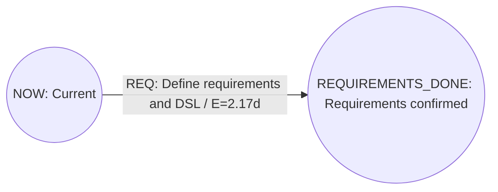
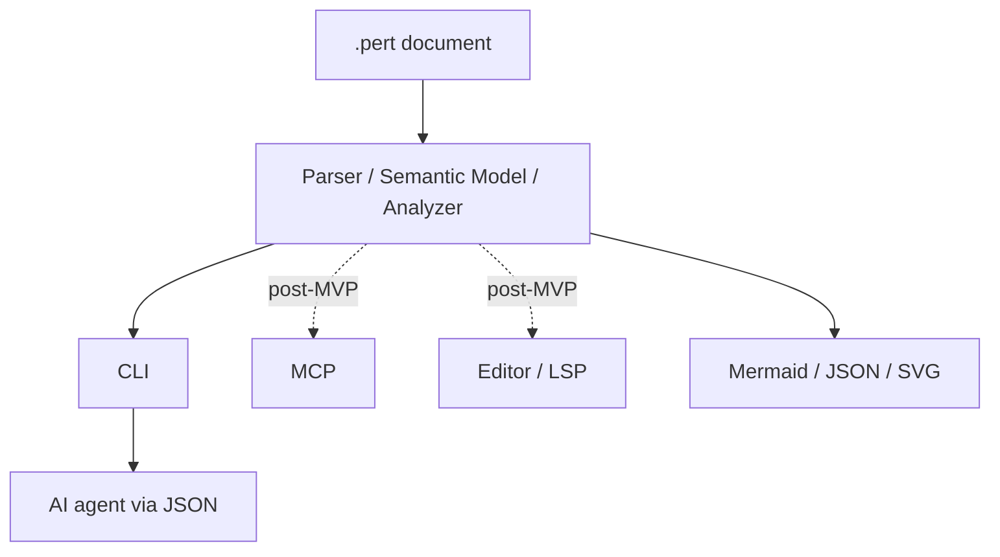

# perttool Requirements

- Document status: Draft 0.26
- Created: 2026-07-21
- Updated: 2026-08-07
- Scope: MVP and subsequent extension boundaries
- Intended file extension: `.pert` (provisional)

## 1. Purpose of this document

This document defines the requirements for `perttool`, which manages a project's current state and future plan using PERT diagrams.

The central mission of `perttool` is not PERT analysis itself. It is to provide an **AI Project Control Plane** that reproduces priority decisions for AI development from an explicit project plan and prevents task choices that may be locally sound but delay the overall project. PERT/CPM, resource schedules, gates, and milestones provide the basis for deriving these project-control decisions from project facts.

`perttool` treats a document written in its DSL as the source of truth and makes the following reproducible from that document.

- Structural validation as a DAG
- Schedule analysis based on PERT/CPM
- Generation of a feasible schedule that considers shared resource capacity
- Projection of the relative schedule onto declared dates or date-times
- Evaluation of task and milestone deadlines without hiding infeasible targets
- Exact preview-first migration between Points and one explicitly
  velocity-linked time unit
- Extraction of critical tasks and slack
- Extraction of the “next task” that can be started now
- Derivation of the task to prioritize in the current project and the reason it takes precedence over other feasible tasks
- Detection of future task plans whose reviewed upstream planning basis has
  changed, with explicit replanning and resealing before normal start authority
  is restored
- Declaration of a macro task's closed detail partition without silently
  composing schedules or weakening the macro assurance boundary
- Conversion to visualization formats such as Mermaid
- Equivalent operations from the CLI, CI, and AI agents using CLI JSON; MCP and editor adapters will be added after the MVP

This document classifies requirements as `Must`, `Should`, and `Could`.

- Must: required for the MVP
- Should: needed by immediately after the MVP
- Could: a future extension

## 2. Core product decisions

### 2.1 Adopt Activity-on-Arrow

`perttool` uses Activity-on-Arrow (AoA) as its core model.

- A task is an edge.
- A milestone or event is a node.
- Task dependencies are expressed through edge connections and zero-duration dependency edges.
- Cycles that violate the DAG structure are not permitted.

This decision makes the need to easily revise, change, and add tasks (edges) a first-class property of the data model.

### 2.2 Treat the document as the source of truth

Must:

- Structural validation, analysis, and next-task selection can be rerun from the `.pert` document alone.
- Routine analysis does not require a database, server, or network connection.
- The same document, configuration, and tool version produce the same analysis result.
- Analysis results, caches, and layout coordinates are not mixed into the source-of-truth document.

Should:

- Generated artifacts can be saved in an ignorable location such as `.perttool/`.
- Relative paths in a document are resolved relative to the document itself, not the execution directory.

### 2.3 The current document represents the present and the future

Must:

- The source-of-truth `.pert` document represents the current work boundary and the unfinished plan beyond it.
- Git retains the history of tasks that are complete and no longer serve a role.
- Only completed tasks still needed to determine a join of parallel tasks may remain temporarily in the current document with state `done`.
- The selected post-beta actuals extension may temporarily retain explicit
  work events owned by a current task. Advance removes those events with the
  task after the exact pre-advance snapshot becomes recoverable from Git.
- After the join condition is satisfied, the current boundary can advance and unnecessary past portions can be removed mechanically.
- A changed in-place advance write that removes or replaces current source
  bytes must fail closed unless every destructive entity or field range is
  byte-identical to the same repository-relative target in `HEAD` and the
  stage-0 index has no uncommitted difference in that range.
- A dirty path or dirty target file is not sufficient reason to reject an
  advance. Dirty changes outside the destructive ranges, including changes
  retained byte-for-byte by the candidate, must remain writable.
- Preview, diff, separate output, an idempotent no-op, and unrelated commands
  must not acquire a Git requirement from the advance-history guard.
- The guard must bind repository identity, path, `HEAD`, the stage-0 index,
  source, and candidate, then recheck source and the complete repository
  baseline immediately before the existing atomic write.
- An explicit history-loss override may bypass only this guard. It must remain
  subject to candidate validation, governance, warning policy, optimistic
  locking, symlink and race rejection, atomic replacement, and post-write
  validation.

This document calls this forward operation `advance`. Git is used to inspect history and the difference before and after `advance`.
The exact proof, force, result, diagnostic, and compatibility rules are in
the [Advance History Safety Contract](specs/advance-history-safety.md).

Git history must also support a separate read-only reconstruction of topology
that canonical advance has removed. The exact first-parent model is defined by
the [Historical DAG Reconstruction Contract](specs/historical-dag.md).

Must:

- Bind one repository-relative path, one exact inclusive endpoint commit, and
  an optional exact inclusive first-parent lower boundary without guessing a
  deleted path, rename, merge base, or branch union.
- Keep the requested revision, resolved endpoint, oldest inspected input,
  effective valid checkpoint, and selected snapshot distinct.
- Classify every inspected source independently and preserve invalid,
  unsupported, missing, shallow, ambiguous, or raced inputs as typed gaps
  rather than skipping them and claiming continuity.
- Reuse stable explicit work-event identity and payload-conflict rules, freeze
  accepted evidence before removal, and never substitute Git time for actual
  time.
- Rehydrate retired topology only when the complete compatible canonical
  advance candidate is semantically equal to the next checkpoint with no
  unrelated semantic change.
- Expose snapshot, proved lineage, and timeline as distinct views. Keep them
  orthogonal to `none`, `precedence`, `resource`, and `both`, and run analysis
  only on one valid checkpoint rather than a union of historical epochs.
- Make cumulative lineage unavailable after an affecting continuity gap,
  ambiguous identity reuse, contradictory frozen evidence, noncanonical
  removal, or union-only cycle. Keep independently valid timeline segments.
- Bind historical navigation to exact repository, path, commit, blob, source
  digest, and UTF-16 range evidence; never apply a historical range to
  mismatched current worktree bytes.
- Enforce fixed commit, byte, epoch, transition, graph, and binding limits
  without presenting a truncated graph as complete.
- Report `first_parent` scope explicitly. Three-way ancestry remains
  unavailable until `SCM-001` accepts the shared normalized semantic delta and
  conflict model.
- Perform no source, worktree, index, ref, configuration, repository, editor,
  or external write and grant no current execution or mutation authority.
- Give the private editor DAG a useful no-configuration default. The primary
  presentation must visibly prioritize the current milestone frontier, the
  critical path, and tasks with exact current start authority; detailed
  historical query parameters remain available through progressive disclosure.
- Use a deterministic directed-graph layout with bounded zoom, fit, native
  scrolling, pointer panning, keyboard access, and an equivalent text outline.
  Layout code must not infer project semantics. The exact private adapter
  boundary is defined by the [DAG Presentation and Focus Contract](specs/dag-presentation.md).
- Use deterministic compact `Mnn`, `Tnn`, and `Gnn` graph labels without
  replacing source or historical occurrence identity. Each label must link to
  an accessible detail row that retains original ID, title, description, exact
  source navigation, and a return path to the graph.
- Keep residual precedence makespan, resource-scheduled remaining makespan,
  and per-task PERT expected time distinct. Show exact Point-to-hour/day
  forecasts only when declared velocity permits them, and label unavailable
  conversion rather than assuming a workday. The exact boundary is defined by
  the [DAG Compact Labels and Exact Time Summary Contract](specs/dag-compact-presentation.md).

### 2.4 Make the AI Project Control Plane the central purpose

`perttool` is a control plane that determines which work an AI or human should prioritize now from the current state of the whole project, rather than merely listing feasible tasks. Its purpose is not to maximize the number of completed tasks; it is to prioritize work that helps shorten the time to the declared project finish while respecting dependencies, resource capacity, explicit priorities, gates, and milestones.

The source of truth for the formal separation of feasibility, resource selection, and recommendation tier is the [Recommendation Semantics specification](specs/recommendation.md); for deterministic recommendation order, the [Recommendation Ranking Policy specification](specs/recommendation-ranking.md); for machine-readable reason vocabulary, the [Recommendation Reason Taxonomy specification](specs/recommendation-reasons.md); for the explanation graph from typed facts to derived descriptions, the [Recommendation Structured Explanation specification](specs/recommendation-explanation.md); for Core/text/JSON, the [Recommendation Interface Contract specification](specs/recommendation-interface.md); and for intentional human deviations, the [Recommendation Human Override Contract specification](specs/recommendation-override.md).

Must:

- A project plan with tasks, dependencies, milestones, gates, resources, state, and explicit priorities is the source of truth for priority decisions.
- “Tasks that can be executed now” and “tasks that should be prioritized in the current project” are separate decisions.
- An AI performs work within the authorization and recommendation range decided by the project; it does not redefine project priority based only on conversational interest, ease of implementation, or local improvements.
- Recommendations are derived from facts made explicit in the project model, such as critical path, float, resource constraints, downstream dependencies, gates, and milestones.
- It is possible to explain, using machine-readable project facts, not only the recommended task but also why other feasible tasks are not more highly prioritized.
- Rather than returning a conclusion by reason code alone, the tool returns the applied rule, typed facts, comparison subjects, and conditions used in the decision as a structured explanation, so that an AI can answer “why this task rather than another task” without re-reasoning the ranking.
- Human-readable reason descriptions are derived deterministically from stable codes, structured facts, comparisons, and a decision trace; natural-language text alone is not the source of truth for the basis of a decision.
- The same document, options, and algorithm version return the same recommendations in the same order.
- When the recommendation algorithm and resource schedule are heuristic, the tool does not present them as an unproven global optimum.
- Facts not present in the current project model, such as rework risk, insufficient information, and release-specific meaning, are not inferred from chat context and incorporated into ranking.
- A human can intentionally deviate from a recommendation. Instead of forbidding the deviation, the contract makes clear that it is an override and states its reason.
- In the MVP, recommendations are available as read-only Core/CLI analysis. Persistence of an override is not required until the write-safety gate has been crossed.

Should:

- After project state changes, such as task completion, a block, capacity, or an override, the whole project is reanalyzed and stale recommendations are not reused.
- Future adapters other than the CLI use the same Core recommendation and do not reimplement provider-specific priority decisions.

### 2.5 English is the repository baseline

English is the canonical language for repository-maintained artifacts. This decision applies to requirements, specifications, design, examples, process documentation, current plan metadata, source comments, bundled help, and diagnostic messages.

Must:

- New or substantively modified repository prose uses English.
- Stable command names, DSL keywords, JSON fields, enum values, schema identifiers, diagnostic codes, reason codes, and typed data remain the machine-readable authority. Natural-language messages alone must not become a machine contract.
- Repository-maintained Japanese prose remains migration debt until the phased work in [`plans/english-baseline.pert`](../plans/english-baseline.pert) is accepted. After acceptance, Japanese-script content is permitted only when exact allowlisted preservation evidence identifies user-authored content, intentional Unicode fixture content, or the scanner's own detection expression.
- User-authored `.pert` titles, descriptions, source data, and intentional Unicode fixtures are preserved. The tool must not translate them automatically.
- The language used to communicate with a human is independent from the repository baseline. An agent may answer a Japanese-speaking user in Japanese while writing tracked repository artifacts in English.
- The same input, options, tool version, and fixed English description registry produce the same output regardless of the process locale.

Current non-goals:

- Runtime locale selection or a `--locale` option
- Translation catalogs, gettext-style infrastructure, or environment-dependent message selection
- Full translation of legacy Japanese artifacts in one change

The baseline policy is effective immediately. Migration of existing surfaces is a separate, phased workstream after the first beta and does not expand the accepted `BETA_RELEASE_E2E` gate.

### 2.6 Separate plan maintenance from goal and DAG authority

`perttool` distinguishes authority to perform ordinary plan maintenance from
authority to redefine the project goal or DAG. The threat is accidental
authority overreach or goal substitution by a non-malicious executor, such as
changing `project.finish` or replacing difficult critical-path work and then
treating the resulting empty recommendation as project completion.
The [Owner-Aware Mutation Governance Semantics specification](specs/governance-authority.md)
defines the exact change classification and pre-change authority decision.
The [Governance Source and Effective-Metadata
specification](specs/governance-source.md) defines principal syntax, declared
and effective project metadata, Grammar 4 compatibility, and the source
snapshot consumed by that decision.
The [Owner-Aware Governance Interface
Contract](specs/governance-interface.md) defines the caller assertions, public
results, CLI Contract 5, help, diagnostics, exits, and atomic activation.

Must:

- Represent effective owners and delegates separately for the project goal and
  DAG.
- Keep existing documents valid when governance metadata is omitted. Their
  effective goal owner and DAG owner are `user`, and both delegate sets are
  empty.
- Treat principal IDs and owner-confirmation values as caller assertions, not
  authenticated or verified identities. The initial principal domain supports
  at least `user`, `llm`, and `codex`.
- Require explicit write authority for goal and DAG changes while keeping
  preview, diff, and read-only analysis available without owner confirmation.
- Authorize owner and delegate changes against the pre-change governance state;
  a mutation cannot grant itself authority and use the new authority in the
  same operation.
- Keep this project-model write authority separate from a recommendation
  override. An override selects a different feasible ready-task start set; it
  does not authorize changing project facts, the goal, or the DAG.
- Preserve all existing parse, semantic, candidate-validation,
  optimistic-lock, safe-write, and Git-history protections.

### 2.7 Preserve conditional plan assurance separately from execution state

`perttool` must be able to state that a downstream task plan remains valid only
while the upstream plans on which it was reviewed remain unchanged. This is a
planning-basis relationship, not another task status, resource dependency,
recommendation tier, approval certificate, or probability score. The
[Conditional Plan Assurance Contract](specs/plan-assurance.md) defines the
target semantic and hash models. The [Plan Assurance Interface
Contract](specs/plan-assurance-interface.md) fixes their Grammar 6 and CLI
Contract 7 source, result, command, diagnostic, and governance boundary.

Must:

- Derive the planning-dependency DAG from the existing projected task
  dependency DAG by default. An ordinary task dependency therefore means both
  execution dependency and planning dependency unless explicitly qualified.
- Support exactly three relationship modes in the first model: `both`,
  `planning_only`, and `execution_only`. A planning-only relation affects plan
  assurance without changing AoA reachability or readiness; an execution-only
  relation preserves execution order without propagating plan-assurance
  changes.
- Represent explicit qualifications with a top-level `task_relation` source
  declaration containing a stable relation ID, predecessor task ID, successor
  task ID, required `mode`, and conditionally required human `reason`. Keep the
  arrow as orientation only; use full mode names rather than punctuation aliases.
- Keep the AoA graph authoritative for execution. Planning-only relations must
  not synthesize tasks, gates, milestones, resource requirements, or schedule
  edges.
- Validate the effective planning-dependency graph as a separate DAG and return
  a deterministic cycle witness before hashing when an explicit relation
  creates a planning cycle.
- Derive a versioned semantic task-plan contract hash and a recursive planning
  basis hash. Hashes must be deterministic from the current document and
  versioned algorithms and require no network, wall clock, or Git access.
- Exclude task lifecycle status, block reason, milestone state, work events,
  actual measurements, derived analysis/recommendation fields, source trivia,
  and the assurance fields themselves from the task-plan contract hash.
- Keep the automatically recomputed basis distinct from the last explicitly
  accepted basis. A mismatch must never update or accept itself.
- Retain enough accepted component commitments to distinguish a direct task
  contract change, a direct planning-relation change, and an inherited
  predecessor change; do not infer those causes from one opaque basis hash.
- Preserve existing documents that do not enable assurance. Once assurance is
  enabled, missing, partial, unknown-version, or mismatched assurance must fail
  closed only for the affected new-start authority while retaining analysis
  needed for replanning.
- Return direct causes, inherited cause paths, affected task IDs, and the
  required `replan_and_reseal` control action. Do not create new AoA tasks or
  rewrite a plan automatically.
- Require an explicit, preview-first, candidate-bound, governed initial seal or
  reseal. A hash-only reacceptance without a task-plan edit requires a human
  reason.
- Preserve every retained task's computed planning basis across an
  assurance-aware `dag advance` by contracting still-needed removed
  commitments into minimal frontier receipts.
- Keep the advance history-loss force boundary separate. It must not bypass
  plan-assurance validation or reseal authority.
- Describe SHA-256 commitments as integrity/freshness seals, not digital
  signatures, authenticated approvals, blockchains, or proof that a plan or
  delivered outcome is correct.

Should:

- Let unaffected verified branches retain their normal start authority when a
  separate planning closure requires replanning.
- Compute all planning bases in one stable topological pass and explain the
  earliest changed semantic input rather than leading with opaque hashes.
- Permit later incremental descendant recomputation only when it is
  byte-identical to a complete topological recomputation.

### 2.8 Keep macro assurance above task refinement

The future multi-plan model must be able to relate one macro task to one closed
set of detail tasks without treating task prose as formal set theory. The
[Task Refinement and Assurance Boundary Contract](specs/task-refinement.md)
defines the semantic target. It is a draft design and does not change active
Grammar 6 or CLI Contract 7.

Must for the future refinement model:

- Represent one macro-to-detail decomposition as one n-ary `partition`
  relation with exactly one parent and at least two distinct children, rather
  than separate containment, pairwise-exclusion, and coverage records.
- Define `partition` as the declaration that the child scopes are contained
  by, pairwise disjoint within, and jointly exhaustive of the parent scope.
- Call this state `declared_partition`; do not claim that task titles,
  descriptions, an LLM, a hash, or a signature mechanically proves MECE.
- Keep macro and detail documents independently valid and analyzable. Do not
  create a combined execution or resource schedule, and do not count both the
  parent and children in one schedule.
- Keep the refinement graph separate from the AoA execution graph, planning-
  dependency DAG, lifecycle, actuals, resources, recommendation, governance,
  and start authority.
- Use only the macro task in the upper assurance graph by default. Refinement
  records and detail task contracts must not enter the macro task's plan
  contract, basis, exported commitment, or downstream assurance closure.
- Let detail edits remain below the macro assurance boundary. A parent edit
  remains an ordinary plan-contract change and must retain existing replan and
  reseal behavior.
- Provide no `skip_review`, `no_recheck`, waiver, or equivalent authority bit.
- Require assurance-boundary expansion and contraction to be explicit,
  preview-first, complete-closure, and atomic. The partition relation alone
  must not generate or transfer planning dependencies.
- On expansion, replace the parent boundary with explicitly selected child
  nodes and relations. On contraction, transfer only exact normalized common
  relations, report every residual, and never silently generalize a child-only
  dependency to the whole parent.
- Require a reviewed parent plan contract during contraction; do not derive
  parent duration, resources, lifecycle, or completion from child values.
- Limit the first transition model to unstarted tasks without work events,
  outcomes, receipts, or other historical evidence requiring reassignment.
- Preserve the partition and detail plan when assurance contracts back to the
  parent.

Should:

- Restrict the first refinement graph to an acyclic forest with one active
  partition per parent, one direct parent per child, and one detail document
  per direct child set.
- Make exact expansion/contraction relation mapping deterministic and
  round-trippable when no task or relation changes between transitions.
- Leave source syntax, document locators, persistence, multi-file transaction,
  CLI/result/schema versions, migration, and release selection to a separate
  interface contract before implementation.

## 3. Problems to solve

- A task list alone makes dependencies and start order hard to see.
- Critical paths and slack calculated manually become stale after a plan changes.
- Relative durations alone do not show when work is projected to start or
  finish, whether a start constraint is active, or whether a declared deadline
  is at risk.
- Editing a diagram directly separates it from the plan data or makes them inconsistent.
- When adding a task, it is difficult to notice that existing dependencies have been broken.
- “Tasks that can be done now” and “future tasks” are mixed together.
- “Tasks that can be done now” and “tasks that should be done now” are not distinguished, causing an AI to optimize locally for an easy-to-start branch task.
- Project intent and the reasons for task selection are scattered across prompts, chat history, and issue discussions, so the same decision cannot be reproduced from the same plan.
- Optional features and improvements scheduled for replacement are prioritized, while critical dependencies and work immediately before a gate are postponed.
- A predecessor investigation, design, or implementation can change while an
  executor continues to follow downstream tasks that were planned against the
  prior predecessor content.
- An executor that is authorized to maintain status or estimates can
  accidentally redefine `project.finish` or restructure the DAG without the
  goal or DAG owner's confirmation.
- A plan that cannot be recalculated without a GUI or external service is difficult to put under Git and automation.
- Behavior diverges when human help and the operational contract for AI are implemented separately.

## 4. Non-goals

The MVP and the subsequent extension boundaries in this document do not aim to
provide the following.

- Replacing a general-purpose project-management SaaS
- Guaranteeing an exact exhaustive-search optimum for resource-constrained schedules in the MVP
- A general-purpose resource calendar that includes shifts, holidays, skills, and setup time
- Actual-time, attendance, or timesheet recording
- Automatic deadline enforcement that silently changes dependencies, duration,
  resource priority, or recommendation ranking
- Management of attendance, work billing, costs, or budgets
- Chat, notifications, or approval workflows
- Storing all historical states in one `.pert` document without using Git history
- Treating Mermaid as the source of truth and interpreting all Mermaid syntax
- Guaranteeing an exact completion probability for a network with competing critical paths
- Delegating PERT/CPM calculation itself to an LLM
- A planning system in which AI autonomously invents tasks, dependencies, milestones, or priorities
- Deciding priority by evaluating code interest, quality, or general value outside the project plan
- Deciding recommendations only from opaque AI/ML scores
- Guaranteeing an exact global optimum for a heuristic schedule or recommendation
- Treating risks, information, or release semantics absent from the project model as source-of-truth facts inferred from chat
- Prohibiting a human from deviating from a recommendation
- Authenticating or verifying governance principals, or providing signatures,
  RBAC, identity-provider integration, or an external approval system
- Defending against a malicious caller that deliberately forges an actor or
  owner-confirmation assertion
- Preventing a text editor from changing `.pert` bytes
- Treating governance owners or delegates as recommendation-ranking facts,
  dependency edges, or scheduling resources
- Treating a same-file hash as a digital signature, malicious-edit defense,
  distributed ledger, or proof that work satisfied its plan
- Automatically inventing replacement work, resealing a changed plan, or
  cancelling active tasks after a plan-assurance mismatch
- Providing a durable owner-confirmation ledger or combining owner-aware
  mutation authority with recommendation override apply/audit
- runtime i18n, localization catalogs, or locale negotiation

## 5. Intended users and primary use cases

### 5.1 Plan author

- Add milestones and tasks as text.
- Describe three-point estimates.
- Declare exclusive equipment or personnel slots as resources.
- Validate syntax, references, cycles, and unreachable portions.
- Generate and review Mermaid diagrams.

### 5.2 Work executor

- Check tasks currently in progress.
- Check tasks that can be started now.
- Check the set of tasks that can start concurrently with currently available resource capacity.
- Check blocking reasons and criticality.
- Change a task's state, estimate, owner, or endpoint.
- Advance the current boundary after completion.

### 5.3 Reviewer

- Review plan changes from a Git diff.
- Recalculate the critical path, projected completion, and slack after a change.
- Compare concurrency and projected completion after changing resource capacity.
- Use both Mermaid diagrams and machine-readable JSON.

### 5.4 AI agent

- Discover the DSL and operational contract through structured help.
- Validate and analyze a document, obtaining feasible tasks separately from recommended tasks.
- Check a recommendation's reasons and higher-ranked tasks, then choose work from the range the project authorizes or recommends.
- When choosing a task outside the recommendation at human direction, state that it is an override and state the reason.
- Preview task edits and show the diff.
- Do not rewrite a file without explicit authorization and conflict validation.

## 6. Terminology and semantic model

| Term | Meaning |
| --- | --- |
| Project | One PERT planning document |
| Milestone | A DAG node representing the start or finish of a task |
| Task | A DAG edge representing work and having positive duration |
| Gate | A non-task edge with zero duration that represents dependency only |
| Resource | A shared resource whose capacity is occupied while a task runs and returned when it completes |
| Frontier | The set of milestones reached now that form the entry to the future plan |
| Reached | A state in which a milestone's conditions are satisfied and work can proceed from it |
| Ready | A state derived from a not-started task whose dependencies are satisfied and which is not blocked |
| Critical | A task or gate whose total float is within the allowed tolerance |
| Schedule Critical | A sequence of tasks that constrains completion time in a feasible schedule including resource waits |
| Recommendation | Work that should currently be prioritized and its explanation, derived from facts explicit in the project model. The [Recommendation Semantics specification](specs/recommendation.md) is authoritative for its formal meaning. |
| Override | A decision in which a human intentionally chooses work different from the recommendation and states that fact and its reason |
| Planning Dependency | A relation in which a successor task plan is conditional on a predecessor's versioned plan assurance; it is separate from execution readiness |
| Plan Contract | The closed semantic projection of a task's reviewed plan fields, excluding lifecycle, actuals, derived values, and source trivia |
| Computed Basis | The current hash derived from a task plan contract and its effective planning predecessors |
| Accepted Basis | The computed basis explicitly accepted by an initial seal or a post-replanning reseal |
| Plan Assurance | The derived `not_applicable`, `unsealed`, `conditional`, `verified`, `review_required`, or `unavailable` state of a task plan |
| Frontier Assurance Receipt | A minimal commitment retained across advance when removed past work still supports a current/future planning basis |
| Task Refinement | A non-execution, non-assurance relation from one macro task to one closed detail-task set |
| Declared Partition | A human-declared assertion that detail scopes form a disjoint and exhaustive partition of a parent scope; it is not machine-proven MECE |
| Assurance Boundary | The task set whose commitments participate in an upper planning-assurance graph; refinement does not move this boundary implicitly |
| Principal | A caller-asserted identifier such as `user`, `llm`, or `codex`; it is not an authenticated identity |
| Goal Owner | The principal whose authority governs changes to `project.finish` and goal-governance metadata |
| DAG Owner | The principal whose authority governs changes to task, gate, and milestone structure and DAG-governance metadata |
| Delegate | A principal that an owner has declared may perform governed writes within one authority scope |
| Owner Confirmation | A single-candidate caller assertion that the named effective owner was consulted for the explicitly identified affected scopes; it is neither authentication nor proof of approval |
| Point | The project-specific unit `p` that AI or people use to estimate relative work size; it is not time itself |
| Velocity | A project-wide ratio expressing the number of Points that can be completed in a period; for example, `20p/10d` |
| Velocity Forecast | A forecast that converts Points and days/hours using Velocity, distinct from declared PERT values |
| Snapshot | A `.pert` document representing the present and future at a particular point in time |
| Advance | An operation that moves the frontier forward to reflect completion conditions and removes unneeded past portions |
| Temporal Anchor | `project.as_of`, which maps relative schedule time zero to the declared snapshot date or date-time |
| Not Before | An absolute task-start constraint that prevents an unstarted task from becoming time-eligible before the declared value |
| Deadline | An absolute target by which a task should finish or a milestone should be reached; missing it does not make the source document structurally invalid |
| Calendar Projection | A derived mapping from exact relative schedule values to dates or date-times; it does not replace the base-unit analysis |

## 7. Canonical data model

### 7.1 Project

Must fields:

- `id`: a stable identifier unique within the document
- `title`: a human-readable name
- `finish`: the ID of the final milestone
- `duration_unit`: the project-wide base unit used for analysis and display: one of `day`, `hour`, or `point`

Optional fields:

- `as_of`: the temporal anchor and reference date or date-time of the snapshot
- `description`: a multiline description
- `critical_epsilon`: the tolerance for including near-critical work in critical display under exact Rational calculation
- `target_duration`: the target duration from the current boundary to `finish`
- `velocity`: the optional project-wide ratio for converting between Points and days/hours

Constraints:

- A task's duration/estimate, `critical_epsilon`, and `target_duration` use the project's base unit.
- New projects default to `duration_unit point`. `day` and `hour` remain compatible deprecated inputs and emit `PTSEM-114` with `project migrate-unit --to-unit point` guidance.
- `velocity` expresses a positive Point quantity and a positive period as `<points>p/<period>d` or `<points>p/<period>h`.
- When specifying velocity with `duration_unit day|hour`, the period suffix matches the project's base unit.
- With `duration_unit point`, the period suffix of velocity determines whether conversion is to `day` or `hour`.
- Without velocity, Point analysis remains available and the separate velocity forecast is unavailable.
- A velocity-derived value is explicitly named `velocity_forecast` and does not replace a declared PERT value.
- Velocity does not imply a relationship between `1d` and `1h`, business days, or working hours.
- A document declaring any task or milestone temporal property requires
  `as_of`; no command derives it from the system clock.
- The deadline for the whole project is the `deadline` on the milestone
  referenced by `finish`. There is no separate `project.deadline` alias.

Owner-aware governance extension:

- The project model provides declared and effective values for `goal_owner`,
  `dag_owner`, `goal_delegates`, and `dag_delegates`.
- Omitting these fields means effective `goal_owner=user`,
  `dag_owner=user`, and empty goal and DAG delegate sets. Existing documents
  remain valid without source migration.
- Owner and delegate values are principal IDs. The normative grammar,
  canonical field order, compatibility version, and source-preserving mutation
  forms are fixed by the [Governance Source and Effective-Metadata
  specification](specs/governance-source.md) rather than inferred from these
  requirements.

### 7.2 Resource

A Resource is a renewable resource that is occupied while a task runs and returned when it completes.

Must fields:

- `id`: a stable identifier unique within the document
- `title`: a human-readable name
- `capacity`: a positive integer available for concurrent use; `1` represents exclusive execution

Optional fields:

- `description`: a multiline description
- `tags`: a set of strings for search and display

Constraints:

- Capacity is at least 1 and at most 2147483647.
- Consumable resources, shifts, calendars, and capacity changes during execution are outside the MVP.
- A task using a resource retains its declared quantity for its entire execution interval.

### 7.3 Milestone

Must fields:

- `id`: a stable identifier unique within the document
- `title`: a human-readable name

Optional fields:

- `state`: `planned` or `reached`; defaults to `planned`
- `description`: a multiline description
- `tags`: a set of strings for search and display
- `deadline`: the latest desired date or date-time at which the milestone
  should be reached

Constraints:

- The milestone referenced by `project.finish` exists.
- No task or gate may leave the finish milestone.
- A `reached` milestone with an unfinished incoming edge is reported as a state contradiction.
- Portions before an explicit `reached` milestone that are not needed for present-state determination should not be retained.
- A milestone deadline is a target, not a dependency edge or a hard cap on the
  schedule. A future or missed deadline does not make an otherwise valid DAG
  invalid.
- The current snapshot does not reconstruct the actual reach time or deadline
  compliance of an already reached milestone.

### 7.4 Task

Must fields:

- `id`: a stable identifier unique within the document
- `from`: the start milestone ID
- `to`: the finish milestone ID
- `title`: a human-readable name
- `status`: one of `planned`, `active`, `blocked`, or `done`; defaults to `planned`
- `duration` or `estimate`: exactly one of them

Optional fields:

- `description`: a multiline description including completion conditions
- `owner`: the responsible person or group
- `priority`: explicit priority during resource contention; defaults to 0
- `requires`: pairs of resource IDs and required quantities; absent means no resource occupation
- `tags`: a set of strings
- `blocked_reason`: the reason for `blocked`
- `source`: a reference target such as a ticket or design document
- `not_before`: the earliest permitted date or date-time at which an unstarted
  task may start
- `deadline`: the latest desired date or date-time at which the task should
  finish

Constraints:

- `from` and `to` must not be the same milestone.
- `duration` must be greater than 0.
- `estimate` must satisfy `optimistic <= most_likely <= pessimistic`.
- `duration` and `estimate` must not be specified together.
- A `blocked` task requires `blocked_reason`.
- Priority is at least 0 and at most 2147483647.
- Each required quantity is at least 1 and no greater than the referenced resource's capacity.
- A task can start only when all required resources can be secured simultaneously.
- The same resource must not be specified more than once within a task.
- The start milestone of an `active` or `done` task must be effectively reached.
- A `done` task should remain only while it is needed for the current join determination.
- A task ID can be retained even when its name or endpoint changes.
- `not_before` constrains temporal start eligibility but does not create a DAG
  edge, change the task duration, or make a structurally ready task unready.
- A task deadline is evaluated independently of its destination milestone
  deadline. Neither value is implicitly copied to the other.
- A deadline is a target rather than a hard finish constraint. A past or
  forecast-missed deadline remains analyzable and is reported as a temporal
  result rather than a structural-validation failure.
- Grammar versions 1 through 4 do not store actual start or finish events. They
  must not infer deadline compliance for `done` tasks from `as_of` or Git
  commit time. The selected Grammar 5 target records explicit work events
  under the separate [Project Actuals and Git History
  Contract](specs/project-actuals.md).

The `duration` or `estimate` of an in-progress task represents remaining duration at the current snapshot. Git history records previous estimates.

### 7.5 Gate

A Gate is a dummy edge in AoA that represents dependency only; it is not a task.

Must fields:

- `id`: a stable identifier unique within the document
- `from`: the start milestone ID
- `to`: the finish milestone ID
- `reason`: why this dependency is necessary

Constraints:

- Its duration is always 0.
- It must not create a cycle, just as a task must not.
- In a visualization, it uses a line style distinguishable from a task.

### 7.6 Temporal property scope

The first temporal extension accepts exactly the following declared
properties.

| Entity | Property | Meaning |
| --- | --- | --- |
| Project | `as_of` | Existing snapshot anchor for relative schedule time zero |
| Milestone | `deadline` | Latest desired reach date or date-time |
| Task | `not_before` | Earliest permitted start date or date-time for an unstarted task |
| Task | `deadline` | Latest desired finish date or date-time |

Must:

- Use the same explicit ISO date/date-time lexical family as `as_of`; a
  date-time carries an offset and no value depends on the process-local time
  zone.
- Require `project.as_of` when `deadline` or `not_before` is declared.
- Keep structural readiness separate from temporal eligibility. A task can be
  `ready` but not time-eligible or `runnable_now`.
- Keep task and milestone deadlines as evaluation targets. Do not convert them
  into hidden gates, resource dependencies, duration changes, or hard
  infeasibility errors.
- Keep exact relative PERT/CPM and resource-schedule values in the project base
  unit. Calendar projections and deadline evaluations are separate qualified
  results and never replace those values.
- Preserve a declared offset and enough date/date-time precision to reproduce
  comparisons and projections. Human-readable formatting is not a comparison
  input.
- Evaluate task deadlines, milestone deadlines, and the finish-milestone
  deadline independently, while returning their relationships explicitly when
  one task feeds a deadline-bearing milestone.
- Treat temporal output as a deterministic function of the document, options,
  and versioned algorithms. Do not read the current wall clock.
- Expose why a calendar projection or deadline evaluation is unavailable,
  including a missing anchor, unavailable point/time conversion, unresolved
  block, or unsupported calendar relationship.

Initial capabilities:

- Derive projected task start and finish, milestone reach, and project finish
  from both the precedence lower bound and the heuristic resource schedule
  where the calendar contract permits it.
- Evaluate temporal start eligibility from `not_before`.
- Derive deadline feasibility, remaining margin or lateness, and overdue or
  at-risk state without concealing whether the result comes from precedence or
  heuristic resource scheduling.
- Carry temporal facts into next-task output and structured explanations.
  Any effect on recommendation eligibility, ranking, selection horizon, tier,
  or reason taxonomy requires an explicit algorithm/schema version change.

The first temporal extension does not accept:

- `project.deadline`; use the finish milestone deadline;
- temporal fields on resources or gates;
- milestone `not_before`, task planned-start/planned-finish fields, actual
  start/finish timestamps, recurrence, reminders, or percent complete;
- per-task or per-resource time zones, business calendars, holidays, shifts,
  working hours, or time-varying capacity;
- implicit day/hour conversion, conversion through the host locale, or
  conversion from Git timestamps; or
- automatic propagation of a milestone deadline to incoming tasks.

Compatibility:

- Grammar version 1 keeps its current field set and meaning. The new temporal
  fields require a new grammar version rather than silently widening version
  1.
- Grammar version 2 keeps its accepted temporal field set and finite-Decimal
  Duration syntax. Exact fraction Duration is introduced by grammar version 3
  rather than silently widening version 2.
- A version 1 document without the new fields retains byte-compatible
  validation behavior and the same base analysis and recommendation results
  under the existing algorithm versions.
- Result schemas that add temporal fields receive new schema identities.
  Existing schema identities do not gain conditionally present fields.
- The [Temporal and Unit Interface Contract](specs/temporal-unit-interface.md)
  version 2 selects grammar version 3, unit-migration version 2,
  `Perttool.UnitMigrationResult.v2`, and the unchanged future CLI Contract 4
  boundary. It introduces no compatibility aliases and does not silently
  reinterpret Contract 3 options.

### 7.7 Point and time-unit source migration

The first unit-migration extension rewrites one complete valid document
between `point` and the `day` or `hour` unit linked by an explicit project
velocity. It is distinct from read-only `velocity_forecast` output.

Must:

- Permit only `point -> day|hour` and matching `day|hour -> point`.
- Select one exact effective velocity from the project or from an explicit
  replacement supplied as part of the same atomic request.
- Require the effective velocity's period to match the time source or target.
  Never infer a `day <-> hour` relationship from a calendar constant,
  displayed forecast, locale, or wall clock.
- Convert `critical_epsilon`, `target_duration`, every task `duration`, and all
  three values of every task `estimate`, regardless of task status.
- Preserve omitted `critical_epsilon` as an omitted target-unit zero rather
  than inserting a field.
- Leave `as_of`, `deadline`, `not_before`, graph structure, resources, state,
  priority, and all other non-duration source values unchanged.
- Calculate every conversion as an exact Rational using the effective
  velocity. Do not use binary floating point or a rendered decimal.
- Serialize every exact converted Rational. Emit the shortest exact finite
  Decimal when the reduced denominator has no prime factor other than 2 or 5;
  otherwise emit a reduced fraction Duration under grammar version 3. Never
  round or expose a partial candidate.
- Retain grammar version 1 or 2 when every generated Duration is representable
  by its existing Decimal syntax. When any generated value requires a
  fraction, atomically upgrade the complete candidate to grammar version 3
  and report the grammar metadata change.
- Retain, replace, or insert velocity deterministically. A retained velocity
  preserves its source bytes; a replacement is explicit and atomic.
- Produce one source-preserving candidate, localized edits, and a deterministic
  unified diff, and revalidate only the final candidate.
- Treat a same-target request without replacement as a no-op and prevent a
  repeated request from scaling values twice.
- Guarantee exact inverse restoration of source Rational values when the same
  effective velocity is retained. Lexical Duration spelling need not be
  restored. Replacement velocity and a grammar-version upgrade must each be
  reported as metadata changes; migration does not automatically downgrade a
  version 3 document.
- Fail closed if a later grammar adds a base-unit-bearing field not inventoried
  by the active migration version.

The normative formulas, field inventory, representability rule, velocity
disposition, round-trip qualification, and stable semantic failure causes are
defined by the
[Point and Time-Unit Migration Semantics specification](specs/unit-migration.md).
The dependency-ordered
[Temporal and Unit Interface Contract](specs/temporal-unit-interface.md)
defines public Core/CLI names, result schemas, help, and diagnostic codes
before runtime implementation.

### 7.8 Project actuals and work lifecycle

The selected post-beta actuals extension records explicit operational evidence
without turning Git commit time or projected schedules into actual facts. Its
source, lifecycle, history, and observation semantics are defined by the
[Project Actuals and Git History Contract](specs/project-actuals.md), with the
storage decision recorded in
[ADR 0006](adr/0006-explicit-work-events-in-git-history.md).

Must:

- Represent actual start, suspend, resume, and finish as versioned work events
  associated with a stable task ID.
- Require an explicit fixed-offset event date-time. Core behavior must not read
  the wall clock or substitute `as_of` or Git time.
- Update lifecycle state and append its event as one previewable,
  source-preserving, candidate-validated mutation.
- Keep `blocked` distinct from the future `suspended` state. A suspended task
  releases its renewable resources and is not automatically ready or
  recommended.
- Keep active execution time, cycle time, person effort, task estimates, and
  resource quantities as distinct values.
- Use exact Rational arithmetic for actual durations, person effort, Point
  baselines, and observed rates.
- Preserve an exact planned-value baseline so estimate changes cannot silently
  inflate completed-Point observations.
- Let a standalone explicit finish record partial `finish_only` coverage
  without inventing a start or elapsed interval.
- Retain task-owned work events only while the task remains in the current
  source, remove them with the task during advance, and preserve the exact
  pre-advance evidence in Git history.
- Reconstruct project actuals through read-only Git inspection. Explicit event
  time and Git-recorded transition time must remain different evidence
  classes.
- Report shallow, ambiguous, renamed, unsupported, or otherwise incomplete
  history as incomplete or unavailable rather than guessing.
- Compute elapsed-hour throughput, qualified active-date throughput, and
  Point/person-hour productivity separately. Parallel task cycle times must
  not be summed as a project observation period.
- Return observed velocity separately from declared `project.velocity`.
  Observation must not mutate the source or automatically adopt a rate.
- Keep Grammar 1 through 4, CLI Contract 5, current analysis/recommendation
  schema identities, and status-only `task finish` unchanged until one atomic
  future contract cutover is accepted.

The first contract does not include automatic Git mutation, a permanent
historical ledger in the current graph, a multi-file sidecar transaction,
post-advance correction, arbitrary branch-union reconstruction, payroll or
billing semantics, business calendars, named time zones, statistical
confidence, automatic velocity adoption, recommendation override apply,
durable authorization audit, or release operations.

### 7.9 Conditional plan assurance

The selected post-beta design records enough versioned planning-basis
commitments to detect when current/future task plans no longer match their last
accepted upstream assumptions. The [Conditional Plan Assurance
Contract](specs/plan-assurance.md) is authoritative for relation projection,
hashing, states, resealing, start authority, and advance contraction.

The first semantic model contains:

- a project-level assurance model identity and coverage state;
- the projected direct task-dependency relation from the AoA graph;
- explicit planning-dependency relation records for the `both`,
  `planning_only`, and `execution_only` modes;
- one versioned semantic task-plan contract hash per task;
- one automatically computed and one explicitly accepted planning basis per
  assurance-applicable task;
- explicit outcome-conformance evidence bound to the basis against which a
  completed task ran, including a versioned semantic commitment when the
  outcome changed; and
- minimal frontier receipts for removed task commitments still consumed by
  current/future plans, including each consumer and its effective planning
  mode.

Must:

- Use `both` for projected direct task dependencies by default.
- Treat a task pair as a direct projected dependency only when the path from
  the predecessor destination to the successor source contains zero or more
  gates and no intervening task.
- Require explicit source facts and a reason for `planning_only` and
  `execution_only` departures from the default.
- Use the target source form
  `task_relation <id> <predecessor> -> <successor>:` with exactly one
  `mode both|execution_only|planning_only`. Preserve an explicit `both` pin
  even though its effective graph and hash match the default.
- Keep relation IDs in the global document ID namespace, resolve both endpoints
  only to tasks, reject duplicate semantic pairs, and keep relation IDs and
  reason wording outside the assurance hash.
- Reject a planning-only record that duplicates an existing projected task
  dependency and an execution-only record that has no projected task
  dependency.
- Hash a closed canonical semantic projection rather than raw `.pert` bytes.
  Exact Duration/Estimate values, requirements, tags, and optional fields must
  have deterministic canonical forms.
- Keep project snapshot fields, milestone metadata other than endpoint IDs,
  and resource capacity outside task-plan hash model 1. Their existing
  temporal, deadline, resource, and recommendation authorities remain active;
  adding them to assurance requires a new hash model.
- Treat any change to a model-1 task-plan field as a contract change. A later
  aspect-specific model requires a new version rather than silently narrowing
  the first model.
- Preserve the plan hash across status transitions, work-event insertion,
  formatter-only edits, and equivalent source trivia.
- Not infer outcome conformance from `done`, a finish time, actual duration,
  effort, Git time, or an LLM interpretation of free-form text.
- Allow a known changed-outcome commitment to invalidate existing consumers
  once and become a valid planning input only after the affected downstream
  plans are explicitly replanned and resealed against it.
- Expose Grammar 1 through 6 through one CLI Contract 7 public boundary, while
  preserving Grammar 1 through 5 source meaning and requiring exact old-package
  pins for the closed Contract 6 result identities.
- Provide Grammar 6 compatibility adapters
  for formatting, unit migration, project metadata, project history, atomic
  batch, and Mermaid conversion. Each adapter must validate the complete
  Grammar 6 input and candidate and must neither synthesize assurance facts nor
  remove or rewrite assurance-owned source as an incidental effect.
- Keep Grammar 6 during unit migration. Convert only the declared duration
  inventory and required project unit/velocity fields; preserve assurance
  model fields, relations, seals, outcomes, and receipts byte-for-byte.
- Treat project history as actuals evidence only. It may validate Grammar 6
  snapshots and reduce task/work-event history, but it must not infer, repair,
  or accept assurance from Git, status, commits, or removal history.
- Use Mermaid semantic profile 2 as the lossless Grammar 6 route. Profile 1 and
  plain Mermaid must fail under strict loss handling; a non-strict projection
  must enumerate each omitted assurance project field and assurance-owned
  declaration and must not claim round-trip fidelity.
- Expose the accepted compatibility adapters through the standard package
  root, command registry, help, schemas, temporary-link workflow, and isolated
  Contract 7 installation without exporting lower-level target-capability
  helpers.
- Direct-edit guidance must state that editing a task, relation, accepted hash,
  outcome, or receipt can invalidate assurance. Hash inspection is read-only;
  it neither repairs a seal nor grants reseal or persistent-write authority.
- Provide one read-only assurance inspection Core shared by the
  `plan-assurance show` and `plan-assurance hash` commands. A hash request must
  identify one task and exactly one of `contract`, `computed-basis`, or
  `exported`; it must select from the semantic evaluator rather than hashing
  source bytes. Text success is only the selected canonical digest plus LF,
  while an unknown task or unavailable selection returns no digest.
- Keep filtered show and hash results source-bound and closed. They must retain
  global coverage, return task results in evaluator order, retain cause roots
  entering selected tasks, and expose no task result outside the requested
  set. Inspection must not accept, persist, or synthesize an assurance record.

SHA-256 is the first commitment algorithm, with domain-separated model
identities and canonical lowercase `sha256:` spelling. The threat model is
accidental or unreviewed continuation through tool-mediated workflows. Because
the task and its accepted hash may share one directly editable file, this
model does not prevent a malicious editor from replacing both.

### 7.10 Task refinement partitions

Refinement model 1 contains one semantic record, identified by one resolved
parent task reference, with a closed set of at least two resolved child task
references and relation kind `partition`. The source spelling and storage
location are not selected by this requirement.

The semantic relation means:

```text
scope(parent) = disjoint_union(scope(child_1), ..., scope(child_n))
```

The machine-readable model validates reference existence, distinctness,
single-parent ownership, one active partition per parent, one detail document
per direct child set, deterministic ordering, and acyclicity. It does not
validate semantic set membership from natural-language plan content.

The default assurance projection contains the macro parent only. Detail tasks
may be analyzed or assured locally, but they do not affect the macro assurance
graph until a separately accepted boundary expansion explicitly maps and
reseals the affected relations. Contraction performs the inverse mapping while
retaining the detail plan and partition. Neither transition changes the AoA
graph, schedule, resources, lifecycle, or actuals implicitly.

## 8. DSL requirements

### 8.1 Design principles

Must:

- It uses a line-oriented block syntax.
- Indentation represents ownership.
- A keyword explicitly identifies each block kind.
- References use stable IDs rather than display names.
- It supports UTF-8 titles and descriptions.
- An ID begins with an ASCII letter and may use ASCII alphanumerics, `-`, and `_`.
- The parser retains file, line, and column source spans for every semantic element.
- It supports standalone-line comments, which ordinary editing operations preserve.
- Declaration order does not affect semantics.
- A task definition is localized in one place, so its endpoint, estimate, and state can be edited locally.
- Resource capacity and task requirements can be edited locally by stable ID.

Should:

- The formatter preserves semantics and, as far as possible, declaration order and comments.
- Multiline text can be written as block text.
- Markdown fenced code blocks can use the language name `pert`.
- Unknown future fields produce an explicit diagnostic rather than being silently ignored.

MVP duration literals require a unit suffix, such as `2d`, `4h`, or `3p`. The DSL recognizes `day`/`d`, `hour`/`h`, and `point`/`p`; task estimates in one document use the project's base unit. Conversion between Points and days/hours uses only explicit velocity, and mixed units in a document without a calendar-conversion rule are an error.

### 8.2 Grammar specification and representative syntax

The [DSL grammar specification](specs/dsl-grammar.md) is authoritative for the complete EBNF, lexical rules, fields, defaults, error recovery, and formatter contract. The following is representative syntax.

```pert
project PERTTOOL_MVP:
  version 1
  title "perttool MVP"
  description |
    Build a document-based PERT task-management tool.
  as_of 2026-07-21
  duration_unit day
  finish RELEASED

resource DEVELOPERS:
  title "Development"
  capacity 2

resource RELEASE_ENV:
  title "Release environment"
  capacity 1

milestone NOW:
  title "Now"
  state reached

milestone REQUIREMENTS_DONE:
  title "Requirements complete"

milestone CORE_DONE:
  title "Analysis core complete"

milestone CONVERTERS_DONE:
  title "Conversion complete"

milestone RELEASED:
  title "MVP released"

task REQ NOW -> REQUIREMENTS_DONE:
  title "Finalize requirements and the DSL"
  estimate:
    optimistic 1d
    most_likely 2d
    pessimistic 4d
  status active
  tags [requirements, mvp]

task CORE REQUIREMENTS_DONE -> CORE_DONE:
  title "Implement the PERT/CPM analysis core"
  duration 5d
  status planned
  requires:
    DEVELOPERS 1

task CONVERT REQUIREMENTS_DONE -> CONVERTERS_DONE:
  title "Implement Mermaid conversion"
  estimate:
    optimistic 2d
    most_likely 3d
    pessimistic 6d
  status planned
  requires:
    DEVELOPERS 1

task INTEGRATE CORE_DONE -> RELEASED:
  title "Integrate the CLI and analysis core"
  duration 2d
  status planned
  requires:
    DEVELOPERS 1
    RELEASE_ENV 1

gate CONVERTER_RELEASE_GATE CONVERTERS_DONE -> RELEASED:
  reason "The release also requires conversion"
```

### 8.3 Grammar contract

Must:

- `project`, `resource`, `milestone`, `task`, `gate`, `estimate`, and `requires` conform to the grammar specification.
- Automated tests detect differences among the grammar, parser, formatter, and syntax help.
- A breaking grammar change includes a version and migration procedure.

## 9. State and current-boundary semantics

The formal definitions, diagnostics, and canonical advance rules in this chapter are defined by the [Graph Semantics specification](specs/graph-semantics.md).

### 9.1 Milestone reachability

The analyzer derives the effective state of a milestone by applying the following rules in DAG topological order.

1. A milestone with `state reached` is reached.
2. A `done` task satisfies the work condition for its edge.
3. A gate satisfies its condition if its source milestone is reached.
4. A milestone whose incoming-edge conditions are all satisfied becomes reached.
5. A milestone with no incoming edge and without `state reached` is a structural error.

When explicit and derived states differ, analysis may use the derived state but returns a warning that recommends `advance`.

### 9.2 Task states

| Stored state | Meaning | Weight in the remaining schedule |
| --- | --- | --- |
| `planned` | Not started | duration or expected value |
| `active` | In progress | currently recorded remaining duration or expected value |
| `blocked` | Cannot start or progress because of an external factor | duration or expected value; excluded from next |
| `done` | Work condition satisfied | 0 |

`ready` is not a stored state; it is derived from dependencies and stored state.

Task states are mutually exclusive, and only `active` tasks occupy resources at snapshot time zero. A `blocked` task is not executing and occupies no resources. Work that retains resources while stopped, and simultaneous `active` and `blocked` representation, are outside grammar version 1.

### 9.3 Advance

Must:

- Be able to set newly reached milestones to `state reached`.
- Be able to remove `done` tasks wholly before the current boundary, unnecessary gates, and isolated historical milestones.
- Not incorrectly remove `done` tasks still needed to determine a merge.
- Perform structural validation before changes.
- Revalidate the DAG, references, frontier, and finish reachability after changes.
- For an assurance-enabled document, retain a minimal frontier receipt for
  each removed task commitment still consumed by retained future work and
  prove that every retained task has the same computed basis before and after
  advance.
- Block an assurance-aware advance when a required cross-frontier commitment
  is unsealed, review-required, unavailable, missing, or changed by
  contraction. A known changed-outcome commitment may cross only after every
  retained consumer has explicitly accepted that exact input. A mismatch
  wholly contained in removed past work with no retained consumer need not
  block advance.
- By default, show only the changed document and diff; do not write a file without an explicit request.
- When writing a file, use atomic replacement from a temporary file and retain the original file on failure.

## 10. Mechanical analysis requirements

An LLM may assist with document editing and explanation, but it MUST NOT generate the following calculation results. The shared analysis core performs the calculations.

The [Analysis specification](specs/analysis.md) defines numeric representation, PERT/CPM, resource schedules, resource arcs, and schedule critical paths.

### 10.1 Structural validation

Must:

- Detect duplicate IDs.
- Detect references to undefined milestones.
- Detect self-loops.
- Detect directed cycles and report the sequence of IDs that forms each cycle.
- Detect tasks, gates, and milestones that cannot reach finish.
- Treat multiple roots as a valid frontier only when all are explicitly `reached`; otherwise detect them.
- Detect roots that are not effectively reached.
- Validate `duration`, three-point estimates, and state-specific fields.
- Return diagnostics that distinguish tasks from gates.

### 10.2 PERT three-point estimates

For a task with a three-point estimate, calculate expected duration and variance as follows.

```text
expected = (optimistic + 4 * most_likely + pessimistic) / 6
variance = ((pessimistic - optimistic) / 6) ^ 2
```

Must:

- Do not round during calculation.
- Permit output options to control displayed rounding precision.
- Set variance for a deterministic duration to 0.
- Set remaining-schedule expected value and variance for a `done` task to 0.
- Normalize units before calculation.
- Report an error for non-convertible mixed units rather than implicitly converting them.
- Do not implicitly add external waiting time for a `blocked` task to duration, and state that the completion forecast is conditional and excludes block-resolution waiting time.

### 10.3 Forward and backward passes

Must:

- Set earliest time to 0 for every effectively reached frontier milestone.
- Determine each milestone's earliest time with a forward pass in topological order.
- Treat the finish milestone's earliest time as the remaining project expected duration.
- Determine each milestone's latest time with a backward pass from finish in reverse order.
- Determine ES, EF, LS, and LF for every task and gate.
- Determine total float and free float for every task and gate.

Use the following formulas.

```text
EF(edge) = E(from) + duration(edge)
E(node) = max(EF(incoming edge))
LS(edge) = L(to) - duration(edge)
L(node) = min(LS(outgoing edge))
total_float(edge) = L(to) - E(from) - duration(edge)
free_float(edge) = E(to) - E(from) - duration(edge)
```

### 10.4 Critical paths

Must:

- Treat an edge with `abs(total_float) <= critical_epsilon` as critical.
- Return all critical edges as the critical subgraph.
- Return one representative critical path using deterministic rules for display.
- Do not conceal the possibility of multiple critical paths.
- Limit path enumeration and state when it is truncated.
- Be able to calculate the total task variance on each critical path.

Could:

- Display the probability of completion by `target_duration` using a normal approximation.
- State approximation limitations when multiple paths compete and do not present the result as exact.

### 10.5 Determinism and complexity

Must:

- Order tied output using a specified tie-break, such as lexicographic stable ID order.
- Target `O(V + E)` for structural validation and basic analysis, excluding full path enumeration and rendering layout.
- Do not vary analysis results based on wall-clock time, random numbers, or network responses.

### 10.6 Resource-constrained schedule

Ordinary CPM considers dependencies only and returns a theoretical lower bound that ignores resource contention. For documents that declare resources, also generate a feasible schedule distinct from that lower bound.

Must:

- Return `precedence schedule` and `resource schedule` as separate results.
- Distinguish DAG edges as hard precedence and task priority as soft preference.
- Do not fix the order of tasks not connected by a dependency; choose it at execution time from resource capacity and the priority rule.
- Return the precedence-schedule makespan as the lower bound without resource constraints.
- Treat tasks as non-preemptive and hold every required resource from start through completion.
- Ensure total use at any time does not exceed capacity in the resource schedule.
- Use expected duration in resource schedules for PERT tasks.
- Have an `active` task occupy resources from time zero for its remaining duration.
- Report an error when resources used by concurrent active tasks exceed capacity.
- Ensure `done` tasks and gates occupy no resources.
- Do not infer external waiting time for blocked tasks, and indicate that the schedule is conditional on immediate block resolution.
- Generate the same schedule from the same input, capacity, and scheduler version.
- Generate a deterministic heuristic schedule in the MVP and do not describe it as optimal.
- Return resource waiting time, utilization by resource, resource makespan, and the difference from the precedence lower bound.
- Express resource waits on the chosen schedule as virtual resource dependencies and return a `schedule critical path`.
- Do not automatically persist virtual resource dependencies as hard dependencies in the authoritative DSL.
- Do not conflate the precedence critical path with the schedule critical path.
- Express in the output contract that a capacity change can change the schedule critical path.

Initial heuristic priority rules:

1. descending task `priority`
2. ascending precedence total float
3. descending expected duration
4. lexicographic task ID

At each time, scan eligible tasks in this order and start as many as possible whose required resources can be acquired. Even when one task cannot acquire resources, permit a later candidate to start if it fits within available capacity.

Should:

- Temporarily override resource capacity through a CLI option for what-if analysis without rewriting the document.
- Compare makespan and schedule-critical-path differences by capacity.
- Include the heuristic name and version in the result.

Could:

- Select an exact or near-optimal solver such as CP-SAT/MILP for bounded problems.
- Report the lower bound, best found result, optimality gap, and timeout.

### 10.7 Temporal projection and deadline evaluation

Temporal analysis is an additional projection over the relative schedules; it
does not replace the calculations in Sections 10.2 through 10.6.

Must:

- Map relative schedule time zero only from the declared `project.as_of`.
- Preserve separate projections for the precedence lower bound and the
  heuristic resource schedule and identify the source schedule in every
  temporal result.
- Apply `not_before` only through a versioned temporal-eligibility rule; keep
  the unqualified precedence CPM result available.
- Return projected dates/date-times and signed deadline margin or lateness
  without reusing display-rounded values.
- Distinguish a deadline that is currently overdue from one that is only
  forecast to be late.
- Qualify results that assume immediate block resolution and results obtained
  from a heuristic resource schedule.
- Return an explicit unavailable result rather than inventing a timezone,
  working calendar, day/hour conversion, actual completion time, or missing
  velocity.
- Use versioned deterministic calendar arithmetic specified before
  implementation.

The exact temporal release scheduling, current due/overdue state, signed
margin, precedence/resource feasibility meanings, non-probabilistic risk
state, block qualification, and unchanged recommendation-version boundary are
defined by the
[Temporal Deadline Semantics specification](specs/temporal-deadline.md).

## 11. Next-task determination

`perttool dag next` returns at least the following classifications.

1. `active`: currently in progress
2. `ready`: its source milestone is effectively reached, its state is `planned`, and it is not blocked
3. `blocked_now`: its source milestone is effectively reached, but its state is `blocked`
4. `upcoming`: an incomplete task that is not yet ready

For documents using resources, subtract current active-task occupancy from `ready` and return the subset that can start concurrently as `runnable_now`.

Must:

- Derive ready determination from the DAG and states rather than a stored label.
- Exclude `done` tasks from next-task candidates.
- Return, for every ready task, precedence/schedule critical status, priority, total float, expected duration, owner, block, and resource requirements.
- Explain missing resources and current occupying tasks for ready tasks excluded from runnable_now.
- Use this default ready-task ordering:
  1. descending priority
  2. precedence critical
  3. ascending total float
  4. ascending earliest start
  5. lexicographic task ID
- Explain unmet direct milestones and incomplete upstream tasks for each upcoming task.
- Return the same meaning in human-readable text and machine-readable JSON.
- Keep `ready` as the structural/state classification. When temporal
  properties are supported, a ready task before `not_before` is excluded from
  `runnable_now` with a distinct temporal-eligibility explanation rather than
  being reclassified as blocked.
- Expose applicable `not_before`, task deadline, destination-milestone
  deadline, projected start/finish, and qualified deadline state in next-task
  results.
- Keep recommendation algorithm version 1 unchanged for version 1 documents.
  Deadline-aware recommendation behavior requires a separately versioned
  ranking and explanation contract.
- Keep plan assurance separate from raw recommendation ranking. An
  assurance-aware result may preserve a task in the raw recommended set while
  removing an unsealed, review-required, or unavailable task from new-start
  authority.
- Return assurance coverage, per-task state, direct and inherited mismatch
  IDs, complete cause paths, active-attention IDs, and required replan/reseal
  actions under a new closed result and policy identity.
- Do not automatically promote a lower-ranked task because the raw recommended
  task requires replanning. Unaffected branches proceed only under the normal
  recommendation and authority contracts.

Should:

- Provide filtering by owner and tag.
- Explain why each task is not ready.
- When milestones can be `advance`d, report that fact before next tasks.

MVP next determination handles dependencies, explicit blocks, and declared renewable resource capacity. Do not infer capacity or concurrency from `owner` alone.

## 12. Task and DAG editing requirements

### 12.1 Text editing

Must:

- Add an edge solely by adding a task block.
- Change a connection solely by changing a task's `from` or `to`.
- Change title, estimate, state, and owner without changing the task ID.
- Remove an edge by deleting its task block.
- Locally add, change, and remove resource blocks and task requires.
- Diagnose invalid references, cycles, and unreachable elements after editing.

### 12.2 Structural editing through the CLI

The MVP provides the following operations.

```text
perttool project show <file>
perttool project set <file> --velocity <velocity> ...
perttool task add <file> <id> <from> <to> --title <text> ...
perttool task set <file> <task-id> --status active
perttool task set <file> <task-id> --from <id> --to <id>
perttool task remove <file> <task-id>
perttool task finish <file> <task-id>
perttool milestone add|set|remove ...
perttool resource add|set|remove ...
perttool mutation apply <file> --request <json-file|->
perttool dag advance <file>
```

Must:

- Inspect project ID, version, title, description, as_of, duration_unit, velocity, finish, critical_epsilon, and target_duration through CLI text/JSON without directly reading the source file.
- Locally change every project-declaration field through the CLI and explicitly clear optional fields.
- By default, emit the changed document to stdout and a summary to stderr, or emit an explicit diff.
- Update the input file only with `--write`.
- Provide `--dry-run` or an equivalent preview contract for every mutation.
- Identify edit targets with stable IDs.
- Do not write when the edited document fails parse or semantic validation.
- Fail when an edit expected to resolve one entity resolves zero or multiple entities.
- Preview multi-entity changes that cannot create a valid intermediate state as an atomic batch that validates only the final candidate.

Should:

- Safely write to a separate file with `--out <file>`.
- Preserve unrelated comments and ordering through source-span-based local edits.
- Accept a pre-change document digest and reject writes on conflict.

The accepted post-beta [CLI Contract 3](specs/cli-contract-3.md) adds two
maintenance capabilities without changing the file-first source of truth.

Must:

- Initialize the smallest valid project through an explicit preview-first
  `project init` command and exclusive `--out`, without silently creating
  tasks, gates, resources, or dependencies.
- Add, change, and remove gates through source-preserving typed mutations.
- Support connected gate/milestone/task changes in one atomic batch.
- Activate direct Contract 3 initialization and gate commands only as part of
  the atomic cutover, after their Core, output, and descriptor prerequisites
  pass their dedicated plan tasks and acceptance cases.
- When the temporal grammar version is implemented, add, change, and clear
  every accepted temporal property through typed preview-first mutations and
  atomic batch requests. File-first maintenance must not require manual source
  rewriting.

Grammar 5 and CLI Contract 6 introduced eventful `task finish`, typed
`task start|suspend|resume`, read-only `project history`, and read-only
`project observe-velocity`. The active Grammar 6 and CLI Contract 7 source
retains those interfaces and composes plan-assurance state additively. Their
option, result, diagnostic, version, and compatibility contracts are fixed by
the Project Actuals specification. The published `0.4.0` Contract 5 package
does not contain these commands.

The active conditional plan-assurance interface provides preview-first
`plan-assurance show|hash|seal|reseal`, `plan-dependency add|set|remove`, and
`task-outcome add|set|remove` operations through the accepted atomic Grammar 6
and CLI Contract 7 cutover. Relation CLI modes `both`, `execution-only`, and
`planning-only` map to DSL/JSON `both`, `execution_only`, and `planning_only`.
These operations never create or remove AoA edges. A mode conversion that also
changes execution dependency must be one final-candidate atomic batch. Grammar
1 through 5 and exact CLI Contract 6 pins continue to reject this surface.

### 12.3 Owner-aware goal and DAG writes

The [governance semantics contract](specs/governance-authority.md) is
authoritative for change classification, preview/write decisions,
pre-change authorization, mixed-scope behavior, and the stable governance
denial. The [governance source
contract](specs/governance-source.md) is authoritative for Grammar 4,
declared/effective project metadata, and the digest-bound pre-change snapshot.
The [governance interface
contract](specs/governance-interface.md) is authoritative for Core caller
assertions, repeatable `--accepted-by-owner`, CLI Contract 5, project and
mutation result schemas, help, diagnostics, exits, and the atomic public
cutover.
The governance extension separates two authority scopes.

- `goal`: changing `project.finish`, `goal_owner`, or `goal_delegates`
- `dag`: adding or removing task, gate, or milestone structure; changing task
  or gate endpoints; importing a replacement graph; advancing away removed
  task, gate, or milestone structure; or changing `dag_owner` or
  `dag_delegates`

Ordinary maintenance remains outside these confirmation gates. This includes
task or milestone state, estimates, priorities, task owner, descriptions,
tags, block reasons, sources, temporal properties, task resource requirements,
resource declarations and capacities, project metadata other than
`project.finish` and governance fields, formatting, and exact unit migration.
A later requirement may add another authority scope, but an implementation
must not silently widen `goal` or `dag`.

Must:

- A governed preview, `--diff`, JSON preview, and read-only operation succeeds
  without an actor or owner-confirmation assertion and reports the authority
  scope, effective pre-change owner, and whether a corresponding write would
  require owner confirmation for the supplied actor. When no actor is
  supplied, the preview reports owner confirmation as required rather than
  inventing an actor.
- A governed write declares a caller-asserted actor. The effective owner or a
  declared delegate for that scope may write without a separate
  owner-confirmation assertion.
- Any other actor must supply a caller assertion naming the effective
  pre-change owner for every affected scope. A missing or mismatched assertion
  fails with a stable machine-readable governance diagnostic that identifies
  the required scope and owner without claiming authentication.
- Bundled AI and editing guidance must begin with an owner-assertion-free
  preview, omit owner assertions for a not-applicable candidate, explicitly
  identify the operation and every affected scope before using a loose owner
  confirmation, and present a human-readable change summary before
  supplemental machine digests. For a filesystem target, the summary includes
  the current modification time, byte size before and after, diff addition and
  deletion counts, and the semantic additions, removals, or field changes.
  Guidance must prohibit carrying that confirmation to another candidate or
  later `dag advance`. A general instruction to perform a workstream or
  release must not silently become confirmation for each later governed
  mutation.
- A valid candidate with no affected governance scope and a non-empty
  caller-asserted owner-confirmation set must emit a stable warning. The
  warning makes accidental assertion boilerplate machine-visible without
  changing `applicable=false`, `writeAuthorized=true`, the default exit-zero
  write behavior, or any result identity. Existing `--warnings-as-errors`
  policy must convert that warning into exit 1 and prevent persistence.
- A valid governed preview with a non-empty caller-asserted
  owner-confirmation set must emit a distinct stable warning that directs the
  caller back to an assertion-free preview. The warning must not change the
  candidate, GovernanceDecision v1, `writeAuthorized`, the default exit-zero
  preview, or any persistent governed write. Existing
  `--warnings-as-errors` policy must convert that preview warning into exit 1
  while retaining the candidate and decision for inspection.
- Owner and delegate changes use only the pre-change owner and delegate state
  for authorization. An atomic request cannot self-authorize through values it
  introduces.
- Atomic batch authorization is evaluated over the union of governed
  mutations. When goal and DAG owners differ, the caller supplies both owner
  confirmations through repeatable `--accepted-by-owner` values or the write
  is rejected. Assertions are operation-level and cannot differ by batch
  member.
- Governed direct commands, atomic batch, graph import, and advance share the
  same Core authority determination. A CLI adapter must not reimplement or
  weaken it.
- Governance authorization does not replace source validation,
  final-candidate validation, expected-digest comparison, symlink/race
  rejection, atomic write, or post-write reanalysis.
- `project show` exposes declared and effective governance values. Applicable
  mutation results expose the actor, affected scopes, required owners, whether
  confirmation was required, and caller-asserted owner-confirmation values.
- Registry-driven text help, JSON help, `guide editing`, README maintenance
  guidance, normative examples, and generated/project-init documents describe
  the same boundary. Generated documents include a short leading comment
  warning that direct DSL editing bypasses owner-confirmation checks.
- Direct editing remains technically possible and receives no claim of
  governance enforcement. Existing `.pert` plans should normally be
  maintained through perttool commands when owner-aware governance is active.
- Focused Core, CLI, batch, safe-write, and installed-package tests cover
  omitted defaults, owner and delegate writes, missing and mismatched
  confirmation, pre-change self-authorization rejection, mixed-scope batches,
  stale-digest conflicts, and unaffected ordinary maintenance.

## 13. Visualization requirements

Must:

- Directly visualize DSL `milestone`s as nodes and `task`s and `gate`s as edges.
- Show task ID and title on task-edge labels.
- Optionally show status, expected duration, total float, and owner.
- Visually distinguish critical, active, blocked, and done tasks, and gates.
- Generate Mermaid and other output formats from the same semantic model.
- Do not require layout coordinates in the DSL semantic model.
- Visualize resource sharing in a separate representation that cannot be mistaken for dependency edges.
- In the resource view, inspect capacity, task requirements, and occupancy intervals in the selected schedule.

Should:

- For large DAGs, show subgraphs filtered by critical, ready, owner, and tag.
- Highlight tasks by resource ID and compare what-if results by capacity.
- Navigate from SVG or HTML preview to a source span.
- Separate the layout engine from the semantic analysis core.

## 14. Mermaid conversion

The [Mermaid Profile specification](specs/mermaid-profile.md) defines profile machine metadata, canonical form, integrity, projection, and import validation.

### 14.1 Export

Must:

- Generate Mermaid based on `flowchart LR`.
- Stably use Mermaid node IDs uniquely derived from milestone IDs.
- Represent task and gate IDs, titles, states, and calculation results.
- Preserve resource capacity, task requirements, and priority in reserved metadata.
- Correctly escape characters unavailable in Mermaid labels.
- Generate stable output from the same input and options.

Example output:



### 14.2 Import

Do not target all Mermaid syntax; define the `perttool` Mermaid profile.

Must:

- Return a profile exported by `perttool` to DSL losslessly.
- Preserve information required for a lossless round trip as machine-readable metadata under the reserved `%% perttool:` comments.
- Define losslessness as normalized semantic-model equivalence under grammar version 1; do not conflate it with source trivia or byte identity.
- Validate integrity of profile metadata and visual projection.
- Do not silently fall back from corruption after profile-header detection to general Mermaid import.
- Best-effort import nodes and directed edges from general `flowchart`s.
- List unrecoverable estimates, states, task/gate distinctions, resource requirements, and similar items in the loss report.
- Do not infer and silently fill in unknown information.
- Report mappings between auto-numbered IDs and source elements.

Should:

- Fix `DSL -> Mermaid -> DSL` semantic-model equivalence with golden tests.
- Guarantee semantic equivalence within accepted profiles for `Mermaid -> DSL -> Mermaid`.

## 15. CLI requirements

Follow the resource-first pattern of existing DSL tools, separating top-level resources from actions.

The [CLI Interface specification](specs/interfaces.md) defines commands, options, streams, exit codes, and JSON fields.

Initial command surface:

```text
perttool dsl check <file>
perttool dsl format <file>
perttool dsl help [topic] [subtopic] [--level index|quick|detail]

perttool project show <file>
perttool project set <file> ...

perttool dag analyze <file>
perttool dag next <file>
perttool dag render <file> --to mermaid|svg|json
perttool dag import <file> --from mermaid
perttool dag advance <file>

perttool task add|set|remove|finish ...
perttool milestone add|set|remove ...
perttool resource add|set|remove ...
```

The active post-beta breaking interface is
[CLI Contract 3](specs/cli-contract-3.md). It replaces `dsl check|format` with
`document check|format`, separates hierarchical command `help` from domain
`guide`, replaces `mutation apply` with `batch apply`, and adds `project init`
and `gate add|set|remove`. The current source completed the versioned atomic
cutover. The already published `0.1.0` package remains the prior Contract 2
artifact. Suffix-free beta `0.2.0` is the selected first Contract 3 package,
subject to the separate release gate in Section 21.3.

Must:

- Provide default text output for people.
- Provide stable machine-readable output with `--format json`.
- Do not reimplement parse, validate, analyze, next, or convert semantics in the UI layer.
- Use stdout for data and stderr for diagnostics and progress information.
- Define exit codes distinguishable in CI.
- Do not silently accept unknown options, missing required arguments, or unknown actions.
- Show the relevant help topic on error.
- Do not require direct reading or hand editing of `.pert` source in ordinary workflows that inspect or update project metadata.

Recommended exit codes:

| Code | Meaning |
| --- | --- |
| 0 | Success; the target is valid |
| 1 | DSL or semantic-validation error |
| 2 | CLI usage error |
| 3 | Input/output error |
| 4 | Loss in a mode that does not permit conversion loss |
| 5 | Optimistic-lock conflict |

## 16. Help and diagnostics

Use `llmthink`'s shared help graph and `semdl`'s separation of operational and machine-readable help as references.

### 16.1 Help graph

Must:

- Make `perttool guide` the entry point for learning the DSL and domain
  concepts.
- Divide help topics at least into `syntax`, `analysis`, `next`, `editing`, `mermaid`, `workflows`, `errors`, and `samples`.
- Let each topic select index, quick, or detail information density.
- Have guide text and guide JSON share the same domain registry, reusable by
  future adapters.
- With `--format json`, return topic, summary, syntax, examples, and related topics.
- Refer to samples by stable sample ID rather than fixed absolute paths.

Contract 3 command discovery and domain guidance have separate authorities.

Must:

- Provide top-level, resource-level, and action-level command discovery through
  `perttool help` in text and JSON.
- Derive dispatch validation, text help, and JSON help from one complete typed
  command descriptor registry.
- Expose operand and option types, requiredness, repeatability, defaults,
  conflicts, input/stdin behavior, filesystem effects, result schemas, exit
  statuses, and examples.
- Move the existing domain topic graph to `perttool guide` without changing its
  stable topic IDs.
- Return the most specific structured command-help target for usage errors and
  derive suggestions only from registered commands and options.

### 16.2 Context-sensitive diagnostics

Must:

- Include stable code, severity, message, and source span in diagnostics.
- When possible, include cause, expected syntax, a repair suggestion, and a help topic.
- Direct syntax errors to local help rather than reproducing full help.
- Ensure text and JSON diagnostics have the same meaning.
- Permit a CLI option to control whether warnings count as success or failure.
- Recover multiple independent syntax errors and suppress derived diagnostics for the same error region and later validation phases.
- Permit a diagnostic-count limit and state truncation in text and JSON.

Example:

```text
PTDSL-012 error: task REQ estimate must satisfy optimistic <= most_likely <= pessimistic
  --> plan.pert:24:5
  help: perttool dsl help syntax estimate --level quick
```

## 17. AI, CLI, and future-adapter integration

### 17.1 Shared core

Adopt the following structure.



Must:

- Make the CLI a thin adapter that directly uses the shared core.
- Do not require starting an MCP server to use the CLI.
- Let AI use analysis results in CLI JSON without needing to generate PERT values in free text.
- Let AI obtain exact Rational values in the base unit and velocity forecasts in separate fields so that it does not mistake Points for time.
- Let AI obtain runnable tasks, recommended tasks, recommendation reasons, and higher-priority tasks from CLI JSON without needing to reassess priority from free text alone.
- Have future adapters use the same shared core and not reimplement calculation or validation rules.

### 17.2 MCP / LSP / VSIX (outside the MVP)

MCP servers, MCP tool schemas, MCP file writes, LSP servers, and VSIX/editor
integration are not MVP or first-beta acceptance criteria. Their selected
post-beta composition is tracked by
[`adapter-platform.pert`](../plans/adapter-platform.pert) and governed by the
[Shared Adapter Architecture Contract](specs/adapter-platform.md).

Must:

- Keep one acyclic Domain, Application, inward-owned port, Host, protocol,
  presentation, and composition dependency model.
- Do not wrap the CLI process as a subprocess. CLI, LSP, and MCP directly use
  the same protocol-neutral Application/Core services.
- Keep adapter SDKs and transport dependencies outside the shared Core and CLI
  dependency closure.
- Retain the current `perttool` package root as a compatibility facade while
  adding separately consumable Core and Node Host boundaries.
- Give every adapter capability one explicit neutral operation mapping,
  mutability class, result owner, deterministic ordering, and fail-closed
  unknown or unavailable behavior.
- Prove semantic parity from the same source bytes, digest, options, reference
  time, and Application result; do not require byte identity between unrelated
  protocol envelopes.
- Treat connection, initialization, editor trust, process identity, and Git
  identity as neither task-selection authority nor mutation authority.

The selected first delivery composes the following artifacts without making
the MCP branch depend on the editor branch.

1. **Read-only LSP server**: Provide `.pert` synchronization, diagnostics,
   document symbols, hover, completion, definition/source navigation, help,
   cancellation, and a version-bound graph projection from shared parser,
   validator, analysis, and document-session services. Use UTF-16 code units
   for protocol positions. Rename, formatting edits, and other mutation edits
   remain a later editor-mutation contract.
2. **VSIX and DAG view**: Provide TextMate highlighting and an LSP client
   without duplicating semantic rules. Add a read-only DAG Webview that renders
   only the current validated graph result, supports accepted analysis views
   and source navigation, and fails closed for stale or invalid input. Fix
   packaging, supported VS Code versions, workspace trust, CSP, accessibility,
   and server distribution before implementation.
3. **Read-only MCP server**: Provide closed local analysis, next, schema, and
   help resources/tools directly over shared Application/Core services. Fix
   tool schemas, transport, capabilities, source identity, resource limits,
   diagnostics, and CLI/Core parity. Preview and persistent mutation remain
   later contracts.

The LSP server is the predecessor of VSIX. MCP is independently contractible
and implementable after the shared Core and Node Host boundaries. Publication,
public package names, releases, editor writes, MCP writes, and Issue mutation
remain separate decisions.

The accepted [Editor Protocol Contract](specs/editor-protocol.md) fixes the
editor branch to stable LSP 3.17, UTF-16 incremental synchronization, Node.js
`>=22`, VS Code `^1.101.0`, exact URI/version/cancellation/stale behavior, the
four read-only DAG analysis modes, `Perttool.GraphViewResult.v1`, bundled Help,
restricted workspace-safe VSIX activation, and a closed accessible Webview.
The accepted read-only server and its isolated dual-tarball package gate
implement the LSP portion without activating editor mutation, a public adapter
package, VSIX publication, or release selection.

The accepted
[Historical Editor Protocol Contract](specs/historical-editor-protocol.md)
keeps `perttool/graphView` and `Perttool.GraphViewResult.v1` unchanged while
fixing a separately negotiated `perttool/historicalGraphView` result and
retained immutable-source request. Historical access is limited to an exact
trusted local `file` workspace and selected repository path, binds URI,
generation, version, ref, commit, blob, digest, and UTF-16 range, fails closed
for untrusted or virtual inputs, preserves the three historical views and four
orthogonal analysis modes, and grants no Git/editor mutation or release
authority. LSP and VSIX implementation remains a later task.

The implemented [Document Session Core](specs/document-session.md) activates
the protocol-neutral in-memory part of that contract through `perttool/core`.
It provides immutable URI/generation/version/digest-bound Grammar 6 snapshots,
exact UTF-16 position conversion, atomic ordered changes, terminal
desynchronization, validated-snapshot analysis, snapshot-scoped completed
projection caching, and cancellation/stale rejection. Stateless adapters use
the same snapshot and analysis functions. It performs no filesystem, Git,
process, network, editor, mutation, or persistence operation. That Core slice
did not itself activate the later LSP, GraphView wire result, VSIX, MCP, or
Node Host boundaries.

The accepted private VSIX activates the LSP portion through VS Code
`^1.101.0`, exact language client 9.0.1, presentation-only TextMate
highlighting, untrusted and virtual workspace support, a closed
URI/generation/version-bound virtual Help bridge, and one offline bundled
server. Its accepted fourteen-file artifact adds the restrictive read-only
GraphView DAG Webview without project semantics or arbitrary Mermaid. The
selected presentation icon is the fifteenth file in the current private VSIX.
The separately accepted [installed supported-host
gate](process/adapter-vsix-acceptance.md) now uses exact test-electron 3.1.0
and minimum VS Code 1.101.0 to prove trusted/untrusted and virtual activation,
offline LSP/navigation/Help, empty/large/rapid-edit DAG use, replacement,
uninstall readback, and unchanged workspace bytes. Editor mutation, public
extension identity, release, and publication remain separate.

The separately selected [VSIX Public Identity and Presentation
Decision](specs/vsix-public-identity.md) fixes the intended public name
`mako10k.perttool-vscode`, display name `perttool`, independent initial
extension version `0.1.0`, retained artifact and tag names, icon, listing
metadata, and a local-VSIX-first stabilization sequence. The current
private manifest remains active until release preparation proves Publisher
ownership and atomically cuts over its identity and installed-host evidence.
This selection does not authorize Publisher registration, a release, tag,
push, asset upload, Marketplace publication, stable promotion, or Open VSX.
GitHub Release and every extension registry remain deferred until a later
explicit decision made after local installation and representative use.

The accepted [Node Host boundary](specs/node-host-boundary.md) activates six
closed inward ports for exact digesting, document and artifact bytes,
read-only Git evidence, established safe persistence, and bounded process
context. The default composition adds `createNodeHost()` identically to the
root and `perttool/node`, which now contain 122 runtime values, while
`perttool/core` remains a 45-name portable runtime. The Host does not select a
command, task, source, result, authority, or write intent.

The accepted [CLI facade parity record](process/adapter-cli-facade-parity-acceptance.md)
composes one private Application facade over that Host. Document bytes and
digests, project-history and advance Git evidence, artifact creation, and
Grammar 6 persistence use injected Node ports while all 44 Contract 7
commands, 20 schemas, root exports, results, Help, Guide, and installed
file-first behavior retain their existing identity. MCP and VSIX acceptance
are separately accepted. The final [adapter integration
acceptance](process/adapter-integration-acceptance.md) now closes their shared
semantic, dependency, distribution, protocol-binding, diagnostic-ownership,
and read-only side-effect boundary. Release selection and publication remain
separate.

The accepted [Read-Only MCP Contract](specs/mcp-read-contract.md) selects final
MCP revision `2026-07-28`, exact stable server SDK `2.0.0`, Node.js `>=22`, and
local stdio for a later private server. It fixes four immutable registry
resources and five closed read-only tools for check, analyze, next, Help, and
schema lookup. Document input is exact inline text or an opaque launcher-
registered ID with a mandatory expected digest; MCP requests accept no path,
workspace lookup, Git ref, commit, or remote URL. Closed adapter-owned output
schemas, explicit Domain/source/protocol error ownership, cancellation, hard
resource limits, and complete semantic parity are required. This contract
does not activate implementation, dependencies, mutation, public
distribution, or release selection.

The separately accepted [MCP installed acceptance](process/adapter-mcp-acceptance.md)
now activates that private server without changing the public package or CLI.
It adds strict malformed-line fail-closure, isolated root/private tarball
installation, two-client deterministic parity, source/digest/error and limit
probes, and before/after project-byte identity. MCP preview, mutation, public
distribution, and release selection remain unavailable.

## 18. JSON and schemas

The [Mutation Semantics specification](specs/mutation.md) is authoritative for
mutation Core requests, local TextEdits, comment ownership, and candidate
revalidation. The [CLI Interface specification](specs/interfaces.md) remains
the reference for Contract 2 payload meanings explicitly preserved by
Contract 3. The [CLI Contract 3 specification](specs/cli-contract-3.md)
remains authoritative for the command/operation namespace, command-help and
guide foundations, initialization result, and diagnostic links.
[Temporal and Unit Interface Contract](specs/temporal-unit-interface.md)
defines the Contract 4 temporal/unit schemas retained by Contract 5, and
[Owner-Aware Governance Interface Contract](specs/governance-interface.md)
defines the active repository-source `cli_contract_version`, ProjectResult v3,
MutationResult v2, governance decision, help, and write boundary.
[Project Actuals and Git History Contract](specs/project-actuals.md) defines
the active Contract 6 result identities, and the
[JSON Schema Artifact Contract](specs/json-schema.md) defines their
machine-readable artifacts, discovery, package layout, and compatibility
rules.

Must:

- Provide JSON Schema for parse/validation reports, analysis results, next results, and conversion loss reports.
- Preserve complete schema lookup while also providing an outline view that
  replaces complex nested records with resolvable `$ref` values and can
  display one referenced detail separately. The existing lookup without a
  view selection must continue to return the complete artifact.
- Describe every nested result object with its concrete fields and reject
  unknown fields at every closed record boundary. An intentionally open map
  must declare the schema of its values; a bare `type: object` is not a
  machine-readable contract.
- Version JSON field names and enums.
- Include at least `schema_version`, `tool_version`, and `document_id` in JSON output that processes a document. Help/CLI usage results need not have document fields.
- Do not confuse values rounded for display with values used for calculation.
- Accompany breaking changes to JSON fields with a schema-version change.
- Keep exact base-unit values and calendar projections in distinct fields.
- Preserve the declared date/date-time form and offset where required by the
  temporal contract.
- Represent unavailable temporal projections and their reasons explicitly;
  absence, not-applicable, and invalid input must not collapse into the same
  state.

Should:

- Export the normalized graph model as JSON.
- Verify consistency between schemas and actual output with golden files.

## 19. Git workflow

Recommended workflow:

1. Edit `.pert`.
2. Run `perttool dsl check`.
3. Check `perttool dag analyze` and `perttool dag next`.
4. Generate Mermaid if needed.
5. Commit only `.pert` and the intended documents.
6. Preview `finish` when a task is complete and `advance` when a merge is established.
7. Review the diff and commit it.

For a future assurance-enabled document, insert assurance verification after
steps 2 and 6. A mismatch is resolved by reviewing or changing the affected
planning closure, previewing one explicit reseal, persisting it with fresh
candidate-bound authority, and obtaining a fresh Next result. Verification
never fills or updates accepted hashes automatically.

Must:

- Do not create large diffs that do not require formatting or structural edits.
- Make generated artifacts distinguishable from sources of truth.
- Document that past tasks remain recoverable and comparable from Git even after they are removed.
- Keep explicit work-event time and Git-recorded time distinct when the
  selected actuals extension is active.
- Make analysis itself usable in environments without Git.

Could:

- Compare changes in critical paths and expected durations between two Git revisions.
- Display structural diffs with `perttool dag diff <old> <new>`.

### 19.1 Self-use

Must:

- Start self-use with DSL grammar design and implementation tasks once the parser, structural checks, basic analysis, and next decisions are stable.
- Keep the normative grammar in `docs/specs/dsl-grammar.md`, current and future grammar work plans in `plans/grammar.pert`, and the past separately in Git history.
- Limit initial self-use to read-only check/analyze/next operations.
- Enable formatter and mutation writes only after regression tests for comment preservation, round trips, preview, revalidation, and atomic writes.
- Enable self-use of advance only after regression tests for done merges and frontier compaction.
- Do not distort the normative grammar or valid plans to accommodate tool defects.

The [self-use process](process/self-use.md) is authoritative for self-use phases and gates.

## 20. Quality requirements

### 20.1 Safety

Must:

- Do not automatically overwrite a document that fails parsing or validation.
- Have mutation operations verify target uniqueness.
- Support atomic writes and optimistic locks.
- Do not implicitly execute external commands or access the network.

### 20.2 Portability

Must:

- Run in a local CLI and CI on Linux.
- Handle UTF-8 documents.
- Do not incorporate path-separator or line-ending differences into the semantic model.

Should:

- Support macOS and Windows/WSL.
- Complete analysis of a single-project document without external services.

### 20.3 Testability

Must:

- Test the parser, validator, analyzer, formatter, and converter without a UI.
- Fix success and failure examples with manifests and golden output.
- Test cycles, diamonds, multiple critical paths, zero-duration gates, blocked tasks, done merges, and advance individually.
- Test exclusive resources, capacity of two or more, simultaneous requirements for multiple resources, active oversubscription, and schedule differences caused by capacity changes individually.
- Verify that CLI JSON and the direct Core API return semantically identical payloads for the same input.
- Regression-test the lossless Mermaid round-trip profile.
- Fix dependency-ordered plan-assurance cases for disabled, unsealed, partial,
  verified, conditional, review-required, and unavailable states; all three
  dependency modes; cycle rejection; lifecycle exclusion; cause propagation;
  reseal authority; and assurance-preserving advance.
- Verify that full and any incremental assurance recomputation return identical
  hashes and cause paths for the same canonical semantic input.
- Fix dependency-ordered task-refinement design cases for independent macro and
  detail analysis, declared partition validation, semantic non-proof, macro
  assurance isolation, parent-change propagation, atomic expansion,
  contraction, residual refusal, historical refusal, and deterministic
  relation round trips.

## 21. MVP acceptance criteria

MVP completion requires satisfying all of the following at a minimum.

1. Parse sample `.pert` documents and produce ASTs and source spans.
2. Model tasks as edges, milestones as nodes, gates as zero-duration edges, and resources as capacity constraints.
3. Detect duplicate IDs, undefined references, cycles, unreachable finish milestones, and invalid estimates.
4. Calculate forward/backward passes, expected values, variance, total/free float, and the critical subgraph.
5. Produce a deterministic heuristic schedule that respects renewable-resource capacity and a schedule critical path.
6. Deterministically classify active, ready, runnable_now, blocked_now, and upcoming tasks.
7. Produce analysis and next results in text and JSON.
8. Preview and safely write structural edits to projects, tasks, milestones, and resources.
9. Let advance retain done tasks required for merge decisions and remove only unneeded past portions.
10. Export to the Mermaid profile and import generated Mermaid without semantic loss.
11. Provide DSL help as topic/index/quick/detail and JSON.
12. Navigate from a parse error to the corresponding help topic.
13. Have CLI text/JSON use the shared parser/analyzer and return the same diagnostics and analysis values.
14. Fix major success cases, failure cases, and round trips with automated tests.
15. Calculate Point estimates as exact PERT values and return day/hour forecasts derived from declared velocity distinctly in text/JSON.
16. Deterministically return, in text/JSON, the task that should currently be prioritized and its reasons from project facts, and explain higher-priority tasks for tasks that are runnable but not recommended.

### 21.1 First-beta acceptance criteria

The first beta after MVP public-alpha acceptance is `0.1.0`, without a `-beta` suffix. Define the `0.x.x` series as beta and `1.0.0` or later as stable. Strict compatibility from alpha to the first beta is not required, and breaking changes necessary to clarify project semantics are allowed. However, update changed schemas, interfaces, specifications, migration methods, CHANGELOG, and regression tests in the same logical change.

Treat alpha dogfooding, local linking, GitHub prerelease, and isolated installation from the npm registry as sufficient evaluation, and do not require an additional soak period before beta begins.

The first beta includes the read-only AI Agent Guidance Registry v1 from [Issue #2](https://github.com/mako10k/perttool/issues/2) and requires at least the following.

1. Keep provider ID, support status, surface, source, and verification date for Codex, GitHub Copilot, Claude Code, Grok Build, and Antigravity as versioned snapshots.
2. Separate common surfaces for instructions, workflows, delegated agents, enforcement, prompts, and connectors from provider-specific names.
3. Return Core results with the same order and content for the same snapshot, query, and options.
4. Generate `agent help` text/JSON from the same Core result, so AI can mechanically determine availability and applicability boundaries of prompt-, skill-, agent-, and hook-equivalent facilities.
5. Complete offline without executing hooks, generating files, changing configuration, accessing the network, or writing to providers.
6. Do not unintentionally change the meaning of legacy `dsl help` or existing CLI surfaces.
7. Fix provider/source drift, aliases, unsupported/unknown states, byte determinism for identical input, and the package-installed CLI with automated tests.
8. For beta publication, use the same tarball for package checks, GitHub prerelease, the npm `beta` dist-tag, and isolated registry installation; do not change existing `latest` in that publish operation.
9. Treat promotion of `latest` after release acceptance as an independent dist-tag operation for which the user explicitly selects and authorizes the target version, not as a publish retry or stable declaration.
10. Maintain only the npm `beta` and `latest` distribution channels. Do not
    maintain or publish through an `alpha` dist-tag; historical alpha package
    versions remain available only by explicit version pin. Reintroducing an
    alpha channel requires a new release-policy decision and separately
    authorized dist-tag creation.

The [AI Agent Guidance Registry specification](specs/agent-guidance.md) is authoritative for provider/surface/guidance/risk taxonomy; structured evidence for support status; offline profiles; Core/text/JSON; diagnostics; staleness; project-guidance composition; and read-only migration boundaries. Fix conflict cases in the [normative examples](examples/agent-guidance.md).

Do not include Issue #3 backlog hierarchy/multi-plan composition, the LSP server, VSIX, MCP server, audit, scaffolding, hook execution, or enforcement as blockers for the first beta.

Migration of legacy surfaces under the English repository baseline is also excluded from this release gate. It proceeds after beta through `plans/english-baseline.pert`.

### 21.2 CLI Contract 3 acceptance criteria

CLI Contract 3 is a post-beta breaking change independent of first-beta
acceptance. It is accepted only when all of the following are true.

1. Requirements, Contract 3 specification, basic design, migration guide, and
   package documentation agree on one complete resource/action surface.
2. One command descriptor registry is authoritative for dispatch, validation,
   text help, JSON help, schemas, exits, effects, and examples.
3. `project init` creates the explicit smallest valid document through preview
   and exclusive output; its Core, result projection, exclusive-create
   composition, and internal descriptor are implemented before public
   activation.
4. Gate add/set/remove and connected atomic batches cover every gate field
   without an implicit cascade.
5. Command `help` is complete at top, resource, and action levels, while
   `guide` owns domain topics.
6. Usage errors return a stable exact help target and never suggest an
   unavailable surface.
7. All JSON envelopes identify Contract 3 and use the accepted operation
   mapping.
8. Contract 2 renamed spellings fail after the versioned cutover; no hidden
   compatibility alias remains.
9. An installed-package E2E initializes, reads, changes, analyzes, selects,
   advances, and validates a plan without manual source rewriting.
10. All `CLI3-*` normative cases in the Contract 3 specification pass.

Design-document acceptance alone does not satisfy these implementation
criteria.

### 21.3 CLI Contract 3 beta release acceptance criteria

The first package that publishes accepted CLI Contract 3 is suffix-free
`0.2.0`. It remains part of the `0.x.x` beta series, is a GitHub prerelease,
and is published to npm `beta`. The release must satisfy all of the following.

1. Align `package.json`, the lockfile root package, CLI/tool version, release
   commit, annotated `v0.2.0` tag, GitHub asset, and npm package identity.
2. Include the accepted Contract 3 command surface and installed-package
   file-first workflow without restoring Contract 2 aliases.
3. Pass `npm ci`, `npm run check`, `git diff --check`, package normalization,
   isolated installation, and file-first acceptance from the release source.
4. Establish before external mutation that `perttool@0.2.0` and `v0.2.0` are
   unused and record the current npm `beta` and `latest` baseline.
5. Push and verify one clean release commit and one annotated tag only after
   explicit user authorization for the named release batch.
6. Generate one tarball outside the worktree and distribute those exact bytes
   through the GitHub prerelease and npm `beta`.
7. Verify local, GitHub, and registry artifact identity and isolated
   installation from both public channels.
8. Verify that publication moves `beta` to `0.2.0` and leaves `latest`
   unchanged.
9. Record the durable release identity, artifact digests, registry metadata,
   public URLs, installation results, and restart observations before
   accepting the release.
10. Treat any later `latest` promotion as a separate post-acceptance mutation
    requiring an explicitly selected version and user authorization.

Planning or locally accepting this gate does not authorize Git, GitHub, npm,
or dist-tag writes. The authoritative procedure is
[`docs/process/0.2.0-release.md`](process/0.2.0-release.md).

### 21.4 CLI Contract 4 beta release acceptance criteria

The first package that publishes the accepted temporal, deadline, exact
unit-migration, and CLI Contract 4 surface is suffix-free `0.3.0`. It remains
part of the `0.x.x` beta series, is a GitHub prerelease, and is published to
npm `beta`. The release must satisfy all of the following.

1. Reach and advance the scheduling-and-units macro finish only after SU-M3
   target-Core acceptance and SU-M5 atomic public Contract 4 acceptance.
2. Publish Grammar 3, CLI Contract 4, `Perttool.AnalysisResult.v3`,
   `Perttool.NextResult.v4`, `Perttool.UnitMigrationResult.v2`, the complete
   migration guidance, and installed-package workflows together.
3. Make a complete, known, non-truncated `Perttool.NextResult.v4` the normal
   start-authority result and fail closed for unknown or incomplete results.
4. Align `package.json`, the lockfile root package, CLI/tool version, release
   commit, annotated `v0.3.0` tag, GitHub asset, and npm package identity.
5. Pass `npm ci`, `npm run check`, `git diff --check`, package normalization,
   isolated installation, temporal/deadline acceptance, exact unit migration,
   and the complete file-first Contract 4 workflow from the release source.
6. Establish before external mutation that `perttool@0.3.0` and `v0.3.0` are
   unused and record the current npm `beta` and `latest` baseline.
7. Push and verify one clean release commit and annotated tag only under
   explicit user authorization for the named `0.3.0` release batch.
8. Generate one tarball outside the worktree, distribute those exact bytes
   through the GitHub prerelease and npm `beta`, and verify isolated
   installation from both public channels.
9. Verify that publication moves `beta` to `0.3.0`, leaves `latest`
   unchanged, and does not imply stable product maturity.
10. Record durable identity, common artifact digests, registry metadata,
    public URLs, Contract 4 behavior, installation results, and restart
    observations before accepting the release.

Planning or locally accepting this gate does not authorize Git, GitHub, npm,
or dist-tag writes. The user's explicit request to proceed through
`RELEASE_030_PUBLISH` authorizes only the named `0.3.0` Git push, annotated
tag, GitHub prerelease, and npm `beta` publication batch after all preceding
gates pass. It does not authorize npm `latest` promotion. The authoritative
procedure is
[`docs/process/0.3.0-release.md`](process/0.3.0-release.md).

All ten criteria were accepted on 2026-07-26. Publication itself preserved
`latest=0.2.0` as required. After acceptance, the user separately selected
and authorized `perttool@0.3.0` for the independent `latest` dist-tag
operation; durable registry reads and an unqualified global installation
confirmed `beta=latest=0.3.0` without changing beta product maturity. The
evidence is recorded in
[`docs/process/0.3.0-release-acceptance.md`](process/0.3.0-release-acceptance.md).

### 21.5 CLI Contract 5 beta release acceptance criteria

The first package that publishes the accepted owner-aware goal/DAG mutation
governance and CLI Contract 5 surface is suffix-free `0.4.0`. It remains part
of the `0.x.x` beta series, is a GitHub prerelease, and is published to npm
`beta`. The release must satisfy all of the following.

1. Retain reached `GOVERNANCE_ACCEPTED` in `plans/governance.pert` and verify
   the accepted Grammar 4, Contract 5, public-root, safe-write, and installed
   package boundary without duplicating completed implementation task state.
2. Publish Grammar 4, declared/effective governance metadata,
   `Perttool.ProjectResult.v3`, `Perttool.MutationResult.v2`,
   `Perttool.GovernanceDecision.v1`, Contract 5 help/Guide, generated warning,
   and owner-aware persistence together.
3. Preserve Grammar 1/2/3 source compatibility through effective default
   owner `user` and empty delegates, while failing closed for unauthorized,
   malformed, invalid, or stale persistent goal/DAG mutations.
4. Retain authentication, verified identity, signatures, durable approval
   audit, direct-edit prevention, recommendation override apply, MIG-08, Git
   integration, Issue synchronization, and adapters as explicit non-goals.
5. Align `package.json`, the lockfile root package, CLI/tool version, release
   commit, annotated `v0.4.0` tag, GitHub asset, and npm package identity.
6. Provide explicit Contract 4-to-5 migration guidance for envelope/result
   schemas, owner fields, `--actor`, repeatable `--accepted-by-owner`, and the
   absence of a Contract 4 runtime switch or compatibility alias.
7. Pass `npm ci`, `npm run check`, `git diff --check`, package normalization,
   isolated installation, owner/delegate/default/stale-digest/batch
   acceptance, exact unit-migration preservation, complete NextResult v4,
   and the file-first Contract 5 workflow from one clean release source.
8. Establish before external mutation that `perttool@0.4.0`, `v0.4.0`, and
   the matching GitHub Release are unused; record npm `beta`, `latest`, and
   `alpha`; and verify the protected credential routes without displaying
   secrets.
9. Generate one immutable tarball outside the worktree, verify it before the
   first external write, distribute those exact bytes through the GitHub
   prerelease and npm `beta`, and verify isolated installation from both
   public channels.
10. Push and verify one clean release commit and annotated tag only under
    separate explicit user authorization for the named `0.4.0` external
    publication batch.
11. Verify that publication moves `beta` to `0.4.0`, leaves `latest`
    unchanged at `0.3.0`, and does not imply stable product maturity.
12. Record durable identity, common artifact digests, registry metadata,
    public URLs, Contract 5 behavior, installation results, and restart
    observations before accepting the release.

Planning or locally accepting this gate does not authorize Git, GitHub, npm,
dist-tag, or Issue writes. The user's 2026-07-27 requests authorized
`RELEASE_040_GATE_DESIGN` and `RELEASE_040_CONTRACT_5_READINESS`; the
first 2026-07-28 instruction to perform the next release task authorized
`RELEASE_040_PREPARATION`, and the later instruction to continue after the
candidate-only scope was stated authorized `RELEASE_040_CANDIDATE`.
After the PUBLISH boundary was stated again, the user's 2026-07-28
instruction to proceed separately authorized and completed only the named
`0.4.0` external publication batch. The release commit and peeled tag agree;
the candidate, GitHub, and npm tarballs are byte-identical; and npm reports
`beta=0.4.0` with unchanged `latest=0.3.0`. All twelve criteria and all six
release-plan tasks were then accepted at `19p/2d` and advanced to reached
`RELEASE_040_ACCEPTED`; the plan has zero makespans and no recommendation. The user's later instruction
separately selected `perttool@0.4.0` for npm `latest`; Issue #4 closure
remains a distinct decision. The separately authorized dist-tag mutation is
complete; fresh registry reads and an unqualified isolated installation
confirmed `beta=latest=0.4.0`, CLI Contract 5, and Grammar 4 without changing
the accepted artifact or completed plan. The authoritative procedure and evidence are
[`docs/process/0.4.0-release.md`](process/0.4.0-release.md) and
[`docs/process/0.4.0-publish.md`](process/0.4.0-publish.md), with the
acceptance decision in
[`docs/process/0.4.0-release-acceptance.md`](process/0.4.0-release-acceptance.md).

### 21.6 CLI Contract 6 beta release acceptance criteria

The first package that publishes the accepted project actuals, lifecycle,
read-only Git history and velocity observation, Grammar 5, and CLI Contract 6
surface is suffix-free `0.5.0`. It remains part of the `0.x.x` beta series,
is a GitHub prerelease, and is published to npm `beta`. The release must
satisfy all of the following.

1. Retain reached `ACTUALS_ACCEPTED` and `ENGLISH_BASELINE_ACCEPTED` in their
   independent plans and verify both acceptance records without duplicating
   completed implementation or language-migration task state.
2. Publish Grammar 5 work events and suspended state; governed start,
   suspend, resume, and eventful finish; read-only project history and
   velocity observation; Contract 6 schemas, help, and Guide; and the
   33-command registry together.
3. Preserve Grammar 1/2/3/4 meanings, effective governance defaults, and
   status-only finish compatibility while requiring explicit fixed-offset
   event times and exact active-time and effort values where Grammar 5
   lifecycle semantics require them.
4. Retain Git mutation, automatic declared-velocity adoption, REOPEN,
   ADV-001, recommendation override apply and audit, MIG-08, Issue
   synchronization, LSP/VSIX/MCP adapters, and runtime i18n as explicit
   non-goals.
5. Align `package.json`, the lockfile root package, CLI/tool version, release
   commit, annotated `v0.5.0` tag, GitHub asset, and npm package identity.
6. Provide explicit Contract 5-to-6 migration guidance for envelope and
   result schemas, new commands and options, Grammar 5 source, suspended
   selection semantics, Git-history qualifications, and the absence of a
   Contract 5 runtime switch or compatibility alias.
7. Pass `npm ci`, `npm run check`, `git diff --check`, package normalization,
   isolated installation, lifecycle and suspended-state acceptance, real
   first-parent Git history, observed-velocity qualification, exact unit
   migration, complete NextResult v5, and the file-first Contract 6 workflow
   from one clean release source.
8. Establish before external mutation that `perttool@0.5.0`, `v0.5.0`, and
   the matching GitHub Release are unused; record npm `beta`, `latest`, and
   `alpha`; and verify the protected credential routes without displaying
   secrets.
9. Generate one immutable tarball outside the worktree, verify it before the
   first external write, distribute those exact bytes through the GitHub
   prerelease and npm `beta`, and verify isolated installation from both
   public channels.
10. Push and verify one clean release commit and annotated tag only under
    explicit user authorization for the named `0.5.0` external publication
    batch.
11. Verify that publication moves `beta` to `0.5.0`, leaves `latest`
    unchanged at `0.4.0`, and does not imply stable product maturity.
12. Record durable identity, common artifact digests, registry metadata,
    public URLs, Contract 6 behavior, installation results, and restart
    observations before accepting the release; then verify the separately
    requested exact local `perttool@0.5.0` installation without changing
    `latest`.

The user's 2026-07-29 release instruction authorizes the complete named
`0.5.0` gate, preparation, candidate, Git push, annotated tag, GitHub
prerelease, npm `beta` publication, durable acceptance, and exact
post-release local installation after each preceding gate passes. Plan state
records this scope but is not a substitute for that instruction. The
authorization does not include npm `latest` promotion, Issue #4 closure, or
any of the non-goals above. The authoritative procedure is
[`docs/process/0.5.0-release.md`](process/0.5.0-release.md).

### 21.7 Contract 6 compatible patch release acceptance criteria

The first package that publishes the accepted machine-readable Contract 6
result artifacts and Git 2.54 UTC compatibility is suffix-free `0.5.1`. It
remains part of the `0.x.x` beta series, is a GitHub prerelease, and is
published to npm `beta`. The release must satisfy all of the following.

1. Retain Grammar 5 and CLI Contract 6, every existing command descriptor,
   option, result identity, required payload meaning, stable exit meaning,
   and package-root export.
2. Add only the read-only `schema [schema-id]` command, the closed
   result-schema catalog and lookup APIs, bundled Draft 2020-12 artifacts,
   and acceptance of strict `Z` or fixed-offset `%cI` Git commit times.
3. Resolve every advertised result identity to exactly one bundled root
   artifact, expose the supported library-only OverrideDecision artifact,
   and reject unknown schema identifiers without document or environment
   discovery.
4. Validate representative success, warning, invalid, unavailable,
   usage-error, truncated, mutation, migration, help, guidance, history, and
   observation results with a strict Draft 2020-12 validator.
5. Align package, lockfile, CLI/tool version, release commit, annotated
   `v0.5.1` tag, GitHub asset, and npm package identity without introducing a
   Contract 7 or Grammar 6 boundary.
6. Pass Node.js 22 repository checks, Node.js 22 and 24 CI, package
   normalization, temporary-link checks, isolated installation, real
   first-parent Git history, schema CLI/API parity, and package wildcard
   schema resolution from one clean release source.
7. Establish before publication that `perttool@0.5.1`, `v0.5.1`, and the
   matching GitHub Release are unused; record npm `beta`, `latest`, and
   `alpha`; and verify protected routes without displaying secrets.
8. Generate one immutable tarball outside the worktree, distribute those
   exact bytes through the GitHub prerelease and npm `beta`, and verify
   isolated installation from both public channels.
9. Push and publish only after every predecessor gate passes and under the
   user's named `0.5.1` authorization; move `beta` to `0.5.1` while leaving
   `latest` unchanged at `0.4.0`.
10. Record durable release, tag, artifact, registry, installed-behavior, CI,
    and restart evidence without promoting npm `latest` or closing Issue #5.

The user's 2026-07-30 instruction authorizes the complete named `0.5.1`
self-review, preparation, candidate, Git push, annotated tag, GitHub
prerelease, npm `beta` publication, and durable acceptance after every
preceding gate passes. Plan state records this scope but is not a substitute
for that instruction. The authoritative procedure is
[`docs/process/0.5.1-release.md`](process/0.5.1-release.md).

After durable acceptance, the user separately selected `perttool@0.5.1` and
authorized one npm `latest` dist-tag mutation. Fresh registry reads and an
unqualified isolated installation confirmed `beta=latest=0.5.1`, CLI
Contract 6, Grammar 5, and schema discovery. This does not declare a stable
series or authorize Issue #5 closure.

### 21.8 Complete JSON Schema patch release acceptance criteria

The first package that publishes complete nested result schemas and
reference-based outline/detail projections is suffix-free `0.5.2`. It
remains a CLI Contract 6 and Grammar 5 beta patch, is a GitHub prerelease,
and is published to npm `beta`.

1. Retain Grammar 5, CLI Contract 6, all existing commands, runtime result
   identities, required payload meanings, stable exits, and package-root
   values.
2. Replace every underspecified nested object placeholder with the concrete
   closed record or a typed open-map value contract that matches real
   Contract 6 output.
3. Preserve the default complete lookup mode and original `query` projection,
   while adding explicit `full` and opt-in `outline` views plus separate
   bundled reference-detail selection.
4. Keep outline projections valid Draft 2020-12 schemas with
   projection-specific identities, absolute references to complete bundled
   artifacts, no network access, and fail-closed `PTSCH-002` handling.
5. Validate representative real success, warning, invalid, unavailable,
   usage-error, mutation, migration, help, guidance, history, observation,
   full, outline, and detail results with strict Draft 2020-12 validation.
6. Align package, lockfile, CLI/tool version, release commit, annotated
   `v0.5.2` tag, GitHub asset, and npm identity without introducing Contract
   7, Grammar 6, or new runtime result identities.
7. Pass Node.js 22 repository checks, Node.js 22 and 24 CI, package
   normalization, temporary-link checks, isolated installation, schema
   CLI/API parity, and installed full/outline/detail resolution.
8. Establish before publication that `perttool@0.5.2`, `v0.5.2`, and the
   matching GitHub Release are unused; record npm `beta`, `latest`, and
   `alpha`; and verify protected routes without displaying secrets.
9. Generate one immutable tarball outside the worktree, distribute those
   exact bytes through the GitHub prerelease and npm `beta`, and verify
   isolated installation from both public channels.
10. Push and publish only after every predecessor gate passes and under the
    user's named `0.5.2` authorization; move `beta` to `0.5.2` while leaving
    `latest=0.5.1` unchanged.
11. Record durable release, tag, artifact, registry, CI, and installed
    behavior evidence without promoting npm `latest`.

The user's 2026-07-30 instruction authorizes the complete named `0.5.2`
review, preparation, candidate, Git push, annotated tag, GitHub prerelease,
npm `beta` publication, and durable acceptance after every predecessor gate
passes. It does not authorize npm `latest` promotion. The authoritative
procedure is
[`docs/process/0.5.2-release.md`](process/0.5.2-release.md).

### 21.9 Governance guidance patch release acceptance criteria

The package that publishes the retired-alpha channel guard and the accepted
single-candidate loose owner-confirmation workflow is suffix-free `0.5.3`.
It remains a CLI Contract 6 and Grammar 5 beta patch, is a GitHub prerelease,
and is published to npm `beta`.

1. Retain Grammar 5, CLI Contract 6, all existing commands and options,
   runtime result and schema identities, payload meanings, stable exits, and
   package-root values.
2. Maintain only npm `beta` and `latest`; reject an alpha publication artifact
   before registry mutation while retaining historical versions by exact pin.
3. Start every candidate with an owner-assertion-free preview, omit loose
   owner confirmation for not-applicable changes, and bind confirmation to one
   unchanged operation and its complete affected scopes.
4. Present available modification time, exact UTF-8 byte sizes, diff counts,
   and semantic changes as the primary human confirmation context; retain
   source and candidate digests only as supplemental machine identity.
5. Do not add authentication, signatures, evidence artifacts, a new
   accepted-scope option, a result field, or a new interface identity.
6. Preserve the accepted six-case controlled dogfooding result and add
   regression coverage for the human-readable confirmation projection.
7. Align package, lockfile, CLI/tool version, release commit, annotated
   `v0.5.3` tag, GitHub asset, and npm identity.
8. Pass Node.js 22 repository checks, Node.js 22 and 24 CI, package
   normalization, temporary-link checks, and isolated installation.
9. Establish before publication that `perttool@0.5.3`, `v0.5.3`, and the
   matching GitHub Release are unused; record npm `beta` and `latest`, confirm
   that `alpha` is absent, and verify protected routes without displaying
   secrets.
10. Generate one immutable tarball outside the worktree, distribute those
    exact bytes through the GitHub prerelease and npm `beta`, and verify
    isolated installation from both public channels.
11. Move only `beta` to `0.5.3`, leave `latest=0.5.1` unchanged, and record
    durable release, tag, artifact, registry, CI, and installed-behavior
    evidence.

The user's 2026-07-30 release instruction authorizes the complete named
`0.5.3` judgment, preparation, candidate, Git push, annotated tag, GitHub
prerelease, npm `beta` publication, and durable acceptance after every
predecessor gate passes. It does not authorize npm `latest` promotion. The
authoritative procedure is
[`docs/process/0.5.3-release.md`](process/0.5.3-release.md).

### 21.10 Governance runtime warning patch release acceptance criteria

The package that publishes the minimal unused-owner-assertion runtime warning
is suffix-free `0.5.4`. It remains a CLI Contract 6 and Grammar 5 beta patch,
is a GitHub prerelease, and is published to npm `beta`.

1. Retain Grammar 5, CLI Contract 6, all existing commands and options,
   runtime result and schema identities, payload meanings, stable exits, and
   package-root values.
2. Emit `PTGOV-103` only after a valid candidate has
   `applicable=false` and a non-empty `acceptedByOwner` set.
3. Preserve `writeAuthorized=true`, default exit 0, and default persistence
   for that not-applicable candidate.
4. Reuse existing `--warnings-as-errors` policy to return exit 1 and prevent
   persistence before filesystem I/O.
5. Apply the same warning projection to direct, batch, lifecycle, and advance
   mutation planning paths.
6. Do not add accepted scopes, approval evidence, authentication,
   cross-candidate state, a new CLI option, result field, or interface
   identity.
7. Align package, lockfile, CLI/tool version, release commit, annotated
   `v0.5.4` tag, GitHub asset, and npm identity.
8. Pass Node.js 22 repository checks, Node.js 22 and 24 CI, package
   normalization, temporary-link checks, and isolated installation.
9. Establish before publication that `perttool@0.5.4`, `v0.5.4`, and the
   matching GitHub Release are unused; record npm `beta` and `latest`, confirm
   that `alpha` is absent, and verify protected routes without displaying
   secrets.
10. Generate one immutable tarball outside the worktree, distribute those
    exact bytes through the GitHub prerelease and npm `beta`, and verify
    isolated installation from both public channels.
11. Move only `beta` to `0.5.4`, leave `latest=0.5.1` unchanged, and record
    durable release, tag, artifact, registry, CI, and installed-behavior
    evidence.

The user's 2026-07-30 release instruction authorizes the complete named
`0.5.4` judgment, preparation, candidate, Git push, annotated tag, GitHub
prerelease, npm `beta` publication, and durable acceptance after every
predecessor gate passes. It does not authorize npm `latest` promotion. The
authoritative procedure is
[`docs/process/0.5.4-release.md`](process/0.5.4-release.md).

### 21.11 Governed-preview warning patch release acceptance criteria

The package that publishes the governed-preview owner-assertion warning is
suffix-free `0.5.5`. It remains a CLI Contract 6 and Grammar 5 beta patch, is
a GitHub prerelease, and is published to npm `beta`.

1. Retain Grammar 5, CLI Contract 6, all existing commands and options,
   runtime result and schema identities, payload meanings, persistent exits,
   and package-root values.
2. Emit `PTGOV-104` only after a valid candidate has `applicable=true`,
   `intent="preview"`, and a non-empty `acceptedByOwner` set.
3. Preserve the candidate, GovernanceDecision v1, `writeAuthorized`, and
   default exit-zero preview.
4. Reuse existing `--warnings-as-errors` policy to return exit 1 while
   retaining the candidate and decision.
5. Emit no PTGOV-104 for persistent intent, an assertion-free preview, a
   not-applicable candidate, or an invalid candidate.
6. Keep PTGOV-103 as the sole loose-assertion warning for a not-applicable
   candidate.
7. Apply the same warning projection to direct, batch, and advance mutation
   planning paths without adding fictional lifecycle governance.
8. Do not add accepted scopes, approval evidence, authentication,
   cross-candidate state, a new CLI option, result field, or interface
   identity.
9. Align package, lockfile, CLI/tool version, release commit, annotated
   `v0.5.5` tag, GitHub asset, and npm identity.
10. Pass Node.js 22 repository checks, Node.js 22 and 24 CI, package
    normalization, temporary-link checks, and isolated installation.
11. Establish before publication that `perttool@0.5.5`, `v0.5.5`, and the
    matching GitHub Release are unused; record npm `beta` and `latest`,
    confirm that `alpha` is absent, and verify protected routes without
    displaying secrets.
12. Generate one immutable tarball outside the worktree, distribute those
    exact bytes through the GitHub prerelease and npm `beta`, and verify
    isolated installation from both public channels.
13. Move only `beta` to `0.5.5`, leave `latest=0.5.1` unchanged, and record
    durable release, tag, artifact, registry, CI, and installed-behavior
    evidence.

The user's 2026-07-30 release instruction authorizes the complete named
`0.5.5` judgment, preparation, candidate, Git push, annotated tag, GitHub
prerelease, npm `beta` publication, and durable acceptance after every
predecessor gate passes. It does not authorize npm `latest` promotion. The
authoritative procedure is
[`docs/process/0.5.5-release.md`](process/0.5.5-release.md).

### 21.12 Advance history safety release acceptance criteria

The first package that publishes ADV-001 and ADV-002 is suffix-free `0.6.0`.
It remains a CLI Contract 6 and Grammar 5 beta, is a GitHub prerelease, and is
published to npm `beta`.

1. Retain Grammar 5, CLI Contract 6, all existing command paths, existing
   option names and defaults, every non-advance result identity, and all
   previously accepted source-preserving and governance controls.
2. Change only `dag advance` from the closed published
   `Perttool.MutationResult.v3` result identity to
   `Perttool.AdvanceResult.v1`, preserving every prior result field and adding
   the required nullable `history_guard` record.
3. Publish the complete Draft 2020-12 `Perttool.AdvanceResult.v1` root and
   advertise it from command discovery, schema catalog, package root, CLI,
   temporary link, and installed package.
4. Enforce history-safety model 1 only for changed destructive in-place
   advance writes. Preview, diff, separate output, no-op, authority denial,
   and warning denial remain Git-independent.
5. Prove exact destructive current bytes against `HEAD` and the stage-0 index,
   permit dirty bytes retained by the candidate, and reject unavailable,
   overlapping, ambiguous, or raced evidence before safe write.
6. Add `--force-history-loss` only as an exact in-place recovery input that
   bypasses one initial history block and cannot bypass governance, warning
   policy, expected digest, source or repository rechecks, candidate
   validation, atomic replacement, or post-write verification.
7. Make modification time, source and candidate byte sizes, diff counts,
   affected entity IDs, and guard cause primary human context while retaining
   digests as supplemental machine bindings.
8. Keep one preview, separate output, and in-place candidate byte-identical.
   Remove only newly orphaned terminal separator prefixes so the written
   candidate passes `git diff --check` without a formatter or second edit.
9. Provide explicit `0.5.5` to `0.6.0` migration guidance for JSON and
   TypeScript consumers and retain `AdvanceResultV3` only as a deprecated
   source-compatibility alias for the new result type.
10. Align package, lockfile, CLI/tool version, release commit, annotated
    `v0.6.0` tag, GitHub asset, and npm identity.
11. Pass the complete Node.js 22 repository, temporary-link, isolated-package,
    and publication-normalization gates and Node.js 22 and 24 CI.
12. Establish before publication that `perttool@0.6.0`, `v0.6.0`, and the
    matching GitHub Release are unused; record npm `beta=latest=0.5.5`,
    confirm that `alpha` is absent, and verify protected routes without
    displaying secrets.
13. Generate one immutable tarball outside the worktree, distribute those
    exact bytes through the GitHub prerelease and npm `beta`, and verify
    isolated installation from both public channels.
14. Move only `beta` to `0.6.0`, leave `latest=0.5.5` unchanged, and record
    durable release, tag, artifact, registry, CI, and installed-behavior
    evidence.
15. Keep npm `latest` promotion, release-plan `dag advance`, and Issue mutation
    outside this release flow as separately authorized operations.

The user's 2026-07-31 release instruction and exact release-plan confirmation
authorize the complete named `0.6.0` judgment, preparation, candidate, Git
push, annotated tag, GitHub prerelease, npm `beta` publication, and durable
acceptance after every predecessor gate passes. They do not authorize npm
`latest` promotion, release-plan advance, or Issue mutation. The authoritative
procedure is [`docs/process/0.6.0-release.md`](process/0.6.0-release.md).

### 21.13 Conditional plan assurance release acceptance criteria

The first package that publishes the accepted ASSURE-001 public boundary is
suffix-free `0.7.0`. It is a Grammar 6 and CLI Contract 7 beta, is published as
a GitHub prerelease, and moves only npm `beta` during publication.

1. Publish Grammar 6 conditional plan assurance atomically with CLI Contract
   7, all active command descriptors, complete help and Guide projections,
   package-root APIs, schemas, and installed-package behavior.
2. Preserve Grammar 1 through 5 source meanings and normal authority when
   assurance is not enabled. Report assurance as not enabled rather than
   synthesizing seals or changing existing task readiness.
3. Publish default `both`, explicit `planning_only`, and explicit
   `execution_only` relations without conflating the planning-dependency DAG
   with execution precedence.
4. Retain task-plan hash model 1 exclusions for lifecycle status, work events,
   timestamps, derived scheduling and recommendation values, source trivia,
   declaration ordering, and accepted hashes themselves.
5. Publish complete canonical task, recursive basis, component-seal, outcome,
   and frontier-receipt commitments with the accepted SHA-256 vectors and
   deterministic cause paths.
6. Fail closed for enabled but unsealed, partially sealed, unknown-version,
   mismatched, stale-outcome, or damaged-receipt assurance. Keep such plans
   analyzable while withholding affected new-start authority and returning
   explicit required actions.
7. Publish preview-first initial seal, selected reseal, outcome, and relation
   mutations with GovernanceDecision v2, assurance impact, digest locking,
   candidate validation, atomic safe write, and deterministic retry handling.
8. Publish assurance-aware CheckResult v4, ProjectResult v4, AnalysisResult
   v5, NextResult v6, MutationResult v4, AdvanceResult v2, and the independent
   PlanAssuranceResult v1 inspection identity.
9. Keep `plan-assurance hash` read-only and scalar in text mode. It must emit
   only an existing evaluator digest and must not repair, seal, reseal,
   authorize, or guess unavailable evidence.
10. Preserve accepted planning basis across canonical advance through exact
    frontier receipts and compose assurance provenance with the independent
    repository history-safety guard without allowing either force boundary to
    bypass the other.
11. Preserve Grammar 6 assurance through formatting, lifecycle, project
    metadata, history, unit migration, mixed atomic mutation, and Mermaid
    semantic profile 2. Older Mermaid profiles must report exact loss.
12. State explicitly that SHA-256 commitments are deterministic drift
    detection, not digital signatures, authenticated approvals, malicious-edit
    resistance, an external transparency log, or a root of trust.
13. Provide explicit `0.6.0` to `0.7.0` migration guidance for CLI, JSON,
    TypeScript, grammar, governance, recommendation-authority, and Mermaid
    consumers, with `0.6.0` retained as the rollback pin.
14. Align package, lockfile, CLI/tool version, release commit, annotated
    `v0.7.0` tag, GitHub asset, and npm identity. Pass Node.js 22 repository,
    audit, temporary-link, isolated-package, and publication-normalization
    gates and Node.js 22 and 24 CI.
15. Establish before publication that `perttool@0.7.0`, `v0.7.0`, and the
    matching GitHub Release are unused; record `beta=latest=0.6.0`, confirm
    that `alpha` is absent, and verify protected routes without displaying
    secrets.
16. Generate one immutable tarball outside the worktree, distribute those
    exact bytes through the GitHub prerelease and npm `beta`, verify isolated
    installation from both public channels, move only `beta` to `0.7.0`, and
    leave `latest=0.6.0` unchanged.
17. Keep npm `latest` promotion, ASSURE-001 advance, release-plan advance,
    archived-advance implementation, and Issue mutation outside this release
    flow as separately authorized operations.

The user's initial 2026-08-04 instruction authorized only local design of the
`RELEASE_070_GATE_DESIGN` work package. A later instruction separately
authorized `RELEASE_070_CONTRACT_7_READINESS`. Neither instruction authorizes
version-bearing source preparation, candidate acceptance, Git push, tag
creation, GitHub or npm publication, durable acceptance, npm `latest`
promotion, either plan advance, or Issue mutation. The authoritative procedure
is [`docs/process/0.7.0-release.md`](process/0.7.0-release.md).

### 21.14 Help and Guide consistency patch release acceptance criteria

The package that publishes the accepted `GUIDE-CONSISTENCY-001` correction is
suffix-free `0.7.1`. It remains a Grammar 6 and CLI Contract 7 beta patch, is
published as a GitHub prerelease, and moves only npm `beta` during
publication.

1. Retain Grammar 6, CLI Contract 7, all 44 command paths, option spellings,
   effects, exits, all 20 root schemas, public result identities, payload
   structure, package-root exports, governance semantics, and recommendation,
   temporal, and plan-assurance authority.
2. Publish exact topic-specific Guide meaning for Grammar 6,
   `Perttool.AnalysisResult.v5`, `Perttool.NextResult.v6`, and authority policy
   `recommendation_v1_plus_release_gate_plus_plan_assurance_v1` without
   unrestricted semantic prose replacement.
3. Require every registered command example to pass active argument parsing,
   including every required operand and option for the eight assurance
   mutations.
4. Require every literal runtime diagnostic `helpTopic` to resolve through the
   active Guide; history and velocity observation use `actuals`, and unit
   migration uses `editing.unit-migration`.
5. Specify and directly test `PTCNV-210` for Grammar 6 plan-assurance records
   omitted by Mermaid profile 1 or plain export.
6. Preserve bounded reciprocal navigation between `plan-assurance` and
   `syntax`, `analysis`, `next`, and `editing`, without imposing reciprocity on
   hierarchical index or workflow links.
7. Keep current installation guidance aligned with `beta=latest=0.7.0` before
   publication while preserving the distinct publication-time facts of prior
   releases and exact compatibility pins.
8. Align package, lockfile, CLI/tool version, release commit, annotated
   `v0.7.1` tag, GitHub asset, and npm identity without changing a public
   interface version.
9. Pass Node.js 22 repository checks, Node.js 22 and 24 CI, dependency audit,
   documentation and English checks, all self-use plans, temporary-link,
   isolated-package, and publication-normalization gates.
10. Establish before publication that `perttool@0.7.1`, `v0.7.1`, and the
    matching GitHub Release are unused; record `beta=latest=0.7.0`, confirm
    that `alpha` is absent, and verify protected routes without displaying
    secrets.
11. Generate one immutable tarball outside the worktree, distribute those
    exact bytes through the GitHub prerelease and npm `beta`, verify isolated
    installation from both public channels, move only `beta` to `0.7.1`, and
    leave `latest=0.7.0` unchanged.
12. Verify the corrected Guide, Help examples, diagnostic navigation,
    conversion diagnostic, exact `0.7.0` rollback pin, and unchanged Contract
    7 interfaces from the public artifact before durable acceptance.
13. Keep npm `latest` promotion, either release-plan or correction-plan
    advance, Issue mutation, and every unrelated backlog item outside this
    release flow as separately authorized operations.

The user's 2026-08-05 confirmation authorizes the exact initial
`release-0.7.1.pert` plan candidate and local `RELEASE_071_SELF_REVIEW` only.
It does not authorize version-bearing source preparation, candidate
acceptance, Git push, tag creation, GitHub or npm publication, durable
acceptance, npm `latest` promotion, plan advance, or Issue mutation. The
later release instruction separately authorized source preparation and
candidate acceptance; the next instruction separately authorized the exact
PUBLISH candidate and batch; and a following instruction separately selected
and authorized the exact `perttool@0.7.1` npm `latest` promotion. None of
these instructions authorizes either plan advance or Issue mutation. The
authoritative procedure is
[`docs/process/0.7.1-release.md`](process/0.7.1-release.md).

### 21.15 Adapter platform and historical DAG beta release acceptance criteria

The package that publishes the accepted `ADAPTER-001`, `HIST-DAG-001`, and
`DECL-ID-001` inputs is suffix-free `0.8.0`. It remains Grammar 6 and CLI
Contract 7, is published as a GitHub prerelease, and moves only npm `beta`
during publication.

1. Retain Grammar 6, CLI Contract 7, existing command meanings and option
   spellings, all prior result and schema meanings, governance, history
   safety, source-preserving mutation, and recommendation, temporal, and
   plan-assurance authority.
2. Publish the additive `perttool/core` and `perttool/node` subpaths while
   keeping the root and Node facades key- and reference-identical at exactly
   122 runtime exports and the portable Core at exactly 45 runtime exports.
3. Publish the read-only `dag history` command,
   `Perttool.HistoricalGraphResult.v1`, the twenty-first root schema, Help,
   Guide, bounded first-parent evidence, snapshot, proved-lineage, timeline,
   immutable source bindings, and single-checkpoint analysis.
4. Increase the Contract 7 registry from 44 to 45 commands and the root
   schema catalog from 20 to 21 without changing Grammar or CLI Contract
   versions.
5. Publish the accepted declaration-identity correction so task mutation,
   lifecycle, and LSP definition distinguish a task from its same-ID
   `plan_seal`, while preserving valid noncanonical source order.
6. Keep private LSP, VSIX, and MCP workspace packages out of the public npm
   package. Do not publish the VSIX or activate Marketplace, Open VSX, editor
   mutation, or MCP mutation in this release.
7. Require the retained complete pre-advance adapter and historical-DAG plans,
   their final acceptance records, and the declaration-identity acceptance
   record without duplicating their implementation state.
8. Align package, both root lockfile identities, CLI/tool version, CHANGELOG,
   README, migration guidance, release commit, annotated `v0.8.0` tag, GitHub
   asset, and npm identity.
9. Pass the complete Node.js 22 repository gate, Node.js 22 and 24 CI,
   dependency audit, documentation and English checks, all self-use plans,
   adapter package gates, temporary-link, isolated-package, and publication-
   normalization gates.
10. Establish before publication that `perttool@0.8.0`, local and remote
    `v0.8.0`, and the matching GitHub Release are unused; record
    `beta=latest=0.7.1`, confirm that `alpha` is absent, and verify protected
    routes without displaying secrets.
11. Generate one immutable tarball outside the worktree, distribute those
    exact bytes through the GitHub prerelease and npm `beta`, verify isolated
    installation from both public channels, move only `beta` to `0.8.0`, and
    leave `latest=0.7.1` unchanged.
12. Verify 45 commands, 21 schemas, 122 root and Node exports, 45 Core exports,
    `dag history`, both public subpaths, declaration identity, private-adapter
    exclusion, exact and beta installation, and the `0.7.1` rollback pin
    before durable acceptance.
13. Keep npm `latest` promotion, public VSIX identity and publication, both
    input-plan advances, release-plan advance, Issue mutation, `SCM-001`, and
    unrelated backlogs outside this release flow as separately authorized
    operations.

The user's 2026-08-07 release instruction authorizes local gate design, input
readiness, source preparation, and candidate acceptance in dependency order.
It does not identify an immutable future candidate. The exact release commit,
tarball, tag, GitHub Release body and assets, npm publication, and maximum
external writes must be presented at a later user boundary before PUBLISH.
The authoritative procedure is
[`docs/process/0.8.0-release.md`](process/0.8.0-release.md).

## 22. Mapping to the initial requirements

| Initial requirement | Coverage in this document |
| --- | --- |
| 1. Define DAG-generation notation | 2, 6, 7, 8 |
| 2. Perform PERT analysis mechanically | 10 |
| 3. Make task edges easy to change | 7.4, 8, 12 |
| 4. Make DAG notation easy to visualize | 2.1, 8, 13 |
| 5. Convert to and from Mermaid and similar formats | 14 |
| 6. Recalculate from documents | 2.2, 18, 19 |
| 7. Make the next task easy to understand | 2.4, 11 |
| 8. Represent the present and future and supplement the past with Git | 2.3, 9, 19 |
| 9. Follow existing DSL-tool help and AI pathways | 15, 16, 17, 19.1 |
| 10. Handle schedules that change with shared resources, exclusive execution, and concurrency | 7.2, 7.4, 10.6, 11 |
| 11. Convert AI estimates to time forecasts with custom Points and Velocity | 6, 7.1, 8, 10, 17 |
| 12. Detect and restrain AI local optimization and schedule deviation | 1, 2.4, 3, 4, 5.4, 11, 17, 21 |
| 13. Use English as the canonical repository language without i18n | 2.5, 4, 21.1 |

## 23. Items deferred until after the MVP

- Calendars with business days, holidays, and working hours
- Per-task calendars and time zones
- Milestone-reach event history; task start/finish and work lifecycle are
  selected in the independent `project-actuals.pert` workstream
- Recurring deadlines, reminders, and external calendar synchronization
- Time-varying resource capacity and resource availability dates
- Advanced resource modeling including shifts, skills, and assignee calendars
- Exact optimization of resource-constrained schedules
- Include/import for multiple project documents, including the runtime source,
  locator, persistence, and transaction interface for the drafted task-
  refinement model
- Statistical analysis of actual time and forecast accuracy beyond the
  selected exact observation model
- Velocity by team/resource and statistical history beyond the selected
  project observation model
- Plan-diff analysis between Git revisions
- Three-way or arbitrary branch-union historical DAG reconstruction; the
  selected first-parent contract is tracked separately under `HIST-DAG-001`
- Conditional plan assurance, planning-only/execution-only relations,
  governed resealing, and assurance-preserving advance under `ASSURE-001`
- Web UI and collaborative editing
- Broad import of arbitrary Mermaid syntax
- Project-completion probability by Monte Carlo simulation
- Bi-directional synchronization with external issue trackers
- MCP server, MCP tool schemas, MCP file writes, LSP server, and VSIX/editor adapters

## 24. Undecided design decisions

There are no undecided design decisions that currently prevent starting MVP implementation. If a new semantic decision is needed during implementation, update an ADR or an individual specification first rather than fixing it only in code.

The SU-M1 temporal and unit-migration extension has accepted its property
scope, deterministic calendar and deadline semantics, exact source-unit
migration semantics, public interface contract, dependency-ordered normative
examples, and
[cross-cutting review](process/scheduling-units-m1-acceptance.md).
The atomic Contract 4 acceptance gate is complete: Grammar 1, 2, and 3,
AnalysisResult v3, NextResult v4 normal authority, exact unit migration, and
the installed-package workflow are active in `0.3.0`.

The project-actuals workstream has accepted its source and public-interface
decisions and activated them in the current source and the published `0.5.0`
through `0.5.2` betas. ADR 0006 is accepted, the Project Actuals and Git
History Contract is Normative 1.0, Grammar 5 and CLI Contract 6 are one atomic
boundary, and every PACT case has a machine-readable fixture. Grammar 1
through 4 semantics remain compatible; npm `beta=0.5.2` and `latest=0.5.1`
provide Contract 6, while Contract 5 remains available by pinning `0.4.0`.
The obsolete npm `alpha` dist-tag is retired; historical
`0.1.0-alpha.2` remains available by exact pin.

The conditional plan-assurance semantic and interface targets are accepted,
and the current source activates its hash/state, Grammar 6 source, governed
mutation, assurance-authority, and public Contract 7 surfaces atomically.
Requirements 2.7 and 7.9, the [Conditional Plan Assurance
Contract](specs/plan-assurance.md), its [normative examples](examples/plan-assurance.md),
the [Plan Assurance Interface Contract](specs/plan-assurance-interface.md), and
the [design consistency review](process/plan-assurance-design-review.md) fix
Grammar 6, CLI Contract 7, all assurance records and commands, result schema
identities, diagnostics, and governance-version cutover. The selected
implementation plan is active, and its final independent acceptance task
remains. Package version and release remain unselected; published `0.6.0`
continues to provide the prior Grammar 5 and Contract 6 surface.

The macro/detail conversation has selected the minimal semantic draft in the
[Task Refinement and Assurance Boundary Contract](specs/task-refinement.md):
one declared partition, macro-only upper assurance by default, and explicit
atomic expansion or contraction when the assurance boundary must move. The
draft intentionally does not select source syntax, a cross-document locator,
persistence, a multi-file transaction, public interfaces, migration, an
implementation plan, or a release. `MULTI-001` remains unselected for runtime
implementation.

Resolved design decisions:

- Adoption of AoA with task=edge: [ADR 0001](adr/0001-activity-on-arrow.md)
- Node.js 22 or later, npm, TypeScript ESM package: [ADR 0005](adr/0005-node-22-runtime-baseline.md)
- Suffix-free `0.x.x` beta, alpha compatibility boundary, and `v0.2.0`
  Contract 3 through the compatible `v0.5.2` Contract 6 release target:
  [ADR 0003](adr/0003-beta-versioning.md)
- English repository baseline, migration boundary, and current i18n non-goal: [ADR 0004](adr/0004-english-repository-baseline.md)
- Separation of executability, resource selection, and recommendation level, and tier semantics: [Recommendation Semantics specification](specs/recommendation.md)
- Ranking inputs, selection horizon, priority rules, complete tie-breaking, and algorithm version: [Recommendation Ranking Policy specification](specs/recommendation-ranking.md)
- Stable reason codes, effect/role, typed fact categories, entity references, and taxonomy version: [Recommendation Reason Taxonomy specification](specs/recommendation-reasons.md)
- Typed facts, restricted expressions, comparisons, decision traces, and description projection: [Recommendation Structured Explanation specification](specs/recommendation-explanation.md)
- Core types, complete JSON, text summaries, and `NextResult.v3` migration: [Recommendation Interface Contract specification](specs/recommendation-interface.md)
- Override requirements, feasible replacements, human reasons, audit, and reanalysis: [Recommendation Human Override Contract specification](specs/recommendation-override.md)
- Mermaid semantic records, canonical JSON, digests, projection, and fail-closed import: [Mermaid Profile specification](specs/mermaid-profile.md)
- Provider/surface/guidance/risk taxonomy, support evidence, offline profile, and Core/text/JSON contracts: [AI Agent Guidance Registry specification](specs/agent-guidance.md)
- Complete command discovery, domain-guide separation, file-first initialization and gate maintenance, naming, effects, schemas, and breaking migration: [CLI Contract 3 specification](specs/cli-contract-3.md)
- Contract 3 package identity, authorization, artifact parity, distribution, and acceptance: [`v0.2.0` release procedure](process/0.2.0-release.md)
- Contract 4 package identity, authorization, artifact parity, distribution, and acceptance: [`v0.3.0` release procedure](process/0.3.0-release.md)
- Contract 5 package identity, authorization, artifact parity, distribution,
  and acceptance:
  [`v0.4.0` release procedure](process/0.4.0-release.md)
- Contract 6 package identity, authorization, artifact parity, distribution,
  and acceptance:
  [`v0.5.0` release procedure](process/0.5.0-release.md)
- Date/date-time comparison, `as_of`, exact day/hour/point projection, fixed-offset preservation, continuous-calendar boundaries, and `not_before` release bounds: [Temporal Calendar Semantics specification](specs/temporal-calendar.md)
- Temporal precedence/resource release scheduling, deadline state, exact margin/lateness, feasibility, blocked/heuristic qualification, risk, and recommendation-version boundary: [Temporal Deadline Semantics specification](specs/temporal-deadline.md)
- Permitted Point/time directions, effective velocity, complete field inventory, exact Decimal-or-fraction conversion, atomic grammar upgrade, and round-trip qualification: [Point and Time-Unit Migration Semantics specification](specs/unit-migration.md)
- Grammar versions 2 and 3, CLI Contract 4, Core boundaries, temporal/unit text and JSON projections, mutation, help, diagnostics, and authority migration: [Temporal and Unit Interface Contract](specs/temporal-unit-interface.md)
- Calendar, deadline, start-authority, exact-migration, failure, idempotence, and deterministic projection cases: [Normative Temporal and Unit-Migration Examples](examples/temporal-units.md)
- Complete requirements/specification/example/interface trace, resolved delivery sequencing, and implementation handoff: [SU-M1 Temporal and Unit-Migration Contract Acceptance Review](process/scheduling-units-m1-acceptance.md)
- Governance principal syntax, Grammar 4 fields, declared/effective defaults, source preservation, initialization warning, project metadata, and pre-change snapshot: [Governance Source and Effective-Metadata specification](specs/governance-source.md)
- Goal/DAG classification, pre-change authority, mixed-scope decisions, preview behavior, and stable denial: [Owner-Aware Mutation Governance Semantics specification](specs/governance-authority.md)
- Core assertions, CLI Contract 5, project/mutation schemas, help, diagnostics, exits, and atomic activation: [Owner-Aware Governance Interface Contract](specs/governance-interface.md)
- Defaults, preview, owner/delegate assertions, atomic batches, safe-write composition, ordinary operations, and direct-edit guidance: [Normative Owner-Aware Governance Examples](examples/governance.md)
- Complete Issue #4 criteria, interface invariants, non-goals, resolved cross-cutting findings, and implementation handoff: [Issue #4 Owner-Aware Governance Design Acceptance Review](process/governance-design-acceptance.md)
- Atomic Grammar 4 and CLI Contract 5 source/package-root activation, installed-package evidence, and retained release boundary: [Issue #4 Governance Implementation Acceptance](process/governance-acceptance.md)
- Same-document work events and pre-advance Git durability:
  [ADR 0006](adr/0006-explicit-work-events-in-git-history.md)
- Grammar 5 event syntax, lifecycle and suspended semantics, Git history and
  observed-performance Core/CLI schemas, diagnostics, and atomic Contract 6
  activation:
  [Project Actuals and Git History Contract](specs/project-actuals.md)
- Dependency-ordered semantic and machine-readable project-actuals cases:
  [Project Actuals Examples](examples/project-actuals.md)
- Complete actuals requirements/specification/example/interface trace and
  implementation handoff:
  [Project Actuals Contract Acceptance Review](process/project-actuals-contract-review.md)

## 25. Recommended next specification work

Before implementation, separate the specifications in the following order.

1. [x] `docs/specs/dsl-grammar.md`: complete EBNF, resource syntax, and normative samples
2. [x] [Graph Semantics specification](specs/graph-semantics.md): formal definitions of reached, ready, done, gate, advance, and resources
3. [x] [Analysis specification](specs/analysis.md): PERT/CPM, resource schedules, resource arcs, and tie-breaking
4. [x] [CLI Interface specification](specs/interfaces.md): CLI, JSON Schema, help, and write safety; MCP is outside the MVP
5. [x] [ADR 0001](adr/0001-activity-on-arrow.md): task=edge design decision
6. [x] [Issue #1](https://github.com/mako10k/perttool/issues/1): recommendation contract for the AI Project Control Plane
   - [x] Product vision, source of truth, global objective, determinism, and non-goals
   - [x] [Executability and recommendation model](specs/recommendation.md)
   - [x] [Deterministic ranking policy](specs/recommendation-ranking.md)
   - [x] [Stable reason-code taxonomy](specs/recommendation-reasons.md)
   - [x] [Structured reason descriptions and decision traces](specs/recommendation-explanation.md)
   - [x] [Core, text, and JSON contract](specs/recommendation-interface.md)
   - [x] [Human-override contract](specs/recommendation-override.md)
   - [x] [Normative examples and test perspectives](examples/recommendation.md)
   - [x] [Self-use and implementation-migration policy](process/recommendation-migration.md)
   - [x] [Cross-cutting design review and acceptance record](process/recommendation-design-review.md)
7. [x] Minimal parser/validator implementation and golden tests
8. [x] [Mutation Semantics specification](specs/mutation.md): project/task/gate/milestone/resource mutation, atomic batch, UTF-16 TextEdits, comment ownership, and candidate revalidation
9. [x] [Mermaid Profile specification](specs/mermaid-profile.md): `%% perttool:` semantic records, canonical JSON, integrity, projection, and lossless-import boundary
10. [x] Mermaid export: `exportMermaid`, `dag render --to mermaid`, profile/plain loss reports, analysis annotation, and exclusive `--out`
11. [x] Mermaid import: `importMermaid`, `dag import --from mermaid`, fail-closed profile restoration, plain loss reports, and round-trip E2E
12. [x] [CLI Contract 3 design](specs/cli-contract-3.md): complete target surface, descriptor registry, command help, domain guide, project initialization, gate maintenance, migration boundary, and normative acceptance cases
13. [x] Temporal properties, deadlines, and unit migration SU-M1 contract
    - [x] Temporal properties, entity scope, meanings, compatibility boundary, and non-goals
    - [x] [Deterministic date/date-time, `as_of`, timezone, and calendar semantics](specs/temporal-calendar.md)
    - [x] [Deadline-derived analysis and recommendation semantics](specs/temporal-deadline.md)
    - [x] [Exact point and time-unit source-migration semantics](specs/unit-migration.md)
    - [x] [Grammar, Core, CLI, help, diagnostics, and result-projection contract](specs/temporal-unit-interface.md)
    - [x] [Normative boundary examples and machine-readable acceptance cases](examples/temporal-units.md)
    - [x] [Cross-cutting SU-M1 contract review](process/scheduling-units-m1-acceptance.md)
14. [x] Exact rational Duration SU-M2R contract refinement
    - [x] Grammar version 3 Decimal-or-fraction Duration syntax and canonical serialization
    - [x] Unit-migration version 2 grammar-upgrade and reversibility semantics
    - [x] Temporal/unit interface version 2 and UnitMigrationResult v2 identities
    - [x] Revised TUI/TUE acceptance observations and machine baseline
15. [x] Atomic Contract 4 public cutover and installed-package acceptance
    - [x] Active Grammar 1/2/3 parsing, validation, formatting, and mutation
    - [x] Public AnalysisResult v3, NextResult v4, and UnitMigrationResult v2
    - [x] Registry, help, Guide, README, diagnostics, and normal start authority
    - [x] Installed-package file-first workflow and durable SU-M5 acceptance
16. [x] Owner-aware goal and DAG mutation governance
    - [x] Requirements and accidental-overreach threat boundary
    - [x] Goal/DAG change classification and pre-change authority semantics
    - [x] Grammar 4 source and declared/effective metadata contract
    - [x] [Core, CLI, help, JSON, and diagnostic interface contract](specs/governance-interface.md)
    - [x] [Normative authority and write-path examples](examples/governance.md)
    - [x] [Cross-cutting Issue #4 design acceptance](process/governance-design-acceptance.md)
    - [x] Source, evaluator, preview, write, guidance, and installed acceptance
17. [x] Project actuals and Git-recorded history contract
    - [x] Accepted same-document event and pre-advance Git architecture in
      [ADR 0006](adr/0006-explicit-work-events-in-git-history.md)
    - [x] Normative lifecycle, history, and observation semantics in the
      [Project Actuals and Git History Contract](specs/project-actuals.md)
    - [x] Normative PACT cases in
      [Project Actuals Examples](examples/project-actuals.md)
    - [x] Grammar 5 EBNF, lexical units, field order, source ownership, and
      migration
    - [x] Public schema identities, exact diagnostics/exits, machine fixtures,
      and cross-cutting contract acceptance
    - [x] Atomic Grammar 5 parser/formatter/lifecycle, suspended analysis and
      NextResult v5, history, velocity observation, root, CLI, help, Guide,
      and installed-package check activation
18. [x] Publish machine-readable JSON Schema artifacts for every active CLI
    Contract 6 result and the supported public library-only result; verify
    descriptor resolution, representative result validation, and
    installed-package availability under the
    [JSON Schema Artifact Contract](specs/json-schema.md), [GitHub Issue
    #5](https://github.com/mako10k/perttool/issues/5), and `SCHEMA-001`.
    [Source acceptance](process/json-schema-acceptance.md) is complete;
    release publication and Issue closure remain separate authorization
    boundaries.
19. [x] Enforce repository-aware history safety for destructive in-place
    `dag advance` writes under `ADV-001`.
    - [x] [Advance History Safety Contract](specs/advance-history-safety.md):
      exact destructive records, `HEAD` and index proof, retained-dirty
      behavior, force boundary, result identity, diagnostics, and eighteen
      machine-readable acceptance cases
    - [x] Pure assessment and shared read-only Git adapter extension
    - [x] In-place CLI enforcement and `Perttool.AdvanceResult.v1`
    - [x] Repository, package, and installed-workflow acceptance under
      [Advance History Safety Acceptance](process/advance-history-acceptance.md)
20. [x] Ensure one destructive `dag advance` preview is the exact
    repository-clean candidate later written and committed under `ADV-002`.
    Follow the
    [repository-clean advance candidate plan](../plans/advance-clean-candidate.pert):
    define narrow ownership of newly orphaned terminal separator trivia,
    extend destructive provenance over those exact bytes, and require no
    manual cleanup edit. The accepted `ADV-001` history guard remains active,
    but release preparation is blocked until this correction passes Core,
    tracked-repository, link, and installed-package acceptance.
    - [x] Select the terminal-separator ownership and history-correspondence
      contract with eight dependency-ordered machine cases.
    - [x] Implement one shared terminal deletion-range planner for the
      candidate and destructive records, with exact current-prefix mapping to
      `HEAD` and focused LF, CRLF, BOM, final-newline, comment, and stage-0
      regression coverage.
    - [x] Accept the real tracked CLI write, preview/write byte identity,
      `git diff --check`, temporary link, installed package, and corrected
      ADV-001 acceptance trace.
21. [x] Implement conditional plan assurance under `ASSURE-001`.
    - [x] Record design principles, dependency modes, hash recurrence,
      unsealed compatibility, reseal behavior, and advance contraction in the
      [Conditional Plan Assurance Contract](specs/plan-assurance.md).
    - [x] Fix dependency-ordered semantic examples and a machine-readable
      design fixture in the [Plan Assurance Examples](examples/plan-assurance.md).
    - [x] Recheck requirements, specification, basic design, examples,
      governance, actuals, recommendation, and advance boundaries in the
      [Plan Assurance Design Review](process/plan-assurance-design-review.md).
    - [x] Select top-level `task_relation` syntax, explicit `both` pinning,
      source-preservation rules, and `plan-dependency add|set|remove` mutation
      mapping without activating Grammar 5 or CLI Contract 6.
    - [x] Select the enclosing grammar version; assurance model, seal, outcome,
      and receipt source records; inspection/seal/reseal operations; public
      result identities; diagnostics; Guide/help projection; governance
      version; and migration in the [Plan Assurance Interface
      Contract](specs/plan-assurance-interface.md).
    - [x] Create and select the independent
      [`plans/plan-assurance.pert`](../plans/plan-assurance.pert) workstream
      from a complete NextResult v5; start only `ASSURE_INTERFACE_CONTRACT`.
    - [x] Implement and accept the internal deterministic hash/state Core with
      accepted component seals, six fixed vectors, complete cause paths, and
      no active package-root or CLI activation in the [Hash Core Acceptance
      Record](process/plan-assurance-hash-core-acceptance.md).
    - [x] Implement and accept the identity-checked internal Grammar 6 parser,
      validator, formatter, source spans, semantic projection, and receipt
      self-hash boundary without active package-root or CLI activation in the
      [Source Core Acceptance
      Record](process/plan-assurance-source-core-acceptance.md).
    - [x] Implement and accept assurance-preserving advance contraction,
      deterministic receipt IDs and self-hashes, changed-outcome handling,
      receipt pruning, exact retained-basis equality, Grammar 6 destructive
      history provenance, and the independent history-force boundary in the
      [Advance Contraction Acceptance
      Record](process/plan-assurance-advance-contraction-acceptance.md).
    - [x] Activate Grammar 6 and CLI Contract 7 atomically across Core, CLI,
      44-command discovery, Guide/help, 20 root schemas, safe write, advance,
      compatibility, package root, temporary link, and isolated installation.
    - [x] Complete the independent cross-surface `ASSURE_ACCEPTANCE` task in
      the [Conditional Plan Assurance Acceptance
      Record](process/plan-assurance-acceptance.md), while retaining release
      selection, publication, plan advance, and Issue mutation as separate
      decisions.
22. [ ] Select the task-refinement source and public interface under
    `MULTI-001` before implementation.
    - [x] Record the minimal semantic draft for one declared partition,
      macro-only upper assurance, and explicit boundary expansion/contraction.
    - [x] Fix dependency-ordered semantic design cases and a machine-readable
      design fixture.
    - [ ] Select cross-document identity, source location, relocation,
      persistence, and atomic transaction behavior.
    - [ ] Select grammar/CLI versions, Core/result/schema/help surfaces,
      migration, implementation plan, and acceptance gates.
23. [x] Implement read-only historical DAG reconstruction under
    `HIST-DAG-001` and the independent
    [`plans/historical-dag.pert`](../plans/historical-dag.pert) workstream.
    - [x] Select the first-parent endpoint, inclusive lower-boundary,
      continuity, frozen-evidence, canonical-advance, occurrence/epoch, view,
      analysis, hard-limit, future-result, diagnostic, source-binding, and
      three-way-deferral rules in the
      [Historical DAG Reconstruction Contract](specs/historical-dag.md).
    - [x] Fix twenty dependency-ordered machine-readable contract cases in
      [`historical-dag-contract-v1.json`](../test/fixtures/historical-dag-contract-v1.json).
    - [x] Implement the shared internal whole-document transition projection,
      chronological classification, and deterministic occurrence/value/topology
      epoch identities without activating a public patch, merge, or history
      result surface. The accepted trace is
      [`historical-transition-model-acceptance.md`](process/historical-transition-model-acceptance.md).
    - [x] Extend bounded immutable first-parent Git evidence without changing
      current project-history behavior. The accepted trace is
      [`historical-git-evidence-acceptance.md`](process/historical-git-evidence-acceptance.md).
    - [x] Implement snapshot, proved lineage, and timeline reconstruction. The
      accepted internal Core trace is
      [`historical-linear-core-acceptance.md`](process/historical-linear-core-acceptance.md).
    - [x] Expose the separate read-only `dag history` command,
      `Perttool.HistoricalGraphResult.v1`, the twenty-first root schema,
      command Help and Guide topic, and an isolated installed-package gate.
      The accepted trace is
      [`historical-cli-acceptance.md`](process/historical-cli-acceptance.md).
    - [x] Accept the distinct
      [Historical Editor Protocol Contract](specs/historical-editor-protocol.md)
      for trusted local repository selection, versioned graph/source methods,
      immutable blob navigation, cancellation, staleness, CSP, accessibility,
      limits, and no-write behavior.
    - [x] Implement the accepted historical LSP methods, trusted local Git
      composition, snapshot/lineage/timeline presentation, and immutable
      read-only source navigation in the private bundled VSIX. The accepted
      trace is
      [`historical-vsix-acceptance.md`](process/historical-vsix-acceptance.md).
    - [x] Complete cross-surface no-write acceptance. Three-way ancestry still
      requires a separately accepted `SCM-001` model and later workstream.

Item 7 is complete. It fixed `dsl check`, source-backed CST/AST, resolver/validator, `dsl help syntax`, multiple-error recovery, validation-phase suppression, diagnostic limits, common indentation and UTF-16 spans for block text, the source-preserving formatter Core, formatter idempotence and AST-equivalence goldens, as well as syntax-help samples, related links, diagnostic `helpTopic`, and drift checks for parser fixtures, satisfying all grammar-acceptance items.

Item 8 completed its foundation with `TASK_MUTATION_CORE` and `ENTITY_MUTATION_CORE`, added gate add/set/remove Core through `MUT_002_GATE_MAINTENANCE`, and added read-only `project show` and source-preserving `project set` through project-metadata extensions. The Core contract also added an atomic batch that validates only the final candidate for connected-milestone task/gate additions, path replacements, and project-wide unit changes that cannot independently produce valid intermediate DAGs. `MUTATION_CLI_PREVIEW` exposed entity commands and the former `mutation apply` path through preview-first text/JSON surfaces, and `SAFE_WRITE_ACCEPTANCE` connected the same candidate to atomic `--write`, exclusive `--out`, and `--expect-digest`. The Contract 3 cutover now exposes direct gate commands and `batch apply` through that shared path. Item 10 fixed all semantic records in the profile, stable projection, both digests, exact values, and text/JSON parity with golden/unit/E2E tests. Item 11 fail-closedly verifies canonical profile JSON, record order, both digests, semantic-model and projection correspondence, and fixes stable generated IDs and loss reports for plain input, strict-loss, and exclusive `--out` in Core/CLI/E2E.

The analysis implementation has progressed through public `dag next` v6 and
read-only `validateOverride`. In addition to Exact Rational values, PERT
expected values/variance, precedence CPM, critical-path counts, deterministic
resource schedules, capacity overrides, resource arcs, schedule critical
paths, next classification, `runnable_now`, resource rejection, and upcoming
explanations, it exposes exact temporal schedules, deadline evaluation,
release eligibility, suspended-state qualification, and the complete temporal
start-authority graph through Core, CLI JSON/text, help, and package. A
complete known non-truncated `Perttool.NextResult.v6` is normal authority, and
override validation cannot bypass future or unavailable release eligibility
or plan-assurance eligibility.
It also exposes `Perttool.OverrideDecision.v1` validation through the public
library. It satisfies Slice 2's bootstrap gate, grammar acceptance,
safe-write gate, and advance gate, and performs Stage 3 preview-first self-use
of advance. Issue #1's product vision, requirement boundary, executability
and recommendation model, ranking policy, reason-code taxonomy, structured
explanation, Core/text/JSON interface, human-override contract, normative
examples, test perspectives, and self-use and implementation-migration policy
were accepted in the [cross-cutting design
review](process/recommendation-design-review.md). The missing acceptance
criterion 16 found by the [MVP release-readiness
audit](process/mvp-release-readiness.md) was resolved with all 22 points of
MIG-01 through MIG-07 in the [Recommendation implementation
plan](../plans/recommendation.pert), five plan shadows, read-only override
validation, normal-authority adoption, and an unknown-version safe-stop dry
run. The provisional measured Velocity specific to Recommendation is
`22p/1d`, with zero detail work remaining. MVP public-alpha acceptance is
complete because the same `v0.1.0-alpha.2` artifact was published to the
GitHub prerelease and npm `alpha`, including isolated installation from the
registry.

[ADR 0003](adr/0003-beta-versioning.md) defines the first beta as suffix-free `0.1.0` and subsequent `0.x.x` versions as beta releases. Issue #2's read-only AI Agent Guidance Registry v1 and the [`v0.1.0` beta distribution](process/beta-release-acceptance.md) are accepted. The macro plan is complete and has no remaining task. The independent English-baseline plan has completed all nine tasks, and the [final acceptance record](process/english-baseline-acceptance.md) traces ADR 0004 across the accepted repository surface. Issue #3 multi-plan composition remains a post-beta backlog; the selected `ADAPTER-001` workstream now composes the shared foundation, read-only LSP, VSIX/DAG view, and read-only MCP delivery while retaining their protocol-specific gates. Its architecture contract, Core reverse-dependency cleanup, additive Core/Node shared-library boundary, editor protocol contract, protocol-neutral document-session Core, private read-only LSP Core, isolated LSP package acceptance, private VSIX shell and DAG Webview, supported-host VSIX acceptance, Node Host boundary, CLI facade parity, read-only MCP contract, private MCP implementation, isolated MCP acceptance, and final cross-surface integration acceptance are complete. The current Core is an exact portable 45-name runtime; the additive Node Host factory leaves root and Node key- and reference-identical at 122 names and closes six inward ports without granting semantic or write authority. The CLI composes one private Application facade over that Host and routes document/digest, Git evidence, artifact, and Grammar 6 persistence through injected ports without changing its 44 commands. The LSP implementation uses stable protocol 3.17.5 over local stdio, exposes only the accepted read-only standard and negotiated Help/GraphView surfaces, remains excluded from the public package, and passes the separate Core/server tarball workflow on Node.js 22. The current fifteen-file private VSIX fixes VS Code `^1.101.0`, exact language client 9.0.1, TextMate presentation, untrusted/virtual workspace support, closed version-bound virtual Help, an offline bundled server, and a restrictive GraphView-only DAG Webview with four modes, closed messages, source navigation, and an accessible exact-value outline. Its installed gate uses exact test-electron 3.1.0 to prove trusted/untrusted minimum-host activation, virtual and large graphs, Help/navigation, replacement, uninstall readback, and source identity. The private MCP workspace implements final revision `2026-07-28`, exact stable server SDK `2.0.0`, modern-only local stdio, four immutable JSON resources, five closed read-only tools, exact inline and digest-bound registered sources, self-contained adapter schemas, hard limits, strict malformed-line fail-closure, isolated dual-tarball execution, and direct Application parity without Git, persistence, or a CLI subprocess. The final integration acceptance closes sixteen dependency-ordered cases across exact Core/CLI/MCP semantics, LSP GraphView and VSIX binding, diagnostic ownership, package isolation, the supported editor host, all 34 self-use plans, and no-write side-effect proof. All sixteen tasks and 91p are complete and retained before advance; precedence and heuristic resource makespans are zero, resource delay is zero, and complete NextResult v6 has no recommendation or startable task.

The accepted Contract 3 source and package workflow published suffix-free beta
`0.2.0` as the first Contract 3 package. All five tasks in
[`plans/release-0.2.0.pert`](../plans/release-0.2.0.pert) completed and
advanced after verifying release commit/tag identity, common local/GitHub/npm
tarball bytes, installed Contract 3 and file-first behavior, `beta=0.2.0`, and
unchanged publication-time `latest=0.1.0`. After acceptance, the user
separately authorized promotion of the accepted version, and npm now reports
`beta=latest=0.2.0`. The completed release plan has no recommendation and was
not changed by that independent dist-tag operation. The
[`v0.2.0` acceptance record](process/0.2.0-release-acceptance.md) preserves the
durable evidence.

The accepted Contract 4 source and package workflow published suffix-free beta
`0.3.0` from one byte-identical local, GitHub, and npm tarball. All six tasks
in [`plans/release-0.3.0.pert`](../plans/release-0.3.0.pert) are complete and
advanced; the plan has zero makespans and no recommendation at `19p/2d`.
Publication moved only `beta` and preserved `latest=0.2.0`. After acceptance,
the user separately authorized the default-tag mutation, and npm now reports
`beta=latest=0.3.0`; an unqualified global installation and light Contract 4
smoke passed. The
[`v0.3.0` acceptance record](process/0.3.0-release-acceptance.md) preserves the
durable evidence.

The accepted public `0.4.0` package activates Grammar 4 and CLI Contract 5
atomically. The independent
[`plans/release-0.4.0.pert`](../plans/release-0.4.0.pert) release workstream
selected and published suffix-free beta `0.4.0` after verifying the completed
governance acceptance, one clean candidate, and one immutable tarball. All
six release tasks are complete and advanced; the plan has zero makespans and
no recommendation at `19p/2d`. At acceptance, npm reported `beta=0.4.0`,
unchanged `latest=0.3.0`, and `alpha=0.1.0-alpha.2`. The user separately
authorized and completed the later `latest` promotion; npm now reports
`beta=latest=0.4.0`, and an unqualified isolated installation passed. Issue
#4 closure remains an independent post-acceptance decision.
