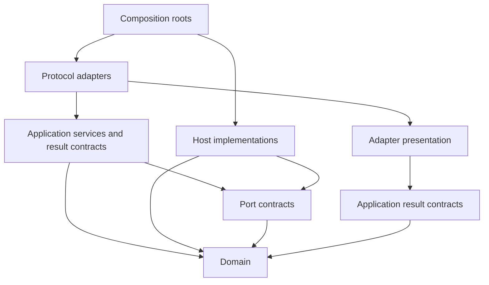

# Shared Adapter Architecture Contract

- Status: Normative 1.0
- Date: 2026-08-05
- Adapter architecture model version: 1
- Workstream: `ADAPTER-001`
- Plan: [../../plans/adapter-platform.pert](../../plans/adapter-platform.pert)
- Requirements: [../requirements.md](../requirements.md)
- Basic design: [../basic-design.md](../basic-design.md)

## 1. Purpose

This specification fixes the shared architecture used by the existing CLI and
the selected read-only LSP, VSIX DAG view, and MCP adapters. It defines stable
dependency directions, logical and physical package boundaries, runtime and
bundling placement, result and capability ownership, compatibility behavior,
and cross-adapter parity evidence before adapter-specific protocols are
implemented.

This contract does not activate a new runtime API, command, result schema,
binary, package export, protocol, extension, or release. Grammar 6, CLI
Contract 7, all current result meanings, the standard package root, governance,
plan assurance, history safety, and safe-write behavior remain unchanged in
this contract task.

## 2. Scope and terms

The following terms are normative.

- **Domain** is deterministic syntax, semantic, graph, analysis,
  recommendation, assurance, governance, mutation-planning, formatting, and
  conversion logic with no ambient I/O.
- **Application** is a protocol-neutral use case that coordinates Domain logic
  through explicit requests and returns stable result contracts.
- **Port contract** is an inward-owned interface for an environmental
  capability such as document bytes, Git evidence, hashing, bundled artifacts,
  or safe persistence.
- **Host** is a runtime implementation of a port contract. The initial host is
  Node.js.
- **Protocol adapter** maps one external protocol to Application requests and
  results. CLI, LSP, and MCP are separate protocol adapters.
- **Presentation** maps an accepted result to text, JSON, editor, or Webview
  data without recalculating Domain meaning.
- **Composition root** constructs Application services, Hosts, and adapter
  mappings. No reusable module imports a composition root.
- **Compatibility facade** is the existing `perttool` package root whose
  accepted names and meanings remain available while internal ownership is
  corrected.

The selected first adapter delivery is read-only. Editor rename, formatting
edits, code actions that return edits, graph-driven edits, MCP preview
mutation, and persistent adapter writes require later contracts and are not
implicitly authorized by this architecture.

## 3. Verified baseline

The contract baseline was captured from the committed `0.7.1` source on
2026-08-05.

| Fact | Verified baseline |
| --- | --- |
| Runtime | Node.js `>=22`, ESM, ES2024 |
| Root distribution | one `perttool` npm package |
| Production dependencies | zero |
| Public root runtime exports | 121 names |
| CLI surface | 44 Contract 7 commands |
| JSON Schema catalog | 20 root schemas |
| TypeScript source | 144 files under `src/` |
| Adapter implementations | CLI only; no LSP, VSIX, or MCP runtime |
| Root package roles | Core, Node I/O, Git/history, schema artifacts, safe write, presentation, and CLI composition are currently mixed |

The machine-readable baseline and acceptance cases are
[`adapter-platform-contract-v1.json`](../../test/fixtures/adapter-platform-contract-v1.json).

### 3.1 Captured reverse-dependency input

The architecture-contract snapshot had twelve lower-layer files containing
nineteen imports from `src/application/`. These imports are retained as exact
historical migration input for `CORE_DEPENDENCY_CLEANUP`; they are not the
target architecture or a continuing allowlist.

| Current owner | Files | Imports into `application/` |
| --- | ---: | ---: |
| `analysis/` | 3 | 5 |
| `assurance/` | 2 | 4 |
| `conversion/` | 2 | 4 |
| `formatter/` | 1 | 1 |
| `io/` | 1 | 1 |
| `mutation/` | 2 | 2 |
| `recommendation/` | 1 | 2 |

The architecture fixture records every exact source and target import. The
accepted cleanup relocates each reusable implementation or inverts its
consumer dependency. It does not hide an import with a broad allowlist,
dynamic import, or a second copy of the same result type.

### 3.2 Accepted cleanup state

After `CORE_DEPENDENCY_CLEANUP`, source outside `src/application/` may import
Application modules only from the two exact composition/facade files
`src/cli.ts` and `src/index.ts`. Every other source file has zero imports into
`src/application/`.

The retained compatibility facades and neutral owners are:

| Compatibility facade | Neutral implementation owner |
| --- | --- |
| `src/application/check.ts` | `src/semantic/check.ts` |
| `src/application/analyze.ts` | `src/analysis/service.ts` |
| `src/application/mutate.ts` | `src/mutation/planner.ts` |
| `src/application/target-mutate.ts` | `src/mutation/target-planner.ts` |
| `src/application/target-temporal-input.ts` | `src/analysis/target-temporal-input.ts` |

Plan-assurance Mermaid projection receives its Application analyzer through
the inward `PlanAssuranceMermaidAnalyzer` function port. Recommendation
override validation owns the narrow `OverrideValidationSource` projection it
consumes. Neither lower module imports Application orchestration.

The executable boundary and compatibility cases are fixed by
[`adapter-core-dependency-cases-v1.json`](../../test/fixtures/adapter-core-dependency-cases-v1.json).

### 3.3 Accepted shared-library state

The additive [`perttool/core` and `perttool/node` boundary](shared-library.md)
is active in the source package. Its initially accepted Core slice has the
closed forty-name baseline catalog for Grammar 6 source operations, graph
analysis, exact arithmetic,
diagnostics, Help, Guide, and deterministic projections. Its complete static
runtime closure contains no `node:` or external import and no Application,
CLI, I/O, history, schema-loader, or adapter module. Pure work-event lifecycle
reduction is separated from the Node-only event-identifier generator so the
active source formatter remains portable.

The Node subpath is key- and reference-identical to all 121 existing package-
root exports. The root remains authoritative, schema artifact loading stays
Node-owned, and `./schemas/*` is unchanged. The exact executable cases are
fixed by
[`adapter-shared-library-cases-v1.json`](../../test/fixtures/adapter-shared-library-cases-v1.json).
No release or Node-port separation is implied by this accepted source
boundary.

### 3.4 Accepted editor-protocol state

The [Editor Protocol Contract](editor-protocol.md) fixes editor protocol model
1 before implementation. It selects stable LSP 3.17 over local stdio, exact
UTF-16 incremental document synchronization, Node.js `>=22`, and VS Code
`^1.101.0`. The capability set is closed to diagnostics, symbols, hover,
completion without supplied edits, definition, read-only Help quick fixes, and
the custom `perttool/graphView` request.

The versioned `Perttool.GraphViewResult.v1` binds exact URI, document
generation, version, and source digest to one of `none`, `precedence`,
`resource`, or `both`. Invalid or unavailable projections contain no graph;
cancelled and stale requests return the stable LSP errors and cannot refresh
the Webview. The VSIX remains an offline Node workspace extension with an
exact bundled server, explicit untrusted and virtual workspace support,
restrictive CSP, closed presentation messages, and an accessible text
outline. No runtime implementation, adapter dependency, editor mutation, or
release is implied by this accepted contract.

### 3.5 Implemented document-session state

The protocol-neutral [Document Session Core](document-session.md) is exposed
only through `perttool/core`. It owns immutable Grammar 6 snapshots bound to
exact URI, open generation, strictly increasing version, synchronized text,
and injected UTF-8 SHA-256 identity. It applies ordered UTF-16 ranged changes
atomically, preserves invalid source as a current diagnostic snapshot, and
terminally desynchronizes after lifecycle, version, range, or digest failure.

The session reuses each snapshot's parse and semantic result for `none`,
`precedence`, `resource`, and `both` analysis. Completed generic and analysis
projections are cached only for the exact immutable snapshot; cancellation,
close, reopen, change, or binding mismatch cannot publish or cache stale work.
Stateless adapters may use the same snapshot and analysis functions without a
connection-owned document map.

This additive slice extends the portable Core from its original forty values
to an exact 45-name, 34-module closure with zero runtime imports outside the
package. The package root and `perttool/node` remain exact 121-name facades.
Hashing is an explicit synchronous inward function port, so this slice neither
imports Node crypto nor activates the broader `NODE_PORT_BOUNDARY`. LSP wire
mapping, GraphView projection, Node composition, CLI migration, MCP transport,
editor writes, and release selection remain later boundaries.

### 3.6 Implemented read-only LSP state

The language server is isolated in the private `adapters/lsp` workspace. It
pins `vscode-languageserver` `9.0.1`, whose protocol dependency is stable LSP
3.17.5, and composes the accepted `perttool/core` document session directly.
The root package retains zero production dependencies, and the private
workspace is excluded from the public `perttool` tarball.

The local-stdio server advertises only UTF-16 incremental synchronization,
diagnostics, document symbols, hover, completion without edits, definition,
and read-only quick fixes. Standard clients may use those features without a
perttool handshake. `perttool/help` and `perttool/graphView` are enabled only
after an exact editor-protocol model 1 handshake. All responses are derived
from the current URI, generation, version, and source digest; cancellation,
stale completion, malformed synchronization, invalid DSL, and close/reopen
cannot publish a stale projection.

`Perttool.GraphViewResult.v1` is projected without Mermaid execution for all
four closed analysis modes. Source ranges remain exact UTF-16 coordinates,
and gates remain zero-duration edges without resource ownership. The server
does not invoke the CLI, read or write files, access Git, listen on a network
socket, edit an editor document, emit telemetry, or select a release. VSIX,
Node-port separation, CLI parity, MCP, and integrated acceptance remain later
tasks.

The independent LSP acceptance gate packs the private server and exact
`perttool` Core as separate artifacts, installs them together in a disposable
prefix, and exercises the complete local-stdio lifecycle. The private package
uses exact `perttool` `0.7.1` peer identity plus the repository-only local
development link; its 25-file artifact contains only `dist/` and its manifest.
This verifies a distributable server input without publishing it or adding it
to the public root tarball. Node.js 22 is exercised directly, while the same
gate remains part of the repository's Node.js 22/24 CI matrix.

The private VS Code shell is implemented in `adapters/vscode` without changing
the public package. It fixes VS Code `^1.101.0`, exact
`vscode-languageclient` `9.0.1`, lazy `.pert` and Help activation,
presentation-only TextMate highlighting, untrusted and virtual workspace
support, a closed version-bound Help bridge, and one exact offline bundled
server. Its disposable VSIX gate packages eleven files and reuses the isolated
server lifecycle smoke under Node.js 22. The DAG Webview and supported-host
acceptance remain later plan tasks.

### 3.7 Accepted Node Host state

The [Node Host and Port Boundary](node-host-boundary.md) adds one type-only,
inward-owned six-port model for exact SHA-256, raw document bytes, bundled
artifact bytes, read-only Git evidence, established safe persistence, and
bounded process context. `createNodeHost()` is the default Node.js composition;
it imports no Application, CLI, LSP, VSIX, or MCP implementation and grants no
semantic, governance, assurance, task-selection, or write authority.

The package root and `perttool/node` add the same factory and remain key- and
reference-identical at 122 runtime names. `perttool/core` remains an exact
45-name, 34-module portable runtime and exposes only the port types. Domain and
Application semantic hashing use the portable SHA-256 owner; direct Node
builtins remain confined to logical and concrete Hosts and composition code.
CLI composition, MCP mapping, VSIX DAG rendering, adapter integration, and
release selection remain later tasks.

### 3.8 Accepted read-only MCP contract

The [Read-Only MCP Contract](mcp-read-contract.md) fixes MCP protocol model 1
to final revision `2026-07-28`, exact stable server SDK `2.0.0`, Node.js
`>=22`, and client-launched local stdio. Discovery lists exactly four immutable
JSON resources and five closed read-only tools for check, analyze, next, Help,
and bundled schema lookup.

Document operations accept exact inline text or an opaque launcher-registered
document ID. Every registered read requires the caller's expected SHA-256;
wire paths, workspace lookup, Git refs, commits, and remote URLs are absent.
The contract owns closed adapter-local result identities, bounded protocol and
source failures, cancellation, complete-result limits, and semantic parity
without invoking the CLI. It activates no server implementation, dependency,
mutation, Git operation, public package, or release.

## 4. Target dependency model

The allowed dependency graph is acyclic.

The import rules are:

| Importing layer | Allowed imported layers |
| --- | --- |
| Domain | Domain |
| Port contract | Domain, port contract |
| Application | Domain, port contract, Application |
| Host | Domain, port contract, same Host |
| Protocol adapter | Application contracts/services, adapter-local protocol and presentation |
| Presentation | stable Application result contracts and adapter-local presentation |
| Composition root | Domain, ports, Application, Hosts, protocol, and presentation |

Additional rules apply.

1. Domain MUST NOT import Application, Host, protocol, presentation, `node:`
   modules, filesystem state, process state, network state, editor APIs, or a
   wall clock.
2. Application MAY depend on an inward-owned port contract, but MUST NOT
   import a concrete Host, CLI command descriptor, LSP type, MCP type, VS Code
   API, or Webview implementation.
3. A Host implements ports and MUST NOT select business actions, reconstruct
   diagnostics, or weaken validation, governance, assurance, history, or
   safe-write decisions.
4. CLI, LSP, and MCP call Application services directly. They MUST NOT invoke
   another perttool adapter as a subprocess or parse another adapter's output.
5. VSIX is an LSP client and presentation host. It MUST NOT parse `.pert`, run
   analysis, or import Domain implementations.
6. The MCP branch MUST NOT depend on LSP or VSIX. The VSIX branch depends on
   the accepted LSP contract and server distribution.
7. Only composition roots may know both a concrete Host and an Application
   service. Reusable modules MUST NOT import a composition root.
8. Adapter dependencies MUST NOT enter the shared Core or CLI dependency
   closure.

## 5. Logical ownership

The existing directory names do not by themselves grant a layer. The
executable boundary manifest classifies modules by the following logical
ownership, and later tasks extend that classification as new ports and
adapters are added.

| Ownership | Responsibilities |
| --- | --- |
| Domain | models, parser, validator, graph, exact arithmetic, analysis, recommendation, assurance evaluation, governance evaluation, source-preserving edit planning |
| Application | check, analyze, next, project, mutation preview, history reduction, observation, help and schema queries, protocol-neutral result contracts |
| Port contracts | document-byte source, artifact source, Git evidence, digest service, safe persistence, cancellation signal |
| Node Host | filesystem bytes, symlink and race checks, Git subprocess, cryptographic hashing, bundled schema resolution, atomic persistence |
| CLI adapter | command registry, operand and option validation, exit status, text/JSON selection, terminal concerns |
| LSP adapter | transport lifecycle, document synchronization, UTF-16 protocol mapping, read-only capability mapping |
| MCP adapter | transport lifecycle, closed read-only resource/tool mapping, bounded protocol errors |
| VSIX presentation | extension activation, LSP client, TextMate grammar, Webview bridge, CSP, accessibility, source navigation |

Types used by more than one layer move to their narrowest neutral owner. A
type is not copied merely to avoid an import. Target-prefixed compatibility
types may remain internal until their accepted public cutover, but their
semantic owner MUST still be unique.

## 6. Physical distribution boundaries

The repository remains one source repository, but adapter protocol
dependencies are physically isolated from the established package.

| Distribution unit | Placement and dependency rule |
| --- | --- |
| `perttool` | Existing npm package. Retains the CLI binary, the `.` compatibility facade, and `./schemas/*`; the accepted source package adds `./core` and `./node` subpath boundaries without removing or changing existing root names. |
| Language server | Private `adapters/lsp` workspace. Depends on the accepted Core document session, owns exact `vscode-languageserver` `9.0.1`, uses local stdio, and is excluded from the public `perttool` tarball. |
| VS Code extension | Separate private VSIX workspace. Bundles or resolves the exact accepted language-server artifact; owns VS Code and Webview dependencies. |
| MCP server | Separate private workspace/distribution input. Depends on accepted `perttool` Core and Node subpaths, owns MCP dependencies, and has no LSP or VSIX dependency. |

The workspace package names, registry publication names, release versions,
and public dist-tags are release decisions and are not selected here. A local
private workspace identity MUST NOT be presented as an available public
package.

The root `perttool` compatibility facade remains authoritative for its current
122 runtime export names. The accepted Node Host slice added only
`createNodeHost`; removal, rename, narrowed types, changed meaning, or a changed
CLI result remains a separately reviewed compatibility decision. The verified
121-name state remains the historical architecture and shared-library
baseline.

## 7. Runtime and bundling placement

1. Shared Core code is ESM/ES2024 and MUST be loadable without importing a
   `node:` module or starting a process.
2. The Node Host, CLI, language server, and MCP server use the accepted Node.js
   `>=22` baseline. Raising that baseline requires a later ADR.
3. LSP starts with local stdio transport. MCP starts with the locally selected
   read-only transport fixed by its protocol contract. Network listeners are
   not implied by package installation.
4. The VSIX contains the exact server artifact needed for offline operation or
   uses an explicitly configured local artifact. It MUST NOT download code at
   activation time.
5. Webview code runs in the VS Code Webview sandbox with a restrictive CSP and
   without Node integration. It receives only the versioned graph-view wire
   result and navigation messages.
6. Adapter SDKs and transport libraries, if accepted later, stay in their
   adapter workspace and are subject to the repository dependency policy.
7. Building, linking, packing, installing, or testing an adapter does not
   publish a package, create a Git tag, update a dist-tag, or install globally.

## 8. Result and diagnostic ownership

Application owns the semantic request and result. TypeScript uses repository
camelCase conventions; an adapter maps to its versioned wire spelling.

- CLI Contract 7 JSON and its 20 schemas remain unchanged and continue to be
  projected by the CLI compatibility facade.
- LSP and MCP wire types are adapter contracts. They MUST NOT be added to the
  CLI schema catalog or treated as CLI result aliases.
- The editor DAG view consumes a later versioned `GraphViewResult`; it MUST
  not consume arbitrary Mermaid text, recalculate a schedule, or infer a
  current result from a stale document version.
- Stable Domain diagnostic codes, severity, and UTF-16 source spans are owned
  once. Protocol adapters may add transport context but MUST NOT reinterpret a
  Domain error as success or discard truncation state.
- Text renderers, JSON mappers, LSP mappers, MCP mappers, and Webview models
  are presentation. They do not own semantic defaults or ordering.
- A result with an unknown identity, incomplete trace, unavailable source
  binding, or stale document version fails closed at the consuming adapter.

## 9. Capability discovery

Application exposes a closed, deterministic capability catalog independent of
CLI spelling. Each record owns one stable operation identity, mutability class,
required input kind, result owner, availability state, and deterministic
ordering key.

Adapters maintain explicit mappings from their public capabilities to catalog
operations.

- CLI retains the complete 44-command registry and maps commands to accepted
  Application operations.
- LSP advertises only implemented read-only protocol capabilities.
- VSIX enables commands and views only after the accepted LSP initialization
  and version handshake.
- MCP lists only its accepted read-only resources and tools.
- Unsupported, unavailable, unknown-version, or write-capable mappings are
  absent or rejected explicitly; they are never inferred from installed files,
  connection state, owner metadata, or another adapter's capabilities.

Connection or initialization success is not task-selection authority,
governance authority, owner confirmation, or write permission.

## 10. Cross-adapter parity

Parity is semantic, not byte equality between unrelated protocols. A parity
fixture fixes:

- exact source bytes and source digest;
- explicit options, reference time, diagnostic limit, and analysis mode;
- Application operation and result identity;
- stable semantic fields and deterministic entity ordering;
- adapter-specific fields excluded from comparison; and
- expected invalid, unavailable, stale, cancelled, and truncated outcomes.

For the same fixture, each adapter projection MUST be traceable to the same
Application result. CLI JSON, LSP, MCP, and GraphView mappings compare a
versioned semantic projection after removing only documented protocol
envelopes. Presentation-specific labels, request IDs, transport errors, and
editor version fields are not silently compared as Domain meaning.

Repeated execution with the same source, options, versions, and injected Host
evidence returns the same semantic projection. A protocol adapter MUST NOT
repair an invalid document, calculate PERT values independently, or obtain
parity by invoking the CLI.

## 11. Safety and compatibility invariants

- All first-delivery LSP, VSIX, DAG-view, and MCP capabilities are read-only.
- CLI mutation behavior remains preview-first and retains all existing
  governance, assurance, expected-digest, symlink, race, atomic-write, and
  post-write validation controls.
- No adapter infers authority from Git branch, Git identity, process user,
  editor trust, client identity, transport identity, or connection state.
- No adapter fetches remote source, executes workspace code, mutates Git,
  changes project configuration, emits telemetry, or writes a `.pert` file in
  the selected read-only workstream.
- Adapter failure cannot weaken or replace a stable Domain diagnostic.
- The CLI does not gain an LSP, VSIX, or MCP startup dependency.

## 12. Normative architecture cases

| Case | Boundary | Required result |
| --- | --- | --- |
| `ADP-001` | Baseline closure | 121 root exports, 44 commands, 20 schemas, and zero production dependencies remain identified |
| `ADP-002` | Layer direction | The accepted import graph is acyclic and inner layers do not import outer layers |
| `ADP-003` | Legacy exceptions | The exact nineteen reverse imports are measured migration input and no broad exemption is accepted |
| `ADP-004` | Shared distribution | `perttool` retains its root facade and later adds isolated Core and Node subpaths |
| `ADP-005` | CLI composition | CLI uses Application and Node Hosts directly without an adapter server |
| `ADP-006` | LSP composition | LSP uses the shared document/Application boundary and returns no mutation edits |
| `ADP-007` | VSIX composition | VSIX is an LSP client and does not implement `.pert` semantics |
| `ADP-008` | DAG view | Webview renders only a current validated `GraphViewResult` and fails closed for stale or invalid input |
| `ADP-009` | MCP composition | MCP is independent of editor adapters, read-only, and does not invoke CLI |
| `ADP-010` | Capabilities | Every exposed capability has one explicit neutral operation mapping and mutability class |
| `ADP-011` | Result parity | Protocol projections trace to one Application result under a fixed semantic comparison |
| `ADP-012` | Distribution safety | Isolated adapter build/test has no publication, network, Git, project-write, or global-install side effect |

The fixture preserves this exact dependency-ordered sequence. Later
adapter-specific contracts refine protocol cases without weakening these
architecture cases.

## 13. Acceptance boundary

This contract is accepted when:

1. requirements, this specification, Basic Design, backlog, and the
   `adapter-platform.pert` task agree;
2. the current package/export/command/schema/source baseline and all nineteen
   reverse imports are reproducible;
3. all twelve architecture cases are complete and dependency ordered;
4. the physical distribution and runtime placement do not leak adapter
   dependencies into `perttool` Core or CLI;
5. the compatibility facade and result/capability ownership are unambiguous;
6. repository documentation, English-baseline, plan check/analyze/next, and
   focused contract tests pass; and
7. no source runtime, package manifest, lockfile, schema, CLI output, adapter
   implementation, release, remote, Issue, or plan-advance side effect is
   included.

Implementation begins with `CORE_DEPENDENCY_CLEANUP`. LSP, VSIX/DAG, and MCP
protocol details remain owned by their later contract tasks.
