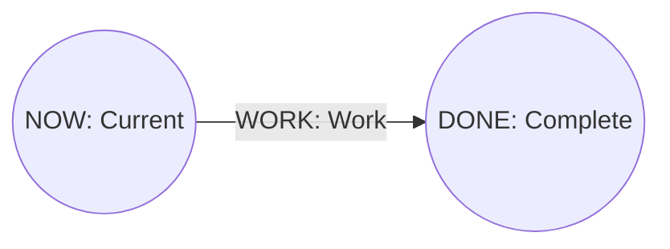

# perttool Mermaid Profile Specification

- Document status: Draft 1.0
- Profile schema: `Perttool.MermaidProfile.v1`
- Projection schema: `Perttool.MermaidProjection.v1`
- Created: 2026-07-22
- Related requirements: [../requirements.md](../requirements.md)
- DSL grammar: [dsl-grammar.md](dsl-grammar.md)
- Graph semantics: [graph-semantics.md](graph-semantics.md)
- Analysis: [analysis.md](analysis.md)
- CLI interface: [interfaces.md](interfaces.md)
- Related basic design: [../basic-design.md](../basic-design.md)
- Normative example: [../examples/mermaid-profile.md](../examples/mermaid-profile.md)

## 1. Purpose

This document defines the `%% perttool:` metadata wire contract for restoring Mermaid flowcharts generated by `perttool` to the DSL without semantic loss.

This profile separates responsibilities.

- Store the normalized semantic model of `.pert` completely in `%% perttool:` semantic records
- Treat Mermaid nodes and edges as projections for human review, not as the authority for DSL restoration
- Restore semantic records only after profile import validates the integrity of metadata and projection
- Treat ordinary Mermaid without a profile as a separate best-effort import that requires a loss report

Mermaid is not the authority for the DSL. A Profile is a visualization artifact suitable for Git management, review, and transfer to external renderers.

## 2. Normative terms and scope

`MUST`, `MUST NOT`, and `SHOULD` in this document express normative requirements.

### 2.1 Definition of lossless

For Profile v1, lossless means **normalized semantic-model equivalence** for grammar version 1. All of the following MUST be restored with the same values.

- The project ID and every field
- The ID and every field of every resource
- The ID and every field of every milestone
- The ID, endpoints, estimation method, and every field of every task
- The ID, endpoints, and reason of every gate
- Finite decimal values and units for duration, PERT three-point estimates, and velocity
- Status, state, priority, resource requirements, owner, tags, and source

The following are outside the Profile v1 lossless scope because the [DSL grammar specification](dsl-grammar.md) defines them as outside the semantic model.

- Comments, blank lines, and source positions of fields and declarations
- Representation differences between strings and block text
- Leading and trailing zeroes in decimals
- BOM, line endings, final newline, and indentation
- Field order and declaration order

The DSL after import uses the representation of the canonical serializer. Equality with the original byte sequence is not called lossless.

### 2.2 Non-goals

Profile v1 does not aim to:

- Interpret arbitrary Mermaid flowchart syntax losslessly
- Use Mermaid as a trust boundary or signature format
- Preserve source comments or formatting through Mermaid
- Incorporate Mermaid layout or coordinates into project semantics
- Convert shared resources into precedence edges

## 3. Artifact structure

Profile v1 artifacts MUST use UTF-8 without BOM, LF line endings, and a final newline, in the following order.

1. `flowchart LR`
2. Exactly one `profile` header
3. A semantic-record block
4. `projection-begin` marker
5. Mermaid projection statement block
6. `projection-end` marker

Outline:



Each `%%` comment occupies one physical line, and JSON MUST NOT be split across multiple lines. A metadata line is emitted as exactly two ASCII spaces, `%% perttool:`, a record kind, one ASCII space, and compact JSON, in that order.

Profile v1 artifacts MUST NOT contain front matter, init directives, `click`, links, raw HTML, JavaScript callbacks, or Mermaid statements outside projection markers. The exporter does not rely on Mermaid security settings and does not generate executable directives.

## 4. Profile detection and no downgrade

The importer treats the document as profile mode when its first nonempty line is `flowchart LR` and its immediately following nonempty line is `%% perttool:profile `.

- Proceed to plain best-effort import only when a profile header is absent
- Treat schema mismatch, invalid JSON, missing records, digest mismatch, or projection mismatch after detecting a profile header as a profile error
- MUST NOT silently downgrade a broken profile to plain import
- The presence or absence of `--strict-loss` MUST NOT turn profile corruption into success

This boundary prevents accidentally treating partial metadata deletion as ordinary Mermaid and filling it with defaults.

## 5. Canonical JSON form

Header and record payloads are RFC 8259 JSON objects and use the following canonical form.

- UTF-8 without BOM
- Object keys in the order of the tables in this document
- No insignificant whitespace
- Strings use JSON escaping and MUST NOT undergo Unicode normalization
- Integers are JSON numbers; duration and velocity containing finite decimal values are JSON strings containing canonical tokens
- Optional values use `null` without omitting keys that this document defines as nullable
- A v1 reader rejects unknown keys, unknown record kinds, and duplicate keys
- JSON numbers allow integers only, and reject negative values, fractions, exponents, and unsafe integers

A Canonical Decimal has no leading zeroes or trailing fractional zeroes. The value zero is `0`. Duration and Velocity append the grammar suffix to this Decimal. Implementations MUST NOT canonicalize by converting to binary floating point.

## 6. Profile header

The header kind is `profile`; its payload key order and types are as follows.

| Key | Type | Value |
| --- | --- | --- |
| `schema_version` | string | exact `Perttool.MermaidProfile.v1` |
| `profile` | string | exact `perttool` |
| `source_fidelity` | string | exact `semantic-v1` |
| `record_count` | integer | number of semantic records after the header |
| `metadata_digest` | string | `sha256:` + lowercase hex |
| `projection_digest` | string | `sha256:` + lowercase hex |
| `projection` | object | projection option snapshot |

The key order and types for `projection` are:

| Key | Type | Value |
| --- | --- | --- |
| `schema_version` | string | exact `Perttool.MermaidProjection.v1` |
| `direction` | string | exact `LR` in v1 |
| `analysis` | string | `none`, `precedence`, `resource`, or `both` |
| `capacity_overrides` | array | `{resource_id, capacity}` in ascending resource-ID order |

A capacity-override record orders keys as `resource_id`, then `capacity`. Overrides are analysis conditions used to create the projection and do not rewrite the semantic project record.

## 7. Common semantic-record rules

Record kinds and their order are as follows.

1. exactly one `project`
2. Zero or more `resource` records in ascending ID order
3. Zero or more `milestone` records in ascending ID order
4. Zero or more `task` records in ascending ID order
5. Zero or more `gate` records in ascending ID order

Ascending ID order is lexicographic order over Unicode code-point sequences. Grammar v1 IDs are ASCII, so locale comparison is unnecessary.

Records contain complete semantic values after defaults are applied. They do not preserve field presence or source representation. Every record ID MUST be unique across the document, and endpoints and resource references are revalidated by the normal semantic validator after metadata decoding.

### 7.1 Project record

The kind is `project`; payload key order and types are:

| Key | Type | Note |
| --- | --- | --- |
| `id` | string | project ID |
| `version` | integer | 1 in v1 |
| `title` | string | decoded nonempty text |
| `description` | string/null | decoded text |
| `as_of` | string/null | date/date-time token accepted by the grammar |
| `duration_unit` | string | `day`, `hour`, or `point` |
| `velocity` | string/null | canonical Velocity token |
| `finish` | string | milestone ID |
| `critical_epsilon` | string | canonical Duration after default application |
| `target_duration` | string/null | canonical Duration |

### 7.2 Resource record

The kind is `resource`; payload key order and types are:

| Key | Type |
| --- | --- |
| `id` | string |
| `title` | string |
| `description` | string/null |
| `capacity` | integer |
| `tags` | string[] |

`tags` preserve decoded values in source-list order.

### 7.3 Milestone record

The kind is `milestone`; payload key order and types are:

| Key | Type |
| --- | --- |
| `id` | string |
| `title` | string |
| `description` | string/null |
| `state` | `planned` or `reached` |
| `tags` | string[] |

### 7.4 Task record

The kind is `task`; payload key order and types are:

| Key | Type |
| --- | --- |
| `id` | string |
| `from` | string milestone ID |
| `to` | string milestone ID |
| `title` | string |
| `description` | string/null |
| `estimate` | estimate object |
| `status` | `planned`, `active`, `blocked`, or `done` |
| `priority` | integer |
| `requires` | requirement[] |
| `owner` | string/null |
| `tags` | string[] |
| `blocked_reason` | string/null |
| `source` | string/null |

Key order for a deterministic estimate:

```json
{"kind":"deterministic","duration":"2d"}
```

Key order for a PERT estimate:

```json
{"kind":"pert","optimistic":"1d","most_likely":"2d","pessimistic":"4d"}
```

Key order for a requirement:

```json
{"resource_id":"DEVELOPERS","units":1}
```

`requires` are in ascending resource-ID order, and `tags` preserve decoded values in source-list order. Do not mix derived analysis values such as expected duration or float into task records.

### 7.5 Gate record

The kind is `gate`; payload key order and types are:

| Key | Type |
| --- | --- |
| `id` | string |
| `from` | string milestone ID |
| `to` | string milestone ID |
| `reason` | string |

MUST NOT add duration or resource requirements to a gate.

## 8. Digest contract

A digest is an integrity check that detects accidental truncation, reordering, and manual edits; it does not provide a signature or authenticity.

### 8.1 Metadata digest

Create the following record body from each semantic record.

```text
<kind><SP><canonical-json><LF>
```

Concatenate every record body other than the header in artifact order as a UTF-8 byte sequence and calculate SHA-256. `metadata_digest` is `sha256:` concatenated with the lowercase hexadecimal digest. Do not include the two-space physical-line indentation or the `%% perttool:` prefix in the digest.

### 8.2 Projection digest

Concatenate the physical lines from immediately after `projection-begin` to immediately before `projection-end`, exactly as UTF-8 byte sequences in the artifact including indentation and LF, and calculate SHA-256. Do not include the marker lines themselves.

An empty projection is not permitted. Even when digests match, the importer verifies that the expected milestone-ID set, task/gate-ID set, endpoints, and edge kinds from metadata appear exactly once in the projection.

## 9. Mermaid projection v1

The projection uses a restricted subset of `flowchart LR`.

### 9.1 Stable IDs

A milestone Mermaid node ID is `ptm_` + the DSL milestone ID. The prefix separates the DSL ID from Mermaid reserved words and interpretation of initial characters, and permits unique restoration of the original ID.

Emit task/gate IDs as exact IDs at the beginning of edge labels. Emit edges in ascending task-ID order followed by ascending gate-ID order, and permit parallel edges.

### 9.2 Base statements

Milestone:

```text
  ptm_<ID>(("<ID>: <escaped title>"))
```

Task:

```text
  ptm_<FROM> -->|"<ID>: <escaped title><optional annotations>"| ptm_<TO>
```

Gate:

```text
  ptm_<FROM> -.->|"<ID>: gate"| ptm_<TO>
```

Emit nodes in ascending milestone-ID order. Task-label annotations use the following order and concatenate only present values with ` / `.

1. Status `active|blocked|done` (omit `planned`)
2. `owner=<owner>`
3. `E=<expected><unit>`
4. `TF=<total float><unit>`
5. `CP` for precedence critical
6. `S=<start>-<finish><unit>` for the resource schedule
7. `SCP` for schedule critical

Emit `E` and `TF` with `analysis=precedence|resource|both`, `CP` with `precedence|both`, and `S` and `SCP` with `resource|both`. Rational display precision is 3 in v1. Do not incorporate analysis values into semantic records. The importer does not infer DSL fields from annotations or styles.

### 9.3 Label escaping

Labels use double-quoted form and preserve decoded titles without Unicode normalization. Replace the following Unicode scalars with `#<decimal code point>;`.

- `"`, `#`, `&`, `;`, `<`, `>`, `\\`, `|`, and `` ` ``
- U+0000..U+001F and U+007F

Emit all other scalars directly in UTF-8. Do not emit descriptions containing CR/LF in labels; retain them only in metadata. A title cannot contain a literal newline under the DSL grammar.

### 9.4 State and analysis

Fix milestone state and task status/critical determinations with the following style statements. The shared Core `Document`/`AnalysisResult` is the source of displayed values; the Mermaid adapter MUST NOT recalculate them.

```text
  classDef pt_milestone_planned fill:#ffffff,stroke:#566573,stroke-width:1px;
  classDef pt_milestone_reached fill:#d5f5e3,stroke:#1e8449,stroke-width:2px;
  class ptm_<ID>,... pt_milestone_planned;
  class ptm_<ID>,... pt_milestone_reached;
  linkStyle <index> <task-or-gate-style>;
```

Milestone classes are in `planned`, then `reached` order, and do not emit `class` for an empty set. Task styles are blue for active, yellow dashed for blocked, gray for done, red for planned critical, and dark gray otherwise. Gates are gray dashed. Make each `linkStyle` index correspond to edge-statement order: ascending task ID followed by ascending gate ID. Status styles take precedence over critical styles, while retaining `CP`/`SCP` annotations.

Analysis annotations are projections and do not change the DSL after import. Capacity overrides for `analysis=resource|both` are also retained only as header option snapshots and do not change resource-capacity records.

Represent shared resources through edge annotations or a separate resource view, and MUST NOT generate them as precedence edges between milestones or tasks.

## 10. Import validation

The profile importer validates in the following fail-closed order.

1. UTF-8, BOM, LF, and artifact structure
2. Header JSON, schema, known keys, and options
3. Record count, kind order, ID order, and canonical JSON
4. Metadata digest
5. Record field types, values after default application, and references
6. Projection markers and projection digest
7. Node/edge identity, endpoints, and task/gate kinds in the projection
8. Graph construction and normal semantic validation
9. Canonical DSL serialization and reparsing/revalidation

On any failure, return no candidate DSL and return a document/conversion error with `lossless=false`. The importer does not fill missing metadata from visual labels.

For a valid profile, `ImportResult.loss_report` has `lossless=true`, `records=[]`, and `generated_ids=[]`. Do not return source trivia being out of scope as a loss record each time.

## 11. Boundary with plain Mermaid

A `flowchart` without a Profile header is a plain best-effort import candidate. Plain mode does not assume profile metadata and lists at least the following in its loss report.

- Defaulted or missing project fields
- Generated node/edge IDs
- Unavailable task/gate kinds
- Missing duration, estimate, status, priority, owner, tags, and source
- Missing resources, capacity, and requirements
- Unsupported Mermaid statements

Every value inferred in plain mode has a stable code, target element, and `lossy=true`. With `--strict-loss`, do not return a candidate if even one lossy record exists. The import implementation slice fixes the detailed supported plain-mode subset together with fixtures.

### 11.1 Plain import v1 subset

The import implementation slice fixes plain-mode support to the following.

- The first statement is `flowchart LR`
- A milestone node is `<source-id>(("<label>"))`
- An edge is `<source-id> -->|"<label>"| <target-id>` or `<source-id> -.->|"<label>"| <target-id>`
- Ignore `classDef`, `class`, and `linkStyle` as display information in generated projections
- Decode `#<decimal code point>;` in labels, but do not restore DSL IDs, task/gate kinds, status, duration, or similar values from labels as authority
- Ignore other non-executable statements while recording `PTCNV-205`
- Reject front matter, init directives, `click`, links/callbacks, and raw HTML with `PTCNV-102` and no candidate

Assign milestones sequential IDs beginning with `MILESTONE_001` in Unicode code-point order of source node IDs, and assign tasks sequential IDs beginning with `TASK_001` in physical source-edge order. Return mappings in `generated_ids` and `PTCNV-201`. Because all edge kinds are unknown, convert every edge, whether solid or dotted, to a task with duration `1d`, and return `PTCNV-203` and `PTCNV-204` for unavailable fields. Set root milestones to `reached` and the single sink as the project finish. With multiple sinks, add `MERMAID_FINISH` and zero-duration synthetic gates in ID order, and record their generation in the loss report.

The project uses ID `IMPORTED_MERMAID`, version 1, title `Imported Mermaid`, and duration unit `day`, and records defaulted or unavailable fields in `PTCNV-202`. Do not restore resources, capacity, requirements, or task status/priority/owner/tags/source; record them in `PTCNV-204`. Pass the generated candidate through the normal semantic validator, and return no candidate with `PTCNV-106` if it cannot form a valid AoA DAG because of a cycle or similar issue. The same plain input MUST return the same DSL byte sequence, loss order, and generated-ID mapping.

## 12. Stable diagnostic/loss codes

Profile validation errors:

| Code | Meaning |
| --- | --- |
| `PTCNV-101` | profile schema/version unsupported |
| `PTCNV-102` | profile/header/record structure invalid |
| `PTCNV-103` | metadata record count/order/canonical form invalid |
| `PTCNV-104` | metadata digest mismatch |
| `PTCNV-105` | projection digest or structural projection mismatch |
| `PTCNV-106` | decoded model failed semantic validation |

Plain import losses:

| Code | Meaning |
| --- | --- |
| `PTCNV-201` | generated stable ID |
| `PTCNV-202` | project field defaulted or unavailable |
| `PTCNV-203` | task/gate kind unavailable |
| `PTCNV-204` | DSL field unavailable in Mermaid |
| `PTCNV-205` | unsupported Mermaid statement ignored |

Export losses:

| Code | Meaning |
| --- | --- |
| `PTCNV-206` | plain profile export omitted lossless semantic metadata |

A code's `message` is for human explanation; consumers use the code for branching. Do not reuse the meaning of an existing code for a new case.

## 13. Security and limits

- Do not execute, render, or open Mermaid input in a browser; parse it as text
- Reject a profile containing front matter, init directives, click/link, raw HTML, or callbacks
- Do not treat JSON-object prototype keys as domain fields
- Reject duplicate JSON keys
- Apply the CLI's common input-size, diagnostic-count, and path-safety limits
- Do not represent a matching digest as author authenticity, tamper resistance, or a signature
- If SVG/HTML generation is added, make Mermaid strict security settings a minimum condition and define a separate sanitization boundary

## 14. Determinism

The same normalized semantic model, analysis options, capacity overrides, and profile/projection schema versions generate the same artifact byte for byte.

- Use this document's stable order for entities, requirements, and capacity overrides
- Do not use locale-dependent comparisons
- Do not convert exact Rational values to binary floating point
- Do not include wall-clock time, absolute paths, hostnames, random IDs, or tool-invocation paths in artifacts
- Do not use package versions for profile-compatibility decisions or include them in headers

## 15. Acceptance criteria

The implementation slice fixes at least the following in fixtures/goldens.

1. Generate every record from DSL containing every declaration, field, and default
2. Distinguish deterministic and PERT estimates and preserve exact decimal tokens
3. Keep metadata-record order, canonical JSON, and both digests stable byte for byte
4. Escape titles containing Japanese, quotes, hashes, ampersands, pipes, and backslashes
5. Restore parallel tasks/gates, forward references, and resource requirements
6. Make `DSL -> Mermaid -> DSL` normalized-semantic-model equivalent
7. Verify `lossless=true` and no loss records for valid profiles
8. Reject record deletion, reordering, JSON changes, and projection changes with their respective stable codes
9. Do not downgrade corrupted profiles to plain mode
10. List unavailable fields and generated IDs from plain Mermaid in the loss report
11. Reject candidates/writes for lossy plain import with `--strict-loss`
12. Reject executable directives, raw HTML, unknown keys, and duplicate keys
13. Return the same artifact/result from the Core result, CLI text/JSON, and package entrypoint

Macro `MERMAID_EXPORT` is complete when it satisfies items 1 through 5, the export portion of 13, `PTCNV-206` for plain export, `--strict-loss`, and exclusive `--out`. Import/round-trip in items 6 through 12 are completion criteria for subsequent `MERMAID_ROUNDTRIP`.

`MERMAID_PROFILE` is design-complete when this contract and the normative example are mutually consistent. It does not mean that the exporter, importer, or SVG/HTML renderer is implemented.

## 16. External compatibility baseline

Profile v1 comments, quoted labels, and entity codes rely on the public syntax in [Mermaid Flowchart Syntax](https://mermaid.js.org/syntax/flowchart). The policy not to generate HTML/links/callbacks aligns with the default Mermaid `strict` security level described by [Mermaid Configuration Schema](https://mermaid.js.org/config/schema-docs/config.html). However, the profile importer does not rely on renderer security settings and performs the Section 13 text validation itself.
