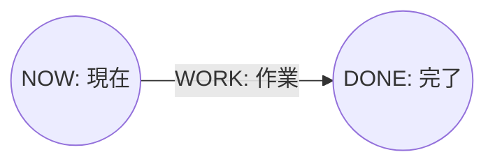

# perttool Mermaid Profile仕様

- 文書状態: Draft 1.0
- Profile schema: `Perttool.MermaidProfile.v1`
- Projection schema: `Perttool.MermaidProjection.v1`
- 作成日: 2026-07-22
- 対応要件: [../requirements.md](../requirements.md)
- DSL grammar: [dsl-grammar.md](dsl-grammar.md)
- Graph semantics: [graph-semantics.md](graph-semantics.md)
- Analysis: [analysis.md](analysis.md)
- CLI interface: [interfaces.md](interfaces.md)
- 対応基本設計: [../basic-design.md](../basic-design.md)
- 規範例: [../examples/mermaid-profile.md](../examples/mermaid-profile.md)

## 1. 目的

本書は、`perttool`が生成するMermaid flowchartをDSLへ意味損失なく戻すための`%% perttool:` metadata wire contractを定義する。

このprofileでは役割を分離する。

- `.pert`の正規化意味モデルは`%% perttool:` semantic recordへ完全に格納する
- Mermaid node/edgeは人間がレビューするprojectionであり、DSL復元の正本にはしない
- profile importはmetadataとprojectionの完全性を検査してからsemantic recordを復元する
- profileを持たない一般Mermaidは別のbest-effort importとして扱い、loss reportを必須とする

MermaidはDSLの正本ではない。Profileは、Git管理、レビュー、外部rendererへの受け渡しに使える可視化artifactである。

## 2. 規範用語と適用範囲

本書の`MUST`、`MUST NOT`、`SHOULD`は規範要件を表す。

### 2.1 losslessの定義

Profile v1のlosslessは、grammar version 1の**正規化意味モデル同値**を表す。次をすべて同じ値で復元できなければならない。

- project IDと全field
- 全resourceのIDと全field
- 全milestoneのIDと全field
- 全taskのID、endpoint、見積り方式、全field
- 全gateのID、endpoint、reason
- duration、PERT三点見積り、velocityの有限10進値と単位
- status、state、priority、resource requirement、owner、tag、source

次は[DSL文法仕様](dsl-grammar.md)で意味モデル外と定義されるため、Profile v1のlossless対象外である。

- comment、blank line、field/declarationのsource位置
- Stringとblock textの表記差
- Decimalのleading/trailing zero
- BOM、line ending、末尾newline、indentation
- field orderとdeclaration order

Import後のDSLはcanonical serializerの表記となる。元byte列との一致をlosslessと呼ばない。

### 2.2 非目標

Profile v1は次を目的にしない。

- 任意のMermaid flowchart構文をlosslessに解釈すること
- Mermaidを信頼境界や署名形式として使うこと
- source commentやformatをMermaid経由で保存すること
- Mermaid layoutや座標をproject semanticsへ取り込むこと
- resource共有をprecedence edgeへ変換すること

## 3. Artifact構造

Profile v1 artifactはUTF-8、BOMなし、LF line ending、末尾newlineありとし、次の順序をMUSTとする。

1. `flowchart LR`
2. exactly oneの`profile` header
3. semantic record block
4. `projection-begin` marker
5. Mermaid projection statement block
6. `projection-end` marker

概形:



`%%` commentは物理行単位とし、JSONを複数行へ分割してはならない。Metadata lineはexactly two ASCII spaces、`%% perttool:`、record kind、one ASCII space、compact JSONの順で出力する。

Profile v1 artifactはfront matter、init directive、`click`、link、raw HTML、JavaScript callback、projection marker外のMermaid statementを含めてはならない。ExporterはMermaidのsecurity settingに依存せず、実行可能directiveを生成しない。

## 4. Profile検出と降格禁止

Importerは最初の非空行が`flowchart LR`で、その直後の非空行が`%% perttool:profile `ならprofile modeとして扱う。

- profile headerがない場合だけplain best-effort importへ進める
- profile headerを検出した後のschema不一致、JSON不正、record欠落、digest不一致、projection不一致はprofile errorとする
- 壊れたprofileをplain importへ黙って降格してはならない
- `--strict-loss`の有無はprofile破損を成功へ変えてはならない

この境界により、metadataの一部削除を「一般Mermaidだった」と誤認して既定値で補完する事故を防ぐ。

## 5. JSON canonical form

Headerとrecord payloadはRFC 8259 JSON objectとし、次のcanonical formを使う。

- UTF-8、BOMなし
- object keyは本書のtable順
- insignificant whitespaceなし
- StringはJSON escapeを使用し、Unicode normalizationを行わない
- integerはJSON number、有限10進値を含むduration/velocityはcanonical tokenのJSON string
- optional valueは本書でnullableとしたkeyを省略せず`null`で表す
- unknown key、unknown record kind、duplicate keyをv1 readerは拒否する
- JSON numberはintegerだけを許可し、negative、fraction、exponent、unsafe integerを拒否する

Canonical Decimalはleading zeroを除き、小数点以下のtrailing zeroを除く。値0は`0`とする。DurationとVelocityはこのDecimalにgrammarのsuffixを付ける。Binary floating pointへ変換してcanonicalizeしてはならない。

## 6. Profile header

Header kindは`profile`、payload key順と型は次のとおりである。

| Key | Type | Value |
| --- | --- | --- |
| `schema_version` | string | exact `Perttool.MermaidProfile.v1` |
| `profile` | string | exact `perttool` |
| `source_fidelity` | string | exact `semantic-v1` |
| `record_count` | integer | header後のsemantic record数 |
| `metadata_digest` | string | `sha256:` + lowercase hex |
| `projection_digest` | string | `sha256:` + lowercase hex |
| `projection` | object | projection option snapshot |

`projection`のkey順と型:

| Key | Type | Value |
| --- | --- | --- |
| `schema_version` | string | exact `Perttool.MermaidProjection.v1` |
| `direction` | string | v1ではexact `LR` |
| `analysis` | string | `none`、`precedence`、`resource`、`both` |
| `capacity_overrides` | array | `{resource_id, capacity}`をresource ID昇順 |

Capacity override recordは`resource_id`、`capacity`のkey順とする。Overrideはprojectionを作った解析条件であり、semantic project recordを書き換えない。

## 7. Semantic record共通規則

Record kindと順序は次のとおりである。

1. exactly one `project`
2. zero以上の`resource`をID昇順
3. zero以上の`milestone`をID昇順
4. zero以上の`task`をID昇順
5. zero以上の`gate`をID昇順

ID昇順はUnicode code point列のlexicographic orderとする。Grammar v1のIDはASCIIなのでlocale比較を使用する必要はない。

Recordはdefault適用後の完全な意味値を持つ。Field presenceやsource表記は保存しない。全record IDは文書全体で一意でなければならず、endpointとresource referenceはmetadata decode後に通常のsemantic validatorで再検査する。

### 7.1 project record

Kindは`project`、payload key順と型:

| Key | Type | Note |
| --- | --- | --- |
| `id` | string | project ID |
| `version` | integer | v1では1 |
| `title` | string | decoded nonempty text |
| `description` | string/null | decoded text |
| `as_of` | string/null | grammarで受理したdate/date-time token |
| `duration_unit` | string | `day`、`hour`、`point` |
| `velocity` | string/null | canonical Velocity token |
| `finish` | string | milestone ID |
| `critical_epsilon` | string | default適用済みcanonical Duration |
| `target_duration` | string/null | canonical Duration |

### 7.2 resource record

Kindは`resource`、payload key順と型:

| Key | Type |
| --- | --- |
| `id` | string |
| `title` | string |
| `description` | string/null |
| `capacity` | integer |
| `tags` | string[] |

`tags`はdecoded valueをsource list順で保持する。

### 7.3 milestone record

Kindは`milestone`、payload key順と型:

| Key | Type |
| --- | --- |
| `id` | string |
| `title` | string |
| `description` | string/null |
| `state` | `planned` or `reached` |
| `tags` | string[] |

### 7.4 task record

Kindは`task`、payload key順と型:

| Key | Type |
| --- | --- |
| `id` | string |
| `from` | string milestone ID |
| `to` | string milestone ID |
| `title` | string |
| `description` | string/null |
| `estimate` | estimate object |
| `status` | `planned`、`active`、`blocked`、`done` |
| `priority` | integer |
| `requires` | requirement[] |
| `owner` | string/null |
| `tags` | string[] |
| `blocked_reason` | string/null |
| `source` | string/null |

Deterministic estimateのkey順:

```json
{"kind":"deterministic","duration":"2d"}
```

PERT estimateのkey順:

```json
{"kind":"pert","optimistic":"1d","most_likely":"2d","pessimistic":"4d"}
```

Requirementのkey順:

```json
{"resource_id":"DEVELOPERS","units":1}
```

`requires`はresource ID昇順、`tags`はdecoded valueをsource list順で保持する。Expected durationやfloatなどの派生解析値をtask recordへ混ぜない。

### 7.5 gate record

Kindは`gate`、payload key順と型:

| Key | Type |
| --- | --- |
| `id` | string |
| `from` | string milestone ID |
| `to` | string milestone ID |
| `reason` | string |

Gateにdurationやresource requirementを追加してはならない。

## 8. Digest契約

Digestはaccidental truncation、reorder、manual editを検出する完全性checkであり、署名やauthenticityを提供しない。

### 8.1 metadata digest

各semantic recordから次のrecord bodyを作る。

```text
<kind><SP><canonical-json><LF>
```

Headerを除く全record bodyをartifact順にUTF-8 byte列として連結し、SHA-256を計算する。`metadata_digest`は`sha256:`とlowercase hex digestを連結した値である。Physical lineのtwo-space indentationと`%% perttool:` prefixはdigest対象に含めない。

### 8.2 projection digest

`projection-begin`直後から`projection-end`直前までのphysical lineを、indentationとLFを含むartifact上のUTF-8 byte列どおり連結してSHA-256を計算する。Marker line自身は含めない。

空projectionは許可しない。Digestが一致しても、importerはmetadataから期待されるmilestone ID集合、task/gate ID集合、endpoint、edge kindがprojectionにexactly once現れることを検査する。

## 9. Mermaid projection v1

Projectionは`flowchart LR`の限定subsetを使用する。

### 9.1 stable ID

MilestoneのMermaid node IDは`ptm_` + DSL milestone IDとする。PrefixによりMermaid予約語や先頭文字の解釈からDSL IDを分離し、元IDへ一意に戻せる。

Task/gate IDはedge labelの先頭へexact IDとして出す。Edgeの出力順はtask ID昇順、続いてgate ID昇順とし、parallel edgeを許可する。

### 9.2 base statement

Milestone:

```text
  ptm_<ID>(("<ID>: <escaped title>"))
```

Task:

```text
  ptm_<FROM> -->|"<ID>: <escaped title><optional annotations>"| ptm_<TO>
```

Gate:

```text
  ptm_<FROM> -.->|"<ID>: gate"| ptm_<TO>
```

Nodeはmilestone ID昇順で出力する。Task labelのannotationは次の順で、値が存在するものだけを` / `で連結する。

1. `active|blocked|done`のstatus（`planned`は省略）
2. `owner=<owner>`
3. `E=<expected><unit>`
4. `TF=<total float><unit>`
5. precedence criticalの`CP`
6. resource scheduleの`S=<start>-<finish><unit>`
7. schedule criticalの`SCP`

`E`と`TF`は`analysis=precedence|resource|both`、`CP`は`precedence|both`、`S`と`SCP`は`resource|both`で出力する。Rationalの表示precisionはv1で3とする。Semantic recordへ解析値を取り込まない。ImporterはannotationやstyleからDSL fieldを推測しない。

### 9.3 label escaping

Labelはdouble-quoted formを使用し、decoded titleをUnicode normalizationせず保持する。次のUnicode scalarは`#<decimal code point>;`へ置換する。

- `"`、`#`、`&`、`;`、`<`、`>`、`\\`、`|`、`` ` ``
- U+0000..U+001FとU+007F

その他のscalarはUTF-8で直接出力する。CR/LFを含むdescriptionはlabelへ出さずmetadataだけに保持する。TitleはDSL grammar上literal newlineを持たない。

### 9.4 stateとanalysis

Milestone stateとtask status/critical判定は次のstyle statementで固定する。表示値は共通CoreのDocument/AnalysisResultから生成し、Mermaid adapter内で再計算してはならない。

```text
  classDef pt_milestone_planned fill:#ffffff,stroke:#566573,stroke-width:1px;
  classDef pt_milestone_reached fill:#d5f5e3,stroke:#1e8449,stroke-width:2px;
  class ptm_<ID>,... pt_milestone_planned;
  class ptm_<ID>,... pt_milestone_reached;
  linkStyle <index> <task-or-gate-style>;
```

Milestone classはplanned、reachedの順とし、空集合の`class`は出力しない。Task styleはactive青、blocked黄破線、done灰、planned critical赤、その他を濃灰とする。Gateは灰破線とする。`linkStyle` indexはtask ID昇順、gate ID昇順のedge statement順に対応させる。Status styleはcritical styleより優先するが、`CP`/`SCP` annotationは維持する。

Analysis annotationはprojectionであり、import後のDSLを変更しない。`analysis=resource|both`のcapacity overrideもheader option snapshotとして保持するだけで、resource capacity recordを変更しない。

Resource共有はedgeのannotationまたは別resource viewで表し、milestone/task間のprecedence edgeとして生成してはならない。

## 10. Import validation

Profile importerは次の順でfail closedに検査する。

1. UTF-8、BOM、LF、artifact構造
2. header JSON、schema、known key、option
3. record count、kind順、ID順、canonical JSON
4. metadata digest
5. record field型、default適用済み値、reference
6. projection markerとprojection digest
7. projection上のnode/edge identity、endpoint、task/gate kind
8. Graph構築と通常のsemantic validation
9. canonical DSL serializeと再parse/再validation

いずれかに失敗した場合、candidate DSLを返さず、`lossless=false`としてdocument/conversion errorを返す。Importerはvisual labelからmetadata欠落を補わない。

Valid profileの`ImportResult.loss_report`は`lossless=true`、`records=[]`、`generated_ids=[]`とする。Source triviaが対象外であることをloss recordとして毎回返さない。

## 11. Plain Mermaidとの境界

Profile headerがない`flowchart`はplain best-effort import候補である。Plain modeはprofile metadataを前提にせず、少なくとも次をloss reportへ列挙する。

- project fieldのdefaultまたは不足
- node/edge IDの生成
- task/gate kindの不明
- duration/estimate/status/priority/owner/tag/sourceの不足
- resource、capacity、requirementの不足
- unsupported Mermaid statement

Plain modeで推測した値は必ずstable code、対象element、`lossy=true`を持つ。`--strict-loss`ではlossy recordが1件でもcandidateを返さない。Plain modeの詳細な対応subsetはimport実装sliceでfixtureとともに固定する。

### 11.1 Plain import v1 subset

Import実装sliceでは、plain modeの対応範囲を次へ固定する。

- 先頭statementは`flowchart LR`
- milestone nodeは`<source-id>(("<label>"))`
- edgeは`<source-id> -->|"<label>"| <target-id>`または`<source-id> -.->|"<label>"| <target-id>`
- `classDef`、`class`、`linkStyle`は生成済みprojectionの表示情報として無視する
- label内の`#<decimal code point>;`をdecodeするが、labelからDSL ID、task/gate kind、status、durationなどをauthorityとして復元しない
- その他の非実行statementは`PTCNV-205`を記録して無視する
- front matter、init directive、`click`、link/callback、raw HTMLは`PTCNV-102`でcandidateなしに拒否する

Source node IDのUnicode code point順でmilestoneへ`MILESTONE_001`から連番を付け、source edgeの物理順でtaskへ`TASK_001`から連番を付ける。Mappingは`generated_ids`と`PTCNV-201`へ返す。全edgeはkind不明のため、solid/dotted表示を問わずduration `1d`のtaskへ変換し、`PTCNV-203`と不足fieldの`PTCNV-204`を返す。Root milestoneは`reached`、単一sinkをproject finishとする。複数sinkの場合は`MERMAID_FINISH`とID順のzero-duration synthetic gateを追加し、その生成もloss reportへ記録する。

ProjectはID `IMPORTED_MERMAID`、version 1、title `Imported Mermaid`、duration unit `day`を使用し、defaultまたは取得不能fieldを`PTCNV-202`へ記録する。Resource、capacity、requirement、taskのstatus/priority/owner/tag/sourceは復元せず`PTCNV-204`へ記録する。生成candidateは通常のsemantic validatorを通し、cycleなどでvalidなAoA DAGを構成できない場合は`PTCNV-106`としてcandidateを返さない。同じplain inputから同じDSL byte列、loss順、generated ID mappingを返さなければならない。

## 12. Stable diagnostic/loss code

Profile validation error:

| Code | Meaning |
| --- | --- |
| `PTCNV-101` | profile schema/version unsupported |
| `PTCNV-102` | profile/header/record structure invalid |
| `PTCNV-103` | metadata record count/order/canonical form invalid |
| `PTCNV-104` | metadata digest mismatch |
| `PTCNV-105` | projection digest or structural projection mismatch |
| `PTCNV-106` | decoded model failed semantic validation |

Plain import loss:

| Code | Meaning |
| --- | --- |
| `PTCNV-201` | generated stable ID |
| `PTCNV-202` | project field defaulted or unavailable |
| `PTCNV-203` | task/gate kind unavailable |
| `PTCNV-204` | DSL field unavailable in Mermaid |
| `PTCNV-205` | unsupported Mermaid statement ignored |

Export loss:

| Code | Meaning |
| --- | --- |
| `PTCNV-206` | plain profile export omitted lossless semantic metadata |

Codeの`message`は人間向け説明であり、consumerは分岐にcodeを使用する。新しいcaseへ既存codeの意味を流用しない。

## 13. Security and limits

- Mermaid inputを実行、render、browserでopenせず、textとしてparseする
- profileにfront matter、init directive、click/link、raw HTML、callbackがあれば拒否する
- JSON objectのprototype keyをdomain fieldとして扱わない
- duplicate JSON keyを拒否する
- CLIの共通input size、diagnostic数、path安全性を適用する
- Digest一致を作者の真正性、改ざん耐性、署名として表示しない
- SVG/HTML生成を追加する場合はMermaidのstrict security設定を最低条件とし、別のsanitization境界を定義する

## 14. Determinism

同じ正規化意味モデル、analysis option、capacity override、profile/projection schema versionから、byte単位で同じartifactを生成する。

- entity/requirement/capacity override順は本書のstable orderを使う
- locale dependent compareを使用しない
- exact Rationalをbinary floating pointへ変換しない
- wall clock、absolute path、hostname、random ID、tool invocation pathをartifactへ含めない
- package versionはprofile compatibility判断に使用せず、headerへ含めない

## 15. Acceptance criteria

実装sliceは少なくとも次をfixture/goldenへ固定する。

1. 全declaration/field/defaultを含むDSLから全recordを生成できる
2. deterministicとPERT estimateを区別し、exact decimal tokenを保持する
3. metadata record順、canonical JSON、両digestがbyte単位で安定する
4. Japanese、quote、hash、ampersand、pipe、backslashを含むtitleをescapeできる
5. parallel task/gate、forward reference、resource requirementを復元できる
6. `DSL -> Mermaid -> DSL`が正規化意味同値になる
7. valid profileの`lossless=true`、loss recordなしを検査する
8. record削除、並び替え、JSON変更、projection変更を各stable codeで拒否する
9. profile破損をplain modeへ降格しない
10. plain Mermaidの不足fieldとgenerated IDをloss reportへ列挙する
11. `--strict-loss`でlossy plain importのcandidate/writeを拒否する
12. executable directive、raw HTML、unknown key、duplicate keyを拒否する
13. Core result、CLI text/JSON、package entrypointで同じartifact/resultを返す

Macro `MERMAID_EXPORT`は1から5、13のexport部分、plain exportの`PTCNV-206`、`--strict-loss`、exclusive `--out`を満たしたとき完了とする。6から12のimport/round-tripは後続の`MERMAID_ROUNDTRIP`の完了条件とする。

`MERMAID_PROFILE`は本contractと規範例の横断整合をもって設計完了とする。Exporter、importer、SVG/HTML rendererの実装完了を意味しない。

## 16. External compatibility baseline

Profile v1のcomment、quoted label、entity codeは[Mermaid Flowchart Syntax](https://mermaid.js.org/syntax/flowchart)の公開構文を前提とする。HTML/link/callbackを生成しない方針は、Mermaidのdefault `strict` security levelを示す[Mermaid Configuration Schema](https://mermaid.js.org/config/schema-docs/config.html)と整合させる。ただしprofile importerはrenderer security settingへ依存せず、Section 13のtext validationを自ら行う。
